# 引言：线性代数 - 机器学习的语言

当我们谈论机器学习时，往往聚焦于复杂的算法模型和令人惊叹的应用场景，譬如 AlphaGo 击败围棋世界冠军、ChatGPT 生成流畅自然的对话、ADS 自动驾驶汽车在复杂的城市道路中穿行。我们都知道这是人工智能在背后驱动的结果，然而，继续深入人工智能本质，支撑这一切的底层语言正是数学与逻辑，或者更具体地说，主要是**线性代数（Linear Algebra）**。

理解[向量（Vector）](vectors.md)、[矩阵（Matrix）](matrices.md)、[张量（Tensor）](matrices.md#张量)这些线性代数中的概念，不仅是对数学理论的探索，更是打开机器学习大门的钥匙。本章将从代数定义、几何视角和实际应用三个维度，阐述线性代数为何能成为机器学习的核心语言。

本系列文章的定位是面为传统软件开发人员朝着机器学习、人工智能迈进所铺垫的前置知识，目的是通过两万字左右的篇幅，讲清楚机器学习中所使用到的数学概念，并不是传统意义的数学课程，因此，不必担心复杂的数学公式推导和繁琐的计算过程，文章里它们将会被计算机工具（主要是 Python 语言和常用 Numpy 等计算工具库）所替代。

## 数据的本质：一切皆向量

机器学习的核心任务是让计算机从历史数据中学习到规律，然后应用于新的数据。那么，什么是数据？在机器学习的世界里，**数据就是向量**。无论数据的原始形式如何，是图像、文本、音频、表格记录，或者其他别的形式。它们最终都会被转化为数值向量，然后才能被后续的各种机器学习算法处理。这个转化过程称为[特征工程（Feature Engineering）](https://en.wikipedia.org/wiki/Feature_engineering)。

来考虑一个简单的例子——房价预测：如果你要预测某套房子的价格，需要考虑哪些因素？可能包括房子的面积、卧室数量、卫生间数量、房龄、距地铁站距离，等等。这里每个因素就被称为一个**特征（Feature）**。将所有特征组合起来，就得到了一个特征向量：

$$\mathbf{x} = (\text{面积}, \text{卧室数}, \text{卫生间数}, \text{房龄}, \text{距地铁站距离})$$

对于一套 90 平米、两室一卫、房龄 5 年、距地铁站 500 米的房子，其特征向量可以表示为：

$$\mathbf{x} = (90, 2, 1, 5, 500)$$

这就是一个五维向量。你听到有人所说“要构建一个用于预测房价的机器学习模型”，这句话的实际含义就是在这个五维空间中寻找规律，建立从特征向量 $\mathbf{x}$ 到房价 $\mathbf{y}$ 的映射关系。

### 不同类型数据的向量化表示

但是，现实世界的数据形式多种多样，并不总是直接与数字直接相关，譬如文字、声音、视频、图像，等等。它们如何转化为向量呢？

- **图像数据**：假设有一张 $28 \times 28$ 像素的 8 位灰度图像，它就可以表示为一个 784 维向量（$28 \times 28 = 784$）。每个维度对应一个像素点的灰度值（8 位图像具有 0-255 种灰度取值）。对于彩色图像，每个像素有 R、G、B 三个通道，因此一张 $28 \times 28$ 的彩色图像对应 $28 \times 28 \times 3 = 2352$ 维向量。

  ```python
  import numpy as np
  from PIL import Image

  # 加载图像并转换为向量
  image = Image.open('photo.jpg').convert('L')  # 转为灰度图
  image = image.resize((28, 28))  # 调整大小
  vector = np.array(image).flatten()  # 展平为 784 维向量
  print(f"向量维度：{vector.shape[0]}")  # 输出：784
  ```

- **文本数据**：文本的向量化有多种方法。最简单的是[词袋模型（Bag of Words）](applications.md#经典-nlp-的代表词袋模型)，它统计每个词出现的频次，形成频次向量。更先进的方法如 `Word2Vec`、`BERT` 能将单词或句子映射为语义丰富的稠密向量。

  ```python
  # 简化的词袋模型示例
  documents = ["深入理解 Java 虚拟机", "凤凰架构", "智慧的疆界"]
  vocabulary = set(" ".join(documents))  # 构建词汇表
  print(f"词汇表：{vocabulary}")

  # 每个文档转换为一个向量，维度等于词汇表大小
  # 向量的每个分量表示对应词的出现次数
  ```

- **声音数据**：音视频信号是时间序列，通过傅里叶变换或梅尔频率倒谱系数（MFCC） 等特征提取方法，可以转化为固定维度的特征向量。

### 向量在数据处理中的应用

向量不仅仅是数据表示的工具，同时也是数据处理的工具。譬如，通过计算向量的相似度，来反映原始数据之间是否存在关联。在信息检索领域，[向量空间模型（Vector Space Model）](https://en.wikipedia.org/wiki/Vector_space_model) 是十分经典的方法：假设你手上有一个文档库系统，要实现根据用户输入信息进行语义检索功能，用户输入“华夏”，系统应当能把“中国”相关的文档找出来，你会如何实现？典型的做法是将每个文档表示为一个向量。当用户输入查询后，系统同样将查询转化为向量，然后计算查询向量与每个文档向量的相似度，返回最相似的文档，一种很常用的相似度度量是[余弦相似度（Cosine Similarity）](vectors.md#内积与投影)：

$$\text{similarity}(\mathbf{q}, \mathbf{d}) = \frac{\mathbf{q} \cdot \mathbf{d}}{\|\mathbf{q}\| \|\mathbf{d}\|}$$

其中 $\mathbf{q}$ 是查询向量，$\mathbf{d}$ 是文档向量。这个式子正是利用了向量的内积和范数来计算相似度。别担心，笔者此时拿出这个公式并不是让你现在理解甚至背诵它，现在你只需要“听说过”余弦相似度就好，余弦相似度是在度量**两个向量之间的夹角大小**而忽略它们的距离，夹角越小，方向越相近的两个向量，语义越相似。

为什么用夹角而不是距离？因为文档长度不同会导致向量长度差异很大——一篇长文和一篇短文有可能指代相同的主题，但用词总量相差悬殊。如果用欧几里得距离（两点间的直线距离），长文档会因为向量更长而被判定为不相似。余弦相似度忽略长度，只关注方向，这样"华夏"和"中华人民共和国"这两个查询都可能被正确匹配到同一组与中国相关文档，即使它们长度不一样。再举个反面的例子，假设查询是"苹果价格"，文档 A 是"今日红富士苹果一斤 8 元"，文档 B 是"苹果公司发布新款 iPhone"。虽然 A 和 B 都包含"苹果"，但是 A 的向量方向指向"水果/农产品"方向，B 的向量方向指向"科技公司/电子产品"方向。这两个方向基本风马牛不相及，向量间夹角接近 90°，余弦相似度接近为零，系统就能正确区分它们的不同语义。理解了关于余弦相似度的作用，计算机工程师便据此编写如下代码来实现这个文档库系统的简单原型：

```python
from sklearn.feature_extraction.text import TfidfVectorizer
from sklearn.metrics.pairwise import cosine_similarity

documents = [
    "机器学习是人工智能的核心技术",
    "深度学习是机器学习的子领域",
    "自然语言处理处理文本数据"
]

# 将文档转换为 TF-IDF 向量
vectorizer = TfidfVectorizer()
doc_vectors = vectorizer.fit_transform(documents)

# 计算查询与文档的相似度
query = "机器学习"
query_vector = vectorizer.transform([query])
similarities = cosine_similarity(query_vector, doc_vectors)

print(f"查询：'{query}'")
for i, sim in enumerate(similarities[0]):
    print(f"文档{i+1} 相似度：{sim:.4f}")
```

## 学习路线图

本章仅是一个引子，简要介绍了线性代数在机器学习中的地位和一个应用场景的案例。接下来的章节，我们将系统地学习向量和矩阵的运算，并通过 Python 实践加深理解。读者可以通过下面线路图来提前获知每个章节的学习意图。

```mermaid
graph LR
    A[第 1 章 引言] -->|理解重要性| B[第 2 章 向量基础]
    B -->|运算与几何意义| C[第 3 章 矩阵基础]
    C -->|线性变换与矩阵运算| D[第 4 章 数据处理实践]
    D -->|NumPy 数组操作| E[第 5 章 应用场景]

    classDef styleA fill:#e1f5fe,stroke:#01579b
    classDef styleB fill:#e8f5e9,stroke:#1b5e20
    classDef styleC fill:#fff3e0,stroke:#e65100
    classDef styleD fill:#f3e5f5,stroke:#4a148c
    classDef styleE fill:#fce4ec,stroke:#880e4f

    class A styleA
    class B styleB
    class C styleC
    class D styleD
    class E styleE
```



- **第 2 章：向量基础**将深入讲解向量的定义、加法、数乘、内积、范数等核心概念，并通过几何图示建立直观理解。

- **第 3 章：矩阵基础**将介绍矩阵的运算规则、特殊矩阵类型，以及最重要的概念——线性变换，揭示矩阵乘法的几何意义。

- **第 4 章：数据处理实践**将使用 NumPy 库实现上述运算，通过代码加深理解，掌握向量化编程的技巧。

- **第 5 章：应用场景**将结合图像处理、文本分析、特征提取等实际案例，展示线性代数如何解决真实问题。

- **第 6 章：总结与练习**将回顾本章要点，提供思考题和扩展阅读，帮助巩固所学知识。

让我们开始这段旅程，掌握机器学习的底层语言——线性代数。