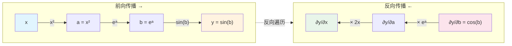

# 微积分计算实践

前两章建立了微积分的理论基础，理解了导数、梯度、链式法则等核心概念。本章将这些理论转化为可执行的代码，通过 NumPy 实现数值微分、梯度计算，并介绍 PyTorch 的自动微分机制。动手实践不仅能加深对概念的理解，更能培养解决实际问题的能力。

## 数值微分

**数值微分**（Numerical Differentiation）一种是用数值方法近似计算导数的技术。解析求导能够给出精确的导数公式，但在许多实际场景中，我们只能获得函数的离散采样值，无法获取其解析表达式——例如实验测量数据、黑盒函数输出、复杂模拟结果等。这时，数值微分就成为唯一可行的求导手段。

最简单的数值微分方法是**前向差分**（Forward Difference）。根据导数的定义：$f'(x) = \lim_{h \to 0} \frac{f(x + h) - f(x)}{h}$，如果我们取一个很小的 $h$（但不能为零），就可以用差商近似导数：$f'(x) \approx \frac{f(x + h) - f(x)}{h}$，这就是前向差分公式。以下是代码实现：

```python runnable
import numpy as np

def forward_difference(f, x, h=1e-5):
    """
    前向差分法计算数值导数
    参数:
        f: 待求导函数
        x: 求导点
        h: 步长（默认 1e-5）
    返回:
        导数的近似值
    """
    return (f(x + h) - f(x)) / h

# 测试：计算 f(x) = x^2 在 x=2 处的导数
f = lambda x: x ** 2
x = 2

# 解析导数：f'(x) = 2x，在 x=2 处为 4
analytical = 2 * x

# 数值导数
numerical = forward_difference(f, x)

print(f"函数: f(x) = x²")
print(f"求导点: x = {x}")
print(f"解析导数: {analytical}")
print(f"数值导数（前向差分）: {numerical:.6f}")
print(f"绝对误差: {abs(numerical - analytical):.2e}")
```

前向差分虽然简单，但精度有限。更精确的方法是**中心差分**（Central Difference），其公式为：$f'(x) \approx \frac{f(x + h) - f(x - h)}{2h}$，与前向差分只用 $x$ 和 $x + h$ 两点不同，中心差分以 $x$ 为中心，取左右对称的两点 $x + h$ 和 $x - h$，用它们的函数值差除以 $2h$。这种对称取点的方式使得截断误差更低：中心差分的误差项是 $O(h^2)$。，前向差分的误差项是 $\frac{h}{2}f''(x)$，即 $O(h)$（推导略）。这意味着中心差分要比前向差分的精度高一阶，即当 $h$ 缩小 10 倍时，前向差分误差缩小 10 倍，而中心差分误差缩小100 倍。以下是代码实现：

```python runnable
import numpy as np

def central_difference(f, x, h=1e-5):
    """
    中心差分法计算数值导数
    参数:
        f: 待求导函数
        x: 求导点
        h: 步长（默认 1e-5）
    返回:
        导数的近似值
    """
    return (f(x + h) - f(x - h)) / (2 * h)

def forward_difference(f, x, h=1e-5):
    return (f(x + h) - f(x)) / h

# 比较前向差分和中心差分的精度
f = lambda x: np.sin(x)
x = np.pi / 4  # 45度

# 解析导数：f'(x) = cos(x)
analytical = np.cos(x)

# 数值导数
forward = forward_difference(f, x)
central = central_difference(f, x)

print(f"函数: f(x) = sin(x)")
print(f"求导点: x = π/4 ≈ {x:.4f}")
print(f"解析导数: {analytical:.6f}")
print(f"前向差分: {forward:.6f}, 误差: {abs(forward - analytical):.2e}")
print(f"中心差分: {central:.6f}, 误差: {abs(central - analytical):.2e}")
print(f"\n中心差分误差约为前向差分的 {abs(forward - analytical) / abs(central - analytical):.1f} 分之一")
```

## 计算梯度

讨论数值微分，主要是为了计算梯度做准备，梯度是由多元函数各个自变量的偏导数组成的向量，进行数值计算时，依然可以采用锁定其他变量，只对其中一个变量求导的思路，这就把求多元函数的偏导数转化为求一元函数的导数，应用前向差分或中心差分算法完成计算。

举一个具体例子，设 $n$ 元函数 $f(x_1, x_2, \ldots, x_n)$，我们要计算它在点 $\mathbf{x} = (x_1, x_2, \ldots, x_n)$ 处的梯度。梯度的第 $i$ 个分量是偏导数 $\frac{\partial f}{\partial x_i}$。根据中心差分公式，我们可以这样近似计算：

$$\frac{\partial f}{\partial x_i} \approx \frac{f(x_1, \ldots, x_i + h, \ldots, x_n) - f(x_1, \ldots, x_i - h, \ldots, x_n)}{2h}$$

为了表达简洁，我们用[标准基向量 $\mathbf{e}_i$](../linear/vectors.md#基、正交基与标准正交基) 来描述"只改变第 $i$ 个变量"这一操作。这样，$\mathbf{x} + h\mathbf{e}_i$ 就表示"把 $\mathbf{x}$ 的第 $i$ 个分量加上 $h$，其他分量不变"，正是我们需要的扰动方式。于是梯度计算公式可以简洁地写成：

$$\frac{\partial f}{\partial x_i} \approx \frac{f(\mathbf{x} + h \mathbf{e}_i) - f(\mathbf{x} - h \mathbf{e}_i)}{2h}$$

将这个公式应用到多元函数的所有的方向上，整个梯度向量就是依次计算各个偏导数：

$$\nabla f(\mathbf{x}) = \left(\frac{\partial f}{\partial x_1}, \frac{\partial f}{\partial x_2}, \ldots, \frac{\partial f}{\partial x_n}\right)$$

下面是梯度计算的代码实现，从代码中可以看到，计算一个 $n$ 维梯度需要调用函数 $2n$ 次（每个偏导数需要两次函数调用），计算开销比一元函数大许多。事实上，无论从便捷性还是性能角度出发，在实际机器学习场景中，人们一般都使用[自动微分](#自动微分)而非数值微分来计算梯度，但是理解如何使用数值微分来手动计算梯度仍然是十分必要的。

```python runnable
import numpy as np

def numerical_gradient(f, x, h=1e-5):
    """
    计算多元函数的梯度（中心差分法）
    参数:
        f: 多元函数，接受 numpy 数组作为输入
        x: 求导点（numpy 数组）
        h: 步长
    返回:
        梯度向量（numpy 数组）
    """
    grad = np.zeros_like(x, dtype=float)
    n = len(x)

    for i in range(n):
        # 创建单位向量 e_i
        e_i = np.zeros(n)
        e_i[i] = 1

        # 中心差分计算偏导数
        grad[i] = (f(x + h * e_i) - f(x - h * e_i)) / (2 * h)
    return grad

# 测试：计算 f(x,y) = x² + y² 在 (3, 4) 处的梯度
def f(xy):
    x, y = xy
    return x ** 2 + y ** 2

x = np.array([3.0, 4.0])

# 解析梯度：∇f = (2x, 2y) = (6, 8)
analytical_grad = np.array([2 * x[0], 2 * x[1]])

# 数值梯度
numerical_grad = numerical_gradient(f, x)

print(f"函数: f(x, y) = x² + y²")
print(f"求导点: ({x[0]}, {x[1]})")
print(f"解析梯度: {analytical_grad}")
print(f"数值梯度: {numerical_grad}")
print(f"误差: {np.linalg.norm(numerical_grad - analytical_grad):.2e}")
```

## 链式法则求导

本节我们将实践使用链式法则进行复合函数求导。对于一元复合函数 $y = f(g(x))$，可以将其拆解为两层：内层函数 $u = g(x)$ 将输入 $x$ 映射到中间变量 $u$，外层函数 $y = f(u)$ 将中间变量映射到最终输出。当我们需要计算 $\frac{dy}{dx}$ 时，可以先分别计算各层的"局部导数" $\frac{dy}{du}$ 和 $\frac{du}{dx}$，然后将它们"链接"起来：

$$\frac{dy}{dx} = \frac{dy}{du} \cdot \frac{du}{dx} = f'(u) \cdot g'(x)$$

$x$ 的微小变化 $\Delta x$ 先经过 $g$ 放大（或缩小）为 $\Delta u = g'(x) \Delta x$，再经过 $f$ 放大（或缩小）为 $\Delta y = f'(u) \Delta u$，总的变化倍数就是两次放大倍数的乘积。用代码实现链式法则时，需要分别提供外层函数和内层函数及其导数，然后依次计算前向传播（得到函数值）和反向传播（得到导数值）。

```python runnable
import numpy as np

# 中心差分法计算数值导数
def central_difference(f, x, h=1e-5):
    return (f(x + h) - f(x - h)) / (2 * h)

# 使用链式法则计算复合函数的导数
def chain_rule_1d(outer_f, outer_df, inner_g, inner_dg, x):
    # 前向传播
    u = inner_g(x)  # 内层函数值
    y = outer_f(u)  # 外层函数值

    # 反向传播（链式法则）
    dy_du = outer_df(u)  # 外层函数对中间变量的导数
    du_dx = inner_dg(x)  # 内层函数对输入的导数
    dy_dx = dy_du * du_dx  # 链式法则

    return y, dy_dx

# 示例：y = sin(x²)
outer_f = np.sin
outer_df = np.cos
inner_g = lambda x: x ** 2
inner_dg = lambda x: 2 * x

x = 1.5
y, dy_dx = chain_rule_1d(outer_f, outer_df, inner_g, inner_dg, x)

# 验证
numerical = central_difference(lambda x: np.sin(x ** 2), x)

print(f"复合函数: y = sin(x²)")
print(f"x = {x}")
print(f"函数值: {y:.6f}")
print(f"解析导数（链式法则）: {dy_dx:.6f}")
print(f"数值导数: {numerical:.6f}")
print(f"误差: {abs(dy_dx - numerical):.2e}")
```

## 自动微分

无论是使用数值微分计算导数，还是手动实现链式法则，计算过程都非常繁琐，稍有不慎就会出错，每个变量调用两次函数，计算效率也不高。机器学习框架 PyTorch 提供了**自动微分**（Automatic Differentiation，简称 autodiff）功能，可以实现自动、精确、高效地计算梯度。

自动微分的思路完全不同于数值微分和[符号微分](https://en.wikipedia.org/wiki/Computer_algebra)（篇幅关系本节未介绍）。数值微分用差商近似导数，存在截断误差和舍入误差；符号微分试图推导解析导数表达式，但容易产生表达式膨胀问题。自动微分则基于一个简单而深刻的思想：**任何复杂函数都是由基本运算（加、减、乘、除、sin、cos、exp 等）组合而成，而这些基本运算的导数都是已知的**。自动微分通过追踪运算过程，应用链式法则逐层计算导数，既保证了数值精度（与解析导数相同），又避免了表达式膨胀。

自动微分有两种主要模式：**前向模式**（Forward Mode）和**反向模式**（Reverse Mode）。前向模式从输入向输出方向传播导数，适合输入变量少、输出变量多的场景；反向模式从输出向输入方向传播导数，适合输入变量多、输出变量少的场景。深度学习中，神经网络的参数（输入变量）数量通常远大于损失函数（输出变量）的数量，因此反向模式更为高效。PyTorch 采用的就是反向模式自动微分。

PyTorch 通过**动态计算图**（Dynamic Computational Graph）来自动记录运算过程。当我们对张量进行运算时，PyTorch 会自动构建一张有向无环图，节点表示变量或运算，边表示数据流向。譬如，计算 $y = \sin(e^{x^2})$ 时，计算图从输入 $x$ 开始，依次经过平方运算得到 $a = x^2$，指数运算得到 $b = e^a$，正弦运算得到 $y = \sin(b)$。反向传播时，沿着计算图反向遍历，从 $y$ 开始，依次计算 $\frac{\partial y}{\partial b} = \cos(b)$、$\frac{\partial b}{\partial a} = e^a$、$\frac{\partial a}{\partial x} = 2x$，最后根据链式法则将它们相乘，得到 $\frac{\partial y}{\partial x} = \cos(b) \cdot e^a \cdot 2x$。整个过程完全自动化，无需用户手动编写任何导数代码。


*图：$y = \sin(e^{x^2})$ 的计算图结构与反向传播过程*

以下代码展示了 PyTorch 自动微分的基本使用方法：

```python runnable
import torch
# 创建需要跟踪梯度的张量
x = torch.tensor([0.5], requires_grad=True)

# 定义计算过程（自动构建计算图）
a = x ** 2
b = torch.exp(a)
y = torch.sin(b)
# 反向传播
y.backward()

print("=== PyTorch 自动微分 ===")
print(f"x = {x.item():.6f}")
print(f"a = x² = {a.item():.6f}")
print(f"b = e^a = {b.item():.6f}")
print(f"y = sin(b) = {y.item():.6f}")
print(f"\n自动计算的梯度 dy/dx = {x.grad.item():.6f}")

# 与 NumPy 数值导数对比
import numpy as np

# 中心差分法计算数值导数
def central_difference(f, x, h=1e-5):
    return (f(x + h) - f(x - h)) / (2 * h)

numerical = central_difference(lambda x: np.sin(np.exp(x ** 2)), 0.5)
print(f"数值导数 = {numerical:.6f}")
print(f"误差 = {abs(x.grad.item() - numerical):.2e}")
```

$\frac{\partial y}{\partial x}

下面的实验演示如何使用 PyTorch 对二元函数 $f(x,y) = x^2 + 2xy + y^2$ 进行自动微分。我们将在点 $(1, 2)$ 处计算函数值，然后通过反向传播，获取两个输入变量的偏导数 $\frac{\partial f}{\partial x}$ 和 $\frac{\partial f}{\partial y}$，并与解析解进行误差验证。

```python runnable
import torch

# 定义一个二元函数：f(x,y) = x² + 2xy + y²
x = torch.tensor([1.0], requires_grad=True)
y = torch.tensor([2.0], requires_grad=True)

# 前向传播
f = x ** 2 + 2 * x * y + y ** 2

print("函数: f(x,y) = x² + 2xy + y²")
print(f"求导点: (x={x.item()}, y={y.item()})")
print(f"函数值: {f.item():.6f}")

# 反向传播
f.backward()

# 获取梯度
print(f"\n偏导数 ∂f/∂x = {x.grad.item():.6f} (解析值: {2*1 + 2*2:.6f})")
print(f"偏导数 ∂f/∂y = {y.grad.item():.6f} (解析值: {2*1 + 2*2:.6f})")

# 解析梯度：∂f/∂x = 2x + 2y, ∂f/∂y = 2x + 2y
analytical_grad_x = 2 * 1 + 2 * 2
analytical_grad_y = 2 * 1 + 2 * 2

print(f"\n梯度验证:")
print(f"  ∂f/∂x 误差: {abs(x.grad.item() - analytical_grad_x):.2e}")
print(f"  ∂f/∂y 误差: {abs(y.grad.item() - analytical_grad_y):.2e}")
```

## 本章小结

本章将微积分的理论转化为可执行的代码，建立了从数学概念到程序实现的桥梁。

 - 数值微分揭示了导数的计算本质是用有限差商近似无限极限，中心差分比前向差分精度更高的原因在于对称取点降低了截断误差；
 - 梯度计算将一元导数推广到多元函数，通过依次扰动各个分量实现偏导数的数值求解；
 - 链式法则的程序实现展示了复合函数求导的结构化思路，前向传播计算函数值，反向传播链接各层导数；
 - 自动微分则将这些繁琐操作完全自动化，PyTorch 通过动态计算图追踪运算过程，反向传播时自动应用链式法则，既保证了数值精度又避免了手动推导的错误。

 这些技术构成了机器学习的计算基础，理解这些底层机制，不仅有助于调试和优化模型，更能从根本上把握深度学习的运作原理。下一章将把这些技术应用于机器学习场景，详细介绍梯度下降算法、反向传播机制和优化算法的演进。

## 练习题

1. 实现一个函数，使用中心差分法计算函数 $f(x) = x^3$ 在区间 $[-2, 2]$ 上等间隔取 100 个点处的导数，并绘制函数和导数的图像。
    <details>
    <summary>参考答案</summary>

    ```python runnable
    import numpy as np
    import matplotlib.pyplot as plt

    def central_difference(f, x, h=1e-5):
        return (f(x + h) - f(x - h)) / (2 * h)

    # 定义函数
    f = lambda x: x ** 3
    df_analytical = lambda x: 3 * x ** 2  # 解析导数

    # 计算点
    x = np.linspace(-2, 2, 100)
    y = f(x)
    dy_numerical = central_difference(f, x)
    dy_analytical = df_analytical(x)

    # 绘图
    fig, axes = plt.subplots(1, 2, figsize=(12, 4))

    axes[0].plot(x, y, 'b-', label='f(x) = x³')
    axes[0].set_xlabel('x')
    axes[0].set_ylabel('f(x)')
    axes[0].set_title('原函数')
    axes[0].legend()
    axes[0].grid(True)

    axes[1].plot(x, dy_numerical, 'r--', label='数值导数')
    axes[1].plot(x, dy_analytical, 'g-', label='解析导数')
    axes[1].set_xlabel('x')
    axes[1].set_ylabel("f'(x)")
    axes[1].set_title('导数对比')
    axes[1].legend()
    axes[1].grid(True)

    plt.tight_layout()
    plt.show()

    # 计算误差
    error = np.max(np.abs(dy_numerical - dy_analytical))
    print(f"最大误差: {error:.2e}")
    ```
    </details>

2. 编写一个通用的梯度检查函数，可以验证任意多元函数的梯度计算是否正确。
    <details>
    <summary>参考答案</summary>

    ```python runnable
    import numpy as np

    def gradient_check(f, grad_f, x, h=1e-5, tol=1e-6):
        """
        验证多元函数梯度计算的正确性

        参数:
            f: 原函数
            grad_f: 梯度函数
            x: 测试点（numpy 数组）
            h: 数值微分的步长
            tol: 容差

        返回:
            (是否通过, 最大相对误差)
        """
        n = len(x)
        numerical_grad = np.zeros(n)

        # 计算数值梯度
        for i in range(n):
            e_i = np.zeros(n)
            e_i[i] = 1
            numerical_grad[i] = (f(x + h * e_i) - f(x - h * e_i)) / (2 * h)

        # 计算解析梯度
        analytical_grad = grad_f(x)

        # 计算相对误差
        diff = np.abs(numerical_grad - analytical_grad)
        norm = np.maximum(np.abs(numerical_grad), np.abs(analytical_grad))
        relative_error = diff / (norm + 1e-10)  # 避免除零

        max_error = np.max(relative_error)
        passed = max_error < tol

        return passed, max_error

    # 测试
    def f(xy):
        x, y = xy
        return x ** 2 * y + x * y ** 2

    def grad_f(xy):
        x, y = xy
        return np.array([2 * x * y + y ** 2, x ** 2 + 2 * x * y])

    x = np.array([1.5, 2.0])
    passed, error = gradient_check(f, grad_f, x)
    print(f"梯度检查: {'通过' if passed else '失败'}")
    print(f"最大相对误差: {error:.2e}")
    ```
    </details>