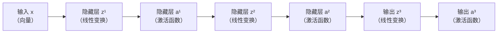
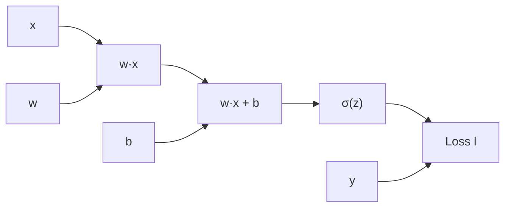
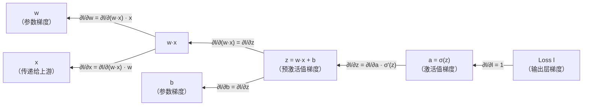

# 反向传播

在前一章我们深入探索了信号从输入层经过各层神经元逐层传递到输出层的前向传播过程。前向传播回答了神经网络如何计算推理结果的问题，但神经网络学习训练的问题还没有解决，即神经网络的参数（权重和偏置）如何确定。这个问题的答案就是**反向传播算法**（Backpropagation Algorithm），它是神经网络训练的核心机制，被誉为深度学习领域最重要的算法发明之一。

1986 年，杰弗里·辛顿（Geoffrey Hinton）在发表于《Nature》期刊上的论文《Learning representations by back-propagating errors》中提出了反向传播算法，并应用于多层神经网络的训练。这个算法出现以后，成为神经网络复兴的关键里程碑，正是这一突破，才使得多层神经网络的训练从理论上变得可行，为后来的深度学习革命奠定了基础。

反向传播解决了一个当时被称为"信用分配问题"（Credit Assignment Problem）的难题，当网络输出错误时，如何确定数百甚至数千个参数中哪些应该调整，以及调整多少。反向传播通过计算损失函数对各层参数的梯度，将输出端的误差信号精确地反向传递到每一层、每一个参数，告诉网络谁的贡献大，谁该调整多少。

本章将介绍反向传播的数学基础（链式法则）、计算图视角下的反向传播过程、梯度计算的具体推导，以及计算复杂度分析。对于初学者来说，本章充满了数学推理，是难度较高的一章，但任何神经网络的教材都必须讲授反向传播算法，理解反向传播，是掌握神经网络训练原理的无可回避的关键一步。

## 反向传播的数学基础

要理解反向传播，必须先理解两个前置基础，一是微积分的[链式法则](../../maths/calculus/gradient.md#复合函数与链式法则)，二是前向传播的[信号流动过程](forward-propagation.md#信号流动过程)。让我们回顾一下神经网络的数学本质，神经网络实际上是一个层层嵌套的复合函数，数据从输入层开始，依次经过每一层的线性变换和激活函数，最终到达输出层。那么，如果我们想调整某个参数来降低预测误差，计算这个参数应该调整多少，实际上就是要从这个复合函数的输出值，反推它的参数变化，这就需要用到链式法则。

回顾[多层网络结构](mlp.md#模型复杂度的限制)的数学表达 $F(\mathbf{x}) = f^K \circ f^{K-1} \circ \cdots \circ f^1(\mathbf{x})$，这是一个 $K$ 层的复合函数，每层函数 $f$ 包含线性变换（$z = \mathbf{W} \mathbf{h} + \mathbf{b}$）和非线性激活（$a = \sigma(z)$）。我们先从最简单的情形开始，考虑单一路径上输入值与损失之间的关系。设某神经元的输入值为 $x$，预激活值为 $z = wx + b$，激活值为 $a = \sigma(z)$，样本标签（真实值）与函数输出（预测值）之间的差距（损失）为 $l$。根据链式法则，损失对输入值的导数为：

$$\frac{\partial l}{\partial x} = \frac{\partial l}{\partial a} \cdot \frac{\partial a}{\partial z} \cdot \frac{\partial z}{\partial x}$$

由于神经网络每一层的输入输出并不是单个数值，而是由多个神经元组成的向量。当函数的输入和输出都是向量时，链式法则需要扩展到多元情形。设第 $k-1$ 层激活值（即下一层第 $k$ 层的输入值）为 $\mathbf{a}^{k-1} \in \mathbb{R}^n$，第 $k$ 层预激活值为 $\mathbf{z}^k \in \mathbb{R}^m$，激活值为 $\mathbf{a}^k \in \mathbb{R}^m$，损失 $l \in \mathbb{R}$。则损失对该层各输入值的偏导数为：

$$\frac{\partial l}{\partial a^{k-1}_i} = \sum_{j=1}^{m} \frac{\partial l}{\partial a^k_j} \cdot \frac{\partial a^k_j}{\partial z^k_j} \cdot \frac{\partial z^k_j}{\partial a^{k-1}_i}$$

公式中 $\sum_{j=1}^{m}$ 是将所有影响路径的贡献加起来，因为第 $k-1$ 层的第 $i$ 个神经元（激活值为 $a^{k-1}_i$）同时影响第 $k$ 层的所有 $m$ 个神经元，整体公式可以理解为某个激活值对损失的总变化率等于所有下游路径的变化率之和。由于向量 $\mathbf{a}^{k-1}$ 由多个分量构成，因此单层网络中所有神经元的共同影响可以用矩阵形式简洁地表示出来：

$$\frac{\partial l}{\partial \mathbf{a}^{k-1}} = \frac{\partial l}{\partial \mathbf{a}^k} \cdot \frac{\partial \mathbf{a}^k}{\partial \mathbf{z}^k} \cdot \frac{\partial \mathbf{z}^k}{\partial \mathbf{a}^{k-1}}$$

::: note 额外提示
这里为了展现标量（单个神经元）、矩阵（单层网络）、矩阵连乘（多层网络）三种形式的表现一致性，相乘使用了[分子布局](https://en.wikipedia.org/wiki/Matrix_calculus#Numerator-layout_notation)（Numerator Layout，Jacobian 形式），即梯度是行向量的形式，实际在机器学习常用约定是使用[分母布局](https://en.wikipedia.org/wiki/Matrix_calculus#Denominator-layout_notation)（Denominator Layout，Hessian 形式），即梯度为列向量，此时需要转置以保证维度匹配，即应为：
$$\frac{\partial l}{\partial \mathbf{a}^{k-1}} = \left(\frac{\partial \mathbf{z}^k}{\partial \mathbf{a}^{k-1}}\right)^T \left(\frac{\partial \mathbf{a}^k}{\partial \mathbf{z}^k}\right)^T \frac{\partial l}{\partial \mathbf{a}^k}$$
:::

接下来，把单层网络的情况扩展到多层网络，观察损失对输入 $\mathbf{x}$ 变化的导数，以一个三层网络为例，信息前向传递路径如下：



*图：三层神经网络前向传播信号流动*

假设我们想计算损失函数 $l$ 对输入向量 $\mathbf{x}$ 的梯度。从前向传播的角度看，$\mathbf{x}$ 的变化会影响 $\mathbf{z}^1$，进而影响 $\mathbf{a}^1$，再影响 $\mathbf{z}^2$、$\mathbf{a}^2$、$\mathbf{z}^3$、$\mathbf{a}^3$，最终影响损失函数 $l$。这条影响链路跨越了三个完整的网络层。应用多元链式法则，梯度沿着这条链路逐层传递：

$$\frac{\partial l}{\partial \mathbf{x}} = \frac{\partial l}{\partial \mathbf{a}^3} \cdot \frac{\partial \mathbf{a}^3}{\partial \mathbf{z}^3} \cdot \frac{\partial \mathbf{z}^3}{\partial \mathbf{a}^2} \cdot \frac{\partial \mathbf{a}^2}{\partial \mathbf{z}^2} \cdot \frac{\partial \mathbf{z}^2}{\partial \mathbf{a}^1} \cdot \frac{\partial \mathbf{a}^1}{\partial \mathbf{z}^1} \cdot \frac{\partial \mathbf{z}^1}{\partial \mathbf{x}}$$

公式表明传递到第一层输入的梯度，等于所有后续各层导数的连乘积，这就是反向传播的核心，**梯度沿着计算链路从输出层反向传递到输入层，每经过一层，梯度乘以该层激活函数的导数和线性变换的导数**。这个过程与前向传播的信息流动方向刚好相反，因此算法被命名为反向传播。

可以用一个生活场景来类比理解反向传播算法，想象一条长长的水管从山顶延伸到山谷，水流从前向传播方向（山顶到山谷）流动。如果我们在山谷测量到水压有问题，要找到山顶哪部分渠道出了故障，就需要沿着水管逆向追踪，自底向上不断测量水压变化情况（偏导数）。反向传播就像这样逆向追踪的过程，从输出端的问题信号（误差）开始，沿着计算链路反向追踪，找出每个环节（每层参数）的责任大小（梯度）。

## 计算图视角下的反向传播

前面从数学角度推导，使用的是链式法则，但在实际编程实现中，深度学习框架（如 TensorFlow、PyTorch）并不会直接摆弄这些复杂的公式，而是如同计算前向传播那样，使用[计算图](forward-propagation.md#计算图)来完成反向传播的计算。计算图将神经网络的前向传播过程分解为一系列基本运算节点，每个节点只负责一个简单的操作（如矩阵乘法、激活函数、加法），数据沿着边从输入流向输出，在处理反向传播时，就将信息流动的方向反转。这种设计使得梯度计算可以被自动化完成，开发者只需要定义前向传播的计算过程，框架会自动推导出反向传播的梯度计算，这是现代深度学习框架强大便捷之处。下面以信息流过单个神经元的计算图为例：



*图：简单神经元的计算图（前向传播方向）*

前向传播时，数据从左向右流动，$x$ 和 $w$ 相乘得到 $w·x$，加上 $b$ 得到 $z$，通过激活函数 $\sigma$ 得到 $a$，与真实标签 $y$ 比较算出损失 $l$。反向传播时，梯度沿着相同的计算图从右向左流动，但遍历方向与前向传播相反，可以用下图表示（实际与前向传播用的是同一张计算图，只是方向相反，这里笔者为了解释方便分成两张图来解释）：



*图：简单神经元的计算图（反向传播方向）*

1. **输出层梯度**：损失 $l$ 对输出 $a$ 的梯度为 $\frac{\partial l}{\partial a}$。以平方误差损失为例， $loss = \frac{1}{2}(a - y)^2$，这个梯度就是 $(a - y)$。
1. **激活函数反向传播**：梯度乘以激活函数的导数 $\sigma'(z)$，得到损失对预激活值 $z$ 的梯度 $\frac{\partial l}{\partial z} = \frac{\partial l}{\partial a} \cdot \sigma'(z)$。这一步也应用了链式法则，将梯度从激活值的输出端传递到输入端。
1. **线性变换反向传播**：预激活值 $z = w \cdot x + b$，因此：
   - 损失对权重 $w$ 的梯度：$\frac{\partial l}{\partial w} = \frac{\partial l}{\partial z} \cdot \frac{\partial z}{\partial w} = \frac{\partial l}{\partial z} \cdot x$
   - 损失对偏置 $b$ 的梯度：$\frac{\partial l}{\partial b} = \frac{\partial l}{\partial z} \cdot \frac{\partial z}{\partial b} = \frac{\partial l}{\partial z} \cdot 1 = \frac{\partial l}{\partial z}$
   - 损失对输入 $x$ 的梯度：$\frac{\partial l}{\partial x} = \frac{\partial l}{\partial z} \cdot \frac{\partial z}{\partial x} = \frac{\partial l}{\partial z} \cdot w$，这个梯度要传递给上游，继续反向传播。

整个计算过程就像是在计算图上进行反向溯源，从最终的损失值出发，沿着每条边逆向追踪，根据链式法则将梯度分配到各个参数节点。每个节点只需知道如何计算自己的局部梯度（输出对输入的导数），然后将上游传来的梯度与局部梯度相乘，传递给下游节点。一旦神经元知道了参数（权重 $w$ 和偏置 $b$）的梯度，就有了对参数调整的方向，可以通过梯度下降法更新参数： $w^{new} \leftarrow w - \eta \frac{\partial l}{\partial w}$，$b^{new} \leftarrow b - \eta \frac{\partial l}{\partial b}$。

## 梯度计算

经过对单个神经元的计算图解析，我们已经对梯度反向传播的过程有初步的了解了。接下来就要进一步深入细节，通过一个选定损失函数和激活函数的例子，推导整个多层神经网络的梯度计算过程。设网络有 $K$ 层，损失函数为[交叉熵损失](../../statistical-learning/linear-models/logistic-regression.md#交叉熵损失)，输出层使用 [Softmax](../../statistical-learning/linear-models/logistic-regression.md#多项逻辑回归) 激活函数，隐藏层使用 [Sigmoid](../../statistical-learning/linear-models/logistic-regression.md#sigmoid-函数) 激活函数，这是分类任务中最常见的配置。为方便后续推导，我们先约定几个符号：

- $\mathbf{z}^k = \mathbf{W}^k \mathbf{a}^{k-1} + \mathbf{b}^k$：第 $k$ 层预激活值，即线性变换的结果。
- $\mathbf{a}^k = \sigma^k(\mathbf{z}^k)$：第 $k$ 层激活值，即经过激活函数后的输出。
- $\delta^k = \frac{\partial l}{\partial \mathbf{z}^k}$：第 $k$ 层误差信号，表示损失函数对该层预激活值的梯度。误差信号 $\delta^k$ 是反向传播推导的核心，它告诉我们该层的预激活值应该调整多少才能降低损失。

### 输出层梯度

与单个神经元的推导一样，我们首先计算输出层（第 $K$ 层）梯度。对于 Softmax + Cross-Entropy 组合，输出层的梯度有一个优美的简化形式，这是神经网络中最令人惊喜的数学巧合之一。设输出层有 $I$ 个神经元（对应 $I$ 个类别），Softmax 函数的输出为：

$$a_i^K = \frac{e^{z_i^K}}{\sum_{j=1}^{I} e^{z_j^K}}$$

其中，$z_i^K$ 是输出层第 $i$ 个神经元的预激活值（线性变换的原始输出），$a_i^K$ 是在 Softmax 变换后的第 $i$ 类的预测概率。交叉熵损失为：

$$l = -\sum_{i=1}^{I} y_i \log a_i^K$$

其中 $y_i$ 是真实标签的 [One-Hot](https://en.wikipedia.org/wiki/One-hot) 编码（正确类别为 1，其他类别为 0）。$\log a_i^K$ 是预测概率的对数，概率越接近 1，对数越接近 0，整体损失等于正确类别预测概率的负对数，概率越低损失越大。$l$ 对 $z_i^K$ 的偏导数为（推导见[练习题](#练习题)部分）：

<!-- equation:label=eq:backprop-output-eq -->
$$\frac{\partial l}{\partial z_i^K} = a_i^K - y_i$$
<!-- end-equation -->

数学上 Softmax + Cross-Entropy 的梯度十分简洁，就等于预测概率减去真实标签，这意味着输出层的误差信号无需进行求导运算，只要简单的减法即可得到，误差信号 $\delta^K$ 就是 $\mathbf{a}^K - \mathbf{y}$。

### 隐藏层梯度传递

输出层的误差信号计算出来后，需要逐层传递到隐藏层。设第 $k$ 层（隐藏层）的误差信号为 $\delta^k$，从第 $k+1$ 层传递过来的梯度为 $\delta^{k+1}$。$\delta^k$ 是损失函数对该层预激活值的梯度，根据链式法则，只要乘以激活函数的导数 $\sigma'(z)$，就能将梯度从激活值的输出端传递到输入端，得到每个隐藏层的误差信号：

<!-- equation:label=eq:backprop-error-sign -->
$$\delta^k = \frac{\partial l}{\partial \mathbf{z}^k} = \frac{\partial l}{\partial \mathbf{a}^k} \cdot \frac{\partial \mathbf{a}^k}{\partial \mathbf{z}^k}= \frac{\partial l}{\partial \mathbf{a}^k} \cdot \sigma'(\mathbf{z}^k)$$
<!-- end-equation -->

式子里的 $\frac{\partial l}{\partial \mathbf{a}^k}$ 可以从第 $k+1$ 层传递过来的误差信号 $\delta^{k+1}$ 得到：

$$\frac{\partial l}{\partial \mathbf{a}^k} = \frac{\partial l}{\partial \mathbf{z}^{k+1}} \cdot \frac{\partial \mathbf{z}^{k+1}}{\partial \mathbf{a}^k} = (\mathbf{W}^{k+1})^T \delta^{k+1}$$

其中 $\frac{\partial l}{\partial \mathbf{z}^{k+1}}$ 就是上一层的误差信号 $\delta^{k+1}$，一直迭代推到输出层（见 <!-- eqref:eq:backprop-output-eq --> ）就是 $\mathbf{a}^K - \mathbf{y}$。$\frac{\partial \mathbf{z}^{k+1}}{\partial \mathbf{a}^k}$ 是下一层预激活值对本层激活值的导数，由于 $\mathbf{z}^{k+1} = \mathbf{W}^{k+1} \mathbf{a}^k + \mathbf{b}^{k+1}$，所以它相对于 $\mathbf{a}^k$ 的偏导数就等于权重矩阵 $\mathbf{W}^{k+1}$。前文提到过，机器学习常用约定是使用分母布局，梯度为列向量，此时需要转置以保证维度匹配为了满足矩阵乘法[内维匹配](../../maths/linear/matrices.md#矩阵的运算)要求，将权重矩阵的转置 $(\mathbf{W}^{k+1})^T$ 后与上一层的误差信号相乘。从信号传播的角度看，这个操作类似于信号缩放，前向传播用 $\mathbf{W}^{k+1}$ 将信号放大，反向传播用转置 $(\mathbf{W}^{k+1})^T$ 将梯度缩回。将这个式子代入隐藏层的误差信号（见 <!-- eqref:eq:backprop-error-sign -->）得到：

<!-- equation:label=eq:backprop-hidden -->
$$\delta^k = (\mathbf{W}^{k+1})^T \delta^{k+1} \cdot \sigma'(\mathbf{z}^k)$$
<!-- end-equation -->

这就是隐藏层误差信号的传递公式，隐藏层的误差信号可以通过上一层误差信号乘以本层权重矩阵的转置，再乘以本层激活函数的导数来获取。不妨用信号衰减来类比理解这部分推导过程，误差信号 $\delta^{k+1}$ 从下游传来，经过权重矩阵的逆映射（$(\mathbf{W}^{k+1})^T$）缩放大小，再经过激活函数导数（$\sigma'(\mathbf{z}^k)$）调整强度，最终得到本层的误差信号 $\delta^k$。如果激活函数导数很小（如 Sigmoid 在两端），误差信号就会被大幅衰减，这就是后面梯度消失问题的根源。

### 参数梯度计算

有了误差信号 $\delta^k$（见 <!-- eqref:eq:backprop-hidden -->），就可以计算第 $k$ 层参数的梯度。这些梯度告诉我们权重和偏置应该调整多少才能降低损失。根据链式法则，权重梯度为：

$$\frac{\partial l}{\partial \mathbf{W}^k} = \frac{\partial l}{\partial z^k} \cdot \frac{\partial z^k}{\partial \mathbf{W}^k} $$

由于 $\frac{\partial l}{\partial z^k} = \delta^k$，且 $\frac{\partial z^k}{\partial \mathbf{W}^k} = a^{k-1}$，因此有：

$$\frac{\partial l}{\partial \mathbf{W}^k} = \frac{\partial l}{\partial z^k} \cdot \frac{\partial z^k}{\partial \mathbf{W}^k} = \delta^k (\mathbf{a}^{k-1})^T$$

公式中 $\delta^k (\mathbf{a}^{k-1})^T$ 是两个向量的外积，维度为 $n_k \times n_{k-1}$，正好是权重矩阵的维度，整体公式的结论为**权重梯度等于误差信号与输入信号的外积**。从几何角度看，外积 $\delta^k (\mathbf{a}^{k-1})^T$ 是一种相关性矩阵。如果某个输入信号 $a_j^{k-1}$ 很强（绝对值大），且对应神经元的误差 $\delta_i^k$ 也很大，则权重 $W_{ij}^k$ 的梯度就大，这个权重对误差贡献大，需要大幅调整。反之，如果输入信号弱或误差小，梯度就小，调整幅度也小。

类似地，再把偏置梯度也算出来，根据链式法则，偏置梯度为：

$$\frac{\partial l}{\partial b^k} = \frac{\partial l}{\partial z^k} \cdot \frac{\partial z^k}{\partial b^k} $$

由于 $\frac{\partial l}{\partial z^k} = \delta^k$，且 $\frac{\partial z^k}{\partial b^k} = 1$（偏置 $b^k$ 对自身的导数为 1，与其他项无关），因此有：

$$\frac{\partial l}{\partial b^k} = \frac{\partial l}{\partial z^k} \cdot \frac{\partial z^k}{\partial b^k} = \delta^k$$

结论非常清晰简洁：**偏置梯度直接等于误差信号**。偏置独立作用于每个神经元，不依赖于输入信号，因此其梯度就是该神经元的误差信号 $\delta_i^k$，没有其他因素的影响。这与权重梯度不同，权重梯度需要考虑输入信号的强度（通过外积体现），而偏置的梯度只反映误差本身的大小。

### 批量样本的梯度计算

以上过程是单个样本在多层网络中的推导，实际训练中，我们不会只用一个样本计算梯度，而是使用[批量计算](./forward-propagation.md#批量计算与效率优化)。批量计算除了能利用 GPU 的并行计算能力，大幅提升训练效率外，也考虑到单样本梯度可能有很大的随机波动，而适当数量的批量样本的梯度平均值更稳定，能更好地反映数据的整体规律。因此，最后我们把计算过程推广到批量样本的情况。设批量大小为 $m$，第 $k$ 层的预激活矩阵为 $\mathbf{Z}^k \in \mathbb{R}^{n_k \times m}$，激活矩阵为 $\mathbf{A}^k \in \mathbb{R}^{n_k \times m}$。矩阵的每一列对应一个样本。则批量误差信号矩阵为：

$$\Delta^k = \frac{\partial L}{\partial \mathbf{Z}^k} = \frac{1}{m} \sum_{i=1}^{m} \delta^k_i$$

这里的 $\Delta^k$ 是平均误差信号矩阵，维度为 $n_k \times m$，$\delta^k_i$ 是第 $i$ 个样本在第 $k$ 层的误差信号向量，整个公式的意思就是**批量梯度等于各样本梯度的平均值**。类似地，批量参数梯度公式也只需使用平均误差信号，权重梯度为 $\frac{\partial L}{\partial \mathbf{W}^k} = \frac{1}{m} \Delta^k (\mathbf{A}^{k-1})^T$，偏置梯度为 $\frac{\partial L}{\partial \mathbf{b}^k} = \frac{1}{m} \Delta^k \cdot \mathbf{1}$。这里的 $\mathbf{1}$ 是一个全 1 向量，维度为 $m \times 1$，用于对批量维度求和，得到每个神经元的偏置梯度总和，再除以 $m$ 得到平均值。

## 计算复杂度分析

理解反向传播的计算复杂度，对于估算训练时间、设计网络架构、优化硬件利用都有很高的实用价值。本节将分析前向传播和反向传播的复杂度对比、内存开销以及数值稳定性问题。

在时间复杂度方面，反向传播的时间复杂度与前向传播是同一量级的，而非直觉上可能认为的反向传播要计算所有参数的梯度，复杂度应该更高，这是一个重要且令人惊讶的结论，意味着训练一次迭代（一次前向传播和一次后向传播）的计算量大概就是前向传播的计算量的两倍，也是同一量级的。这点可以通过简单推导就能证明，设网络有 $K$ 层，第 $k$ 层有 $n_k$ 个神经元，整个网络的总参数数量就是 $P = \sum_{k=1}^{K} (n_k \cdot n_{k-1} + n_k)$。

- 前向传播中，每层的计算主要是矩阵乘法 $\mathbf{W}^k \mathbf{a}^{k-1}$，时间复杂度是 $O(n_k \cdot n_{k-1})$，以及激活函数计算，时间复杂度是 $O(n_k)$。所以单样本在单层前向传播总复杂度是 $T_{forward} = O(P)$。
- 反向传播中，每层的计算包括误差信号传递 $(\mathbf{W}^{k+1})^T \delta^{k+1}$，时间复杂度是 $O(n_{k+1} \cdot n_k)$，以及参数梯度计算 $\delta^k (\mathbf{a}^{k-1})^T$，时间复杂度是 $O(n_k \cdot n_{k-1})$，所以单样本在单层反向传播总复杂度也是 $T_{backward} = O(P)$。

由此得出结论，反向传播的计算时间复杂度与前向传播相当，都是 $O(P)$。

在空间复杂度方面，反向传播需要存储前向传播的中间结果（预激活值 $\mathbf{z}^k$ 和激活值 $\mathbf{a}^k$）用于计算梯度。这需要有一定的内存开销（后续都将 CPU 训练的内存和 GPU 训练的显存统一称为内存）。设批量大小为 $B$，各层存储的中间结果总量为 $M = B \cdot \sum_{k=1}^{K} 2 n_k$，其中的系数 $2$ 是因为每个神经元需要存储两个值，即预激活值 $z_i^k$ 和激活值 $a_i^k$，整体公式说明内存占用等于批量大小乘以各层神经元数的两倍。

对于大型网络和批量训练，内存开销可能成为瓶颈。譬如，一个 10 层网络，每层 1000 个神经元，批量大小 1000，内存占用约为 $1000 \times 10 \times 1000 \times 2 = 2$ 千万个浮点数，按 FP32 计算，约需 80 MB 内存。这还只是训练中间结果的存储开销，并未计算模型参数本身占用的内存。现代机器学习框架采用各种优化策略减少内存占用，如：

- **梯度检查点**（Gradient Checkpointing）：只存储部分层的中间结果，需要时重新计算。这是一种用计算换内存的策略，适合内存受限但计算资源充足的场景。
- **内存复用**：计算完梯度后立即释放中间结果内存，减少峰值内存占用。
- **混合精度**：使用低精度（如 FP16）存储中间结果，减少一半内存占用，同时保持基本的计算精度。

## 反向传播算法实践

下面通过代码实现完整的反向传播过程，验证梯度计算的正确性，并可视化误差信号在网络中的传递过程。从实验输出的四张可视化图标中可以分别看到训练过程中的损失和梯度变化趋势。如果训练一切顺利，训练应该呈现出损失单调下降、梯度逐层衰减的趋势，这说明模型损失逐渐收敛趋向于稳定。然而现实中，模型训练稳定性是一大工程难题，我们将在后面专门讨论。

```python runnable
import numpy as np
import matplotlib.pyplot as plt

class NeuralNetworkBP:
    """
    完整的反向传播实现
    
    支持多层网络，多种激活函数
    """
    def __init__(self, layer_sizes, activations, learning_rate=0.01):
        """
        Parameters:
        layer_sizes : list of int
            各层神经元数量
        activations : list of str
            各层激活函数类型
        learning_rate : float
            学习率
        """
        self.layer_sizes = layer_sizes
        self.activations = activations
        self.lr = learning_rate
        self.num_layers = len(layer_sizes) - 1
        
        # 初始化权重和偏置
        np.random.seed(42)
        self.weights = []
        self.biases = []
        
        for i in range(self.num_layers):
            # He初始化（适用于ReLU）
            if activations[i] == 'relu':
                scale = np.sqrt(2.0 / layer_sizes[i])
            else:
                scale = np.sqrt(1.0 / layer_sizes[i])
            
            w = np.random.randn(layer_sizes[i+1], layer_sizes[i]) * scale
            b = np.zeros((layer_sizes[i+1], 1))
            self.weights.append(w)
            self.biases.append(b)
        
        # 存储中间结果和梯度历史
        self.activations_cache = []
        self.pre_activations_cache = []
        self.gradients_history = []
        self.loss_history = []
    
    def _apply_activation(self, Z, activation_name):
        """应用激活函数"""
        if activation_name == 'sigmoid':
            Z = np.clip(Z, -500, 500)
            return 1 / (1 + np.exp(-Z))
        elif activation_name == 'relu':
            return np.maximum(0, Z)
        elif activation_name == 'tanh':
            return np.tanh(Z)
        elif activation_name == 'softmax':
            Z_shifted = Z - np.max(Z, axis=0, keepdims=True)
            exp_Z = np.exp(Z_shifted)
            return exp_Z / np.sum(exp_Z, axis=0, keepdims=True)
        elif activation_name == 'linear':
            return Z
        else:
            raise ValueError(f"Unknown activation: {activation_name}")
    
    def _activation_derivative(self, Z, A, activation_name):
        """计算激活函数导数"""
        if activation_name == 'sigmoid':
            return A * (1 - A)
        elif activation_name == 'relu':
            return (Z > 0).astype(float)
        elif activation_name == 'tanh':
            return 1 - A ** 2
        elif activation_name == 'linear':
            return np.ones_like(Z)
        else:
            raise ValueError(f"Derivative not implemented for: {activation_name}")
    
    def forward(self, X):
        """前向传播"""
        self.activations_cache = [X]
        self.pre_activations_cache = []
        
        A = X
        for i in range(self.num_layers):
            Z = self.weights[i] @ A + self.biases[i]
            self.pre_activations_cache.append(Z)
            A = self._apply_activation(Z, self.activations[i])
            self.activations_cache.append(A)
        
        return A
    
    def backward(self, Y):
        """反向传播"""
        m = Y.shape[1]  # 样本数量
        gradients = {'weights': [], 'biases': []}
        
        # 输出层误差信号
        if self.activations[-1] == 'softmax':
            # Softmax + Cross-Entropy的简化梯度
            delta = self.activations_cache[-1] - Y
        else:
            # 其他激活函数
            delta = (self.activations_cache[-1] - Y) * \
                    self._activation_derivative(
                        self.pre_activations_cache[-1],
                        self.activations_cache[-1],
                        self.activations[-1]
                    )
        
        # 反向逐层传递
        for i in range(self.num_layers - 1, -1, -1):
            # 计算参数梯度
            dW = delta @ self.activations_cache[i].T / m
            db = np.sum(delta, axis=1, keepdims=True) / m
            
            gradients['weights'].insert(0, dW)
            gradients['biases'].insert(0, db)
            
            # 传递到上一层（除了输入层）
            if i > 0:
                delta_prev = self.weights[i].T @ delta
                delta = delta_prev * self._activation_derivative(
                    self.pre_activations_cache[i-1],
                    self.activations_cache[i],
                    self.activations[i-1]
                )
        
        self.gradients_history.append(gradients)
        return gradients
    
    def compute_loss(self, Y_pred, Y_true):
        """计算交叉熵损失"""
        eps = 1e-15
        Y_pred = np.clip(Y_pred, eps, 1 - eps)
        return -np.mean(np.sum(Y_true * np.log(Y_pred), axis=0))
    
    def update_parameters(self, gradients):
        """更新参数"""
        for i in range(self.num_layers):
            self.weights[i] -= self.lr * gradients['weights'][i]
            self.biases[i] -= self.lr * gradients['biases'][i]
    
    def train(self, X, Y, epochs=100):
        """训练网络"""
        for epoch in range(epochs):
            # 前向传播
            Y_pred = self.forward(X)
            
            # 计算损失
            loss = self.compute_loss(Y_pred, Y)
            self.loss_history.append(loss)
            
            # 反向传播
            gradients = self.backward(Y)
            
            # 更新参数
            self.update_parameters(gradients)
        
        return self
    
    def predict(self, X):
        """预测"""
        Y_pred = self.forward(X)
        return np.argmax(Y_pred, axis=0)


# 实验：反向传播过程可视化
print("=" * 60)
print("实验：反向传播过程可视化")
print("=" * 60)

# 创建一个三层网络
layer_sizes = [2, 16, 8, 3]  # 输入2，两个隐藏层，输出3类
activations = ['relu', 'relu', 'softmax']
nn = NeuralNetworkBP(layer_sizes, activations, learning_rate=0.5)

print(f"网络结构: {' -> '.join(map(str, layer_sizes))}")
print(f"激活函数: {activations}")
print(f"总参数量: {sum(w.size + b.size for w, b in zip(nn.weights, nn.biases))}")
print()

# 生成训练数据
np.random.seed(123)
m = 100  # 样本数量
X = np.random.randn(2, m)

# 生成三分类标签
Y_indices = np.random.randint(0, 3, m)
Y = np.zeros((3, m))
for i, idx in enumerate(Y_indices):
    Y[idx, i] = 1

# 训练网络
nn.train(X, Y, epochs=200)

print(f"训练完成，最终损失: {nn.loss_history[-1]:.4f}")
print()

# 可视化反向传播过程
fig, axes = plt.subplots(2, 2, figsize=(12, 10))

# 图1：损失变化曲线
ax1 = axes[0, 0]
ax1.plot(nn.loss_history, color='#3498db', linewidth=2)
ax1.set_xlabel('迭代次数', fontsize=11)
ax1.set_ylabel('交叉熵损失', fontsize=11)
ax1.set_title('训练过程损失变化', fontsize=12, fontweight='bold')
ax1.grid(True, alpha=0.3)

# 图2：梯度范数变化
ax2 = axes[0, 1]
gradient_norms = []
for grad in nn.gradients_history:
    total_norm = 0
    for w_grad in grad['weights']:
        total_norm += np.linalg.norm(w_grad)
    for b_grad in grad['biases']:
        total_norm += np.linalg.norm(b_grad)
    gradient_norms.append(total_norm)

ax2.plot(gradient_norms, color='#e74c3c', linewidth=2)
ax2.set_xlabel('迭代次数', fontsize=11)
ax2.set_ylabel('梯度总范数', fontsize=11)
ax2.set_title('梯度变化趋势', fontsize=12, fontweight='bold')
ax2.grid(True, alpha=0.3)

# 图3：各层梯度分布（最后一次迭代）
ax3 = axes[1, 0]
last_gradients = nn.gradients_history[-1]
layer_names = ['层1权重', '层1偏置', '层2权重', '层2偏置', '层3权重', '层3偏置']
layer_values = []

for i in range(nn.num_layers):
    layer_values.append(np.abs(last_gradients['weights'][i]).mean())
    layer_values.append(np.abs(last_gradients['biases'][i]).mean())

colors = ['#3498db', '#e74c3c', '#2ecc71', '#f39c12', '#9b59b6', '#1abc9c']
bars = ax3.bar(range(len(layer_values)), layer_values, color=colors, alpha=0.7)
ax3.set_xticks(range(len(layer_values)))
ax3.set_xticklabels(layer_names, fontsize=9)
ax3.set_ylabel('梯度绝对值均值', fontsize=11)
ax3.set_title('各层梯度分布（最后一次迭代）', fontsize=12, fontweight='bold')
ax3.grid(True, alpha=0.3, axis='y')

# 图4：误差信号传递可视化
ax4 = axes[1, 1]

# 模拟一次反向传播的误差信号传递
nn.forward(X[:, :5])  # 使用5个样本
nn.backward(Y[:, :5])

# 绘制误差信号在各层的范数
delta_norms = []
for i in range(nn.num_layers):
    if i == nn.num_layers - 1:
        # 输出层：直接计算误差信号
        delta = nn.activations_cache[-1] - Y[:, :5]
        delta_norm = np.linalg.norm(delta)
        delta_norms.append(delta_norm)
    else:
        # 隐藏层：通过梯度范数近似误差信号
        grad_norm = np.linalg.norm(nn.gradients_history[-1]['weights'][i])
        delta_norms.append(grad_norm)

# 由于我们没有存储中间delta，这里用梯度范数近似
delta_approx = [np.linalg.norm(g) for g in nn.gradients_history[-1]['weights']]
ax4.plot(range(nn.num_layers), delta_approx[::-1], 'o-', color='#2ecc71',
         linewidth=2, markersize=8, label='误差信号近似范数')
ax4.set_xlabel('层索引（从输出层到输入层）', fontsize=11)
ax4.set_ylabel('误差信号范数', fontsize=11)
ax4.set_title('误差信号反向传递过程', fontsize=12, fontweight='bold')
ax4.invert_xaxis()  # 反向传播方向：从右（输出层）到左（输入层）
ax4.legend()
ax4.grid(True, alpha=0.3)

plt.tight_layout()
plt.show()
plt.close()
```

## 本章小结

本章详细介绍了反向传播算法的原理与实现，包括链式法则的数学基础、计算图视角下的反向传播过程、梯度计算的具体推导、以及计算复杂度分析。反向传播是神经网络训练的核心算法，它解决了多层网络的信用分配问题，将输出层的误差信号反向传递到各层，计算参数更新的梯度。理解反向传播，为后续学习激活函数、损失函数、优化算法等内容奠定了坚实基础。下一章将介绍激活函数，探讨不同激活函数的特性及其对梯度传递的影响。

## 练习题

1. 设神经网络使用 Sigmoid 激活函数 $f(z) = \frac{1}{1+e^{-z}}$，证明其导数为 $f'(z) = f(z)(1-f(z))$。分析 Sigmoid 导数的最大值及其对梯度传递的影响。
    <details>
    <summary>参考答案</summary>
    
    **Sigmoid 导数证明**：
    
    设 $f(z) = \frac{1}{1+e^{-z}} = \frac{e^z}{1+e^z}$
    
    对 $f(z)$ 求导：
    
    $$f'(z) = \frac{d}{dz}\left(\frac{1}{1+e^{-z}}\right) = \frac{e^{-z}}{(1+e^{-z})^2}$$
    
    注意 $1 - f(z) = 1 - \frac{1}{1+e^{-z}} = \frac{e^{-z}}{1+e^{-z}}$
    
    因此：
    
    $$f'(z) = f(z) \cdot (1 - f(z)) = \frac{1}{1+e^{-z}} \cdot \frac{e^{-z}}{1+e^{-z}} = \frac{e^{-z}}{(1+e^{-z})^2}$$
    
    **导数最大值分析**：
    
    $f'(z) = f(z)(1-f(z))$)，设 $f(z) = t$，则 $f'(z) = t(1-t)$。
    
    当 $t = 0.5$ 时（即 $z=0$），$f'(z) = 0.5 \times 0.5 = 0.25$，这是导数的最大值。
    
    当 $z$ 很大（$f(z) \approx 1$）或 $z$ 很小（$f(z) \approx 0$），导数趋近于 0。
    
    **对梯度传递的影响**：
    
    反向传播中，每经过一个 Sigmoid 激活层，梯度乘以 $f'(z)$（最大 0.25）。这意味着梯度逐层衰减：
    
    - 经过 1 层 Sigmoid：梯度最多保留 25%
    - 经过 2 层：梯度最多保留 $25\% \times 25\% = 6.25\%$
    - 经过 10 层：梯度最多保留 $(0.25)^{10} \approx 0.0001\%$
    
    这就是**梯度消失问题**的根源。深层网络使用 Sigmoid 激活函数时，前面几层的梯度几乎为 0，参数无法有效更新。
    </details>

2. 解释为何 Softmax + Cross-Entropy 的梯度 $\frac{\partial l}{\partial \mathbf{z}^L} = \mathbf{a}^L - \mathbf{y}$ 这么简洁。这个简化有什么实际意义？
    <details>
    <summary>参考答案</summary>
    
    **简化原因**：
    
    这个简化源于 Softmax 和 Cross-Entropy 的特殊组合性质。
    
    设 Softmax 输出 $a_k = \frac{e^{z_k}}{\sum_j e^{z_j}}$，Cross-Entropy 损失 $l = -\sum_k y_k \log a_k$。
    
    直接计算 $\frac{\partial l}{\partial z_k}$：
    
    $$\frac{\partial l}{\partial z_k} = \sum_j \frac{\partial l}{\partial a_j} \cdot \frac{\partial a_j}{\partial z_k}$$
    
    其中：
    - $\frac{\partial l}{\partial a_j} = -\frac{y_j}{a_j}$
    - $\frac{\partial a_j}{\partial z_k} = a_j(\delta_{jk} - a_k)$（$\delta_{jk}$ 是 Kronecker delta）
    
    代入：
    
    $$\frac{\partial l}{\partial z_k} = \sum_j -\frac{y_j}{a_j} \cdot a_j(\delta_{jk} - a_k) = -\sum_j y_j(\delta_{jk} - a_k)$$
    
    $$= -\sum_j y_j \delta_{jk} + \sum_j y_j a_k = -y_k + a_k \sum_j y_j$$
    
    由于 $\sum_j y_j = 1$（one-hot 编码），得到：
    
    $$\frac{\partial l}{\partial z_k} = a_k - y_k$$
    
    **实际意义**：
    
    1. **计算高效**：无需显式计算 Softmax 的雅可比矩阵（大小 $K \times K$），直接计算预测概率与真实标签的差值即可。
    2. **数值稳定**：Softmax 的雅可比矩阵计算涉及 $a_j(\delta_{jk} - a_k)$，当 $a_k$ 很小时可能出现数值问题。简化公式避免了这些复杂计算。
    3. **梯度直观**：误差信号 $a_k - y_k$ 直观表示"预测误差"。预测正确时 $a_k \approx y_k$，梯度接近 0；预测错误时，梯度指向修正方向。
    4. **避免梯度消失**：Softmax 单独使用时，输出层梯度可能很小。但与 Cross-Entropy 组合后，梯度始终与预测误差成比例，避免了梯度消失。
    
    这就是为什么分类问题几乎总是使用 Softmax + Cross-Entropy 组合的原因 —— 它们"天生一对"，梯度计算简洁高效。
    </details>

3. 反向传播的计算复杂度与前向传播相当，这对硬件设计有什么启示？
    <details>
    <summary>参考答案</summary>
    反向传播复杂度与前向传播相当这一结论，意味着硬件优化矩阵运算可以同时提升训练和推理效率。现代 AI 硬件（GPU、TPU）正是围绕矩阵乘法设计的。

    1. **矩阵运算是核心**：前向传播和反向传播的主要计算都是矩阵乘法。GPU 应该优化矩阵运算能力。

    2. **内存带宽重要**：反向传播需要读取前向传播存储的中间结果，内存带宽可能成为瓶颈。GPU 应该有高带宽内存（如 HBM）。

    3. **专用加速器**：既然前向传播和反向传播复杂度相当，可以设计专用硬件同时优化两者。TPU 的矩阵乘法加速单元就是为此设计。

    4. **算子融合**：将线性组合、激活函数、梯度计算合并为单一操作，减少内存访问次数。现代 GPU 和框架都支持算子融合。

    5. **内存优化**：反向传播需要存储所有层的中间结果。可以设计内存复用机制，或使用梯度检查点技术减少内存占用。

    6. **并行计算**：不同层、不同样本的计算可以并行。批量处理时，$m$ 个样本的前向传播和反向传播可以并行执行。
    </details>
