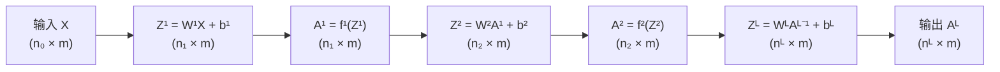
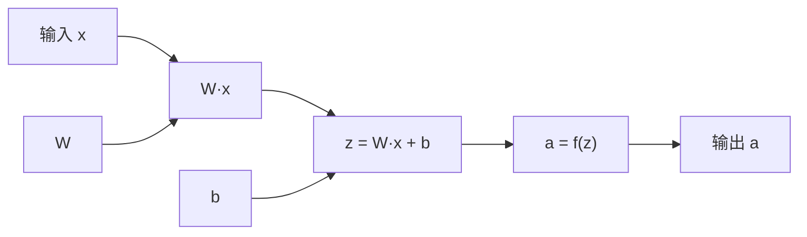

# 前向传播

在前三章中，我们逐步构建了神经网络的理论框架，从生物神经元到 M-P 模型，从单层感知机到多层感知机，从线性决策边界到非线性表达能力。现在，我们将深入神经网络的计算机制 —— **前向传播**（Forward Propagation）。前向传播的概念可以追溯到 1943 年，麦卡洛克和皮茨提出 M-P 模型时，描述神经元如何接收输入信号、加权求和、阈值处理后输出信号的过程就是前向传播的雏形。现在，前向传播特指在神经网络中信号从输入层经过各层神经元逐层传递到输出层的过程。本章将介绍信号流动过程、矩阵形式推导、计算图概念，以及批量计算与效率优化，并通过实验比较前向传播在 CPU 和 GPU 硬件中的速度差异。

## 信号流动过程

前文介绍感知机和多层感知机时，都是以单个神经元的角度去看待信号流动的，神经元接收多个输入信号 $\mathbf{x} = (x_1, x_2, \ldots, x_n)^T$，对每个输入信号乘以对应的权重向量并加上偏置值，得到线性组合的结果 $z = \sum_{i=1}^{n} w_i x_i + b = \mathbf{w}^T \mathbf{x} + b$，再通过激活函数 $f$ 变换，产生神经元输出 $a = f(z)$。这里"**输入 → 加权求和 → 激活变换**"的三步流程就构成了神经元的基本计算过程。

当我们将多个神经元组织成层，连接成网络后，必须借助矩阵运算，以整个网络的视角来描述输入信号经过多个神经元逐层传递的过程。假设有一个 $L$ 层（包括输入层、隐藏层和输出层）的神经网络，其第 $l$ 层的权重矩阵表示为 $\mathbf{W}^l$，偏置向量为 $\mathbf{b}^l$，它将接收第 $l-1$ 层的输出 $\mathbf{a}^{l-1}$，然后对其进行线性组合 $\mathbf{z}^l = \mathbf{W}^l \mathbf{a}^{l-1} + \mathbf{b}^l$，其中权重矩阵 $\mathbf{W}^l$ 的维度为 $n_l \times n_{l-1}$（行数等于本层神经元数量，列数等于上一层神经元数量），偏置向量 $\mathbf{b}^l$ 的维度为 $n_l \times 1$。再将结果通过激活函数 $f^l$ 进行变换，得到这层的输出 $\mathbf{a}^l = f^l(\mathbf{z}^l)$。对每层重复这个过程，直到最后一层的输出 $\mathbf{a}^L$ 就是整个网络对输入 $\mathbf{x}$ 的预测结果。如果理解了样本在单个神经元的信息流动过程，那么整个网络的信息流动就只是将参数变为矩阵的推广形式，这个过程可以用流程图直观表示：


*图：多层神经网络的信息流动过程*

从上图可知，信号流动是一个接力传递的过程，输入信号进入第一层，经过线性组合和激活变换后，输出作为第二层的输入，如此逐层传递，直到输出层产生最终预测。网络的每一层都在加工上一层传递来的信号，有的层提取特征，有的层组合特征，有的层做出判断。

现在我们已经将单个神经元的信息流动推广到整个网络，但这也只是单个样本进入网络的计算过程，在实际应用中，神经网络通常需要处理成千上万个样本，图像识别需要处理海量图片，语音识别需要处理大量音频片段，如果逐个样本计算前向传播，效率太过低下。所以我们还要更进一步，给出批量输入的矩阵形式，一次计算批量完成。

设输入包含 $m$ 个样本，每个样本有 $n_0$ 个特征，输入矩阵 $\mathbf{X} \in \mathbb{R}^{n_0 \times m}$，其中每一列是一个样本向量 $\mathbf{X} = [\mathbf{x}_1, \mathbf{x}_2, \ldots, \mathbf{x}_m]$，$L$ 层网络的第 $l$ 层接收第 $l-1$ 层的批量输出 $\mathbf{A}^{l-1} \in \mathbb{R}^{n_{l-1} \times m}$，然后对其进行线性组合 $\mathbf{Z}^l = \mathbf{W}^l \mathbf{A}^{l-1} + \mathbf{b}^l$，再通过激活函数 $f^l$ 进行变换得到第 $l$ 层的输出矩阵 $\mathbf{A}^l = f^l(\mathbf{Z}^l)$。如果理解了单个样本在网络的信息流动过程，那么批量样本的信息流动就只是将变量变为矩阵的推广形式，这个过程同样可以用流程图直观表示：



*图：批量样本在多层神经网络中的信息流动过程*

从上图可见，批量处理时信号流动过程与单样本完全一致，只是变量从向量扩展为矩阵。输入矩阵 $\mathbf{X}$ 的每一列代表一个样本，经过各层线性组合和激活变换后，输出矩阵 $\mathbf{A}^L$ 的每一列对应该样本的预测结果，矩阵运算一次性完成所有 $m$ 个样本的计算，充分利用了现代硬件的并行计算能力。

不过，这里在计算上还有一点小瑕疵需要处理。细心的读者可能会注意到公式 $\mathbf{Z}^l = \mathbf{W}^l \mathbf{A}^{l-1} + \mathbf{b}^l$ 中存在一个细节问题：$\mathbf{W}^l \mathbf{A}^{l-1}$ 结果大小为 $n_l \times m$，$\mathbf{b}^l$ 大小为 $n_l \times 1$。两者形状并不匹配，是不能相加的。这要通过[广播机制](../../maths/linear/numpy.md#广播机制)（Broadcasting）来解决。在 NumPy、PyTorch 等框架中，形状为 $n_l \times 1$ 的偏置向量会自动扩展为 $n_l \times m$，每列都是相同的偏置向量，相当于对所有样本添加相同的偏置，因为偏置是神经元的固有参数，不随样本变化。

至此，我们先把参数扩展为矩阵形式，将单个神经元的计算推广至网络，再把变量扩展为矩阵形式，将单个样本的计算推广至批量处理。参数与变量表达的计算过程表述为矩阵乘法和非线性变换的组合，既便于推导反向传播公式，也便于利用 GPU 等硬件的矩阵运算优化能力，现代深度学习框架（TensorFlow、PyTorch）的底层实现都是基于矩阵运算的。

## 计算图

矩阵形式将前向传播表达为紧凑的数学公式，现在把关注点从数学理论转移到工程实践，探讨深度学习框架如何管理复杂的计算流程的。现代深度学习框架能够高效处理神经网络大量运算工作的关键是**计算图**（Computational Graph），它不仅是理解和调试神经网络的有力工具，更是[自动微分](../../maths/calculus/numpy.md#自动微分)（Automatic Differentiation）的基础，为反向传播提供技术支撑。

计算图是一种表示计算过程的图形化方法，图中的节点表示运算（如加法、乘法、激活函数），边表示数据流动，将复杂的计算过程分解为基本运算的组合。神经网络的前向传播可以自然地表示为计算图，每个神经元包含两个节点，线性组合节点（$\mathbf{z} = \mathbf{W}\mathbf{x} + \mathbf{b}$）和激活节点（$\mathbf{a} = f(\mathbf{z})$）。多层网络将这些节点按层连接，形成完整的计算图。以单层感知机为例，计算图结构如下：


*图：单层感知机计算图*

图中每个节点代表一个运算：权重乘法（$\mathbf{W}·\mathbf{x}$）、偏置加法（$z$）、激活变换（$a$）。数据沿着边从输入节点流向输出节点，形成完整的计算链路。对于多层网络，计算图是多个单层计算图的串联，如下图所示：


*图：多层网络计算图*

在现代计算机体系中，计算图提供了许多便捷与优势，包括：

1. **可视化计算过程**：计算图直观展示数据如何从输入流向输出，每步进行什么运算。调试神经网络时，可视化计算图可以帮助定位计算错误、理解中间结果。
2. **支持自动求导**：这是计算图最重要的优势。反向传播需要计算梯度，手动推导梯度公式繁琐且容易出错。计算图是自动微分的基础，反向传播沿着计算图反向遍历，自动计算每个节点的梯度。这正是 TensorFlow、PyTorch 等框架能自动计算梯度的底层机制。
3. **便于模块化实现**：计算图将计算分解为基本运算单元（加法、乘法、激活函数等），便于模块化实现和组合。每个运算单元是独立的积木，可以自由组合构建复杂的网络结构。当前的深度学习框架都基于计算图构建，提供了丰富的运算单元库。
4. **支持优化**：计算图结构便于分析计算依赖关系，进行优化。譬如，算子融合将多个连续运算合并为单一运算，减少内存访问次数；并行计算识别无依赖的计算节点，并行执行提升效率，这些优化在现代框架中已广泛实现。

### 静态图与动态图

深度学习框架中，计算图有两种构建方式：静态图和动态图。理解两者的区别，有助于理解不同框架（TensorFlow vs PyTorch）的设计理念。

- **静态图**（Static Graph）：先定义完整的计算图结构，再执行计算。TensorFlow 早期版本（1.x）采用这种方式。用户先"画好"计算图的蓝图，然后框架对蓝图进行优化（算子融合、内存规划等），最后执行优化后的计算图。优点是可以预先优化计算图，执行效率高；缺点是灵活性较低，难以处理动态结构（如条件分支、循环变长序列），调试时难以实时检查中间结果。

- **动态图**（Dynamic Graph）：计算图在执行时动态构建。PyTorch 采用这种方式。每次执行前向传播时，框架边执行边构建计算图。优点是灵活性高，可以自由使用 Python 的条件分支、循环等控制流，便于调试（可以直接 print、设置断点）；缺点是无法预先优化，每次执行都要重新构建。

打个生活的比方，静态图就像"预制菜"，工厂预先设计好配方、准备好材料，用户只需按流程执行，效率高但无法定制；动态图就像"现炒现做"，厨师根据实际情况实时调整，灵活但计算效率相对较低。现代框架逐渐融合两种方式的优点，TensorFlow 2.x 支持动态图模式（Eager Execution），但可以通过 `tf.function` 转换为静态图进行优化；PyTorch 默认动态图，但支持 JIT 编译将动态图优化为静态图。这种融合让用户在开发时享受动态图的灵活性，在生产部署时享受静态图的高效性。

## 批量计算与效率优化

矩阵形式为**批量处理**（Batch Processing）奠定了基础，批量处理不仅仅是单纯的数学技巧，也是神经网络训练效率的核心。神经网络训练通常涉及大量样本，以图像分类为例，MNIST 数据集有 6 万样本、CIFAR-10 数据集有 5 万样本、ImageNet 数据集有 128 万样本。在语言模型的文本分类中，样本数量更是以亿为计数单位。由此可见，批量处理是优化计算效率必不可少的手段，它将多个样本合并为一个矩阵，一次性完成计算。设批量大小为 $B$（Batch Size），前向传播一次处理 $B$ 个样本，输出 $B$ 个预测结果；反向传播基于 $B$ 个样本的梯度平均值更新权重。批量处理的价值可以从以下三个角度来理解：

1. **计算效率**：矩阵运算可以利用 GPU 等硬件的并行计算能力。现代 GPU 有数千到上万个计算核心（如 NVIDIA A100 有 6912 个 CUDA 核心），设计之初就是为了高效执行矩阵运算。处理 $B$ 个样本的时间远小于逐个处理 $B$ 个样本的时间之和，就像卡车一次运输 1000 块砖，肯定比工人来回搬运 1000 次快得多。
2. **梯度稳定性**：基于多个样本的梯度平均值比单个样本的梯度更稳定。单个样本的梯度可能受噪声影响，方向不稳定；批量梯度是多样本的平均，噪声被平滑，梯度方向更稳定，训练更平稳。打个比方，单个样本的梯度就像盲人摸象，每个样本只反映局部信息；批量梯度就相当于多角度观察，综合多个样本的信息，方向更准确。
3. **内存利用**：批量处理可以更好地利用内存带宽。GPU 的计算速度很快，但数据传输速度相对较慢。批量处理减少数据传输次数，让 GPU 计算核心持续工作，而不是等待数据传输。

因此，批量大小 $B$ 也是神经网络模型的重要超参数，需要在效率、稳定性、内存之间权衡。下表列出了常见的批量大小范围和选择的原则：

| 批量大小范围 | 特点 | 适用场景 |
|:------------:|:-----|:---------|
| 小批量（$B=16$-$64$） | 梯度噪声大，训练波动，但有利于跳出局部最优；内存占用低 | 内存受限场景、研究实验、追求泛化性能 |
| 中等批量（$B=128$-$512$） | 平衡效率和稳定性，梯度噪声适中 | 常用选择，多数训练场景 |
| 大批量（$B=1024$+） | 计算效率高，梯度稳定，但可能陷入局部最优；内存占用高 | 大规模训练、GPU/TPU 高性能硬件 |

并不是在内存（显存）允许的情况下，批量越大越好。小批量梯度噪声大并不全然是坏事，噪声相当于在梯度方向上添加随机扰动，这种扰动可能帮助跳出局部最优或鞍点，探索更广的区域。大批量梯度平滑稳定，缺乏这种随机探索能力，容易沿着梯度方向稳定收敛到局部最优。研究表明，大批量训练的模型往往在训练集上表现更好，但在测试集上表现较差（泛化差距大），可能因为小批量噪声迫使模型学习更鲁棒的特征。

因为前向传播的计算效率直接影响训练和推理的速度，现代深度学习框架已经实现了多种优化策略，用户一般不需要手动优化，但理解这些策略有助于更好地利用框架能力。现代深度学习框架主要优化策略包括：

1. **矩阵运算优化**：利用 GPU 加速矩阵乘法（如 CUDA、cuBLAS），计算一个 $n \times n$ 矩阵乘法在 CPU 上需要 $O(n^3)$ 时间，GPU 可以利用数千个 GPU 核心并行计算，速度提升数十倍甚至上百倍。
2. **算子融合**：将线性组合和激活变换合并为单一操作，减少中间结果的存储和传输。传统实现先计算 $\mathbf{z}^l = \mathbf{W}^l \mathbf{a}^{l-1} + \mathbf{b}^l$，存储 $\mathbf{z}^l$，再计算 $\mathbf{a}^l = f(\mathbf{z}^l)$。融合实现直接计算 $\mathbf{a}^l = f(\mathbf{W}^l \mathbf{a}^{l-1} + \mathbf{b}^l)$，省去存储 $\mathbf{z}^l$ 的步骤，减少内存访问。更进一步，可以将多个连续运算合并为一个复合运算，减少计算图节点数量，降低执行开销。譬如，将"矩阵乘法 → 偏置加法 → 激活函数"三个节点合并为单一节点，减少中间结果的存储和传输，减少函数调用次数。
3. **内存复用**：复用中间结果的内存空间，减少内存分配开销。譬如，$\mathbf{Z}^l$ 计算完成后，如果后续不再需要 $\mathbf{Z}^l$，$\mathbf{A}^l$ 可以复用 $\mathbf{Z}^l$ 的内存。这减少了内存分配次数，提升执行效率。
4. **混合精度计算**：使用低精度浮点数（如 FP16，半精度浮点数）进行计算，减少内存占用和计算时间，同时保持足够的数值精度。FP16 占用内存是 FP32（单精度）的一半，计算速度更快。现代 GPU（如 NVIDIA V100、A100）专门优化了 FP16 计算，速度可达 FP32 的数倍。可以按不同的精度需求来使用混合精度计算，譬如，主计算流程使用 FP16，但梯度累积使用 FP32，避免精度损失导致训练不稳定。

这些优化策略在现代深度学习框架（TensorFlow、PyTorch）中已广泛实现。用户只需调用框架提供的算子（如 `nn.Linear`、`nn.ReLU`），框架自动应用优化。但对于理解框架行为、调试性能问题、定制优化方案，这些知识仍然有用。

## 前向传播算法实践

通过以下代码实现，我们可以直观感受矩阵运算的流程，验证维度检查的正确性，理解信号如何在层间流动。下面的实验实现了多层神经网络的前向传播，展示了单样本和批量处理两种场景的计算过程，并可视化了网络结构和计算流程。实验首先定义一个通用的神经网络类，然后对比 CPU 和 GPU 在不同批量大小下的前向传播速度，并对比不同网络规模下的性能差异，最后通过可视化图表展示 GPU 的加速效果，直观理解 GPU 并行计算在深度学习中的价值。

如果你使用的是 GPU 版本的沙箱，可以点击使用 Run on GPU 运行，否则只使用 CPU。从运行结果可以看出，由于有内存到显存拷贝等启动成本，在规模很小的神经网络中，GPU 并没有效率优势，但随着网络规模增大，GPU 的优势会迅速展现出来。

```python runnable gpu
import torch
import torch.nn as nn
import time
import matplotlib.pyplot as plt

# 检查GPU是否可用
device_gpu = torch.device('cuda' if torch.cuda.is_available() else 'cpu')
device_cpu = torch.device('cpu')

print("=" * 60)
print("PyTorch CPU vs GPU 前向传播速度对比实验")
print("=" * 60)
print(f"CPU设备: {device_cpu}")
print(f"GPU设备: {device_gpu}")
print(f"GPU名称: {torch.cuda.get_device_name(0) if torch.cuda.is_available() else 'N/A'}")
print()


class NeuralNetworkPyTorch(nn.Module):
    """
    多层神经网络PyTorch实现
    """
    def __init__(self, layer_sizes):
        """
        Parameters:
        layer_sizes : list of int
            各层神经元数量，如 [784, 256, 128, 10]
        """
        super(NeuralNetworkPyTorch, self).__init__()
        self.layer_sizes = layer_sizes
        
        # 构建网络层
        layers = []
        for i in range(len(layer_sizes) - 1):
            layers.append(nn.Linear(layer_sizes[i], layer_sizes[i+1]))
            if i < len(layer_sizes) - 2:  # 除了最后一层，都加ReLU
                layers.append(nn.ReLU())
            else:
                layers.append(nn.Sigmoid())  # 输出层用Sigmoid
        
        self.network = nn.Sequential(*layers)
    
    def forward(self, x):
        return self.network(x)


def benchmark_forward(model, input_data, device, num_iterations=100):
    """
    基准测试：测量前向传播时间
    """
    model = model.to(device)
    data = input_data.to(device)
    
    # 预热（warmup）
    for _ in range(10):
        _ = model(data)
    
    if device.type == 'cuda':
        torch.cuda.synchronize()
    
    # 正式计时
    start_time = time.perf_counter()
    for _ in range(num_iterations):
        _ = model(data)
        if device.type == 'cuda':
            torch.cuda.synchronize()
    end_time = time.perf_counter()
    
    avg_time = (end_time - start_time) / num_iterations
    return avg_time


# 实验1：不同批量大小下的速度对比
print("实验1：不同批量大小下的CPU vs GPU速度对比")
print("-" * 60)

# 网络配置：模拟MNIST规模的网络
layer_sizes = [784, 512, 256, 128, 10]  # 输入784(28x28图像), 3个隐藏层, 输出10(分类)
model = NeuralNetworkPyTorch(layer_sizes)
model.eval()  # 评估模式

print(f"网络结构: {' -> '.join(map(str, layer_sizes))}")
print(f"总参数量: {sum(p.numel() for p in model.parameters()):,}")
print()

# 测试不同的批量大小
batch_sizes = [16, 64, 256, 1024, 4096]
cpu_times = []
gpu_times = []
speedups = []

print(f"{'批量大小':<12} {'CPU时间(ms)':<15} {'GPU时间(ms)':<15} {'加速比':<10}")
print("-" * 60)

for bs in batch_sizes:
    # 生成随机输入数据
    input_data = torch.randn(bs, layer_sizes[0])
    
    # CPU测试
    cpu_time = benchmark_forward(model, input_data, device_cpu, num_iterations=50)
    cpu_times.append(cpu_time * 1000)  # 转换为毫秒
    
    # GPU测试
    if torch.cuda.is_available():
        gpu_time = benchmark_forward(model, input_data, device_gpu, num_iterations=100)
        gpu_times.append(gpu_time * 1000)
        speedup = cpu_time / gpu_time
        speedups.append(speedup)
        print(f"{bs:<12} {cpu_time*1000:<15.3f} {gpu_time*1000:<15.3f} {speedup:<10.1f}x")
    else:
        print(f"{bs:<12} {cpu_time*1000:<15.3f} {'N/A':<15} {'N/A':<10}")


# 实验2：不同网络规模下的速度对比
print("\n\n实验2：不同网络规模下的CPU vs GPU速度对比")
print("-" * 60)

# 固定批量大小
fixed_batch_size = 256

# 不同规模的网络
network_configs = [
    ('小型网络 [256, 128, 64, 10]', [256, 128, 64, 10]),
    ('中型网络 [784, 256, 128, 10]', [784, 256, 128, 10]),
    ('大型网络 [1024, 512, 256, 128, 10]', [1024, 512, 256, 128, 10]),
    ('超大网络 [4096, 2048, 1024, 512, 10]', [4096, 2048, 1024, 512, 10]),
]

print(f"固定批量大小: {fixed_batch_size}")
print()
print(f"{'网络规模':<30} {'CPU时间(ms)':<15} {'GPU时间(ms)':<15} {'加速比':<10}")
print("-" * 75)

network_speedups = []
network_labels = []

for name, layers in network_configs:
    net = NeuralNetworkPyTorch(layers)
    net.eval()
    input_data = torch.randn(fixed_batch_size, layers[0])
    
    cpu_time = benchmark_forward(net, input_data, device_cpu, num_iterations=30)
    
    if torch.cuda.is_available():
        gpu_time = benchmark_forward(net, input_data, device_gpu, num_iterations=100)
        speedup = cpu_time / gpu_time
        network_speedups.append(speedup)
        network_labels.append(name.split('[')[0].strip())
        print(f"{name:<30} {cpu_time*1000:<15.3f} {gpu_time*1000:<15.3f} {speedup:<10.1f}x")
    else:
        print(f"{name:<30} {cpu_time*1000:<15.3f} {'N/A':<15} {'N/A':<10}")


# 实验3：可视化对比结果
print("\n\n实验3：可视化速度对比")
print("-" * 60)

fig, axes = plt.subplots(1, 2, figsize=(14, 5))

# 图1：不同批量大小的速度对比
ax1 = axes[0]
x_pos = range(len(batch_sizes))

if gpu_times:
    # GPU可用：显示CPU vs GPU对比
    width = 0.35
    bars1 = ax1.bar([p - width/2 for p in x_pos], cpu_times, width, label='CPU', color='#3498db', alpha=0.8)
    bars2 = ax1.bar([p + width/2 for p in x_pos], gpu_times, width, label='GPU', color='#e74c3c', alpha=0.8)
    ax1.set_title('不同批量大小：CPU vs GPU 前向传播时间', fontsize=12, fontweight='bold')
    
    # 在柱状图上标注加速比
    for i, (cpu_t, gpu_t, sp) in enumerate(zip(cpu_times, gpu_times, speedups)):
        ax1.text(i, gpu_t * 0.5, f'{sp:.1f}x', ha='center', va='center',
                 fontsize=9, fontweight='bold', color='white')
else:
    # GPU不可用：只显示CPU数据
    bars1 = ax1.bar(x_pos, cpu_times, color='#3498db', alpha=0.8)
    ax1.set_title('不同批量大小：CPU 前向传播时间（GPU不可用）', fontsize=12, fontweight='bold')
    
    # 在柱状图上标注时间
    for i, cpu_t in enumerate(cpu_times):
        ax1.text(i, cpu_t * 0.5, f'{cpu_t:.1f}ms', ha='center', va='center',
                 fontsize=9, fontweight='bold', color='white')

ax1.set_xlabel('批量大小 (Batch Size)', fontsize=11)
ax1.set_ylabel('平均时间 (毫秒)', fontsize=11)
ax1.set_xticks(x_pos)
ax1.set_xticklabels(batch_sizes)
ax1.legend()
ax1.set_yscale('log')  # 使用对数刻度
ax1.grid(True, alpha=0.3, axis='y')

# 图2：加速比趋势或CPU性能趋势
ax2 = axes[1]

if speedups:
    # GPU可用：显示加速比趋势
    ax2_twin = ax2.twinx()
    
    line1 = ax2.plot(batch_sizes, speedups, 'o-', color='#2ecc71', linewidth=2,
                     markersize=8, label='批量大小 vs 加速比')
    ax2.set_xlabel('批量大小', fontsize=11)
    ax2.set_ylabel('加速比 (GPU/CPU)', fontsize=11, color='#2ecc71')
    ax2.tick_params(axis='y', labelcolor='#2ecc71')
    ax2.grid(True, alpha=0.3)
    
    if network_speedups:
        # 子图2b：网络规模 vs 加速比（用散点表示）
        x_pos_net = [i * max(batch_sizes) / 3 for i in range(len(network_speedups))]
        scatter = ax2_twin.scatter(x_pos_net, network_speedups, s=200, c='#f39c12',
                                   alpha=0.7, marker='s', label='网络规模 vs 加速比', zorder=5)
        ax2_twin.set_ylabel('加速比 (GPU/CPU)', fontsize=11, color='#f39c12')
        ax2_twin.tick_params(axis='y', labelcolor='#f39c12')
        
        # 添加网络规模标签
        for i, (x, y, label) in enumerate(zip(x_pos_net, network_speedups, network_labels)):
            ax2_twin.annotate(label, (x, y), xytext=(10, 10), textcoords='offset points',
                              fontsize=9, ha='left')
    
    ax2.set_title('GPU加速比趋势分析', fontsize=12, fontweight='bold')
    
    # 添加图例
    lines1, labels1 = ax2.get_legend_handles_labels()
    if network_speedups:
        lines2, labels2 = ax2_twin.get_legend_handles_labels()
        ax2.legend(lines1 + lines2, labels1 + labels2, loc='upper left')
    else:
        ax2.legend(loc='upper left')
else:
    # GPU不可用：显示CPU时间与批量大小的关系
    ax2.plot(batch_sizes, cpu_times, 'o-', color='#3498db', linewidth=2,
             markersize=8, label='CPU时间')
    ax2.set_xlabel('批量大小', fontsize=11)
    ax2.set_ylabel('平均时间 (毫秒)', fontsize=11)
    ax2.set_title('CPU 前向传播时间趋势（GPU不可用）', fontsize=12, fontweight='bold')
    ax2.grid(True, alpha=0.3)
    ax2.legend(loc='upper left')

plt.tight_layout()
plt.show()
plt.close()


# 输出总结
print("\n" + "=" * 60)
print("实验总结")
print("=" * 60)
print(f"1. 网络配置: {' -> '.join(map(str, layer_sizes))}")
print(f"2. 总参数量: {sum(p.numel() for p in model.parameters()):,}")
print(f"3. GPU可用: {torch.cuda.is_available()}")
if torch.cuda.is_available():
    print(f"4. GPU设备: {torch.cuda.get_device_name(0)}")
    print(f"5. 最大加速比: {max(speedups):.1f}x (批量大小 {batch_sizes[speedups.index(max(speedups))]})")
    print(f"6. 平均加速比: {sum(speedups)/len(speedups):.1f}x")
print("=" * 60)
```

## 本章小结

本章详细介绍了神经网络前向传播的计算机制，从单个神经元的三步流程（输入→加权求和→激活变换）到多层网络的逐层传递，从向量形式到矩阵形式的批量处理，从数学公式到计算图的图形化表示。前向传播是神经网络的基础计算机制，回答了信号如何在网络中流动的问题，这是神经网络的推理过程。但网络的参数（权重和偏置）如何确定的问题尚未解决，这涉及神经网络的训练过程。下一章将介绍反向传播算法，揭示神经网络如何学习自动调整参数，将预测误差转化为参数更新的方向。

## 练习题

1. 给定一个三层神经网络，输入维度 $n_0=3$，隐藏层神经元数 $n_1=5$，$n_2=4$，输出维度 $n_3=2$。批量大小 $B=10$。计算各层权重矩阵和预激活矩阵的形状。
    <details>
    <summary>参考答案</summary>

    **各层参数形状**：

    - 第 1 层权重矩阵 $\mathbf{W}^1$: $n_1 \times n_0 = 5 \times 3$
    - 第 1 层偏置向量 $\mathbf{b}^1$: $n_1 \times 1 = 5 \times 1$
    - 第 2 层权重矩阵 $\mathbf{W}^2$: $n_2 \times n_1 = 4 \times 5$
    - 第 2 层偏置向量 $\mathbf{b}^2$: $n_2 \times 1 = 4 \times 1$
    - 第 3 层权重矩阵 $\mathbf{W}^3$: $n_3 \times n_2 = 2 \times 4$
    - 第 3 层偏置向量 $\mathbf{b}^3$: $n_3 \times 1 = 2 \times 1$

    **各层预激活矩阵形状**（批量大小 $B=10$）：

    - 输入矩阵 $\mathbf{X}$（即 $\mathbf{A}^0$）: $n_0 \times B = 3 \times 10$

    - 第 1 层预激活 $\mathbf{Z}^1 = \mathbf{W}^1 \mathbf{A}^0 + \mathbf{b}^1$:
        - $\mathbf{W}^1$: $5 \times 3$
        - $\mathbf{A}^0$: $3 \times 10$
        - $\mathbf{W}^1 \mathbf{A}^0$: $5 \times 10$
        - $\mathbf{b}^1$（广播）: $5 \times 10$
        - $\mathbf{Z}^1$: $5 \times 10$

    - 第 1 层激活 $\mathbf{A}^1$: $5 \times 10$

    - 第 2 层预激活 $\mathbf{Z}^2 = \mathbf{W}^2 \mathbf{A}^1 + \mathbf{b}^2$:
        - $\mathbf{W}^2$: $4 \times 5$
        - $\mathbf{A}^1$: $5 \times 10$
        - $\mathbf{W}^2 \mathbf{A}^1$: $4 \times 10$
        - $\mathbf{Z}^2$: $4 \times 10$

    - 第 2 层激活 $\mathbf{A}^2$: $4 \times 10$

    - 第 3 层预激活 $\mathbf{Z}^3 = \mathbf{W}^3 \mathbf{A}^2 + \mathbf{b}^3$:
        - $\mathbf{W}^3$: $2 \times 4$
        - $\mathbf{A}^2$: $4 \times 10$
        - $\mathbf{W}^3 \mathbf{A}^2$: $2 \times 10$
        - $\mathbf{Z}^3$: $2 \times 10$

    - 第 3 层激活 $\mathbf{A}^3$（输出）: $2 \times 10$
    </details>