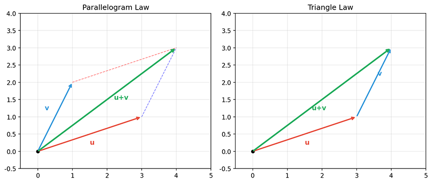

# 向量基础

向量是线性代数最基本的研究对象，也是理解机器学习算法的关键。本章将系统地介绍向量的定义、运算规则及其几何意义，为后续章节奠定坚实基础。

## 标量与向量

**标量（Scalar）** 是一个只有数值的量，没有方向，也没有单位。在数学中，标量可以是实数或复数，例如 $3$、$-5.7$、$\pi$ 等。标量用于表示大小或数量，是构成更复杂数学对象（如向量）的基本元素。

**向量（Vector）** 是由一组标量组成的有序序列。在数学上，$n$ 维向量 $\mathbf{v}$ 定义为：

$$\mathbf{v} = (v_1, v_2, \ldots, v_n)$$

其中 $v_i$ 称为向量的第 $i$ 个**分量（Component）**，$n$ 称为向量的**维度（Dimension）**，$n$ 维向量只存在于 $n$ 维空间中，意味着它需要 $n$ 个坐标轴才能完整描述。譬如，$\mathbf{v} = (3, -1, 2)$ 是一个三维向量，其三个分量分别为 $v_1 = 3$，$v_2 = -1$，$v_3 = 2$。按数据处理的的观点，特征向量的维度对应于特征的数量。例如，用"房屋面积、卧室数量、房龄"三个特征描述一套房子，就需要一个三维向量来表示。大数据中的“维表”、DBMS 中的“多维数据库”这些名字都是由此而来。

有一个与维度相关的易混淆的概念是向量的**长度（Length）**，也称为**大小（Size）**或**模（Magnitude）**，维度是几何视角看待向量所形成的概念，意为多少个坐标轴才能描述向量；而长度是代数视角下的产物，是指向量中包含的分量个数。对于 $n$ 维向量 $\mathbf{v} = (v_1, v_2, \ldots, v_n)$，其长度也同样为 $n$。与维度在数值上是相等的。但是后面讲到矩阵与张量的时情况就不一样了，一个 $3 \times 4$ 矩阵，可以说维度是 $3 \times 4$（二维结构），但长度为 12（元素总数）；一个模型训练中的 4 维张量 $(batch, channel, height, width)$，其维度是 4，长度则是 $batch \times channel \times height \times width$。

向量、矩阵的长度决定了存储该它们所需的储存空间大小；维度则是进行向量、矩阵运算时检查兼容性的重要依据，譬如两个矩阵进行加法运算的前提是必须具有相同的维度，而非长度。譬如 $2 \times 6$ 与 $3 \times 4$ 的两个矩阵长度都是 12，但它们不能进行加法运算。

还有一个数学上不经常提起，但是编程和机器学习框架中（如 NumPy、PyTorch、TensorFlow）被频繁使用的概念：**形状（Shape）**，它描述的是向量在内存中的存储结构。形状以元组形式表示，指明数组在每个维度上的大小。如：

| 表示形式 | 形状 | 数学表示 | 说明 |
|----------|------|------|------|
| 一维数组 | `(n,)` | $\begin{bmatrix} v_1 & v_2 & \cdots & v_n \end{bmatrix}$ |只有长度，无行列之分 |
| 行向量 | `(1, n)` | $\mathbf{v} = \begin{bmatrix} v_1 & v_2 & \cdots & v_n \end{bmatrix}$ | 1 行 $n$ 列的二维数组 |
| 列向量 | `(n, 1)` | $\mathbf{v} = \begin{pmatrix} v_1 \\ v_2 \\ \vdots \\ v_n \end{pmatrix}$ | $n$ 行 1 列的二维数组 |

在大多数线性代数文献和机器学习框架中，默认使用**列向量**。在 Python 的 NumPy 框架中，一维数组既可以表示行向量也可以表示列向量：

```python
import numpy as np

# 一维数组（默认表示向量）
v = np.array([3, -1, 2])
print(f"形状：{v.shape}")  # (3,) - 一维数组

# 明确的行向量（二维数组）
row_vector = v.reshape(1, -1)
print(f"行向量形状：{row_vector.shape}")  # (1, 3)

# 明确的列向量（二维数组）
col_vector = v.reshape(-1, 1)
print(f"列向量形状：{col_vector.shape}")  # (3, 1)
```

接下来，笔者会从向量定义开始，逐步引出一系列与之相关的概念。这些概念在大学的线性代数课程中往往会花费一个学期乃至更多的时间来讲解，因此，一时无法理解、记忆并不要紧，在后续章节用到时再回来查看是完全可行的。

## 向量空间

**向量空间（Vector Space）** 是一个更抽象的数学概念：设 $V$ 是一个非空集合，$\mathbb{F}$ 是一个数域（通常是实数域 $\mathbb{R}$），如果 $V$ 中定义了加法和数乘两种运算，且满足以下八条公理，则称 $V$ 是 $\mathbb{F}$ 上的向量空间：

| 加法公理（4 条） | 数乘公理（4 条） |
|----------------|---------------|
| 1. 交换律：$\mathbf{u} + \mathbf{v} = \mathbf{v} + \mathbf{u}$ | 5. 数乘对向量加法分配：$c(\mathbf{u} + \mathbf{v}) = c\mathbf{u} + c\mathbf{v}$ |
| 2. 结合律：$(\mathbf{u} + \mathbf{v}) + \mathbf{w} = \mathbf{u} + (\mathbf{v} + \mathbf{w})$ | 6. 数乘对标量加法分配：$(c + d)\mathbf{v} = c\mathbf{v} + d\mathbf{v}$ |
| 3. 零向量存在：存在 $\mathbf{0}$ 使得 $\mathbf{v} + \mathbf{0} = \mathbf{v}$ | 7. 数乘结合律：$c(d\mathbf{v}) = (cd)\mathbf{v}$ |
| 4. 逆元存在：对任意 $\mathbf{v}$，存在 $-\mathbf{v}$ 使得 $\mathbf{v} + (-\mathbf{v}) = \mathbf{0}$ | 8. 单位元：$1 \cdot \mathbf{v} = \mathbf{v}$ |

以上八条公理严格保证了向量运算的基本性质，但是对于非数学专业的读者，它们光读起来就已经显得异常拗口。这里不妨发挥些许想象力，将向量空间想成一张无限大的白纸，这张白纸上的每一个点都能进行以下“加法”和“数乘”两种动作：

- **加法**：从原点出发，先走向量 a 再走向量 b，等价于直接走 a + b
- **数乘**：可以把向量 a 拉长 2 倍变成 2a，或反向翻转变成 -a

显然，无论“加法”还是“数乘”如何折腾，所到达的目的地最终还是会落在这张无限大的白纸里面（具有封闭性），并且这些操作还都满足结合律、分配律等"自然"的算术规则，那么，这张白纸就被称作是一个向量空间。无论是严格的八条公理，还是白纸上将加法、数乘理解为点移动的直观解释，其实都在说同一件事儿：向量空间里面的元素能互相"增减"和"缩放"，且怎么折腾都不会跑出这个集合外。在机器学习中，我们主要关注**欧几里得空间** $\mathbb{R}^n$，即所有 $n$ 维实数向量的集合。

## 线性相关与线性无关

如果给定一组向量 $\mathbf{v}_1, \mathbf{v}_2, \ldots, \mathbf{v}_k$，存在不全为零的标量 $c_1, c_2, \ldots, c_k$，使得：$c_1\mathbf{v}_1 + c_2\mathbf{v}_2 + \cdots + c_k\mathbf{v}_k = \mathbf{0}$，
则称这组向量**线性相关（Linearly Dependent）**。否则，如果只有 $c_1 = c_2 = \cdots = c_k = 0$ 才能使上式成立，则称这组向量**线性无关（Linearly Independent）**。

这两个定义的直观解释是：线性无关意味着没有任何一个向量可以被其他向量表示，好比一个由程序员、设计师、产品经理组成的团队，每个成员都有独特的技能，没有人能替代其他人；线性相关意味着至少有一个向量可以由其他向量的线性组合表示，相当于团队中有人是"多余的"，他能做的工作别人也能做。以数据即向量的观点来看，线性相关就意味着数据集中存在“冗余的数据”。

机器学习中经常使用**秩（Rank）**这个概念来衡量数据之间的相关性，秩的定义直接来源于对向量组线性无关程度的度量，它是指“向量组中线性无关向量的最大个数”。一旦想明白了秩的定义，即使现在还没有看后面关于机器学习的章节，相信读者也可以大致推断出下面常见的机器学习应用是在做些什么。

- **特征选择**：如果特征矩阵的秩小于特征数，说明存在冗余特征
- **数据压缩**：秩分解可以实现低秩近似，用更少参数近似原矩阵，降低维度，减少存储空间
- **奇异值分解**：秩等同于非零奇异值个数，决定了"有多少东西值得保留"
- **模型 LoRA 微调**：只训练"低秩适配器"，不动原模型，用极少参数实现高效微调
- ……

根据秩的定义，对于一个矩阵，其秩应等于其行向量组的秩，也等于其列向量组的秩。因此，可以通过如下代码，反过来判断若干向量是否线性相关。

```python
import numpy as np
from numpy.linalg import matrix_rank

# 判断向量组是否线性相关
def is_linearly_independent(vectors):
    """
    通过矩阵秩判断向量组是否线性无关
    如果秩等于向量个数，则线性无关
    """
    A = np.column_stack(vectors)  # 将向量组成矩阵
    rank = matrix_rank(A)
    return rank == len(vectors)

# 示例：三维空间中的三个向量
v1 = np.array([1, 0, 0])
v2 = np.array([0, 1, 0])
v3 = np.array([0, 0, 1])  # 与 v1, v2 线性无关

v4 = np.array([1, 1, 0])  # v4 = v1 + v2，与 v1, v2 线性相关

print(f"v1, v2, v3 线性无关：{is_linearly_independent([v1, v2, v3])}")  # True
print(f"v1, v2, v4 线性无关：{is_linearly_independent([v1, v2, v4])}")  # False
```

## 向量加法与数乘

前面讲解向量空间时，已经以通俗解释的形式提到过加法与数乘。向量加法和数乘是向量空间中最基本的两种运算，它们共同构筑了线性代数的基础。

**向量加法**定义如下：对于两个同维向量 $\mathbf{u} = (u_1, \ldots, u_n)$ 和 $\mathbf{v} = (v_1, \ldots, v_n)$，其相加的代数定义为：$\mathbf{u} + \mathbf{v} = (u_1 + v_1, u_2 + v_2, \ldots, u_n + v_n)$。向量加法有两种等价的几何解释，即“平行四边形法则”与“三角形法则”，分别是：

- **平行四边形法则**：将两个向量 $\mathbf{u}$ 和 $\mathbf{v}$ 的起点放在同一点，以它们为邻边作平行四边形，从公共起点出发的对角线就是 $\mathbf{u} + \mathbf{v}$。

- **三角形法则**：将 $\mathbf{v}$ 的起点放在 $\mathbf{u}$ 的终点，从 $\mathbf{u}$ 的起点到 $\mathbf{v}$ 的终点的向量就是 $\mathbf{u} + \mathbf{v}$。



*图 “平行四边形法则”与“三角形法则”*

**数乘（Scalar Multiplication）** 也称标量乘法，定义即为标量与向量的乘积：$c\mathbf{v} = (cv_1, cv_2, \ldots, cv_n)$。数乘的几何意义比加法更加直观，便是对向量进行 $\mathbf{c}$ 倍的缩放操作：

- 当 $c > 0$：向量的长度缩放为原来的 $|c|$ 倍，方向不变
- 当 $c < 0$：向量的长度缩放为原来的 $|c|$ 倍，方向反向
- 当 $c = 0$：结果为零向量 $\mathbf{0}$

几乎所有向量的操作都由这两种基本的运算组合而来，譬如模型训练过程中，经常被提及的**线性组合（Linear Combination）** 便是一种向量加法和数乘的复合运算。给定向量 $\mathbf{v}_1, \mathbf{v}_2, \ldots, \mathbf{v}_k$ 和标量 $c_1, c_2, \ldots, c_k$，那么它们的线性组合即为 $c_1\mathbf{v}_1 + c_2\mathbf{v}_2 + \cdots + c_k\mathbf{v}_k$。线性组合是神经网络的基础，神经网络每一层的输出就是前一层的输出（向量）与权重矩阵（决定了线性组合系数）的乘积。

## 向量子空间

**子空间（Subspace）** 在数学上是向量空间 $V$ 的一个子集 $W$，它满足如下性质：
1. 包含零向量：$\mathbf{0} \in W$
2. 对加法封闭：$\mathbf{u}, \mathbf{v} \in W \Rightarrow \mathbf{u} + \mathbf{v} \in W$
3. 对数乘封闭：$\mathbf{v} \in W, c \in \mathbb{R} \Rightarrow c\mathbf{v} \in W$

笔者照例给出一个通俗的解释，想象你站在室外操场上（这是一个三维空间）晒太阳，以你的脚尖为原点，你的影子被阳光投射在地面上，这个地面上的阴影就是你这个三维物体的一个二维子空间。影子上的任何一点都可以用“东-西”和“北-南”两个方向来描述，但是不再需要考虑“上-下”（高度）这个维度。如果用子空间的数学语言来描述以上场景是这样的：在三维空间 $\mathbb{R}^3$ 中，所有形如 $(x, y, 0)$ 的向量构成一个子空间——它就是 $xy$ 平面。这个平面满足三条规则：包含原点 $(0,0,0)$、平面上两点相加仍在平面上、平面上任意点缩放后仍在平面上。同理，在二维平面 $\mathbb{R}^2$ 中，过原点的任意直线都是一个子空间。比如所有形如 $(t, 2t)$ 的点（即直线 $y=2x$）构成一个一维子空间。这条直线穿过原点，直线上两点相加还在直线上，直线上任意点缩放后仍在直线上。

子空间的概念在降维、特征工程等机器学习任务中有非常广泛的应用。譬如，PCA 找到的主成分方向就构成一个低维子空间。

## 内积与投影

当把数的概念从标量扩展到向量后，构成向量的多个标量将以不同的规则相乘，会的得出不同的结果，因此“乘法”对于向量（当然也包括后续的矩阵和张量）就是个需要根据上下文或数学符号才能准确分辨的词汇。譬如，两个同维向量对应位置元素相乘，结果仍是同维向量，这种称为逐元素积（Hadamard 积）；两个向量进行列向量与向量组个元素相乘，结果生成一个矩阵，这种称为外积（Outer Product），还有外积在更高维的张量上的推广克罗内克积（Kronecker Product）；又或者局限于三维空间，但在计算机图形学中（计算表面法向量）、物理学中（力矩、角动量）都很常见的叉积（Cross Product），等等。

由于下一篇才会讲到矩阵、张量这些概念，因此这里我们只关注内积和它的应用。**内积（Inner Product）**，也称为点积（Dot Product），它的代数定义为：$\mathbf{u} \cdot \mathbf{v} = \sum_{i=1}^{n} u_i v_i = u_1v_1 + u_2v_2 + \cdots + u_nv_n$。内积满足如下性质：
1. 交换律：$\mathbf{u} \cdot \mathbf{v} = \mathbf{v} \cdot \mathbf{u}$
2. 分配律：$\mathbf{u} \cdot (\mathbf{v} + \mathbf{w}) = \mathbf{u} \cdot \mathbf{v} + \mathbf{u} \cdot \mathbf{w}$
3. 数乘结合：$(c\mathbf{u}) \cdot \mathbf{v} = c(\mathbf{u} \cdot \mathbf{v})$
4. 非负性：$\mathbf{v} \cdot \mathbf{v} \geq 0$，等号成立当且仅当 $\mathbf{v} = \mathbf{0}$

在本章的引言部分，笔者介绍向量应用场景时，曾经提到过向量内积的结果其实是度量了两个向量的"方向一致性程度"——同向时最大，反向时最小（负），垂直时为零。这类“方向一致”、“垂直”、“相反”的描述，都可以视为是对内积的几何解释，事实上，内积的几何定义也许更加值得讨论，它表示为：$\mathbf{u} \cdot \mathbf{v} = \|\mathbf{u}\| \|\mathbf{v}\| \cos\theta$。其中 $\theta$ 是两个向量之间的夹角，$\|\cdot\|$ 表示向量的模长（L2 范数，范数的含义我们稍后就会讲解）。内积可以说是向量之间最重要的运算之一，因为它建立了代数与几何的桥梁。通过内积的代数计算可以等到向量夹角（$\cos\theta = \frac{u \cdot v}{|u| |v|}$）、向量长度（$|v| = \sqrt{v \cdot v}$）这些几何量，还可以用代数表达式精确描述正交（$u \cdot v = 0$）、投影（$\text{proj}_u(v) = \frac{v \cdot u}{u \cdot u} u$）这样的几何概念。不夸张地说，内积让"计算"与"看见"最终统一了起来。

**余弦相似度（Cosine Similarity）** 是内积的一种典型的应用，也是机器学习中常用的相似度度量，广泛用于文本相似度比较、推荐系统等场景。它的定义可以直接从内积几何定义中得出：$\text{cosine\_similarity}(\mathbf{u}, \mathbf{v}) = \frac{\mathbf{u} \cdot \mathbf{v}}{\|\mathbf{u}\| \|\mathbf{v}\|}$，显而易见，它是内积去掉摸长后的结果（内积公式 $\mathbf{u} \cdot \mathbf{v} = \|\mathbf{u}\| \|\mathbf{v}\| \cos\theta$ 两边同时除以 $\|\mathbf{u}\| \|\mathbf{v}\|$）。这表明余弦相似度只关心向量的方向，并不关心向量的长度。这个特点在处理文本相似度中十分有用，因为一小段话与一大篇文章完全有可能在描述同一个意思。

**投影（Projection）** 也是内积的另一种典型应用。向量 $\mathbf{u}$ 在向量 $\mathbf{v}$ 上的投影可表示为：$\text{proj}_{\mathbf{v}} \mathbf{u} = \frac{\mathbf{u} \cdot \mathbf{v}}{\mathbf{v} \cdot \mathbf{v}} \mathbf{v} = \frac{\mathbf{u} \cdot \mathbf{v}}{\|\mathbf{v}\|^2} \mathbf{v}$。从几何意义上看，投影描述了向量 $\mathbf{u}$ 在向量 $\mathbf{v}$ 方向上的"影子"——它是 $\mathbf{u}$ 在 $\mathbf{v}$ 方向上的分量，可以形象地理解为：当一束垂直于 $\mathbf{v}$ 的光线照射 $\mathbf{u}$ 时，在 $\mathbf{v}$ 所在直线上投下的影子。投影的结果 $\text{proj}_{\mathbf{v}} \mathbf{u}$ 是一个与 $\mathbf{v}$ 同向（或反向）的向量，其模长反映了 $\mathbf{u}$ 在 $\mathbf{v}$ 方向上的"影响力"大小。投影在各种科学领域中都有着广泛的应用场景，譬如：

- **数据降维**：在 PCA（主成分分析）中，数据点在主成分方向上的投影决定了该维度上的坐标值，通过保留高方差的投影维度实现降维
- **信号处理**：将信号投影到特定基函数上，用于滤波、噪声消除或特征提取，如傅里叶变换本质上是将信号投影到不同频率的正弦波上
- **机器学习**：最小二乘线性回归的求解过程，本质上就是将响应向量投影到设计矩阵的列空间上，找到最佳拟合超平面
- **计算机图形学**：3D 物体在 2D 屏幕上的显示需要通过投影变换，包括正交投影和透视投影
- **物理力学**：将力分解为沿某方向的分量（如斜面上物体的重力分解为下滑力和正压力）

## 正交基与标准正交基

**基（Basis）** 是向量空间的一组线性无关向量，使得空间中任意向量都可以表示为这组向量的线性组合。就像我们平常在三维空间中用 x、y、z 轴描述任何位置一样，基提供了一套描述向量空间中所有向量的"语言"。譬如有一组二维平面 $\mathbb{R}^2$ 的基向量 $\mathbf{e}_1 = (1, 0)$ ，$\mathbf{e}_2 = (0, 1)$，那么向量（3,2）就可以表示为 $(3, 2) = 3\cdot\mathbf{e}_1 + 2\cdot\mathbf{e}_2 = 3\cdot(1,0) + 2\cdot(0,1)$。这里的 3 和 2 就是该向量在这个基下的坐标。

如同正方形与平行四边形、直角坐标系与笛卡尔坐标系的关系那样，在所有基向量中有一类两两正交的特殊子集，被称为**正交基**。上面举的例子 $\mathbf{e}_1 = (1, 0)$ ，$\mathbf{e}_2 = (0, 1)$ 就是一组正交基。进一步，如果正交基的每个向量都是单位向量（模长为 1），那我们就成其为**标准正交基（Orthonormal Basis）**。根据正交与摸长为 1 的定义，显然标准正交基 $\{\mathbf{e}_1, \mathbf{e}_2, \ldots, \mathbf{e}_n\}$ 满足：$\mathbf{e}_i \cdot \mathbf{e}_j = \begin{cases} 1, & i = j \\ 0, & i \neq j \end{cases}$。最常用的标准正交基是**自然基**，既：
- $\mathbf{e}_1 = (1, 0, 0, \ldots, 0)$
- $\mathbf{e}_2 = (0, 1, 0, \ldots, 0)$
- ...

标准正交基使得坐标计算变得简单：向量 $\mathbf{v}$ 在标准正交基下的第 $i$ 个坐标就是 $\mathbf{v} \cdot \mathbf{e}_i$。对于非正交的基还得解线性方程组才能求得坐标，尽管也能达成目的，但就显得比较啰嗦。

## 向量范数

**范数（Norm）** 类似于“尺子”，是用来度量向量“大小”的量，可以理解为求向量的长度。前面提到过的模长（Magnitude）就是范数的其中一种类型（特指 L2 范数）。“求向量长度”这句通俗描述的严谨定义是这样一个函数：$\|\cdot\|: V \to \mathbb{R}$，符号“$\|$”看起来像绝对值“|”的“加强版”，它就是范数符号，可以理解为绝对值在高维空间的推广。“$\cdot$” 是一个占位符，表示"这里要摆放一个向量"。$V \to \mathbb{R}$ 的含义是从向量空间 $V$（所有向量的集合）到实数集 $\mathbb{R}$ 的一个映射，意思是范数把向量变成普通数字（度量长度大小的标量）。范数满足如下性质：

1. 非负性：$\|\mathbf{v}\| \geq 0$，等号成立当且仅当 $\mathbf{v} = \mathbf{0}$ （含义：且只有零向量的范数是 0）
2. 齐次性：$\|c\mathbf{v}\| = |c| \|\mathbf{v}\|$ （含义：数乘后长度等比例缩放）
3. 三角不等式：$\|\mathbf{u} + \mathbf{v}\| \leq \|\mathbf{u}\| + \|\mathbf{v}\|$ （含义：三角的两边之和大于第三边）

数学的内容讲完了，后面照例是通俗解释。不过到这里，可能已经会有读者先产生疑问，什么叫模长是范数的其中“一种”类型？既然长度已经是个标量，为什么还能有多种不同类型？还有什么是 L2 范数，还有其他 L1、L3 范数吗？

我们先来考虑这样一个现实场景：用户使用导航软件查询深成市到珠海市的距离，在搜索列表中，导航显示距离大致是 67 千米，当点击导航按钮后，导航规划的路线长度是 112 千米。显然，产生差异的原因在于这两个距离意义并不相同，前者是空间上的直线最短距离，但用户无法凭空飞跃过去，后者才是考虑了实际通行线路后的“计程车距离”。

将这个现实场景类比到范数中：求两点之间的直线距离（为方便，我们将其中一点平移到向量空间的原点上，平移操作不改变距离大小）就是** L2 范数（欧几里得范数）**。从名字很容易联想到在初等几何中平面直角坐标系中的欧几里得距离公式 $d = \sqrt{(x_1-x_2)^2+(y_1-y_2)^2}$。当其中一点为原点时，计算另一点到原点的距离公式简化为 $d = \sqrt{x_1^2+y_1^2}$。

更一般地，从二维平面扩展到高维空间，L2 范数计算的就是向量 $v$ 到原点的直线距离，计算公式为 $\|\mathbf{v}\|_2 = \sqrt{v_1^2 + v_2^2 + \cdots + v_n^2}$ 。同样的类比，如果求两点之间只能沿坐标轴方向行走的总距离，就类似于导航路线中智只能沿着道路行进的总距离，这被称为** L1 范数（曼哈顿范数）**，计算方法就是对向量对应各个坐标轴中的分量进行绝对距离求和，计算公式为 $\|\mathbf{v}\|_1 = \sum_{i=1}^{n} |v_i| = |v_1| + |v_2| + \cdots + |v_n|$。

在 L1、L2 范数的基础上，数学学者们进一步拓展产生了 **$L_p$ 范数**，它的定义为 $\|\mathbf{v}\|_p = \left( \sum_{i=1}^{n} |v_i|^p \right)^{1/p}$。不妨对比一下前面 L1、L2 范数的公式，易见这两条公式是 $p=1、p=2$ 时 $L_p$ 范数公式的特例。同理，如果我们将 $p=0$ 代入，还能得到 L0 范数（$\|\mathbf{v}\|_0 = \sum_{i=1}^{n} \mathbf{1}_{x_i \neq 0}$）的计算公式，从公式可以看出这实际是求向量中从非零元素的个数。严格来说，"L0 范数"不是真正的范数（不满足齐次性：$|\alpha \mathbf{x}|_0 \neq |\alpha| \cdot |\mathbf{x}|_0$），但由于其形式与 $L_p$ 范数族相似，习惯上仍这样称呼。这里作为课间思考题，请读者想一下当 $p=\infty$ 时，$\|\mathbf{v}\|_\infty $ 范数的公式是什么，从公式看它应当具备什么意义？

在机器学习中，范数贯穿于模型设计、训练、优化的全过程，以它在正则化（Regularization）过程中的发挥的作用为例：模型训练的一类重要风险是过拟合现象。假设我们用大量高考试题训练一个学生做题模型，希望的是这个模型能理解解题思路和方法，在下一次高考能得高分，而不希望模型把历年高考题目答案全部背下来，面对历史高考题能得满分，遇到新题就懵了。这种只记住训练数据，泛化能力差的现象就是过拟合。正则化实质是一种防止模型"死记硬背"训练数据，让它学会"通用规律"而不是"背诵答案"的手段。在机器学习中，正则化通过在损失函数中增加对模型复杂度的"惩罚"，迫使模型学习更简洁、更具泛化能力的规律。囿于当前我们还没有讲解过模型训练的相关知识，在这个问题上无法进一步展开，需后面学习模型训练的正则化章节中再继续展开讨论。

## 本章小结

本章从向量这一线性代数最基本的研究对象出发，系统地构建了理解机器学习算法所需的数学基础。

- **向量的本质与表示**。向量是由标量组成的有序序列，是数据的结构化表示形式。理解向量的维度、长度与形状等概念，是正确使用机器学习框架（如 NumPy、PyTorch）进行数据操作的前提。列向量作为默认表示形式，贯穿后续矩阵运算的始终。

- **向量空间的代数结构**。向量空间通过八条公理严格定义了加法与数乘运算的封闭性，其中线性相关与线性无关的概念直接引出了"秩"这一核心度量。秩不仅衡量数据冗余程度，更是特征选择、数据压缩、LoRA 微调等技术的理论基础。

- **内积：连接代数与几何的桥梁**。内积的代数定义（对应分量相乘求和）与几何定义（模长乘积与夹角余弦的乘积）等价，这一性质使得我们可以通过纯代数运算获得向量的几何特征。基于内积的余弦相似度广泛用于文本相似度计算和推荐系统，而投影运算则是 PCA 降维、信号处理、最小二乘回归的数学基础。

- **基的选取与坐标表示**。基提供了一套描述向量空间的"语言"，正交基和标准正交基因其良好的几何性质而被广泛使用。标准正交基使得坐标计算简化为内积运算，避免了求解线性方程组的繁琐过程。

- **范数：多角度的度量工具**。从 L1 范数的"曼哈顿距离"到 L2 范数的"欧几里得距离"，不同范数反映了不同的度量视角。范数不仅是衡量向量大小的工具，更是正则化技术的核心——通过在损失函数中引入范数惩罚，有效防止模型过拟合，提升泛化能力。

这些概念相互关联、层层递进：向量空间定义了运算的舞台，线性相关性刻画了数据的冗余结构，内积建立了代数与几何的联系，正交基提供了最优的坐标系统，范数则赋予了我们多角度度量数据的能力。掌握这些基础，将为后续学习矩阵、线性变换以及更复杂的机器学习算法奠定坚实基础。

下一章将介绍矩阵——向量的自然扩展，以及线性变换的几何意义。