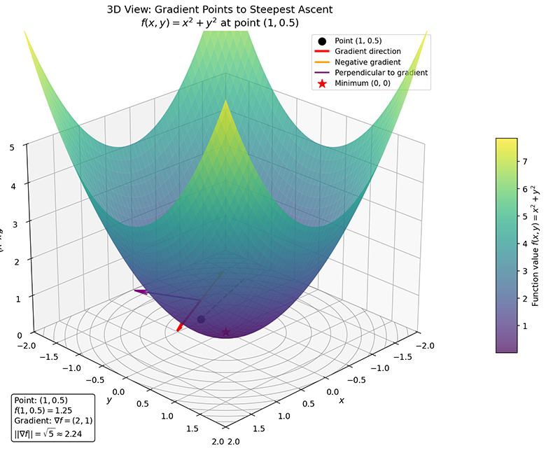

# 多元函数与复合函数求导

上一章我们学习了单变量函数的导数和微分，建立了变化率的基本概念。然而，机器学习中的大多数问题涉及多个变量——神经网络的参数可能有数百万甚至数十亿个，损失函数是这些参数的多元函数。本章将把导数概念推广到多元函数，介绍偏导数、梯度、链式法则、方向导数和海森矩阵等核心概念，为理解机器学习优化算法奠定理论基础。

## 偏导数

**多元函数**（Multivariate Function）是单变量函数的自然推广。一个 $n$ 元函数 $f$ 就是将 $n$ 个输入 $(x_1, x_2, \ldots, x_n)$ 映射到一个输出值。现实世界里，多元函数比一元函数更普遍，譬如神经网络中每一层的输出是多个输入的多元函数，神经网络优化过程中的损失函数 $L(\theta_1, \theta_2, \ldots, \theta_n)$ 是模型参数的多元函数，特征向量 $(x_1, x_2, \ldots, x_n)$ 对应的预测值 $f(x_1, x_2, \ldots, x_n)$，等等。

当我们处理多元函数时，首先想到的是用固定变量的思维将问题简化，去思考如果只让其中一个变量变化，而保持其他变量不变，函数值会如何变化？这正是**偏导数**（Partial Derivative）解决问题的思路。设 $z = f(x, y)$ 是一个二元函数，$f$ 在点 $(x_0, y_0)$ 处关于 $x$ 的偏导数定义为当 $y$ 固定不变，$x$ 发生微小的变化量 $\Delta x$ 时，函数 $f$ 关于 $x$ 的偏导数是：

$$\frac{\partial f}{\partial x} = \lim_{\Delta x \to 0} \frac{f(x_0 + \Delta x, y_0) - f(x_0, y_0)}{\Delta x}$$

类似地，关于 $y$ 的偏导数被定义为：

$$\frac{\partial f}{\partial y} = \lim_{\Delta y \to 0} \frac{f(x_0, y_0 + \Delta y) - f(x_0, y_0)}{\Delta y}$$

求 $f(x, y)$ 关于 $x$ 的偏导数时，将 $y$ 视为常数，对 $x$ 求普通导数，与单变量导数的计算方法完全一致，因此上一章节介绍的[导数运算法则](derivative.md#常见函数的导数)依然适用。设 $f(x, y) = x^2 y + 3xy^2$，求 $\frac{\partial f}{\partial x}$ 时，视 $y$ 为常数，$\frac{\partial f}{\partial x} = 2xy + 3y^2$，求 $\frac{\partial f}{\partial y}$ 时，视 $x$ 为常数，$\frac{\partial f}{\partial y} = x^2 + 6xy$ 。

导数在几何上被视为切线的斜率，偏导数有同样直观的几何解释。对于二元函数 $z = f(x, y)$，其图像是三维空间中的一张曲面。$\frac{\partial f}{\partial x}$ 表示在曲面上沿 $x$ 方向的"切线斜率"，$\frac{\partial f}{\partial y}$ 表示沿 $y$ 方向的"切线斜率"。具体来说，$\frac{\partial f}{\partial x}(x_0, y_0)$ 是曲面与平面 $y = y_0$ 的交线在点 $(x_0, y_0, f(x_0, y_0))$ 处的切线斜率。这相当于"固定 $y$，只让 $x$ 变化"的切线斜率。简而言之，偏导数代表着函数沿坐标轴方向的变化率。

那如果我们不想局限于固定坐标轴，想知道沿任意方向的变化率呢？这就需要**方向导数**（Directional Derivative）：设 $f(x, y)$ 是一个二元函数，$\mathbf{u} = (u_1, u_2)$ 是一个单位向量（$\|\mathbf{u}\| = 1$），则 $f$ 在点 $(x_0, y_0)$ 处沿方向 $\mathbf{u}$ 的方向导数定义为：

$$D_{\mathbf{u}} f(x_0, y_0) = \lim_{h \to 0} \frac{f(x_0 + h u_1, y_0 + h u_2) - f(x_0, y_0)}{h}$$

几何直观上，方向导数表示从点 $(x_0, y_0)$ 出发，沿方向 $\mathbf{u}$ 移动一小步 $h$ 时，函数值的平均变化率的极限。

## 梯度

偏导数告诉我们函数沿每个坐标轴方向的变化率。如果把所有坐标方向的偏导数信息组合起来，就得到一个向量，称为**梯度**（Gradient）：设 $f(x_1, x_2, \ldots, x_n)$ 是一个多元函数，其梯度定义为：

$$\nabla f = \left(\frac{\partial f}{\partial x_1}, \frac{\partial f}{\partial x_2}, \ldots, \frac{\partial f}{\partial x_n}\right)$$

其中 $\nabla$ 称为**梯度算子**（Gradient Operator）。有了梯度后，我们可以从另外一个角度来观察方向导数——方向导数是梯度与方向向量的内积：

$$D_{\mathbf{u}} f = \nabla f \cdot \mathbf{u}$$

这个公式（在学习[链式法则](#链式法则)后可以证明它与前面的定义是等价的）揭示了梯度一个极其重要的几何性质：**梯度指向函数值增长最快的方向**。回想一下 [内积的定义与几何性质](../linear/vectors.md#内积与投影)，设 $\theta$ 为梯度 $\nabla f$ 与方向向量 $\mathbf{u}$ 之间的夹角，则有 $D_{\mathbf{u}} f = \|\nabla f\| \|\mathbf{u}\| \cos\theta $，又由于 $\|\mathbf{u}\| = 1$，因此 $D_{\mathbf{u}} f = \|\nabla f\| \cos\theta$。因为 $\cos\theta$ 在 $\theta = 0$ 时取得最大值 1，所以当方向向量 $\mathbf{u}$ 与梯度 $\nabla f$ **同向**时，方向导数达到最大值 $\|\nabla f\|$。换句话说，梯度方向就是让函数值增长最快的方向。

举个具体例子，考虑函数 $f(x, y) = x^2 + y^2$，这像一个碗状曲面（或倒过来的山丘），如下图所示。在点 $(1, 0.5)$ 处的梯度 $\nabla f = (2x, 2y) = (2, 1)$，梯度大小 $||\nabla f|| = \sqrt{2^2 + 1^2} = \sqrt{5} \approx 2.24$

*图：梯度示例*

计算表明，如果沿梯度方向 $(2, 1)$ 走，每单位距离函数值增加约 2.24（这是所有方向中最大的）。如果沿负梯度方向 $(-2, -1)$ 走，每单位距离函数值减少约 2.24（这是所有方向中"下降最快"的）。如果沿与梯度垂直的方向走（比如 $(1, -2)$），函数值不变——这正是等高线的切线方向。相应地，**负梯度方向**就是函数值下降最快的方向。这就引出机器学习中损失函数优化算法梯度下降算法的核心：沿着负梯度方向移动，可以最快地找到函数的最小值。

梯度这个几何性质对我们后面的学习非常重要，在机器学习的场景里，优化目标通常是**最小化损失函数**。设损失函数为 $L(\theta)$，其中 $\theta = (\theta_1, \theta_2, \ldots, \theta_n)$ 是模型参数。梯度下降算法的更新规则是：

$$\theta_{t+1} = \theta_t - \eta \nabla L(\theta_t)$$

这里 $\eta$ 是学习率，控制每一步的步长，$\nabla L(\theta_t)$ 是损失函数在当前参数处的梯度，指示了函数增长最快的方向，负号表示沿负梯度方向移动，相当于是损失函数下降最快的方向移动。理解梯度的几何意义，是理解机器学习中梯度下降的收敛行为、选择合适的学习率、诊断训练等问题的理论基础。

## 复合函数与链式法则

前面介绍偏导数和梯度时，我们跳过了对梯度与方向向量间内积关系的解释，这是因为过程中要使用到路径复合函数（具体推导见 [练习题第 1 题](#练习题））。实际场景中，函数往往不是简单的 $f(x)$ 形式，而是多个函数嵌套组合的结果。譬如一辆飞机向上爬升，位置 $x(t)$ 随时间变化，而不同高度的温度 $T(x)$ 不同。飞机周围的温度 $T(t) = T(x(t))$ 就是一个复合函数——时间 $t$ 先影响位置 $x$，再通过位置影响温度 $T$。如果我们想知道"温度随时间的变化率" $\frac{dT}{dt}$，不能直接对 $T(t)$ 求导，必须逐层拆解：先看温度如何随位置变化 $\frac{dT}{dx}$，再看位置如何随时间变化 $\frac{dx}{dt}$，这就要用到复合函数求导。

**复合函数**（Composite Function）是指一个函数的输出作为另一个函数的输入。设 $u = g(x)$，$y = f(u)$，则 $y = f(g(x))$ 称为 $f$ 与 $g$ 的复合函数，记作 $f \circ g$。复合函数将多个简单函数"串联"起来，形成复杂的函数关系。譬如 $y = \sin(x^2)$ 是由 $u = x^2$ 和 $y = \sin(u)$ 复合而成，$y = e^{x^2 + 1}$ 是由 $u = x^2 + 1$ 和 $y = e^u$ 复合而成。神经网络模型里，输入数据经过层层变换，最终输出预测值和损失，每一层都是一个函数，整个网络也是一个深度复合函数。

**链式法则**（Chain Rule）正是解决复合函数求导问题的有力工具。它告诉我们复合函数的导数等于各层函数导数的乘积，$y$ 关于 $x$ 的变化率，等于 $y$ 关于中间变量 $u$ 的变化率，乘以 $u$ 关于 $x$ 的变化率。这就像一连串"连锁反应"，$x$ 的变化先影响 $u$，再通过 $u$ 影响 $y$。譬如设 $y = f(u)$，$u = g(x)$，则 $y = f(g(x))$ 是 $x$ 的复合函数，其导数为：$\frac{dy}{dx} = \frac{dy}{du} \cdot \frac{du}{dx}$。用函数符号表示为：$(f \circ g)'(x) = f'(g(x)) \cdot g'(x)$。

举个具体例子，有 $y = \sin(x^2)$，求 $\frac{dy}{dx}$。先设 $u = x^2$，则 $y = \sin u$。由链式法则：$$\frac{dy}{dx} = \frac{dy}{du} \cdot \frac{du}{dx} = \cos u \cdot 2x = 2x \cos(x^2)$$

将多元函数与复合函数结合起来，可以得出链式法则更一般的形式：设 $z = f(x, y)$，而 $x = x(t)$，$y = y(t)$，则 $z$ 通过 $x$ 和 $y$ 成为 $t$ 的函数 $z = f(x(t), y(t))$。此时有 $\frac{dz}{dt} = \frac{\partial f}{\partial x} \cdot \frac{dx}{dt} + \frac{\partial f}{\partial y} \cdot \frac{dy}{dt}$。这个式子的所表达的含义是说总变化率等于各路径贡献之和。

## 积分

在机器学习中主要关注的是优化问题，微分肯定是主角，但积分作为微积分中另一个重要概念，在概率论、信息论等领域也有着广泛应用。微分研究的是"局部变化率"——在某一点处，函数值变化的快慢。积分则研究"全局累积量"——在一个区间上，函数值的总体效果。这两个看似相反的问题，却通过 [微积分基本定理](#微积分基本定理)紧密联系在一起。

积分概念源于一个古老而实际的问题：如何计算曲线下的面积。譬如，要计算河流横截面的面积以估算流量，或者计算不规则土地的面积。对于直线围成的图形（三角形、矩形），面积公式人们早已熟知；但对于曲线围成的区域，传统几何方法束手无策。积分的解题思路是**分割-近似-求极限**：将不规则区域分割成许多小块，每块用规则图形（如矩形）近似，然后求和，当分割无限细密时，近似值趋于精确值。这种思想不仅解决了面积问题，还推广到更广泛的"累积"问题：累积路程（从速度求位移）、累积质量（从密度求质量）、累积概率（从概率密度求概率）等等。

积分分为**定积分**（Definite Integral）和**不定积分**（Indefinite Integral）两大类：

- 定积分计算函数在特定区间上的累积效果。它给出一个具体数值，而不是一个函数。定积分回答"函数在区间 $[a, b]$ 上累积了多少"的问题。

- 不定积分是导数的逆运算。已知一个函数 $f(x)$，寻找它的原函数 $F(x)$ 使得 $F'(x) = f(x)$。譬如已知 $f(x) = 2x$，其不定积分是 $F(x) = x^2 + C$（$C$ 是任意常数），因为 $(x^2 + C)' = 2x$。不定积分回答"什么函数的导数是这个函数"的问题。

介绍了背景，现在给出定积分的严格定义：设 $f(x)$ 在区间 $[a, b]$ 上有界，将区间分成 $n$ 个小区间，在每个小区间 $[x_{i-1}, x_i]$ 上任取一点 $\xi_i$，作和式：$\sum_{i=1}^{n} f(\xi_i) \Delta x_i$，当分割无限细密（所有 $\Delta x_i \to 0$）时，如果这个和式趋于一个确定的极限，则称此极限为 $f(x)$ 在 $[a, b]$ 上的定积分，记作：

$$\int_a^b f(x) \, dx$$

其中 $a$ 称为积分下限，$b$ 称为积分上限，$f(x)$ 称为被积函数，$dx$ 表示积分变量。这个定义很好地体现了积分“分割、近似、求极限”的中心思想。也直观体现改了积分的几何意义：定积分表示函数曲线与 $x$ 轴之间的有向面积（有向面积是指当 $f(x) > 0$ 时，面积取正值，当 $f(x) < 0$ 时，面积取负值），定积分是这些有向面积的代数和。

## 微积分基本定理

微分和积分通过**微积分基本定理**（Fundamental Theorem of Calculus）紧密联系在一起。这个定理是微积分理论两个重要部分的纽带，它证明了微分和积分运算互逆，微分求变化率，积分求累积量；一个是"拆分"，一个是"组装"，是同一问题的两个侧面。这为后续发展（如微分方程、变分法）奠定了基础。同时，基本定理还大幅简化了定积分的计算，从复杂的极限过程简化为找原函数代入端点。整个微积分基本定理分为两部分：

- **第一基本定理**（微分与积分的关系）

    设 $f(x)$ 在 $[a, b]$ 上连续，定义"积分函数"：$F(x) = \int_a^x f(t) \, dt$，则 $F(x)$ 在 $[a, b]$ 上可导，且导数就是被积函数本身：$F'(x) = f(x)$

    这个定理告诉我们：**积分的导数等于被积函数**。也就是说，积分是微分的逆运算——如果先对 $f$ 积分得到 $F$，再对 $F$ 求导，就会回到 $f$。从几何直观很容易就能理解这个定理为何成立：$F(x) = \int_a^x f(t) \, dt$ 表示曲线 $y = f(t)$ 从 $a$ 到 $x$ 之间的面积。当 $x$ 增加一小量 $\Delta x$ 时，面积增加约 $f(x) \cdot \Delta x$（近似为宽 $\Delta x$、高 $f(x)$ 的矩形）。因此面积的变化率（即导数）正好是高度 $f(x)$。

- **第二基本定理**（牛顿-莱布尼茨公式）

    设 $f(x)$ 在 $[a, b]$ 上连续，$G(x)$ 是 $f(x)$ 的任意一个原函数（即 $G'(x) = f(x)$），则：$\int_a^b f(x) \, dx = G(b) - G(a)$。

    这个公式也称为牛顿-莱布尼茨公式，是微积分中最著名的公式之一。它告诉我们：要计算定积分，只需要找到被积函数的原函数，然后代入端点求值即可。这大大简化了积分的计算，原本需要用"分割、近似、求极限"的复杂过程，现在只需找到原函数并求差值。

通过一个具体例子来展示牛顿-莱布尼茨公式对积分计算的简化，假设要计算 $\int_0^1 2x \, dx$，可以有如下两种方法：

- 方法一（分割求极限）：将区间分成 $n$ 个等份，每份宽度 $\Delta x = 1/n$，取右端点求和，当 $n \to \infty$ 时，极限为 $1$ ：
$$\sum_{i=1}^{n} f(x_i) \Delta x = \sum_{i=1}^{n} \frac{2i}{n} \cdot \frac{1}{n} = \frac{2}{n^2} \sum_{i=1}^{n} i = \frac{2}{n^2} \cdot \frac{n(n+1)}{2} = \frac{n+1}{n}$$

- 方法二（牛顿-莱布尼茨公式）：$f(x) = 2x$ 的原函数是 $G(x) = x^2$（验证：$(x^2)' = 2x$）。因此：
$$\int_0^1 2x \, dx = G(1) - G(0) = 1^2 - 0^2 = 1$$

## 本章小结

当数学从研究"一个变量如何影响结果"转向"多个变量共同作用如何决定结果"时，偏导数提供了一个自然的切入点——固定其他变量，只观察一个变量的影响。这种"降维思考"的策略，将复杂的多元问题分解为熟悉的单变量问题，体现了科学研究中化繁为简的核心智慧。偏导数刻画了沿坐标轴方向的变化，梯度则将这些分散的信息整合成一个向量，揭示了函数在各方向变化的"全景图"。梯度指向函数值增长最快的方向，这一几何性质看似简单，却是机器学习中梯度下降算法的灵魂所在。多元函数是另外一个维度的多变量复合嵌套关系，链式法则为我们提供了拆解这种复杂性的工具。总变化率等于各路径贡献之和，这是一种"分治"的思想，在机器学习中也完全被借鉴过去，神经网络正是深度复合函数的典型代表，反向传播算法本质上就是链式法则的系统性应用。

下一章将通过 NumPy 和 PyTorch 的实践，将这些抽象概念转化为可执行的代码，让数学思想在程序中落地生根。

## 练习题

1. 证明方向向量的定义 $D_{\mathbf{u}} f(x_0, y_0) = \lim_{h \to 0} \frac{f(x_0 + h u_1, y_0 + h u_2) - f(x_0, y_0)}{h}$ 与 $D_{\mathbf{u}} f = \nabla f \cdot \mathbf{u}$ 是等价的。
    

    
参考答案

    这实际上是一个复合函数的导数问题：令 $g(h) = f(x_0 + h u_1, y_0 + h u_2)$，方向导数就是 $g'(0)$。定义路径函数 $x(h) = x_0 + h u_1$，$y(h) = y_0 + h u_2$。根据多元链式法则：

    $$\frac{dg}{dh} = \frac{\partial f}{\partial x} \cdot \frac{dx}{dh} + \frac{\partial f}{\partial y} \cdot \frac{dy}{dh}$$

    计算路径导数：$\frac{dx}{dh} = u_1$，$\frac{dy}{dh} = u_2$。代入得：

    $$D_{\mathbf{u}} f = \frac{\partial f}{\partial x} \cdot u_1 + \frac{\partial f}{\partial y} \cdot u_2$$

    上式右边正好是向量 $(\frac{\partial f}{\partial x}, \frac{\partial f}{\partial y})$ 与向量 $(u_1, u_2)$ 的点积。前者就是梯度 $\nabla f$，后者就是方向向量 $\mathbf{u}$。因此：

    $$D_{\mathbf{u}} f = \nabla f \cdot \mathbf{u}$$
    

1. 设 $f(x, y) = x^2 y + y^3$，求 $\frac{\partial f}{\partial x}$、$\frac{\partial f}{\partial y}$ 和 $\nabla f$。
    

    
参考答案

    求 $\frac{\partial f}{\partial x}$：视 $y$ 为常数，$\frac{\partial f}{\partial x} = 2xy$

    求 $\frac{\partial f}{\partial y}$：视 $x$ 为常数，$\frac{\partial f}{\partial y} = x^2 + 3y^2$

    梯度：$\nabla f = (2xy, x^2 + 3y^2)$

    在点 $(1, 2)$ 处：$\nabla f(1, 2) = (4, 13)$
    

1. 设 $z = x^2 + y^2$，$x = t + 1$，$y = t^2$，用链式法则求 $\frac{dz}{dt}$。
    

    
参考答案

    方法一（链式法则）：
    $$\frac{dz}{dt} = \frac{\partial z}{\partial x} \cdot \frac{dx}{dt} + \frac{\partial z}{\partial y} \cdot \frac{dy}{dt}$$

    计算：
    - $\frac{\partial z}{\partial x} = 2x$
    - $\frac{\partial z}{\partial y} = 2y$
    - $\frac{dx}{dt} = 1$
    - $\frac{dy}{dt} = 2t$

    因此：$\frac{dz}{dt} = 2x \cdot 1 + 2y \cdot 2t = 2(t+1) + 2t^2 \cdot 2t = 2t + 2 + 4t^3$

    方法二（直接代入验证）：
    $z = (t+1)^2 + t^4 = t^2 + 2t + 1 + t^4$
    $\frac{dz}{dt} = 2t + 2 + 4t^3$

    两种方法结果一致。
    

1. 设 $f(x, y) = x^2 - y^2$，计算 $f$ 在点 $(1, 1)$ 处沿方向 $\mathbf{u} = (\frac{1}{\sqrt{2}}, \frac{1}{\sqrt{2}})$ 的方向导数。
    

    
参考答案

    首先计算梯度：$\nabla f = (2x, -2y)$

    在点 $(1, 1)$ 处：$\nabla f(1, 1) = (2, -2)$

    方向导数：$D_{\mathbf{u}} f = \nabla f \cdot \mathbf{u} = (2, -2) \cdot (\frac{1}{\sqrt{2}}, \frac{1}{\sqrt{2}}) = \frac{2}{\sqrt{2}} - \frac{2}{\sqrt{2}} = 0$

    解释：方向 $\mathbf{u}$ 与梯度垂直，因此沿这个方向函数值不变。这正是等高线的切线方向。
    

1. 判断函数 $f(x, y) = x^2 + 2y^2 + 2xy$ 的凸性。
    

    
参考答案

    计算一阶偏导数：
    - $\frac{\partial f}{\partial x} = 2x + 2y$
    - $\frac{\partial f}{\partial y} = 4y + 2x$

    计算二阶偏导数：
    - $\frac{\partial^2 f}{\partial x^2} = 2$
    - $\frac{\partial^2 f}{\partial y^2} = 4$
    - $\frac{\partial^2 f}{\partial x \partial y} = 2$
    - $\frac{\partial^2 f}{\partial y \partial x} = 2$

    海森矩阵：$\mathbf{H} = \begin{pmatrix} 2 & 2 \\ 2 & 4 \end{pmatrix}$

    计算特征值：
    $\det(\mathbf{H} - \lambda \mathbf{I}) = \begin{vmatrix} 2-\lambda & 2 \\ 2 & 4-\lambda \end{vmatrix} = (2-\lambda)(4-\lambda) - 4 = \lambda^2 - 6\lambda + 4 = 0$

    解得：$\lambda = 3 \pm \sqrt{5}$，均为正数。

    结论：海森矩阵正定，函数严格凸。
    

1. 设 $f(x) = e^{-x^2}$，计算 $\int_{-\infty}^{\infty} f(x) \, dx$，并解释其在概率论中的意义。
    

    
参考答案

    这个积分是著名的高斯积分：$\int_{-\infty}^{\infty} e^{-x^2} \, dx = \sqrt{\pi}$

    概率论意义：
    标准正态分布的概率密度函数为 $\phi(x) = \frac{1}{\sqrt{2\pi}} e^{-x^2/2}$

    由于 $\int_{-\infty}^{\infty} \phi(x) \, dx = 1$，概率密度函数下的总面积为 1，这保证了概率的归一化。

    高斯积分在机器学习中广泛出现，例如：
    - 高斯核函数（RBF 核）
    - 变分推断中的 KL 散度计算
    - 高斯分布的参数估计
    

1. 证明：若 $\nabla f(\mathbf{x}^*) = \mathbf{0}$ 且海森矩阵 $\mathbf{H}$ 在 $\mathbf{x}^*$ 处正定，则 $\mathbf{x}^*$ 是 $f$ 的局部最小值点。
    

    
参考答案

    这是二阶充分条件的核心结论。

    证明思路：
    1. $\nabla f(\mathbf{x}^*) = \mathbf{0}$ 意味着 $\mathbf{x}^*$ 是临界点
    2. 海森矩阵正定意味着在 $\mathbf{x}^*$ 附近，函数可以用二次函数近似：$f(\mathbf{x}^* + \mathbf{h}) \approx f(\mathbf{x}^*) + \frac{1}{2}\mathbf{h}^T \mathbf{H} \mathbf{h}$
    3. 由于 $\mathbf{H}$ 正定，对于任意非零 $\mathbf{h}$，有 $\mathbf{h}^T \mathbf{H} \mathbf{h} > 0$
    4. 因此 $f(\mathbf{x}^* + \mathbf{h}) > f(\mathbf{x}^*)$ 对足够小的 $\mathbf{h}$ 成立
    5. 这说明 $\mathbf{x}^*$ 是局部最小值点

    这个结论在优化算法中有重要应用：当我们找到梯度为零的点后，检查海森矩阵的正定性可以判断这是最小值点还是最大值点或鞍点。
    
