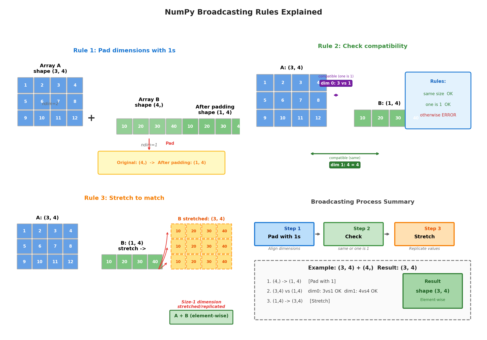

# 数据处理实践

NumPy（Numerical Python）是 Python 科学计算的最主流工具库，提供了高效的多维数组对象和丰富的数学函数。本章将通过一系列实操案例来讲解 NumPy 的常用操作，帮助读者通过动手加深前面对向量、矩阵、张量的理解，同时也为后续机器学习算法、模型训练准备编程基础。

## NumPy 数组

### 从列表创建数组

NumPy 的核心是 `ndarray`（N-Dimensional Array）对象，即多维数组。它的设计意图是解决 Python 原生列表在科学计算中的性能瓶颈 —— 原生列表存储的是对象指针，运算时需要逐个遍历，效率低下。`ndarray` 通过**同质数据类型**和**连续内存布局**的设计，使批量数值运算能够达到接近 C 语言的执行效率，同时保持 Python 的简洁语法。`ndarray` 的核心设计要点包括：
- **同质性**：数组中所有元素必须是相同的数据类型（如全为 `float64` 或全为 `int32`），这使得每个元素占用固定大小的内存，支持通过偏移量直接定位元素
- **多维索引**：支持任意维度的数组结构，通过 `shape` 属性描述各维度大小，`ndim` 表示维度数
- **向量化运算**：对整个数组进行数学运算时，无需编写显式循环，底层自动应用 SIMD 指令加速
- **视图机制**：切片操作返回原数组的视图而非副本，避免不必要的数据拷贝

最简单的创建方式是从 Python 列表转换：

```python runnable
import numpy as np

# 一维数组
arr1d = np.array([1, 2, 3, 4, 5])
print(f"一维数组：{arr1d}")
print(f"类型：{type(arr1d)}")

# 二维数组（矩阵）
arr2d = np.array([
    [1, 2, 3],
    [4, 5, 6]
])
print(f"二维数组：\n{arr2d}")

# 三维数组
arr3d = np.array([
    [[1, 2], [3, 4]],
    [[5, 6], [7, 8]]
])
print(f"三维数组形状：{arr3d.shape}")  # (2, 2, 2)
```

### 特殊数组创建

除从列表创建数组外，NumPy 提供了多种创建特殊数组的函数，以下是常用的几种：

#### 1. `np.zeros()` - 全零数组

创建一个所有元素都为 0 的数组，常用于预分配结果数组或初始化权重。

```python runnable
import numpy as np

zeros = np.zeros((3, 4))  # 3×4 全零矩阵
print(f"zeros:\n{zeros}")
```

#### 2. `np.ones()` - 全一数组

创建一个所有元素都为 1 的数组，常用于广播乘法和统计计算。

```python runnable
import numpy as np

ones = np.ones((2, 3))  # 2×3 全一矩阵
print(f"ones:\n{ones}")
```

#### 3. `np.eye()` - 单位矩阵

创建主对角线为 1、其余为 0 的单位矩阵，是矩阵运算中的乘法单位元。

```python runnable
import numpy as np

eye = np.eye(4)  # 4×4 单位矩阵
print(f"单位矩阵：\n{eye}")
```

#### 4. `np.empty()` - 空数组

创建未初始化的数组，分配内存但不填充值，速度最快。适用于立即被完全覆盖的场景。

```python runnable
import numpy as np

empty = np.empty((2, 2))  # 内容未初始化，值是随机的
print(f"空矩阵：\n{empty}")
```

#### 5. `np.arange()` - 等差序列

创建指定范围内的等差序列（类似 Python 的 `range()`），适用于整数索引。

```python runnable
import numpy as np

arange_arr = np.arange(0, 10, 2)  # [0, 2, 4, 6, 8]
print(f"arange: {arange_arr}")
```

#### 6. `np.linspace()` - 等间隔序列

在指定区间内创建均匀分布的数值，包含端点，适用于连续采样。

```python runnable
import numpy as np

linspace_arr = np.linspace(0, 1, 5)  # [0, 0.25, 0.5, 0.75, 1]
print(f"linspace: {linspace_arr}")
```

#### 7. `np.diag()` - 对角矩阵

从向量创建对角矩阵，或提取矩阵的对角线元素。

```python runnable
import numpy as np

diag = np.diag([1, 2, 3])  # 对角元素为 1, 2, 3
print(f"对角矩阵：\n{diag}")
```

### 随机数组生成

机器学习中经常需要生成随机数据，NumPy 提供了丰富的随机数生成函数，以下是常用的几种：

#### 1. `np.random.rand()` - [0, 1) 均匀分布

生成指定形状的随机数组，元素服从 [0, 1) 区间的均匀分布，常用于初始化权重和生成随机样本。

```python runnable
import numpy as np

rand_arr = np.random.rand(2, 3)  # 2×3 随机矩阵
print(f"均匀分布：\n{rand_arr}")
```

#### 2. `np.random.randn()` - 标准正态分布

生成服从标准正态分布（均值 0，方差 1）的随机数组，常用于生成高斯噪声和权重初始化。

```python runnable
import numpy as np

randn_arr = np.random.randn(2, 3)  # 均值 0，方差 1
print(f"正态分布：\n{randn_arr}")
```

#### 3. `np.random.randint()` - 指定范围整数

生成指定范围内的随机整数，适用于生成离散随机索引和分类标签。

```python runnable
import numpy as np

randint_arr = np.random.randint(0, 10, (2, 3))  # [0, 10) 范围整数
print(f"随机整数：\n{randint_arr}")
```

#### 4. `np.random.normal()` - 正态分布（指定参数）

生成服从指定均值和标准差的正态分布随机数，灵活性更高，适用于自定义分布的参数初始化。

```python runnable
import numpy as np

normal_arr = np.random.normal(loc=0, scale=1, size=(2, 3))
print(f"指定正态分布：\n{normal_arr}")
```

#### 5. `np.random.shuffle()` - 随机打乱

原地随机打乱数组元素顺序，常用于数据集的随机重排，直接修改原数组不返回新数组。

```python runnable
import numpy as np

arr = np.array([1, 2, 3, 4, 5])
np.random.shuffle(arr)
print(f"打乱后：{arr}")
```

#### 6. `np.random.choice()` - 随机选择

从给定数组中随机抽取元素，可控制是否放回抽样，适用于数据采样和批量抽取。

```python runnable
import numpy as np

choices = np.random.choice([1, 2, 3, 4, 5], size=3, replace=False)
print(f"随机选择：{choices}")
```

### 数组的基本属性

每个 NumPy 数组都有一些描述其结构和内存占用的基本属性。理解这些属性有助于我们准确把握数据的组织方式：

- **形状**（shape）：一个元组，表示数组在每个维度上的大小。例如 `(2, 2, 3)` 表示这是一个三维数组，第一维有 2 个元素，第二维有 2 个元素，第三维有 3 个元素。
- **维度数**（ndim）：数组的轴（维度）数量，数值上等同于 `len(shape)`。
- **数据类型**（dtype）：数组中元素的数据类型，如 `int64`、`float32` 等。NumPy 数组要求所有元素类型一致，这是其高效计算的基础。
- **元素总数**（size）：数组中所有元素的总个数，等于 `shape` 各分量的乘积。
- **元素字节大小**（itemsize）：单个元素占用的内存字节数，取决于 `dtype`。
- **总字节大小**（nbytes）：整个数组占用的内存字节数，等于 `size × itemsize`。

```python runnable
import numpy as np

arr = np.array([
    [[1, 2, 3], [4, 5, 6]],
    [[7, 8, 9], [10, 11, 12]]
])

print(f"数组：\n{arr}")
print(f"形状 (shape): {arr.shape}")    # (2, 2, 3)
print(f"维度 (ndim): {arr.ndim}")      # 3
print(f"数据类型 (dtype): {arr.dtype}") # int64
print(f"元素总数 (size): {arr.size}")   # 12
print(f"每个元素字节大小：{arr.itemsize}")  # 8
print(f"总字节大小：{arr.nbytes}")      # 96
```

### 数组的数据类型转换

NumPy 提供了丰富的数据类型支持，合理选择数据类型能够在保证精度的同时优化内存占用和计算性能。数据类型的选择是数值计算中重要的权衡考量。

**数据类型指定方式：**

- **创建时指定**：通过 `dtype` 参数在创建数组时显式声明类型，如 `np.float32`、`np.int64` 等
- **后期转换**：使用 `astype()` 方法将数组转换为其他类型，注意这可能产生数据截断或精度损失

**常见数据类型分类：**

- **整数类型**：`int8`、`int16`、`int32`、`int64`，分别占用 1、2、4、8 字节，数值范围依次增大
- **无符号整数**：`uint8` 到 `uint64`，仅表示非负数，相同字节下正数范围更大
- **浮点类型**：`float32`（单精度）和 `float64`（双精度），后者精度更高但内存占用翻倍
- **布尔类型**：`bool`，仅存储 True/False，是内存效率最高的类型

```python runnable
import numpy as np

# 创建时指定类型
arr_float = np.array([1, 2, 3], dtype=np.float32)
print(f"浮点数组：{arr_float}, dtype: {arr_float.dtype}")

# 类型转换
arr_int = arr_float.astype(np.int32)
print(f"整数数组：{arr_int}, dtype: {arr_int.dtype}")

# 常见数据类型
print("\n 常见数据类型：")
print(f"bool: {np.array([True, False]).dtype}")
print(f"int8: {np.array([1], dtype=np.int8).dtype}")
print(f"int32: {np.array([1], dtype=np.int32).dtype}")
print(f"int64: {np.array([1], dtype=np.int64).dtype}")
print(f"float32: {np.array([1.0], dtype=np.float32).dtype}")
print(f"float64: {np.array([1.0], dtype=np.float64).dtype}")
```

## 索引与切片

### 一维数组索引

索引和切片是访问数组元素的基础操作。NumPy 数组支持 Python 列表的索引语法，并进行了扩展以支持多维数组。

- **正向索引**：从 0 开始计数，如 `arr[0]` 访问第一个元素
- **反向索引**：从 -1 开始表示最后一个元素，如 `arr[-1]`
- **切片**：使用 `[start:end:step]` 语法，可指定起始位置、结束位置和步长
- **反转数组**：使用 `[::-1]` 快速反转数组顺序

```python runnable
import numpy as np

arr = np.array([10, 20, 30, 40, 50])

print(f"数组：{arr}")
print(f"arr[0]: {arr[0]}")    # 第一个元素
print(f"arr[-1]: {arr[-1]}")  # 最后一个元素
print(f"arr[1:4]: {arr[1:4]}")  # 切片 [20, 30, 40]
print(f"arr[::2]: {arr[::2]}")  # 步长为 2 [10, 30, 50]
print(f"arr[::-1]: {arr[::-1]}")  # 反转
```

### 多维数组索引

多维数组使用逗号分隔各维度的索引，语法为 `arr[row, col]`。这种索引方式比嵌套列表的 `arr[row][col]` 更高效，且支持同时访问多个维度。

- **完整索引**：`arr[i, j]` 获取第 i 行第 j 列的单个元素
- **行切片**：`arr[i]` 获取第 i 行的所有元素（省略后续维度）
- **列切片**：`arr[:, j]` 使用 `:` 表示获取第 j 列的所有行
- **子矩阵**：`arr[row_start:row_end, col_start:col_end]` 获取二维切片

```python runnable
import numpy as np

arr = np.array([
    [1, 2, 3, 4],
    [5, 6, 7, 8],
    [9, 10, 11, 12]
])

print(f"数组形状：{arr.shape}")  # (3, 4)
print(f"arr[0, 1]: {arr[0, 1]}")    # 第 0 行第 1 列：2
print(f"arr[1]: {arr[1]}")          # 第 1 行：[5, 6, 7, 8]
print(f"arr[:, 0]: {arr[:, 0]}")    # 第 0 列：[1, 5, 9]
print(f"arr[0:2, 1:3]:\n{arr[0:2, 1:3]}")  # 子矩阵
# [[2 3]
#  [6 7]]
```

### 切片操作

切片是获取数组子集的重要操作。与 Python 列表不同，NumPy 的切片返回的是**视图**（View）而非副本，这意味着切片和原数组共享内存，修改视图会影响原数组。切片有如下特性：

- **视图机制**：切片不复制数据，只是创建新的引用视图，内存效率高
- **数据共享**：通过视图修改数据会直接反映到原数组
- **显式复制**：如需独立副本，需调用 `.copy()` 方法

```python runnable
import numpy as np

arr = np.array([[1, 2, 3], [4, 5, 6], [7, 8, 9]])

# 获取子矩阵（视图）
sub = arr[:2, 1:]
print(f"子矩阵：\n{sub}")

# 修改视图会影响原数组
sub[0, 0] = 100
print(f"修改后的原数组：\n{arr}")
# [[  1 100   3]
#  [  4   5   6]
#  [  7   8   9]]

# 如果需要副本，使用 copy()
arr = np.array([[1, 2, 3], [4, 5, 6], [7, 8, 9]])
sub_copy = arr[:2, 1:].copy()
sub_copy[0, 0] = 100
print(f"使用 copy() 后原数组不变：\n{arr}")
```

### 布尔索引

布尔索引是一种强大的条件筛选机制，通过布尔掩码选择满足特定条件的元素。这种索引方式避免了显式循环，是向量化编程的重要组成部分。布尔索引支持以下几种使用方式：

- **创建掩码**：通过条件表达式（如 `arr > 5`）生成布尔数组
- **应用索引**：将布尔数组作为索引，返回所有为 `True` 位置的元素
- **复合条件**：使用 `&`（与）、`|`（或）、`~`（非）组合多个条件，注意需用括号包裹

```python runnable
import numpy as np

arr = np.array([1, 2, 3, 4, 5, 6, 7, 8, 9, 10])

# 创建布尔掩码
mask = arr > 5
print(f"布尔掩码：{mask}")

# 使用布尔索引
print(f"大于 5 的元素：{arr[mask]}")

# 直接在索引中使用条件
print(f"偶数：{arr[arr % 2 == 0]}")

# 复合条件
print(f"大于 3 且小于 8: {arr[(arr > 3) & (arr < 8)]}")

# 多维数组的布尔索引
matrix = np.array([[1, 2, 3], [4, 5, 6], [7, 8, 9]])
print(f"大于 5 的元素：{matrix[matrix > 5]}")
```

### 花式索引

花式索引（Fancy Indexing）使用整数数组作为索引，可以灵活地选择任意位置的元素。与切片不同，花式索引总是返回数据的副本，而非视图。花式索引有以下几种常见的索引方式：

- **一维索引**：使用索引数组选择特定位置的元素，如 `arr[[0, 2, 4]]` 选择第 0、2、4 个元素
- **负索引**：支持使用负数索引，如 `arr[[0, -1]]` 选择首尾元素
- **多维索引**：通过两个索引数组同时指定行和列，选择交叉位置的元素
- **np.ix_**：用于创建笛卡尔积索引，选择指定行列构成的子矩阵

```python runnable
import numpy as np

arr = np.array([10, 20, 30, 40, 50])

# 使用索引数组
indices = [0, 2, 4]
print(f"索引 {indices} 的元素：{arr[indices]}")

# 使用负索引
print(f"arr[[0, -1]]: {arr[[0, -1]]}")  # 第一个和最后一个

# 多维花式索引
matrix = np.array([
    [1, 2, 3],
    [4, 5, 6],
    [7, 8, 9]
])

# 选择特定行
print(f"第 0 行和第 2 行：\n{matrix[[0, 2]]}")

# 选择特定位置的元素
rows = [0, 1, 2]
cols = [2, 1, 0]
print(f"对角线元素 （反）: {matrix[rows, cols]}")  # [3, 5, 7]

# 使用 np.ix_ 创建索引器
print(f"选择特定行列：\n{matrix[np.ix_([0, 2], [0, 2])]}")
# [[1 3]
#  [7 9]]
```

## 广播机制

**广播**（Broadcasting）是 NumPy 处理不同形状数组运算的核心机制。[矩阵的运算](matrices.md#矩阵的运算)曾提到过，矩阵运算是由明确前提约束的，如两个矩阵必须具有相同的维度（相同的行数和列数）才能够进行加法运算，两个矩阵必须满足第一个矩阵的列数必须等于第二个矩阵的行数（内维匹配)才能进行乘法运算。当两个参与运算的数组数组形状不同时，NumPy 会自动扩展较小数组的维度，使其能够与较大数组进行逐元素运算，而无需显式复制数据，这为编程提供了很大便利。

```python runnable
import numpy as np

# 标量与数组
a = np.array([1, 2, 3])
b = 2
result = a + b
print(f"{a} + {b} = {result}")  # [3, 4, 5]

# 不同形状数组
A = np.array([[1, 2, 3], [4, 5, 6]])  # (2, 3)
v = np.array([10, 20, 30])            # (3,)
result = A + v
print(f"广播结果：\n{result}")
# [[11 22 33]
#  [14 25 36]]
```

### 广播的规则

广播机制遵循一套严格的规则来决定两个数组是否可以进行运算。理解这些规则有助于预判运算结果形状，避免广播错误。

**广播规则：**

1. **维度对齐**：如果两个数组维度数不同，在较小数组的形状前面补 1，直到维度数相同
2. **兼容检查**：如果两个数组在某个维度上大小相同，或其中一个为 1，则它们在该维度上兼容
3. **扩展执行**：在所有维度都兼容时，大小为 1 的维度会被"拉伸"复制以匹配另一个数组



*图：广播三规则的示意*

```python runnable
import numpy as np

# 示例：与图片一致的数据
A = np.array([[1, 2, 3, 4],
              [5, 6, 7, 8],
              [9, 10, 11, 12]])   # 形状 (3, 4)

B = np.array([10, 20, 30, 40])      # 形状 (4,)

print(f"数组 A:\n{A}")
print(f"A 的形状：{A.shape}")
print(f"\n 数组 B: {B}")
print(f"B 的形状：{B.shape}")

# 广播加法
result = A + B
print(f"\n 广播过程：")
print(f"  Step 1: B 从 (4,) -> (1, 4) [前面补 1]")
print(f"  Step 2: (3,4) vs (1,4) 兼容 [dim0: 3vs1, dim1: 4vs4]")
print(f"  Step 3: (1,4) -> (3,4) [拉伸复制]")
print(f"\nA + B 结果：\n{result}")
print(f"结果形状：{result.shape}")

# 验证广播形状
print(f"\n 广播后的形状：{np.broadcast_shapes(A.shape, B.shape)}")
```

### 广播的应用

广播在实际数据处理和科学计算中有广泛应用。以下是几个典型场景：

**数据标准化**：在机器学习中，经常需要对特征进行标准化处理。广播使得形状为 `（样本数，特征数）` 的数据可以直接与形状为 `（特征数，)` 的均值和标准差进行运算。

```python runnable
import numpy as np

# 模拟数据集：100 个样本，50 个特征
data = np.random.randn(100, 50)

# 计算每个特征的均值和标准差
means = data.mean(axis=0)  # (50,)
stds = data.std(axis=0)    # (50,)

# 标准化：广播使 (100, 50) 与 (50,) 运算
normalized = (data - means) / stds

print(f"原始数据形状：{data.shape}")
print(f"均值形状：{means.shape}")
print(f"标准化后形状：{normalized.shape}")
print(f"标准化后均值：{normalized.mean(axis=0)[:5]}")  # 接近 0
```

**外积运算**：两个向量的外积可以通过广播实现。将一维向量重塑为列向量和行向量，通过广播机制生成二维外积矩阵。

```python runnable
import numpy as np

a = np.array([1, 2, 3])    # (3,)
b = np.array([10, 20])     # (2,)

# 方法一：广播
outer = a.reshape(3, 1) * b.reshape(1, 2)
print(f"外积 （广播）:\n{outer}")

# 方法二：np.outer
outer2 = np.outer(a, b)
print(f"外积 (np.outer):\n{outer2}")
```

**距离矩阵计算**：广播可以高效计算两组点之间的距离矩阵。通过引入新维度，利用广播自动扩展的特性计算所有点对之间的差值。

```python runnable
import numpy as np

# 两点集之间的距离
points1 = np.random.rand(5, 2)  # 5 个点，2 维
points2 = np.random.rand(3, 2)  # 3 个点，2 维

# 使用广播计算距离矩阵
# (5, 1, 2) - (1, 3, 2) -> (5, 3, 2)
diff = points1[:, np.newaxis, :] - points2[np.newaxis, :, :]
distances = np.sqrt((diff ** 2).sum(axis=2))  # (5, 3)

print(f"点集 1 形状：{points1.shape}")
print(f"点集 2 形状：{points2.shape}")
print(f"距离矩阵形状：{distances.shape}")
```

### 避免隐式广播的陷阱

广播虽然灵活强大，但也可能带来意外的错误。当数组形状看似"差不多"但不满足广播规则时，会产生难以发现的问题，譬如：

- **维度错位**：意图是按行或按列运算，但数组维度对齐方式与预期不符
- **形状不匹配**：缺少必要的维度扩展，导致广播失败
- **解决方案**：使用 `np.newaxis` 显式增加维度，明确指定广播方向

```python runnable
import numpy as np

# 陷阱示例：意外的广播
A = np.array([[1, 2], [3, 4], [5, 6]])  # (3, 2)
v = np.array([10, 20, 30])               # (3,)

try:
    result = A + v
except ValueError as e:
    print(f"错误：{e}")
    # 解决方法：明确指定维度
    result = A + v[:, np.newaxis]  # (3, 2) + (3, 1) -> (3, 2)
    print(f"正确结果：\n{result}")
```

## 向量化运算与传统循环

**向量化**（Vectorization）是指用数组运算替代显式 Python 循环的编程方式。NumPy 的底层由 C 语言实现，配合内部专门为向量化优化设计的数据结构，能够利用 CPU 的 SIMD（单指令多数据）指令并行处理数据，带来数量级的性能提升（向量化运算通常比 Python 循环快 10-100 倍）。向量化运算还让程序代码变得更加简洁，能用一行数组表达式替代原本要许多行传统循环代码才能完成的工作，这种代码编写方式虽然有悖于程序员的思维，却十分契合数学研究者的思维方式，因为这样的程序算法更接近于数学表达式的原貌。

下面的实验对比了 Python 传统循环和 NumPy 向量化运算在处理一千万个元素时的性能差异。

```python runnable
import numpy as np
import time

# 创建大数组
n = 10_000_000
a = np.random.rand(n)
b = np.random.rand(n)

# 方法一：Python 循环
start = time.time()
result_loop = np.zeros(n)
for i in range(n):
    result_loop[i] = a[i] + b[i]
loop_time = time.time() - start
print(f"循环耗时：{loop_time:.4f} 秒")

# 方法二：NumPy 向量化
start = time.time()
result_vec = a + b
vec_time = time.time() - start
print(f"向量化耗时：{vec_time:.4f} 秒")
print(f"性能提升：{loop_time/vec_time:.1f} 倍")

# 验证结果一致
print(f"结果一致：{np.allclose(result_loop, result_vec)}")
```

NumPy 提供了丰富的向量化函数库，涵盖数学运算、统计计算等多种场景。这些函数都能对整个数组进行逐元素或聚合运算。包括有：

- **数学函数**：`np.exp`、`np.log`、`np.sqrt` 等，对数组每个元素进行计算
- **三角函数**：`np.sin`、`np.cos`、`np.tan` 等，支持弧度制运算
- **聚合函数**：`np.sum`、`np.mean`、`np.std` 等，对整个数组或指定轴进行汇总
- **统计函数**：`np.median`、`np.percentile`、`np.unique` 等，用于统计分析

此外，掌握向量化技巧是编写高效 NumPy 代码的关键。以下是几种常见的向量化模式，用于替代低效的 Python 循环。

- **避免 Python 循环**：对于逐元素的数学运算，应直接使用数组表达式，而非编写循环逐个处理元素。

    ```python runnable
    import numpy as np

    # 不好的做法
    def sigmoid_loop(arr):
        result = np.zeros_like(arr)
        for i in range(len(arr)):
            result[i] = 1 / (1 + np.exp(-arr[i]))
        return result

    # 好的做法
    def sigmoid_vectorized(arr):
        return 1 / (1 + np.exp(-arr))

    arr = np.random.randn(100000)

    import time
    start = time.time()
    result1 = sigmoid_loop(arr)
    loop_time = time.time() - start

    start = time.time()
    result2 = sigmoid_vectorized(arr)
    vec_time = time.time() - start

    print(f"循环耗时：{loop_time:.4f} 秒")
    print(f"向量化耗时：{vec_time:.4f} 秒")
    print(f"性能提升：{loop_time/vec_time:.1f} 倍")
    print(f"结果一致：{np.allclose(result1, result2)}")
    ```

- **使用 np.where 替代条件循环**：`np.where` 可以实现逐元素的条件选择，是 `if-else` 逻辑的向量化版本。

    ```python runnable
    import numpy as np

    arr = np.random.randn(1000)

    # 不好的做法
    result = np.zeros_like(arr)
    for i in range(len(arr)):
        if arr[i] > 0:
            result[i] = arr[i]
        else:
            result[i] = 0

    # 好的做法
    result_vec = np.where(arr > 0, arr, 0)
    # 或者
    result_relu = np.maximum(arr, 0)  # ReLU

    print(f"结果一致：{np.allclose(result, result_vec)}")
    ```

- **使用 np.einsum 进行复杂运算**：`einsum`（爱因斯坦求和约定）提供了一种灵活的矩阵运算表达方式，特别适用于复杂的张量运算。它通过一个简洁的字符串表达式来指定输入数组的维度索引和输出维度的映射关系，从而统一表达矩阵乘法、转置、迹、对角线提取等多种操作。

    ```python runnable
    import numpy as np

    # 矩阵乘法
    A = np.random.rand(100, 50)
    B = np.random.rand(50, 80)

    # 常规方法
    C1 = A @ B

    # einsum 方法（更灵活）
    C2 = np.einsum('ij,jk->ik', A, B)

    print(f"结果一致：{np.allclose(C1, C2)}")

    # 更复杂的例子：批量矩阵乘法
    batch_A = np.random.rand(10, 100, 50)
    batch_B = np.random.rand(10, 50, 80)
    batch_C = np.einsum('bij,bjk->bik', batch_A, batch_B)
    print(f"批量矩阵乘法形状：{batch_C.shape}")
    ```

## 本章小结

NumPy 的价值不仅在于提供了丰富的数值计算函数，更在于它建立了一套面向数组的高效计算范式。通过向量化运算替代循环，代码简洁度与执行效率得以兼得；通过广播机制处理不同形状的数据，复杂的数学表达可以用直观的代数形式呈现。这些设计使得原本需要多层嵌套循环和繁琐索引的操作，能够用接近数学语言的简洁代码完成。对于机器学习而言，NumPy 是连接理论推导与实际实现的桥梁 —— 无论是数据预处理、特征工程，还是模型训练中的矩阵运算，都建立在本书介绍的这些基础操作之上。掌握 NumPy 的思维方式，意味着能够以计算效率最优的方式表达数学问题，这是数据科学工作者不可或缺的核心能力。

## 练习题

1. 使用 NumPy 创建以下数组，并打印它们的形状和数据类型：
   - 一个 $3 \times 4$ 的全零矩阵
   - 一个包含 0 到 9（不含 9）的等差整数序列
   - 一个从 0 到 1 均匀分布的 5 个点的序列
    <details>
    <summary>参考答案</summary>

    ```python runnable
    import numpy as np

    # 3×4 全零矩阵
    zeros = np.zeros((3, 4))
    print(f"全零矩阵形状：{zeros.shape}, 类型：{zeros.dtype}")
    # 形状：(3, 4), 类型：float64

    # 0 到 9 的等差序列
    arange_arr = np.arange(0, 9)
    print(f"等差序列：{arange_arr}, 形状：{arange_arr.shape}, 类型：{arange_arr.dtype}")
    # [0, 1, 2, 3, 4, 5, 6, 7, 8], 形状：(9,), 类型：int64

    # 0 到 1 均匀分布 5 个点
    linspace_arr = np.linspace(0, 1, 5)
    print(f"均匀序列：{linspace_arr}, 形状：{linspace_arr.shape}, 类型：{linspace_arr.dtype}")
    # [0., 0.25, 0.5, 0.75, 1.], 形状：(5,), 类型：float64
    ```
    </details>

1. 给定数组 `arr = np.array([[1, 2, 3, 4], [5, 6, 7, 8], [9, 10, 11, 12]])`，使用索引和切片操作获取：
   - 第 2 行的所有元素
   - 第 1 列的所有元素
   - 位于第 1-2 行、第 2-3 列的子矩阵
    <details>
    <summary>参考答案</summary>

    ```python runnable
    import numpy as np

    arr = np.array([[1, 2, 3, 4], [5, 6, 7, 8], [9, 10, 11, 12]])

    # 第 2 行（索引从 0 开始）
    row_2 = arr[1]
    print(f"第 2 行：{row_2}")  # [5, 6, 7, 8]

    # 第 1 列
    col_1 = arr[:, 0]
    print(f"第 1 列：{col_1}")  # [1, 5, 9]

    # 第 1-2 行、第 2-3 列的子矩阵
    sub = arr[0:2, 1:3]
    print(f"子矩阵：\n{sub}")
    # [[2, 3],
    #  [6, 7]]
    ```
    </details>

1. 解释 NumPy 切片返回视图而非副本的设计意图，并写出代码验证视图修改会影响原数组。
    <details>
    <summary>参考答案</summary>

    设计意图：视图机制避免了不必要的内存拷贝，大幅提升了大数据处理的效率。当只需要读取或修改部分数据时，无需复制整块数据。

    验证代码：

    ```python runnable
    import numpy as np

    arr = np.array([1, 2, 3, 4, 5])
    view = arr[1:4]  # 创建视图

    print(f"原数组：{arr}")
    print(f"视图：{view}")

    # 修改视图
    view[0] = 100
    print(f"修改视图后，原数组：{arr}")  # [1, 100, 3, 4, 5]

    # 使用 copy() 创建副本，修改不影响原数组
    arr = np.array([1, 2, 3, 4, 5])
    copy = arr[1:4].copy()
    copy[0] = 100
    print(f"使用副本，原数组不变：{arr}")  # [1, 2, 3, 4, 5]
    ```
    </details>

1. 使用布尔索引从数组 `arr = np.array([1, -2, 3, -4, 5, -6, 7, 8, -9, 10])` 中筛选出所有正数和所有绝对值大于 5 的元素。
    <details>
    <summary>参考答案</summary>

    ```python runnable
    import numpy as np 

    arr = np.array([1, -2, 3, -4, 5, -6, 7, 8, -9, 10])

    # 筛选正数
    positive = arr[arr > 0]
    print(f"正数：{positive}")  # [1, 3, 5, 7, 8, 10]

    # 筛选绝对值大于 5 的元素
    abs_greater_5 = arr[np.abs(arr) > 5]
    print(f"绝对值 > 5：{abs_greater_5}")  # [-6, 7, 8, -9, 10]
    ```
    </details>

1. 解释以下广播操作的形状匹配过程：
   ```python
   A = np.array([[1, 2, 3], [4, 5, 6]])  # (2, 3)
   v = np.array([10, 20, 30])            # (3,)
   result = A + v
   ```
    <details>
    <summary>参考答案</summary>

    广播过程：
    1. **维度对齐**：$\mathbf{v}$ 的形状 $(3,)$ 维度数为 1，$\mathbf{A}$ 的形状 $(2, 3)$ 维度数为 2。在 $\mathbf{v}$ 前面补 1，变为 $(1, 3)$。

    2. **兼容检查**：比较各维度大小 —— 第 0 维：$2$ vs $1$（兼容，因为其中一个为 1）；第 1 维：$3$ vs $3$（兼容，大小相同）。

    3. **扩展执行**：将 $(1, 3)$ 扩展为 $(2, 3)$，即 $\mathbf{v}$ 被复制成两行：第一行 $(10, 20, 30)$，第二行也是 $(10, 20, 30)$。

    最终结果：`result = [[11, 22, 33], [14, 25, 36]]`

    广播让每行都能与同一向量相加，无需显式循环或复制数据。
    </details>

1. 给定形状为 $(3, 2)$ 的矩阵 $\mathbf{A}$ 和形状为 $(3,)$ 的向量 $\mathbf{v}$，如何正确使用广播使 $\mathbf{A}$ 的每一列加上 $\mathbf{v}$？
    <details>
    <summary>参考答案</summary>

    直接相加会报错，因为形状 $(3, 2)$ 和 $(3,)$ 不兼容（第 1 维：$2$ vs $3$ 不匹配）。

    正确做法：使用 `np.newaxis` 将 $\mathbf{v}$ 重塑为列向量 $(3, 1)$：

    ```python runnable
    import numpy as np

    A = np.array([[1, 2], [3, 4], [5, 6]])  # (3, 2)
    v = np.array([10, 20, 30])              # (3,)

    # 错误：A + v 会报 ValueError

    # 正确：将 v 变为 (3, 1)
    result = A + v[:, np.newaxis]
    print(f"结果：\n{result}")
    # [[11, 12], [23, 24], [35, 36]]
    ```

    关键技巧：`np.newaxis` 明确指定广播方向，避免隐式广播的错误。
    </details>

1. 编写向量化代码，替代以下循环实现，计算两个数组的逐元素 sigmoid 函数值：
   ```python 
   # 低效的循环实现
   def sigmoid_loop(arr):
       result = np.zeros_like(arr)
       for i in range(len(arr)):
           result[i] = 1 / (1 + np.exp(-arr[i]))
       return result
   ```
    <details>
    <summary>参考答案</summary>

    ```python runnable
    import numpy as np

    # 向量化实现
    def sigmoid_vectorized(arr):
        return 1 / (1 + np.exp(-arr))

    # 低效的循环实现
    def sigmoid_loop(arr):
        result = np.zeros_like(arr)
        for i in range(len(arr)):
            result[i] = 1 / (1 + np.exp(-arr[i]))
        return result

    # 性能对比
    arr = np.random.randn(100000)

    import time

    # 循环版本
    start = time.time()
    result_loop = sigmoid_loop(arr)
    loop_time = time.time() - start

    # 向量化版本
    start = time.time()
    result_vec = sigmoid_vectorized(arr)
    vec_time = time.time() - start

    print(f"循环耗时：{loop_time:.4f} 秒")
    print(f"向量化耗时：{vec_time:.4f} 秒")
    print(f"性能提升：{loop_time/vec_time:.1f} 倍")
    print(f"结果一致：{np.allclose(result_loop, result_vec)}")
    ```

    向量化利用 NumPy 底层的 C 实现和 SIMD 指令，避免了 Python 循环的解释开销，通常能获得 10-100 倍的性能提升。
    </details>

1. 使用 `np.where` 实现向量化的 ReLU 函数（将负数置零），并与循环实现进行性能对比。
    <details>
    <summary>参考答案</summary>

    ```python runnable
    import numpy as np
    import time

    # 循环实现
    def relu_loop(arr):
        result = np.zeros_like(arr)
        for i in range(len(arr)):
            if arr[i] > 0:
                result[i] = arr[i]
            else:
                result[i] = 0
        return result

    # 向量化实现
    def relu_vectorized(arr):
        return np.where(arr > 0, arr, 0)

    # 或者使用 np.maximum
    def relu_maximum(arr):
        return np.maximum(arr, 0)

    arr = np.random.randn(100000)

    # 性能对比
    start = time.time()
    result_loop = relu_loop(arr)
    loop_time = time.time() - start

    start = time.time()
    result_vec = relu_vectorized(arr)
    vec_time = time.time() - start

    print(f"循环耗时：{loop_time:.4f} 秒")
    print(f"向量化耗时：{vec_time:.4f} 秒")
    print(f"性能提升：{loop_time/vec_time:.1f} 倍")
    ```

    ReLU 是神经网络最常用的激活函数，向量化实现是深度学习框架的基础。
    </details>

1. 使用 `np.einsum` 实现矩阵乘法，并与 `@` 运算符对比结果。
    <details>
    <summary>参考答案</summary>

    ```python runnable
    import numpy as np

    A = np.random.rand(100, 50)
    B = np.random.rand(50, 80)

    # 常规矩阵乘法
    C1 = A @ B

    # einsum 实现
    # 'ij,jk->ik' 表示：A 的维度标记为 i,j；B 的维度标记为 j,k
    # 重复的 j 表示在该维度上求和（缩并），输出维度为 i,k
    C2 = np.einsum('ij,jk->ik', A, B)

    print(f"结果一致：{np.allclose(C1, C2)}")
    print(f"C1 形状：{C1.shape}, C2 形状：{C2.shape}")
    ```

    `einsum`（爱因斯坦求和约定）提供了一种统一的矩阵运算表达方式，特别适合复杂的张量运算。字符串中的索引规则是：重复索引求和，不重复索引保留在输出中。例如批量矩阵乘法可用 `'bij,bjk->bik'`，计算迹可用 `'ii->'`（对角线元素求和）。
    </details>

1. 使用广播机制计算两组点之间的欧氏距离矩阵，不使用显式循环。
    <details>
    <summary>参考答案</summary>

    ```python runnable
    import numpy as np

    # 两组点（二维坐标）
    points1 = np.array([[0, 0], [1, 1], [2, 2]])  # 3 个点
    points2 = np.array([[1, 0], [0, 1]])          # 2 个点

    # 广播计算距离矩阵
    # points1[:, np.newaxis, :] 形状 (3, 1, 2)
    # points2[np.newaxis, :, :] 形状 (1, 2, 2)
    # 相减后形状 (3, 2, 2)，表示 3×2 对点的坐标差值
    diff = points1[:, np.newaxis, :] - points2[np.newaxis, :, :]

    # 计算欧氏距离：sqrt(dx² + dy²)
    distances = np.sqrt((diff ** 2).sum(axis=2))  # 形状 (3, 2)

    print(f"距离矩阵：\n{distances}")
    # [[1.    1.  ]
    #  [1.    1.  ]
    #  [2.236 2.236]]
    ```

    这种技巧在机器学习中常用于计算样本间的距离，如 KNN 算法、聚类算法等。广播避免了显式循环，效率大幅提升。`distances[i, j]` 表示 points1[i] 与 points2[j] 的欧氏距离。
    </details>