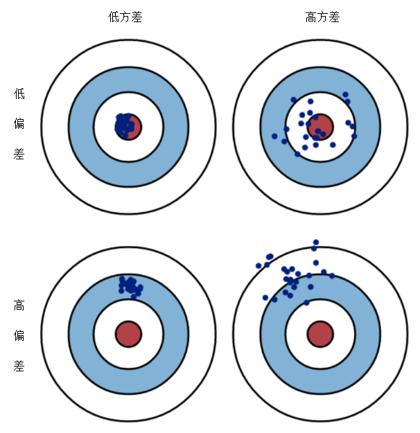
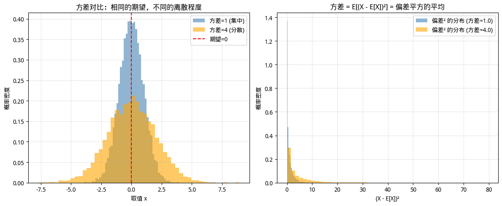

# 概率基础

在[引言](introduction.md)里，我们理解了为什么机器学习需要概率性思维——因为数据有噪声、样本有限、模型有简化，不确定性是不可避免的。本章开始系统地学习概率论的基础概念，建立描述和处理不确定性的数学语言。对于程序员来说，概率论可能比线性代数和微积分更具挑战性，后者更多是计算工具，而概率论要求思维方式的转变。但好消息是，概率论的许多概念可以用程序来直观理解。本章将借助代码示例，帮助读者建立概率的直觉。

## 随机变量

在传统编程中，变量是一个确定性的容器，譬如 `x = 5` 给变量 `x` 赋值为 5，它的值就是确定的 5，每次调用都会返回 5，直至它被重新赋值。但在概率论中，**随机变量**（Random Variable）是一个可能取多个值的变量，每个值有一定的概率。用程序员的思维来理解随机变量就像一个"函数"或"数据生成器"，每次调用可能返回不同的值，就像以下代码中的 `dice_roll()`。

```python runnable
import numpy as np

# 随机变量：掷骰子的结果
def dice_roll():
    return np.random.randint(1, 7)  # 返回 1-6 中的一个整数

# 每次调用可能得到不同的值
print(dice_roll())  # 可能是 3
print(dice_roll())  # 可能是 5
print(dice_roll())  # 可能是 1
```

更严谨地说，随机变量是一个从样本空间到实数的映射。这种形式化定义可能不够直观，我们可以这样理解：假设我们观察"明天天气"这个不确定事件，样本空间是所有可能的结果 $\Omega = \{\text{晴天}, \text{雨天}, \text{阴天}\}$。随机变量 $X$ 把这些结果映射到实数，比如 $X(\text{晴天}) = 1$，$X(\text{雨天}) = 2$，$X(\text{阴天}) = 3$。这样，原本抽象的"天气"概念就变成了可以进行数学运算的数字，我们可以计算它的期望、方差，或者与其他变量建立数学关系。随机变量封装了整个不确定性的结构——包括所有可能的结果及其概率分布。当我们说 $X$ 是"掷骰子的结果"时，$X$ 不是一个具体的数字（如 3 或 5），而是包含了"可能是 1 到 6 中的任意一个、每个结果的概率是 1/6"这整套信息。这正是概率论区别于确定性数学的核心：概率论处理的是"可能是什么"，而非"确定是什么"。根据取值的特点，随机变量分为两类：

- **离散型随机变量**（Discrete Random Variable）：取值是有限个或可数无限个。例如：

    - 掷骰子的结果：{1, 2, 3, 4, 5, 6}
    - 网站日访问量：{0, 1, 2, 3, ...}
    - 分类任务的类别：{猫，狗，鸟}

- **连续型随机变量**（Continuous Random Variable）：取值充满某个区间。例如：

    - 人的身高：[0, 300] cm
    - 网页加载时间：[0, +∞) 秒
    - 模型参数：(-∞, +∞)

这两类随机变量的数学处理方式不同，分别用**概率质量函数**和**概率密度函数**来描述。

### 概率质量函数（PMF）

对于离散型随机变量，概率质量函数（Probability Mass Function, PMF）给出每个取值的概率：$P(X = x) = p$，其中 $X$ 是随机变量，$x$ 是一个可能的取值，$p$ 是取该值的概率。PMF 有两个重要性质：

1. **非负性**：$P(X = x) \geq 0$ 对所有 $x$ 成立
2. **归一性**：$\sum_x P(X = x) = 1$，所有概率之和为 1

### 概率密度函数（PDF）

对于连续型随机变量，我们不能说"取某个值的概率"，因为连续变量取任何特定值的概率都是 0，譬如在实数轴上随机取一个数，取得数字 1 的概率为 0。我们用概率密度函数（Probability Density Function, PDF）来描述连续型随机变量。PDF $f(x)$ 的含义是随机变量 $X$ 落在区间 $[a, b]$ 内的概率是该区间内 PDF 曲线下的面积：$P(a \leq X \leq b) = \int_a^b f(x) \, dx$。PDF 也有两个性质：

1. **非负性**：$f(x) \geq 0$ 对所有 $x$ 成立
2. **归一性**：$\int_{-\infty}^{+\infty} f(x) \, dx = 1$

以[正态分布](#正态分布)为例，这是自然界中最常见的非均匀分布。


*图：正态分布的概率密度函数*

现在暂时不用理会正态分布的公式、含义等，只要知道它的概率密度呈"钟形曲线"，如上图所示，中心最高、两侧逐渐降低，说明变量取值集中在均值附近，越远离均值概率密度越低。下面的代码绘制标准正态分布 $N(0, 1)$ 的 PDF，并计算变量落在区间 $[-1, 1]$ 内的概率（约为 68%，即著名的 ["68-95-99.7"经验法则](https://en.wikipedia.org/wiki/68%E2%80%9395%E2%80%9399.7_rule) 的第一项）：

```python runnable
import numpy as np
import matplotlib.pyplot as plt
from math import erf, sqrt

# 标准正态分布的 PDF 实现
def normal_pdf(x, mu=0, sigma=1):
    """正态分布概率密度函数"""
    return 1 / (sigma * sqrt(2 * np.pi)) * np.exp(-0.5 * ((x - mu) / sigma) ** 2)

x = np.linspace(-4, 4, 1000)
pdf = normal_pdf(x)

# 可视化 PDF
plt.figure(figsize=(10, 5))
plt.plot(x, pdf, 'b-', linewidth=2, label='PDF')
plt.fill_between(x, pdf, alpha=0.3)

# 标注均值和标准差区间
plt.axvline(0, color='r', linestyle='--', label='μ=0')
plt.axvline(-1, color='g', linestyle=':', alpha=0.7, label='μ±σ')
plt.axvline(1, color='g', linestyle=':', alpha=0.7)

# 填充 [-1, 1] 区间（约 68% 的概率）
x_fill = np.linspace(-1, 1, 100)
plt.fill_between(x_fill, normal_pdf(x_fill), color='orange', alpha=0.5, label='P(-1≤X≤1)≈68%')

plt.xlabel('x')
plt.ylabel('概率密度 f(x)')
plt.title('标准正态分布 N(0, 1) 的概率密度函数 (PDF)')
plt.legend()
plt.grid(alpha=0.3)
plt.ylim(0, 0.5)
plt.tight_layout()
plt.show()
plt.close()

# 计算 P(-1 ≤ X ≤ 1) 使用误差函数
def normal_cdf(x, mu=0, sigma=1):
    """正态分布累积分布函数"""
    return 0.5 * (1 + erf((x - mu) / (sigma * sqrt(2))))

prob = normal_cdf(1) - normal_cdf(-1)
print(f"P(-1 ≤ X ≤ 1) = {prob:.4f} ≈ {prob*100:.1f}%")
```

注意：PDF 本身不是概率，它完全可以大于 1。只有它的积分（曲线面积）才是概率，这个才受 PDF 归一性的约束。

### 累积分布函数（CDF）

前面的 PMF 和 PDF 分别描述离散型和连续型随机变量的概率分布，它们计算"某个值附近"的概率。但在实际问题中，我们常需要回答"不超过某个阈值"的概率，譬如"顾客等待时间不超过 5 分钟的概率是多少"、"模型预测误差不超过 10% 的概率有多大"。这类问题需要一个累积的概念，这就是**累积分布函数**（Cumulative Distribution Function, CDF）：$F(x) = P(X \leq x)$。CDF 的直观含义是：从最小值开始，逐步累积概率，直到 $x$ 点。对于离散变量，CDF 是 PMF 的逐点累加；对于连续变量，CDF 是 PDF 曲线从负无穷到 $x$ 的积分面积。CDF 具有以下三个性质：

1. **单调递增**：$F(x)$ 从 0 增长到 1，因为累积的概率越来越多
2. **有界性**：$\lim_{x \to -\infty} F(x) = 0$，$\lim_{x \to +\infty} F(x) = 1$
3. **右连续**：对于离散变量，CDF 在每个取值点有一个"跳跃"——因为每个可能取值对应一个概率"块"，累积到该点时突然增加这个概率值

CDF 与 PMF/PDF 的数学关系：

- **离散型**：$F(x) = \sum_{t \leq x} P(X = t)$，即逐点累加 PMF
- **连续型**：$F(x) = \int_{-\infty}^x f(t) \, dt$，且 $f(x) = \frac{dF(x)}{dx}$

CDF 的主要优势是统一了离散型和连续型随机变量的描述方式——无论哪种类型，CDF 都直接给出概率值（而非密度），且永远在 $[0, 1]$ 范围内。这使得 CDF 在计算区间概率时特别方便：$P(a < X \leq b) = F(b) - F(a)$。

下面的代码绘制标准正态分布 $N(0, 1)$ 的 CDF 曲线，展示其从 0 平滑增长到 1 的 S 形特征：

```python runnable
import numpy as np
import matplotlib.pyplot as plt

# 标准正态分布的 CDF
x = np.linspace(-4, 4, 1000)

# NumPy 没有内置正态分布 CDF，我们用误差函数近似
from math import erf
def norm_cdf(x):
    return 0.5 * (1 + erf(x / np.sqrt(2)))

cdf = np.array([norm_cdf(xi) for xi in x])

plt.figure(figsize=(10, 5))
plt.plot(x, cdf, 'b-', linewidth=2)
plt.xlabel('x')
plt.ylabel('F(x) = P(X ≤ x)')
plt.title('标准正态分布的累积分布函数 (CDF)')
plt.grid(alpha=0.3)

# 标注几个关键点
key_points = [-2, 0, 2]
for kp in key_points:
    plt.axvline(kp, color='r', linestyle='--', alpha=0.5)
    plt.axhline(norm_cdf(kp), color='r', linestyle='--', alpha=0.5)
    plt.text(kp + 0.1, norm_cdf(kp) + 0.05, f'({kp}, {norm_cdf(kp):.2f})', fontsize=9)

plt.tight_layout()
plt.show()
plt.close()

print(f"P(X ≤ 0) = {norm_cdf(0):.4f}")   # 应该约为 0.5
print(f"P(X ≤ 1.96) ≈ {norm_cdf(1.96):.4f}")  # 约为 0.975
```

## 分布的特征

PMF、PDF 和 CDF 告诉我们概率分布的"形状"——每个取值（或区间）的概率是多少。但在实践中，我们常需要用更简洁的数字来概括一个分布的核心特征。譬如，"这个模型的预测误差大概有多大"、"用户平均等待时间是多少"。这就需要引入几个新的概念：**期望**、**偏差**和**方差**。

### 期望

**期望**（Expected Value）可以形象理解为概率分布的"中心位置"，即随机变量取值的"平均"，但它不是简单地把所有可能值加起来除以数量，而是要考虑每个值出现的概率。如果是离散型随机变量，则期望为：$E[X] = \sum_x x \cdot P(X = x)$，如果是连续型随机变量，则期望为：$E[X] = \int_{-\infty}^{+\infty} x \cdot f(x) \, dx$。期望的实质是如果无限次重复实验，结果的平均值会趋近于期望，这算是大数定律的一种直观解释。期望有如下几个性质：

1. **线性性**：$E[aX + bY] = aE[X] + bE[Y]$，期望对线性组合可分解
2. **常数期望**：$E[c] = c$，常数的期望就是它本身
3. **非负性传递**：如果 $X \geq 0$，则 $E[X] \geq 0$

用程序员视角理解，期望就像是加权平均，假设你有一个数组，每个元素有一个"权重"（概率），期望就是加权求和。下面的代码模拟掷骰子的期望计算：

```python runnable
import numpy as np

# 掷骰子的期望计算
# 理论计算：每个面 1-6，概率均为 1/6
faces = np.arange(1, 7)  # [1, 2, 3, 4, 5, 6]
prob = 1/6

# 期望 = Σ x × P(x)
expected_value = np.sum(faces * prob)
print(f"掷骰子的理论期望：E[X] = {expected_value}")

# 用大量采样验证
np.random.seed(42)
samples = np.random.randint(1, 7, size=1000000)
sample_mean = samples.mean()
print(f"100 万次采样的平均值：{sample_mean:.4f}")
print(f"差异：{abs(expected_value - sample_mean):.4f}")
```

### 偏差与方差

**偏差**（Bias）衡量的是预测值的期望与真实值之间的差距。用数学语言表达：$\text{Bias}[\hat{Y}] = E[\hat{Y}] - Y_{\text{true}}$，其中 $\hat{Y}$ 是预测值，$Y_{\text{true}}$ 是真实值。偏差的直观理解是如果用同一个模型在无数个不同的训练集上训练，然后对所有模型的预测取平均，这个"平均预测"与真实值相差多少。偏差反映了模型的"系统性误差"，即不是由随机波动造成的，而是由模型本身的假设造成的。偏差越大，说明模型的预测倾向性地偏离真实值；偏差越小，说明模型能够准确地捕捉数据的真实规律。偏差为零时，我们称模型是"无偏的"（Unbiased）。在实际问题中，偏差在训练阶段一般是难以观测的，因为我们只有一个训练集，无法获得"无数个训练集的平均预测"，所以偏差通常需要通过理论分析或间接推断来估计。

在实际问题中，通常更具有可操作性的是**方差**（Variance），它是概率分布的"离散程度"，期望告诉我们分布的中心在哪里，但它不能告诉我们数据是紧密聚集在中心周围，还是分散得很远。这个信息要由方差来提供。方差定义为：$\text{Var}[X] = E[(X - E[X])^2]$。这个式子的直观理解是方差是每个取值与期望之差的平方的期望，或者更简单地说，是偏差平方的平均值。"平方"是为了让正负偏差都变成正数（否则会相互抵消），同时也放大了较大的偏差。方差越大，说明数据分布越分散；方差越小，说明数据集中在期望附近。方差有一个更方便的计算公式：$\text{Var}[X] = E[X^2] - (E[X])^2$，这个公式的好处是不需要先计算期望再逐点求差，只需计算 $X^2$ 的期望和 $X$ 的期望即可。方差有如下几个性质：

1. **方差与缩放**：$\text{Var}[aX] = a^2 \text{Var}[X]$（注意是 $a^2$，不是 $a$）
2. **方差与平移**：$\text{Var}[X + c] = \text{Var}[X]$（平移不改变离散程度）
3. **独立变量的方差**：$\text{Var}[X + Y] = \text{Var}[X] + \text{Var}[Y]$（仅当 $X, Y$ 独立时成立）

偏差与方差在数理统计上都是对误差程度的度量和来源（误差还有一种来源是噪声），如果用射击比赛来类比偏差和方差对结果的影响的话，假设射击运动员在 10 环靶中只打到了 7 环，产生的 3 环的差距就是期望目标与实际目标的差距，也就是误差，这个误差即可能是因为他瞄准的时候就没瞄好，本来就是朝着 7 环去打的，也可能是因为他瞄准的确实是 10 环靶心，但是手不够稳定，射到了 7 环上。这里“瞄不准，手很稳”的情况就相当于偏差大，方差小所构成的误差，而“瞄的准，手不稳”的情况就相当于偏差小，方差大所构成的误差。这个例子中，偏差和方差的对结果的影响，可以通过下图直观地看出来。



*图：偏差与方差的直观理解*

下面的代码通过对比两个正态分布，直观展示了方差的意义。两个分布的期望相同（都为 0），但方差不同（分别为 1 和 4）。代码将生成两组样本数据，通过直方图对比它们的分布形态，并可视化方差的数学定义——偏差平方的平均值。



*图：方差的可视化结果*

上图是这段代码的可视化结果，我们可以从中得到三个关键洞察：

1. **期望相同，方差不同**：两个分布的理论期望都是 0，但分布 A 的方差为 1，分布 B 的方差为 4。这意味着两个分布的"中心位置"相同，但数据的"分散程度"差异很大。
2. **方差影响分布形态**：方差较小的分布 A（蓝色）集中在期望附近，呈现出高耸窄峭的形态；方差较大的分布 B（橙色）分布更分散，呈现出扁平宽阔的形态。左图的直方图对比清晰地展示了这一差异。
3. **方差的数学直观**：右图展示了方差的数学定义——方差是偏差平方的平均值。分布 B 的偏差平方分布明显比分布 A 更分散，说明其数据点偏离期望的程度更大。这就是"方差越大，数据的波动范围越大"的数学含义。

```python runnable
import numpy as np
import matplotlib.pyplot as plt

# 对比两个分布的期望和方差
# 分布 A：集中在期望附近
# 分布 B：分散较远
np.random.seed(42)
# 分布 A：标准正态分布 N(0, 1)
samples_a = np.random.normal(0, 1, 10000)
# 分布 B：方差更大的正态分布 N(0, 4)
samples_b = np.random.normal(0, 2, 10000)  # σ=2，方差=4

# 计算期望和方差
print("分布 A (N(0, 1)):")
print(f"  期望：E[X] = {samples_a.mean():.4f} （理论：0)")
print(f"  方差：Var[X] = {samples_a.var():.4f} （理论：1)")

print("\n 分布 B (N(0, 4)):")
print(f"  期望：E[X] = {samples_b.mean():.4f} （理论：0)")
print(f"  方差：Var[X] = {samples_b.var():.4f} （理论：4)")

# 可视化对比
fig, axes = plt.subplots(1, 2, figsize=(12, 5))

# 左图：直方图对比
axes[0].hist(samples_a, bins=50, alpha=0.6, label='方差=1 （集中）', color='steelblue', density=True)
axes[0].hist(samples_b, bins=50, alpha=0.6, label='方差=4 （分散）', color='orange', density=True)
axes[0].axvline(0, color='r', linestyle='--', label='期望=0')
axes[0].set_xlabel('取值 x')
axes[0].set_ylabel('概率密度')
axes[0].set_title('方差对比：相同的期望，不同的离散程度')
axes[0].legend()
axes[0].grid(alpha=0.3)

# 右图：方差公式的直观解释
# 展示 (X - E[X])² 的平均值
deviations_a = (samples_a - samples_a.mean()) ** 2
deviations_b = (samples_b - samples_b.mean()) ** 2

axes[1].hist(deviations_a, bins=50, alpha=0.6, label=f'偏差² 的分布 （方差≈{samples_a.var():.1f})', 
             color='steelblue', density=True)
axes[1].hist(deviations_b, bins=50, alpha=0.6, label=f'偏差² 的分布 （方差≈{samples_b.var():.1f})', 
             color='orange', density=True)
axes[1].set_xlabel('(X - E[X])²')
axes[1].set_ylabel('概率密度')
axes[1].set_title('方差 = E[(X - E[X])²] = 偏差平方的平均')
axes[1].legend()
axes[1].grid(alpha=0.3)

plt.tight_layout()
plt.show()
plt.close()
```

还有一个概念这里可以一并介绍：**标准差**（Standard Deviation），标准差是方差的"人性化版本"，方差虽然有数学上的便利性，但其单位是原单位的平方，譬如"身高方差"的单位是 cm²，这在实际解读时不非常直观。因此，人们常用标准差来代替方差度量概率分布的"离散程度"，标准差的数学表达是：$\sigma = \sqrt{\text{Var}[X]}$，开平方后，它的单位与原数据相同，更易于解读。譬如"身高标准差为 5cm"比"身高方差为 25cm²"更有实用意义。正态分布中的 $\sigma$ 参数就是标准差。

## 常见概率分布

前面我们学习了描述概率分布的数学工具——PMF、PDF 和 CDF 三种概率密度函数，这些工具描述的是概率分布的"形式"，而具体概率分布的"内容"，即概率如何在不同取值上分配则取决于概率分布的类型。不同的概率分布刻画了不同类型的不确定性：有的描述"只有两种结果"的简单场景，有的描述"大量微小因素叠加"的复杂现象。理解这些常见概率分布，不仅能帮助我们建模数据，还能指导模型设计。本节介绍机器学习中最常用的几种分布及其应用场景。

### 伯努利分布

**伯努利分布**（Bernoulli Distribution）描述最简单的随机试验，只有两种可能的结果：成功（1）或失败（0），伯努利分布虽然简单，但它是所有更复杂分布的起点，它的数学表示为 $P(X = 1) = p, \quad P(X = 0) = 1 - p$，其中 $p$ 是成功的概率，$X$ 的期望 $E[X] = p$，方差 $\text{Var}[X] = p(1-p)$。

伯努利分布是二分类问题的数学基础。以垃圾邮件检测为例，当邮件系统判断一封邮件是否为垃圾邮件时，模型的输出本质上就是在估计伯努利分布的参数 $p$，即这封邮件是垃圾邮件的概率。逻辑回归模型通过 Sigmoid 函数将输入特征映射到 $[0,1]$ 区间，输出的数值正是这个 $p$ 值；而训练过程中使用的二元交叉熵损失函数，其数学形式 $-\sum(y\log(p) + (1-y)\log(1-p))$ 实际上是在最大化伯努利分布的似然函数——当真实标签 $y=1$（垃圾邮件）时，我们希望 $p$ 尽可能大，当 $y=0$（正常邮件）时，我们希望 $1-p$ 尽可能大。从这个角度看，整个二分类模型的设计、训练和预测，都是在围绕伯努利分布展开的。

```python runnable
import numpy as np
import matplotlib.pyplot as plt

# 伯努利分布
p = 0.7  # 成功概率

# PMF
outcomes = [0, 1]
probs = [1 - p, p]

# 采样
np.random.seed(42)
samples = np.random.binomial(1, p, size=1000)

# 可视化
fig, axes = plt.subplots(1, 2, figsize=(12, 4))

# 左图：PMF
axes[0].bar(outcomes, probs, color=['lightcoral', 'steelblue'], edgecolor='black')
axes[0].set_xlabel('结果')
axes[0].set_ylabel('概率')
axes[0].set_title(f'伯努利分布 PMF (p={p})')
axes[0].set_xticks([0, 1])
axes[0].set_xticklabels(['失败 (0)', '成功 (1)'])

# 右图：采样结果
axes[1].hist(samples, bins=[-0.5, 0.5, 1.5], rwidth=0.8, 
            color='steelblue', edgecolor='black', density=True)
axes[1].set_xlabel('结果')
axes[1].set_ylabel('频率')
axes[1].set_title(f'1000 次采样结果 （实际成功率：{samples.mean():.2f})')
axes[1].set_xticks([0, 1])

plt.tight_layout()
plt.show()
plt.close()

print(f"理论期望：E[X] = p = {p}")
print(f"样本均值：{samples.mean():.4f}")
print(f"理论方差：Var[X] = p(1-p) = {p * (1 - p):.4f}")
print(f"样本方差：{samples.var():.4f}")
```

### 正态分布

**正态分布**（Normal Distribution）又称高斯分布，是概率论中最重要的分布。它的概率密度函数呈经典的"钟形曲线"，中心最高、两侧对称下降：

$$f(x) = \frac{1}{\sqrt{2\pi\sigma^2}} \exp\left(-\frac{(x-\mu)^2}{2\sigma^2}\right)$$

其中 $\mu$ 是均值（决定曲线中心位置），$\sigma$ 是标准差（决定曲线的宽窄程度）。记作 $X \sim N(\mu, \sigma^2)$。这个公式乍看复杂，其实结构很清晰：前面的系数 $\frac{1}{\sqrt{2\pi\sigma^2}}$ 是一个常数，用于保证整个曲线下的面积等于 1（概率的归一性）；核心部分是指数项 $\exp\left(-\frac{(x-\mu)^2}{2\sigma^2}\right)$，它决定了曲线的"钟形"形状。指数项中的 $(x-\mu)^2$ 衡量 $x$ 与均值 $\mu$ 的偏离程度——当 $x = \mu$ 时，偏离为零，指数项取最大值 1，概率密度最高；随着 $x$ 远离 $\mu$，$(x-\mu)^2$ 增大，负指数使概率密度快速下降。分母中的 $2\sigma^2$ 控制"下降速度"——$\sigma$ 越大，分母越大，下降越慢，曲线越扁平宽缓；$\sigma$ 越小，下降越快，曲线越高耸窄峭。这就像一个"山峰"，均值 $\mu$ 是山顶位置，标准差 $\sigma$ 是山坡的陡峭程度。

正态分布之所以如此重要，一方面是因为自然界许多现象都近似服从正态分布——人的身高、考试成绩、测量误差等；另一方面是因为[中心极限定理](https://en.wikipedia.org/wiki/Central_limit_theorem)：大量独立随机变量之和趋于正态分布，这使得正态分布成为[统计推断](statistical-inference.md)的核心工具。

正态分布在深度学习中最直接的应用是**神经网络权重初始化**。考虑一个简单的全连接层 $y = Wx + b$，如果权重 $W$ 全部初始化为相同的值（如全为 0），则所有神经元输出相同，反向传播时梯度也相同，网络无法学习有意义的特征。如果权重初始化过大，前向传播时激活值可能饱和（如 Sigmoid 输出接近 0 或 1），导致梯度消失；如果初始化过小，信号在网络层层传递时会逐渐衰减，同样导致学习困难。正态分布初始化恰好提供了一个"折中"方案：大部分权重集中在 0 附近（不至于太大），但又有足够的分散度（不至于完全相同），让每个神经元能够学习不同的特征。

实际应用中，初始化的具体参数需要考虑网络的层数和激活函数类型。经典的 [Xavier 初始化](http://proceedings.mlr.press/v9/glorot10a/glorot10a.pdf)使用均匀分布或正态分布，标准差设为 $\sqrt{2/(n_{\text{in}} + n_{\text{out}})}$，其中 $n_{\text{in}}$ 和 $n_{\text{out}}$ 分别是该层的输入和输出神经元数量，目的是让前向传播和反向传播的信号方差保持一致。对于 ReLU 激活函数，由于它只保留正半轴，信号方差会减半，因此 [He 初始化](https://arxiv.org/abs/1502.01852)将标准差调整为 $\sqrt{2/n_{\text{in}}}$。下面的代码展示了不同初始化策略对网络训练的影响：

```python runnable
import numpy as np
import matplotlib.pyplot as plt

# 模拟一个多层神经网络的前向传播
# 观察: 不同初始化策略下，各层激活值的分布变化

np.random.seed(42)

def relu(x):
    """ReLU 激活函数"""
    return np.maximum(0, x)

def forward_pass(x, weights, activation='relu'):
    """模拟多层网络的前向传播"""
    activations = [x]
    for W in weights:
        x = x @ W
        if activation == 'relu':
            x = relu(x)
        activations.append(x)
    return activations

# 输入数据：100 个样本，每个样本 100 维
n_samples = 100
n_features = 100
x = np.random.randn(n_samples, n_features) * 0.1  # 标准化输入

# 三种初始化策略
n_layers = 10
layer_sizes = [100] * (n_layers + 1)  # 所有层大小相同

# 1. 过大初始化（标准差=1）
weights_large = [np.random.randn(layer_sizes[i], layer_sizes[i+1]) * 1.0 
                 for i in range(n_layers)]

# 2. 过小初始化（标准差=0.01）
weights_small = [np.random.randn(layer_sizes[i], layer_sizes[i+1]) * 0.01 
                 for i in range(n_layers)]

# 3. He 初始化（标准差=sqrt(2/n_in))
weights_he = [np.random.randn(layer_sizes[i], layer_sizes[i+1]) * np.sqrt(2 / layer_sizes[i]) 
              for i in range(n_layers)]

# 分别执行前向传播
acts_large = forward_pass(x, weights_large)
acts_small = forward_pass(x, weights_small)
acts_he = forward_pass(x, weights_he)

# 绘制各层激活值的标准差变化
fig, axes = plt.subplots(1, 3, figsize=(14, 4))

layer_indices = range(n_layers + 1)

# 过大初始化：激活值爆炸
stds_large = [a.std() for a in acts_large]
axes[0].plot(layer_indices, stds_large, 'ro-', linewidth=2, markersize=8)
axes[0].set_xlabel('网络层')
axes[0].set_ylabel('激活值标准差')
axes[0].set_title('过大初始化 (σ=1.0)\n激活值爆炸')
axes[0].grid(alpha=0.3)
axes[0].set_yscale('log')

# 过小初始化：激活值消失
stds_small = [a.std() for a in acts_small]
axes[1].plot(layer_indices, stds_small, 'bo-', linewidth=2, markersize=8)
axes[1].set_xlabel('网络层')
axes[1].set_ylabel('激活值标准差')
axes[1].set_title('过小初始化 (σ=0.01)\n激活值消失')
axes[1].grid(alpha=0.3)

# He 初始化：激活值稳定
stds_he = [a.std() for a in acts_he]
axes[2].plot(layer_indices, stds_he, 'go-', linewidth=2, markersize=8)
axes[2].set_xlabel('网络层')
axes[2].set_ylabel('激活值标准差')
axes[2].set_title('He 初始化 (σ=√(2/n_in))\n激活值稳定')
axes[2].grid(alpha=0.3)
axes[2].set_ylim(0, max(stds_he) * 1.5)

plt.suptitle('正态分布初始化对神经网络训练的影响', fontsize=14)
plt.tight_layout()
plt.show()
plt.close()

print("关键洞察：")
print(f"  过大初始化：第 10 层标准差 = {stds_large[-1]:.2e}（梯度爆炸风险）")
print(f"  过小初始化：第 10 层标准差 = {stds_small[-1]:.2e}（梯度消失风险）")
print(f"  He 初始化：第 10 层标准差 = {stds_he[-1]:.4f}（信号稳定传递）")
```

### 二项分布

**二项分布**（Binomial Distribution）描述 $n$ 次独立伯努利试验中成功的次数，是伯努利分布的自然扩展。如果单次伯努利试验只关注"这一次是否成功"，那么二项分布关注的是"重复 $n$ 次后，总共成功了几次"。它的概率质量函数为：

$$P(X = k) = \binom{n}{k} p^k (1-p)^{n-k}$$

其中 $\binom{n}{k} = \frac{n!}{k!(n-k)!}$ 是组合数，表示从 $n$ 次试验中选出 $k$ 次成功的方式数量；$p^k$ 表示 $k$ 次成功的概率；（$1-p)^{n-k}$ 表示 $n-k$ 次失败的概率。整个公式可以理解为：选出哪些试验成功（组合数）× 成功的概率 × 失败的概率。二项分布的期望 $E[X] = np$，方差 $\text{Var}[X] = np(1-p)$，期望是单次成功概率的 $n$ 倍，方差也比伯努利分布放大了 $n$ 倍。

二项分布在机器学习中最常见的应用是**模型准确率评估**。假设一个分类模型在测试集上的真实准确率为 $p=0.85$，我们在 $n=100$ 个测试样本上评估它，那么正确预测的次数 $X$ 服从 $B(100, 0.85)$。即使模型真实准确率确实为 85%，由于测试集的随机性，我们观测到的准确率可能是 82%、88% 或其他值。二项分布让我们能够量化这种不确定性——譬如，观测准确率低于 80% 的概率是多少？这对于判断模型性能是否显著优于基准模型至关重要。在软件开发的 A/B 测试中，二项分布同样扮演核心角色：如果新版本 B 的点击率为 $p_B$，旧版本 A 的点击率为 $p_A$，我们需要在有限用户样本上判断 $p_B > p_A$ 是否具有统计显著性，这就涉及两个二项分布的比较。下面的代码展示了二项分布的概率分布形态，以及理论期望与采样结果的对比：

```python runnable
import numpy as np
import matplotlib.pyplot as plt

# 二项分布
n, p = 20, 0.3  # 20 次试验，每次成功概率 0.3

# 计算概率
def binomial_pmf(k, n, p):
    """二项分布 PMF"""
    from math import comb
    return comb(n, k) * (p ** k) * ((1 - p) ** (n - k))

k_values = np.arange(0, n + 1)
pmf = [binomial_pmf(k, n, p) for k in k_values]

# 采样
np.random.seed(42)
samples = np.random.binomial(n, p, size=10000)

# 可视化
fig, axes = plt.subplots(1, 2, figsize=(12, 4))

# 左图：PMF
axes[0].bar(k_values, pmf, color='steelblue', edgecolor='black')
axes[0].axvline(n * p, color='r', linestyle='--', label=f'期望 E[X]={n*p}')
axes[0].set_xlabel('成功次数 k')
axes[0].set_ylabel('概率 P(X=k)')
axes[0].set_title(f'二项分布 PMF (n={n}, p={p})')
axes[0].legend()

# 右图：采样分布
axes[1].hist(samples, bins=np.arange(-0.5, n + 1.5, 1), density=True, 
             color='steelblue', edgecolor='black', alpha=0.7, label='采样分布')
axes[1].bar(k_values, pmf, color='orange', edgecolor='black', alpha=0.5, label='理论 PMF')
axes[1].set_xlabel('成功次数 k')
axes[1].set_ylabel('概率/频率')
axes[1].set_title('理论 vs 采样 (10000 次）')
axes[1].legend()

plt.tight_layout()
plt.show()
plt.close()

print(f"理论期望：E[X] = np = {n * p}")
print(f"样本均值：{samples.mean():.2f}")
print(f"理论方差：Var[X] = np(1-p) = {n * p * (1 - p):.2f}")
print(f"样本方差：{samples.var():.2f}")
```

### 指数分布与泊松分布

**泊松分布**（Poisson Distribution）和**指数分布**（Exponential Distribution）是一对互补的分布，它们从不同角度描述同一类随机现象——"稀疏事件的时间分布"。泊松分布关注"固定时间内事件发生多少次"，是离散型的；指数分布关注"两次事件之间间隔多长时间"，是连续型的。它们共同的参数 $\lambda$ 表示事件的发生速率（单位时间内平均发生多少次）。泊松分布的概率质量函数为：

$$P(X = k) = \frac{\lambda^k e^{-\lambda}}{k!}$$

其中 $\lambda$ 是单位时间内事件发生的平均次数，$k$ 是实际观测到的次数，$e^{-\lambda}$ 是"没有事件发生"的基准概率，$\lambda^k/k!$ 调节不同 $k$ 值的概率分配。这个公式的直观理解是假设事件以恒定速率 $\lambda$ 随机发生，那么在单位时间内恰好发生 $k$ 次的概率由两部分平衡，因为$\lambda^k$ 让高频事件有更高的概率基础，但 $k!$ 会抑制过高次数的概率（因为连续发生多次事件的组合方式急剧减少）。泊松分布的期望 $E[X] = \lambda$，方差 $\text{Var}[X] = \lambda$，期望和方差相等是泊松分布的独特特征。

指数分布的概率密度函数为：

$$f(x) = \lambda e^{-\lambda x}, \quad x \geq 0$$

其中 $\lambda$ 是事件发生率，$x$ 是时间间隔。这个公式的核心是负指数项 $e^{-\lambda x}$：当 $x=0$（刚刚发生了一次事件），概率密度最大为 $\lambda$；随着 $x$ 增大（时间间隔变长），概率密度快速下降。这反映了"稀疏事件"的特性：短间隔常见，长间隔罕见。指数分布的期望 $E[X] = 1/\lambda$，方差 $\text{Var}[X] = 1/\lambda^2$。期望等于 $1/\lambda$ 有直观意义：如果平均每小时发生 $\lambda=2$ 次事件，那么两次事件之间的平均间隔就是 $1/2 = 0.5$ 小时。

这对分布在**用户行为建模**中有广泛应用。以网站流量分析为例，假设某网站平均每分钟收到 $\lambda=10$ 个请求。用泊松分布可以回答"下一分钟会收到多少请求"——这对于容量规划、负载预测至关重要；用指数分布可以回答"下一个请求何时到达"——这对于连接超时设置、缓存策略优化有意义。在**故障预测**场景中，泊松分布描述"一周内发生多少次故障"，指数分布描述"两次故障之间的间隔时间"。这两个问题的答案虽然数学形式不同，但本质上描述的是同一套参数 $\lambda$ 控制的随机过程，因此泊松分布和指数分布常被统称为"泊松过程"的两个视角。下面的代码展示了泊松分布和指数分布的概率形态，以及它们共享参数 $\lambda$ 的对应关系：

```python runnable
import numpy as np
import matplotlib.pyplot as plt

lambda_param = 2  # 平均每小时 2 个事件

# 指数分布
x = np.linspace(0, 5, 1000)
exp_pdf = lambda_param * np.exp(-lambda_param * x)

# 泊松分布
from math import exp, factorial
def poisson_pmf(k, lam):
    return (lam ** k) * exp(-lam) / factorial(k)

k_values = np.arange(0, 15)
poi_pmf = [poisson_pmf(k, lambda_param) for k in k_values]

fig, axes = plt.subplots(1, 2, figsize=(12, 4))

# 左图：指数分布（时间间隔）
axes[0].plot(x, exp_pdf, 'b-', linewidth=2)
axes[0].fill_between(x, exp_pdf, alpha=0.3)
axes[0].set_xlabel('时间间隔 x')
axes[0].set_ylabel('概率密度 f(x)')
axes[0].set_title(f'指数分布 (λ={lambda_param})')
axes[0].axvline(1/lambda_param, color='r', linestyle='--', label=f'均值 E[X]={1/lambda_param}')
axes[0].legend()
axes[0].grid(alpha=0.3)

# 右图：泊松分布（事件次数）
axes[1].bar(k_values, poi_pmf, color='steelblue', edgecolor='black')
axes[1].axvline(lambda_param, color='r', linestyle='--', label=f'均值 E[X]={lambda_param}')
axes[1].set_xlabel('事件次数 k')
axes[1].set_ylabel('概率 P(X=k)')
axes[1].set_title(f'泊松分布 (λ={lambda_param})')
axes[1].legend()
axes[1].grid(axis='y', alpha=0.3)

plt.tight_layout()
plt.show()
plt.close()

print(f"指数分布：")
print(f"  理论均值：E[X] = 1/λ = {1/lambda_param}")
print(f"泊松分布：")
print(f"  理论均值：E[X] = λ = {lambda_param}")
print(f"  理论方差：Var[X] = λ = {lambda_param}")
```

## 条件概率与联合概率

**条件概率**（Conditional Probability）描述在已知一个事件发生的情况下，另一个事件发生的概率，它的数学定义为：

$$P(A|B) = \frac{P(A \cap B)}{P(B)}, \quad P(B) > 0$$

读作"在 B 发生的条件下 A 发生的概率"。式子中，分子 $P(A \cap B)$ 是两个事件同时发生的概率（既下面介绍的联合概率），分母 $P(B)$ 是条件事件发生的概率。整个式子可以理解为"在 B 发生的所有情况中，A 也发生的比例"。用程序员视角理解，条件概率就是带过滤器的多重查询，先筛选出满足条件 B 的记录，再在其中计算满足 A 的比例。

**联合概率**（Joint Probability）描述两个或多个事件同时发生的概率，记作 $P(A \cap B)$ 或简写为 $P(A, B)$，它的数学定义为：

$$P(A \cap B) = P(A) \cdot P(B|A) = P(B) \cdot P(A|B)$$

这个公式可以从条件概率的定义直接推导：将 $P(A|B) = P(A \cap B) / P(B)$ 两边同乘 $P(B)$ 即得。联合概率衡量的是"两个事件都发生"的可能性，它是多事件概率分析的基础。用程序员视角理解，联合概率就是多条件查询的匹配率，即同时满足条件 A 和条件 B 的记录占总记录的比例。

两个事件之间的关系除了条件概率和联合概率外，还有第三种，两个事件相互**独立**（Independent），就是一个事件的发生不影响另一个事件的概率。数学上，独立性有两种等价的定义形式：

$$P(A|B) = P(A)$$

或者

$$P(A \cap B) = P(A) \cdot P(B)$$

第一种形式从条件概率角度理解：知道 B 发生后，A 的概率没有任何变化，说明 B 对 A 没有提供任何信息。第二种形式从联合概率角度理解：两个事件同时发生的概率等于各自概率的乘积，这正是"互不影响"的数学刻画。譬如抛硬币和掷骰子是独立的：上一次抛硬币或掷骰子不会影响下一次的结果。

条件概率可以扩展到多个事件，得到概率的**链式法则**（Chain Rule），它将联合概率分解为一系列条件概率的乘积：

$$P(A_1 \cap A_2 \cap \cdots \cap A_n) = P(A_1) \cdot P(A_2|A_1) \cdot P(A_3|A_1, A_2) \cdots P(A_n|A_1, \ldots, A_{n-1})$$

这个公式可以从条件概率的定义递归推导。以三个事件为例：

$$P(A_1 \cap A_2 \cap A_3) = P(A_1 \cap A_2) \cdot P(A_3|A_1 \cap A_2) = P(A_1) \cdot P(A_2|A_1) \cdot P(A_3|A_1, A_2)$$

链式法则的本质是逐步引入条件：先考虑 $A_1$ 发生的概率，再在 $A_1$ 已发生的条件下考虑 $A_2$，再在 $A_1, A_2$ 都发生的条件下考虑 $A_3$，依此类推。下面的代码展示了链式法则在用户“访问 → 注册 → 购买”三事件场景中的应用：

```python runnable
import numpy as np

# 链式法则验证：三事件场景
# 模拟一个简单的用户转化流程：访问 → 注册 → 购买
np.random.seed(42)
n = 10000

# 生成模拟数据（有依赖关系）
# P(visit) = 0.3
# P(register|visit) = 0.2
# P(buy|visit, register) = 0.1

visit = np.random.random(n) < 0.3
register = visit & (np.random.random(n) < 0.2)
buy = register & (np.random.random(n) < 0.1)

# 统计各事件
p_visit = visit.sum() / n
p_register_given_visit = register.sum() / visit.sum() if visit.sum() > 0 else 0
p_buy_given_visit_register = buy.sum() / register.sum() if register.sum() > 0 else 0

# 联合概率：P(visit ∩ register ∩ buy)
p_all = buy.sum() / n

# 链式法则计算
p_all_chain = p_visit * p_register_given_visit * p_buy_given_visit_register

print("=== 链式法则验证 ===")
print(f"P(visit) = {p_visit:.4f}")
print(f"P(register|visit) = {p_register_given_visit:.4f}")
print(f"P(buy|visit, register) = {p_buy_given_visit_register:.4f}")
print()
print(f"P(visit ∩ register ∩ buy) 直接计算 = {p_all:.6f}")
print(f"P(visit) × P(register|visit) × P(buy|visit, register) = {p_all_chain:.6f}")
print(f"差异 = {abs(p_all - p_all_chain):.8f}")
```

## 贝叶斯定理

前面的条件概率告诉我们如何在已知 B 发生的情况下计算 A 发生的概率，但在实际问题中，我们常面临一个反向的挑战：我们知道"如果 A 发生，则 B 发生的概率"（这通常可以从历史数据统计得到），但我们需要回答的是"如果观察到 B 发生，那么 A 发生的概率有多大"。譬如，医学检测中我们知道"如果患者患某种疾病，检测呈阳性的概率是 99%"（这可以通过临床试验统计），但患者真正关心的其实是"如果检测呈阳性，我真正患病的概率是多少"。这个反向推断就是**贝叶斯定理**（Bayes' Theorem）要解决的问题。贝叶斯定理的数学定义为：

$$P(A|B) = \frac{P(B|A) \cdot P(A)}{P(B)}$$

这个公式的思想很深刻，推导却非常简单：将条件概率公式 $P(A|B) = P(A \cap B) / P(B)$ 中的 $P(A \cap B)$ 改写为联合概率公式 $P(A \cap B) = P(B|A) \cdot P(A)$，即可得到贝叶斯定理。整个式子将观察到 B 时 A 发生的概率分解为三个可获取的信息的积与商，解读作“**后验**等于**似然**乘以**先验**除以**边际似然**”。这个解读里面使用到了贝叶斯定理的几个关键术语：

- **信念**（Belief），在贝叶斯框架下是指对某个命题成立可能性的判断，用概率值来量化。譬如"我相信明天会下雨"这个信念，可以用概率表达为 $P(\text{下雨}) = 0.7$，即我认为有 70% 的可能性会下雨。信念不是凭空猜测，而是基于已有知识和经验形成的判断——天气预报说湿度高、云层厚，这些信息让我们形成"很可能下雨"的信念。
- **$P(A)$**：**先验**（Prior），也叫先验概率，指在看到证据 B 之前对 A 发生的信念。譬如在疾病检测场景中，疾病的患病率就是先验概率，在未做任何检测之前，任何人患该疾病的概率。
- **$P(B|A)$**：**似然**（Likelihood），指如果 A 为真，观察到证据 B 的可能性。譬如"患病者检测呈阳性的概率"，这可以通过临床试验统计获得。
- **$P(B)$**：**边际似然**（Marginal Likelihood），也叫证据，是观察到 B 的总概率，用于归一化确保后验概率在 $[0,1]$ 范围内。
- **$P(A|B)$**：**后验**（Posterior），也叫后验概率，指在看到证据 B 之后对 A 的更新信念。这正是我们想要回答的最终问题："检测阳性后，真正患病的概率"。

贝叶斯定理所表达的思想是一种"根据新证据更新信念"的过程，先验概率是初始信念，观察到新证据后，通过贝叶斯公式计算后验概率，同时得到更新后的新信念。这个"更新"过程体现了理性推理的本质：不固执于原有判断，也不盲目接受新信息，而是将两者有机结合。

下面通过一个经典的"抛硬币推断"问题，演示贝叶斯信念更新的动态过程。假设有一个硬币，我们不知道它是否公平，就是不知道抛出正面的真实概率是多少。目标是通过不断抛硬币、观察结果，逐步推断出正面概率。在这个过程中，我们先假设一个"均匀先验"（即初始时认为正面概率可能是 0.01 到 0.99 之间的任何值，且每个值的可能性相同），然后每抛一次硬币，就根据结果（正面或反面）更新我们对正面概率的信念。如果抛出正面，那么较高的正面概率更有可能，后验分布会向右移动；如果抛出反面，较低的正面概率更有可能，后验分布会向左移动。随着抛掷次数增加，后验分布会逐渐收窄，最终集中到真实值附近——这正是"证据越多，信念越确定"的数学实质。

```python runnable
import numpy as np
import matplotlib.pyplot as plt

# 贝叶斯更新演示：抛硬币推断
# 问题：有一个硬币，不知道是否公平，通过抛硬币来推断正面概率

# 先验：假设正面概率可能是 0.01 到 0.99 之间的均匀分布
p_values = np.linspace(0.01, 0.99, 100)
prior = np.ones_like(p_values) / len(p_values)  # 均匀先验

def bayesian_update(prior, p_values, data):
    """
    贝叶斯更新
    data: 观测数据，1 表示正面，0 表示反面
    """
    likelihood = np.where(data == 1, p_values, 1 - p_values)
    posterior = prior * likelihood
    posterior = posterior / posterior.sum()  # 归一化
    return posterior

# 模拟抛硬币
true_p = 0.7  # 真实正面概率
n_flips = 50
flips = np.random.binomial(1, true_p, n_flips)

# 逐步更新
posteriors = [prior.copy()]
current_posterior = prior.copy()

for i, flip in enumerate(flips):
    current_posterior = bayesian_update(current_posterior, p_values, flip)
    posteriors.append(current_posterior.copy())

# 可视化
fig, axes = plt.subplots(2, 3, figsize=(14, 8))
axes = axes.flatten()

steps = [0, 5, 10, 20, 35, 50]  # 展示的步骤

for i, step in enumerate(steps):
    ax = axes[i]
    ax.plot(p_values, posteriors[step], 'b-', linewidth=2)
    ax.axvline(true_p, color='r', linestyle='--', label=f'真实值 p={true_p}')
    ax.axvline(p_values[np.argmax(posteriors[step])], color='g', linestyle=':', 
               label=f'MAP 估计={p_values[np.argmax(posteriors[step])]:.2f}')
    ax.set_xlabel('正面概率 p')
    ax.set_ylabel('后验概率密度')
    ax.set_title(f'抛 {step} 次后')
    ax.legend(fontsize=8)
    ax.set_xlim(0, 1)
    ax.grid(alpha=0.3)

plt.suptitle('贝叶斯推断：抛硬币学习正面概率', fontsize=14)
plt.tight_layout()
plt.show()
plt.close()

# 最终估计
final_map = p_values[np.argmax(posteriors[-1])]
final_mean = np.sum(p_values * posteriors[-1])
print(f"真实正面概率：{true_p}")
print(f"MAP 估计：{final_map:.3f}")
print(f"后验均值：{final_mean:.3f}")
print(f"观测到的正面比例：{flips.sum() / len(flips):.3f}")
```

## 本章小结

概率论的本质是建立一套描述和处理不确定性的数学语言。在确定性数学的世界里，变量有固定的值、函数有确定的输出、方程有唯一的解，这正是程序员熟悉的编程世界，每一行代码的执行结果都是可预期的。但现实世界远比这复杂，不确定性无处不在。概率论的出现，正是为了回答一个根本性的问题：当无法确切知道"是什么"时，如何严谨地描述"可能是什么"，并基于这种描述做出理性的决策。

本章的核心脉络围绕这一根本问题展开。随机变量封装了不确定性的完整结构，而不只是某个可能的结果，而是所有可能结果及其概率分布的整体。PMF、PDF 和 CDF 提供了描述这种分布的数学工具，让我们能够精确刻画"概率如何在不同取值上分配"。期望和方差则从分布中提取关键特征，前者定位分布的中心，后者度量分布的离散程度，这两个数字概括了"大体在哪里"和"偏离程度有多大"，将复杂的分布形态压缩为可操作的统计量。常见概率分布揭示了自然界和机器学习中反复出现的概率模式，每种分布背后都对应一类典型的不确定性场景。

概率之所以是机器学习的三大支柱之一，是因为机器学习本身就是一场与不确定性的持续博弈。模型从不完美的数据中学习，对未来做出预测，在每个环节都面临不确定性：训练数据可能带有噪声或偏差，模型假设可能无法完全捕捉数据的真实规律，预测结果可能偏离实际情况。概率论为这场博弈提供了武器——用随机变量建模数据生成过程，用概率分布量化预测的不确定性，用期望和方差评估模型性能，用贝叶斯定理在先验知识和观测数据之间寻找平衡。没有概率思维，机器学习就会沦为"猜一个答案，看它对不对"的盲目试错；有了概率论提供的工具，我们才能在不确定性的迷雾中建立理性的推断路径，量化风险，优化决策，最终让机器的"学习"过程变得可控且可解释。

下一章我们将学习如何从数据中估计分布的参数（统计推断），再后续将学习如何评估和选择模型。

## 练习题

1. 解释 PMF 和 PDF 的区别，以及为什么连续随机变量取特定值的概率为 0。
   <details>
   <summary>参考答案</summary>

   PMF（概率质量函数）用于离散随机变量，给出每个取值的概率，是一个概率值。PDF（概率密度函数）用于连续随机变量，给出的是概率密度，不是概率本身。

   连续随机变量取特定值的概率为 0，是因为连续变量的取值有无限多个，如果每个取值的概率大于 0，总概率就会无限大。只有区间的概率才有意义（PDF 在区间上的积分）。

   </details>

2. 使用贝叶斯定理计算：如果 P(A) = 0.3, P(B|A) = 0.8, P(B|¬A) = 0.2，求 P(A|B)。
   <details>
   <summary>参考答案</summary>

   根据贝叶斯定理：
   - P(A) = 0.3
   - P(¬A) = 0.7
   - P(B) = P(B|A)P(A) + P(B|¬A)P(¬A) = 0.8×0.3 + 0.2×0.7 = 0.24 + 0.14 = 0.38
   - P(A|B) = P(B|A)P(A) / P(B) = 0.8×0.3 / 0.38 = 0.24 / 0.38 ≈ 0.632

   </details>