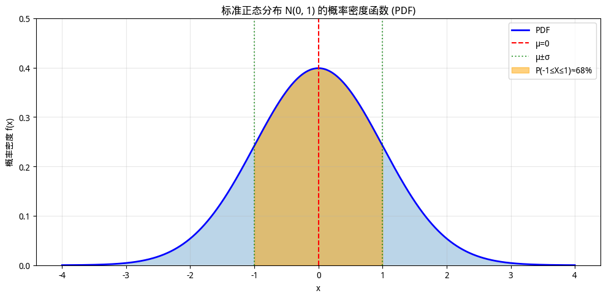

# 概率基础

在[引言](introduction.md)里，我们理解了为什么机器学习需要概率性思维——因为数据有噪声、样本有限、模型有简化，不确定性是不可避免的。本章开始系统地学习概率论的基础概念，建立描述和处理不确定性的数学语言。对于程序员来说，概率论可能比线性代数和微积分更具挑战性，后者更多是计算工具，而概率论要求思维方式的转变。但好消息是，概率论的许多概念可以用程序来直观理解。本章将借助代码示例，帮助读者建立概率的直觉。

## 随机变量：不确定性的数学表示

在传统编程中，变量是一个确定性的容器，譬如 `x = 5` 给变量 `x` 赋值为 5，它的值就是确定的 5，每次调用都会返回 5，直至它被重新赋值。但在概率论中，**随机变量（Random Variable）**是一个可能取多个值的变量，每个值有一定的概率。用程序员的思维来理解随机变量就像一个"函数"或"数据生成器"，每次调用可能返回不同的值，就像以下代码中的 `dice_roll()`。

```python runnable
import numpy as np

# 随机变量：掷骰子的结果
def dice_roll():
    return np.random.randint(1, 7)  # 返回 1-6 中的一个整数

# 每次调用可能得到不同的值
print(dice_roll())  # 可能是 3
print(dice_roll())  # 可能是 5
print(dice_roll())  # 可能是 1
```

更严谨地说，随机变量是一个从样本空间到实数的映射。这种形式化定义可能不够直观，我们可以这样理解：假设我们观察"明天天气"这个不确定事件，样本空间是所有可能的结果 $\Omega = \{\text{晴天}, \text{雨天}, \text{阴天}\}$。随机变量 $X$ 把这些结果映射到实数，比如 $X(\text{晴天}) = 1$，$X(\text{雨天}) = 2$，$X(\text{阴天}) = 3$。这样，原本抽象的"天气"概念就变成了可以进行数学运算的数字，我们可以计算它的期望、方差，或者与其他变量建立数学关系。随机变量封装了整个不确定性的结构——包括所有可能的结果及其概率分布。当我们说 $X$ 是"掷骰子的结果"时，$X$ 不是一个具体的数字（如 3 或 5），而是包含了"可能是 1 到 6 中的任意一个、每个结果的概率是 1/6"这整套信息。这正是概率论区别于确定性数学的核心：概率论处理的是"可能是什么"，而非"确定是什么"。根据取值的特点，随机变量分为两类：

- **离散型随机变量（Discrete Random Variable）**：取值是有限个或可数无限个。例如：

    - 掷骰子的结果：{1, 2, 3, 4, 5, 6}
    - 网站日访问量：{0, 1, 2, 3, ...}
    - 分类任务的类别：{猫，狗，鸟}

- **连续型随机变量（Continuous Random Variable）**：取值充满某个区间。例如：

    - 人的身高：[0, 300] cm
    - 网页加载时间：[0, +∞) 秒
    - 模型参数：(-∞, +∞)

这两类随机变量的数学处理方式不同，分别用**概率质量函数**和**概率密度函数**来描述。

### 概率质量函数（PMF）

对于离散型随机变量，概率质量函数（Probability Mass Function, PMF）给出每个取值的概率：$P(X = x) = p$，其中 $X$ 是随机变量，$x$ 是一个可能的取值，$p$ 是取该值的概率。PMF 有两个重要性质：

1. **非负性**：$P(X = x) \geq 0$ 对所有 $x$ 成立
2. **归一性**：$\sum_x P(X = x) = 1$，所有概率之和为 1

### 概率密度函数（PDF）

对于连续型随机变量，我们不能说"取某个值的概率"，因为连续变量取任何特定值的概率都是 0，譬如在实数轴上随机取一个数，取得数字 1 的概率为 0。我们用概率密度函数（Probability Density Function, PDF）来描述连续型随机变量。PDF $f(x)$ 的含义是随机变量 $X$ 落在区间 $[a, b]$ 内的概率是该区间内 PDF 曲线下的面积：$P(a \leq X \leq b) = \int_a^b f(x) \, dx$。PDF 也有两个性质：

1. **非负性**：$f(x) \geq 0$ 对所有 $x$ 成立
2. **归一性**：$\int_{-\infty}^{+\infty} f(x) \, dx = 1$

以正态分布为例，这是自然界中最常见的非均匀分布。正态分布的概率密度函数为：

$$f(x) = \frac{1}{\sqrt{2\pi\sigma^2}} \exp\left(-\frac{(x-\mu)^2}{2\sigma^2}\right)$$



*图：正态分布的概率密度函数*

其中 $\mu$ 是均值，$\sigma$ 是标准差，你现在不用理会这个公式是什么意思，只要知道它的概率密度呈"钟形曲线"，如上图所示，中心最高、两侧逐渐降低，说明变量取值集中在均值附近，越远离均值概率密度越低。下面的代码绘制标准正态分布 $N(0, 1)$ 的 PDF，并计算变量落在区间 $[-1, 1]$ 内的概率（约为 68%，即著名的 ["68-95-99.7"经验法则](https://en.wikipedia.org/wiki/68%E2%80%9395%E2%80%9399.7_rule) 的第一项）：

```python runnable
import numpy as np
import matplotlib.pyplot as plt
from math import erf, sqrt

# 标准正态分布的 PDF 实现
def normal_pdf(x, mu=0, sigma=1):
    """正态分布概率密度函数"""
    return 1 / (sigma * sqrt(2 * np.pi)) * np.exp(-0.5 * ((x - mu) / sigma) ** 2)

x = np.linspace(-4, 4, 1000)
pdf = normal_pdf(x)

# 可视化 PDF
plt.figure(figsize=(10, 5))
plt.plot(x, pdf, 'b-', linewidth=2, label='PDF')
plt.fill_between(x, pdf, alpha=0.3)

# 标注均值和标准差区间
plt.axvline(0, color='r', linestyle='--', label='μ=0')
plt.axvline(-1, color='g', linestyle=':', alpha=0.7, label='μ±σ')
plt.axvline(1, color='g', linestyle=':', alpha=0.7)

# 填充 [-1, 1] 区间（约 68% 的概率）
x_fill = np.linspace(-1, 1, 100)
plt.fill_between(x_fill, normal_pdf(x_fill), color='orange', alpha=0.5, label='P(-1≤X≤1)≈68%')

plt.xlabel('x')
plt.ylabel('概率密度 f(x)')
plt.title('标准正态分布 N(0, 1) 的概率密度函数 (PDF)')
plt.legend()
plt.grid(alpha=0.3)
plt.ylim(0, 0.5)
plt.tight_layout()
plt.show()
plt.close()

# 计算 P(-1 ≤ X ≤ 1) 使用误差函数
def normal_cdf(x, mu=0, sigma=1):
    """正态分布累积分布函数"""
    return 0.5 * (1 + erf((x - mu) / (sigma * sqrt(2))))

prob = normal_cdf(1) - normal_cdf(-1)
print(f"P(-1 ≤ X ≤ 1) = {prob:.4f} ≈ {prob*100:.1f}%")
```

注意：PDF 本身不是概率，它完全可以大于 1。只有它的积分（曲线面积）才是概率，这个才受 PDF 归一性的约束。

### 累积分布函数（CDF）

前面的 PMF 和 PDF 分别描述离散型和连续型随机变量的概率分布，它们计算"某个值附近"的概率。但在实际问题中，我们常需要回答"不超过某个阈值"的概率，譬如"顾客等待时间不超过 5 分钟的概率是多少"、"模型预测误差不超过 10% 的概率有多大"。这类问题需要一个累积的概念，这就是**累积分布函数（Cumulative Distribution Function, CDF）**：$F(x) = P(X \leq x)$。CDF 的直观含义是：从最小值开始，逐步累积概率，直到 $x$ 点。对于离散变量，CDF 是 PMF 的逐点累加；对于连续变量，CDF 是 PDF 曲线从负无穷到 $x$ 的积分面积。CDF 具有以下三个性质：

1. **单调递增**：$F(x)$ 从 0 增长到 1，因为累积的概率越来越多
2. **有界性**：$\lim_{x \to -\infty} F(x) = 0$，$\lim_{x \to +\infty} F(x) = 1$
3. **右连续**：对于离散变量，CDF 在每个取值点有一个"跳跃"——因为每个可能取值对应一个概率"块"，累积到该点时突然增加这个概率值

CDF 与 PMF/PDF 的数学关系：

- **离散型**：$F(x) = \sum_{t \leq x} P(X = t)$，即逐点累加 PMF
- **连续型**：$F(x) = \int_{-\infty}^x f(t) \, dt$，且 $f(x) = \frac{dF(x)}{dx}$

CDF 的主要优势是统一了离散型和连续型随机变量的描述方式——无论哪种类型，CDF 都直接给出概率值（而非密度），且永远在 $[0, 1]$ 范围内。这使得 CDF 在计算区间概率时特别方便：$P(a < X \leq b) = F(b) - F(a)$。

下面的代码绘制标准正态分布 $N(0, 1)$ 的 CDF 曲线，展示其从 0 平滑增长到 1 的 S 形特征：

```python runnable
import numpy as np
import matplotlib.pyplot as plt

# 标准正态分布的 CDF
x = np.linspace(-4, 4, 1000)

# NumPy 没有内置正态分布 CDF，我们用误差函数近似
from math import erf
def norm_cdf(x):
    return 0.5 * (1 + erf(x / np.sqrt(2)))

cdf = np.array([norm_cdf(xi) for xi in x])

plt.figure(figsize=(10, 5))
plt.plot(x, cdf, 'b-', linewidth=2)
plt.xlabel('x')
plt.ylabel('F(x) = P(X ≤ x)')
plt.title('标准正态分布的累积分布函数 (CDF)')
plt.grid(alpha=0.3)

# 标注几个关键点
key_points = [-2, 0, 2]
for kp in key_points:
    plt.axvline(kp, color='r', linestyle='--', alpha=0.5)
    plt.axhline(norm_cdf(kp), color='r', linestyle='--', alpha=0.5)
    plt.text(kp + 0.1, norm_cdf(kp) + 0.05, f'({kp}, {norm_cdf(kp):.2f})', fontsize=9)

plt.tight_layout()
plt.show()
plt.close()

print(f"P(X ≤ 0) = {norm_cdf(0):.4f}")   # 应该约为 0.5
print(f"P(X ≤ 1.96) ≈ {norm_cdf(1.96):.4f}")  # 约为 0.975
```

## 分布的特征

PMF、PDF 和 CDF 告诉我们概率分布的"形状"——每个取值（或区间）的概率是多少。但在实践中，我们常需要用更简洁的数字来概括一个分布的核心特征。譬如，"这个模型的预测误差大概有多大"、"用户平均等待时间是多少"。这就需要引入几个新的概念：**期望**、**偏差**和**方差**。

### 期望

**期望**（Expected Value）可以形象理解为概率分布的"中心位置"，即随机变量取值的"平均"，但它不是简单地把所有可能值加起来除以数量，而是要考虑每个值出现的概率。如果是离散型随机变量，则期望为：$E[X] = \sum_x x \cdot P(X = x)$，如果是连续型随机变量，则期望为：$E[X] = \int_{-\infty}^{+\infty} x \cdot f(x) \, dx$。期望的实质是如果无限次重复实验，结果的平均值会趋近于期望，这算是大数定律的一种直观解释。期望有如下几个性质：

1. **线性性**：$E[aX + bY] = aE[X] + bE[Y]$，期望对线性组合可分解
2. **常数期望**：$E[c] = c$，常数的期望就是它本身
3. **非负性传递**：如果 $X \geq 0$，则 $E[X] \geq 0$

用程序员视角理解，期望就像是加权平均，假设你有一个数组，每个元素有一个"权重"（概率），期望就是加权求和。下面的代码模拟掷骰子的期望计算：

```python runnable
import numpy as np

# 掷骰子的期望计算
# 理论计算：每个面 1-6，概率均为 1/6
faces = np.arange(1, 7)  # [1, 2, 3, 4, 5, 6]
prob = 1/6

# 期望 = Σ x × P(x)
expected_value = np.sum(faces * prob)
print(f"掷骰子的理论期望：E[X] = {expected_value}")

# 用大量采样验证
np.random.seed(42)
samples = np.random.randint(1, 7, size=1000000)
sample_mean = samples.mean()
print(f"100 万次采样的平均值：{sample_mean:.4f}")
print(f"差异：{abs(expected_value - sample_mean):.4f}")
```

### 偏差与方差

**偏差**（Bias）衡量的是预测值的期望与真实值之间的差距。用数学语言表达：$\text{Bias}[\hat{Y}] = E[\hat{Y}] - Y_{\text{true}}$，其中 $\hat{Y}$ 是预测值，$Y_{\text{true}}$ 是真实值。偏差的直观理解是：如果我们用同一个模型在无数个不同的训练集上训练，然后对所有模型的预测取平均，这个"平均预测"与真实值相差多少。偏差反映了模型的"系统性误差"，即不是由随机波动造成的，而是由模型本身的假设造成的。偏差越大，说明模型的预测倾向性地偏离真实值；偏差越小，说明模型能够准确地捕捉数据的真实规律。偏差为零时，我们称模型是"无偏的"（Unbiased）。在实际问题中，偏差一般是不可观测的，因为我们只有一个训练集，无法获得"无数个训练集的平均预测"，所以偏差通常需要通过理论分析或间接推断来估计。

偏差与方差在数据统计上都是对误差程度的度量和来源（误差还有一种来源是噪声），在概率统计中，更多应用的是方差。**方差**（Variance）是概率分布的"离散程度"，期望告诉我们分布的中心在哪里，但它不能告诉我们数据是紧密聚集在中心周围，还是分散得很远。这个信息要由方差来提供。方差定义为：$\text{Var}[X] = E[(X - E[X])^2]$。这个式子的直观理解是方差是每个取值与期望之差的平方的期望，或者更简单地说，是偏差平方的平均值。"平方"是为了让正负偏差都变成正数（否则会相互抵消），同时也放大了较大的偏差。方差越大，说明数据分布越分散；方差越小，说明数据集中在期望附近。方差有一个更方便的计算公式：$\text{Var}[X] = E[X^2] - (E[X])^2$，这个公式的好处是不需要先计算期望再逐点求差，只需计算 $X^2$ 的期望和 $X$ 的期望即可。方差有如下几个性质：

1. **方差与缩放**：$\text{Var}[aX] = a^2 \text{Var}[X]$（注意是 $a^2$，不是 $a$）
2. **方差与平移**：$\text{Var}[X + c] = \text{Var}[X]$（平移不改变离散程度）
3. **独立变量的方差**：$\text{Var}[X + Y] = \text{Var}[X] + \text{Var}[Y]$（仅当 $X, Y$ 独立时成立）

如果用射击比赛来类比偏差和方差对结果的影响的话，假设射击运动员在 10 环靶中只打到了 7 环，产生的 3 环的差距就是期望目标与实际目标的差距，也就是误差，这个误差即可能是因为他瞄准的时候就没瞄好，本来就是朝着 7 环去打的，也可能是因为他瞄准的确实是 10 环靶心，但是手不够稳定，射到了 7 环上。这里“瞄不准，手很稳”的情况就相当于偏差大，方差小所构成的误差，而“瞄的准，手不稳”的情况就相当于偏差小，方差大所构成的误差。这个例子中，偏差和方差的对结果的影响，可以通过下图直观地看出来。


*图：偏差与方差的直观理解*

下面的代码通过对比两个正态分布，直观展示了方差的意义。两个分布的期望相同（都为 0），但方差不同（分别为 1 和 4）。代码将生成两组样本数据，通过直方图对比它们的分布形态，并可视化方差的数学定义——偏差平方的平均值。


*图：方差的可视化结果*

上图是这段代码的可视化结果，我们可以从中得到三个关键洞察：

1. **期望相同，方差不同**：两个分布的理论期望都是 0，但分布 A 的方差为 1，分布 B 的方差为 4。这意味着两个分布的"中心位置"相同，但数据的"分散程度"差异很大。
2. **方差影响分布形态**：方差较小的分布 A（蓝色）集中在期望附近，呈现出高耸窄峭的形态；方差较大的分布 B（橙色）分布更分散，呈现出扁平宽阔的形态。左图的直方图对比清晰地展示了这一差异。
3. **方差的数学直观**：右图展示了方差的数学定义——方差是偏差平方的平均值。分布 B 的偏差平方分布明显比分布 A 更分散，说明其数据点偏离期望的程度更大。这就是"方差越大，数据的波动范围越大"的数学含义。

```python runnable
import numpy as np
import matplotlib.pyplot as plt

# 对比两个分布的期望和方差
# 分布 A：集中在期望附近
# 分布 B：分散较远
np.random.seed(42)
# 分布 A：标准正态分布 N(0, 1)
samples_a = np.random.normal(0, 1, 10000)
# 分布 B：方差更大的正态分布 N(0, 4)
samples_b = np.random.normal(0, 2, 10000)  # σ=2，方差=4

# 计算期望和方差
print("分布 A (N(0, 1)):")
print(f"  期望：E[X] = {samples_a.mean():.4f} （理论：0)")
print(f"  方差：Var[X] = {samples_a.var():.4f} （理论：1)")

print("\n 分布 B (N(0, 4)):")
print(f"  期望：E[X] = {samples_b.mean():.4f} （理论：0)")
print(f"  方差：Var[X] = {samples_b.var():.4f} （理论：4)")

# 可视化对比
fig, axes = plt.subplots(1, 2, figsize=(12, 5))

# 左图：直方图对比
axes[0].hist(samples_a, bins=50, alpha=0.6, label='方差=1 （集中）', color='steelblue', density=True)
axes[0].hist(samples_b, bins=50, alpha=0.6, label='方差=4 （分散）', color='orange', density=True)
axes[0].axvline(0, color='r', linestyle='--', label='期望=0')
axes[0].set_xlabel('取值 x')
axes[0].set_ylabel('概率密度')
axes[0].set_title('方差对比：相同的期望，不同的离散程度')
axes[0].legend()
axes[0].grid(alpha=0.3)

# 右图：方差公式的直观解释
# 展示 (X - E[X])² 的平均值
deviations_a = (samples_a - samples_a.mean()) ** 2
deviations_b = (samples_b - samples_b.mean()) ** 2

axes[1].hist(deviations_a, bins=50, alpha=0.6, label=f'偏差² 的分布 （方差≈{samples_a.var():.1f})', 
             color='steelblue', density=True)
axes[1].hist(deviations_b, bins=50, alpha=0.6, label=f'偏差² 的分布 （方差≈{samples_b.var():.1f})', 
             color='orange', density=True)
axes[1].set_xlabel('(X - E[X])²')
axes[1].set_ylabel('概率密度')
axes[1].set_title('方差 = E[(X - E[X])²] = 偏差平方的平均')
axes[1].legend()
axes[1].grid(alpha=0.3)

plt.tight_layout()
plt.show()
plt.close()
```

还有一个概念顺带介绍一下：**标准差（Standard Deviation）**，标准差是方差的"人性化版本"，方差虽然有数学上的便利性，但其单位是原单位的平方，譬如"身高方差"的单位是 cm²，这在实际解读时不非常直观。因此，人们常用标准差来代替方差度量概率分布的"离散程度"，标准差的数学表达是：$\sigma = \sqrt{\text{Var}[X]}$，开平方后，它的单位与原数据相同，更易于解读。譬如"身高标准差为 5cm"比"身高方差为 25cm²"更有意义。正态分布中的 $\sigma$ 参数就是标准差。

## 常见概率分布及其应用

前面我们学习了描述概率分布的数学工具——PMF、PDF 和 CDF 三种概率密度函数，这些工具描述的是概率分布的"形式"，而具体概率分布的"内容"，即概率如何在不同取值上分配则取决于概率分布的类型。不同的概率分布刻画了不同类型的不确定性：有的描述"只有两种结果"的简单场景，有的描述"大量微小因素叠加"的复杂现象。理解这些常见概率分布，不仅能帮助我们建模数据，还能指导模型设计。本节介绍机器学习中最常用的几种分布及其应用场景。

- **伯努利分布（Bernoulli Distribution）**描述最简单的随机试验，只有两种可能的结果：成功（1）或失败（0），伯努利分布虽然简单，但它是所有更复杂分布的起点。伯努利分布的数学表示为 $P(X = 1) = p, \quad P(X = 0) = 1 - p$，其中 $p$ 是成功的概率，$X$ 的期望 $E[X] = p$，方差 $\text{Var}[X] = p(1-p)$。

**AI 应用**：

- **二分类输出**：垃圾邮件检测、图像分类（是否包含目标对象）、点击率预测
- **逻辑回归**：模型输出正是伯努利分布的参数 $p$
- **损失函数**：二元交叉熵损失本质上是在最大化伯努利分布的似然

```python runnable
import numpy as np
import matplotlib.pyplot as plt

# 伯努利分布
p = 0.7  # 成功概率

# PMF
outcomes = [0, 1]
probs = [1 - p, p]

# 采样
np.random.seed(42)
samples = np.random.binomial(1, p, size=1000)

# 可视化
fig, axes = plt.subplots(1, 2, figsize=(12, 4))

# 左图：PMF
axes[0].bar(outcomes, probs, color=['lightcoral', 'steelblue'], edgecolor='black')
axes[0].set_xlabel('结果')
axes[0].set_ylabel('概率')
axes[0].set_title(f'伯努利分布 PMF (p={p})')
axes[0].set_xticks([0, 1])
axes[0].set_xticklabels(['失败 (0)', '成功 (1)'])

# 右图：采样结果
axes[1].hist(samples, bins=[-0.5, 0.5, 1.5], rwidth=0.8, 
             color='steelblue', edgecolor='black', density=True)
axes[1].set_xlabel('结果')
axes[1].set_ylabel('频率')
axes[1].set_title(f'1000 次采样结果 （实际成功率：{samples.mean():.2f})')
axes[1].set_xticks([0, 1])

plt.tight_layout()
plt.show()
plt.close()

print(f"理论期望：E[X] = p = {p}")
print(f"样本均值：{samples.mean():.4f}")
print(f"理论方差：Var[X] = p(1-p) = {p * (1 - p):.4f}")
print(f"样本方差：{samples.var():.4f}")
```

### 正态分布：万物之基

**正态分布（Normal Distribution）**又称高斯分布，是最重要的概率分布。自然界许多现象都近似服从正态分布。

$$f(x) = \frac{1}{\sqrt{2\pi\sigma^2}} \exp\left(-\frac{(x-\mu)^2}{2\sigma^2}\right)$$

其中 $\mu$ 是均值，$\sigma$ 是标准差。记作 $X \sim N(\mu, \sigma^2)$。

**AI 应用**：

- **权重初始化**：神经网络权重通常用正态分布初始化
- **噪声建模**：假设数据噪声服从正态分布
- **正则化**：L2 正则化可解释为假设权重服从正态分布先验
- **中心极限定理**：大量独立随机变量之和趋于正态分布

```python runnable
import numpy as np
import matplotlib.pyplot as plt

# 不同参数的正态分布
x = np.linspace(-6, 10, 1000)

def normal_pdf(x, mu, sigma):
    """正态分布 PDF"""
    return 1 / (sigma * np.sqrt(2 * np.pi)) * np.exp(-0.5 * ((x - mu) / sigma) ** 2)

# 三组参数
params = [
    (0, 1, '标准正态 N(0,1)'),
    (2, 1, 'N(2, 1)'),
    (0, 2, 'N(0, 4)')
]

plt.figure(figsize=(10, 6))

for mu, sigma, label in params:
    pdf = normal_pdf(x, mu, sigma)
    plt.plot(x, pdf, linewidth=2, label=label)

plt.xlabel('x')
plt.ylabel('概率密度 f(x)')
plt.title('不同参数的正态分布')
plt.legend()
plt.grid(alpha=0.3)

plt.tight_layout()
plt.show()
plt.close()

# 采样验证
np.random.seed(42)
samples = np.random.normal(0, 1, 10000)
print(f"标准正态分布采样 (n=10000):")
print(f"  样本均值：{samples.mean():.4f} （理论：0)")
print(f"  样本标准差：{samples.std():.4f} （理论：1)")
```

### 二项分布：多次伯努利试验

**二项分布（Binomial Distribution）**描述 $n$ 次独立伯努利试验中成功的次数。

$$P(X = k) = \binom{n}{k} p^k (1-p)^{n-k}$$

**AI 应用**：

- **模型准确率评估**：在 $n$ 个测试样本上正确预测的次数
- **A/B 测试**：用户点击次数的分布

```python runnable
import numpy as np
import matplotlib.pyplot as plt

# 二项分布
n, p = 20, 0.3  # 20 次试验，每次成功概率 0.3

# 计算概率（使用 NumPy，不用 SciPy）
def binomial_pmf(k, n, p):
    """二项分布 PMF"""
    from math import comb
    return comb(n, k) * (p ** k) * ((1 - p) ** (n - k))

k_values = np.arange(0, n + 1)
pmf = [binomial_pmf(k, n, p) for k in k_values]

# 采样
np.random.seed(42)
samples = np.random.binomial(n, p, size=10000)

# 可视化
fig, axes = plt.subplots(1, 2, figsize=(12, 4))

# 左图：PMF
axes[0].bar(k_values, pmf, color='steelblue', edgecolor='black')
axes[0].axvline(n * p, color='r', linestyle='--', label=f'期望 E[X]={n*p}')
axes[0].set_xlabel('成功次数 k')
axes[0].set_ylabel('概率 P(X=k)')
axes[0].set_title(f'二项分布 PMF (n={n}, p={p})')
axes[0].legend()

# 右图：采样分布
axes[1].hist(samples, bins=np.arange(-0.5, n + 1.5, 1), density=True, 
             color='steelblue', edgecolor='black', alpha=0.7, label='采样分布')
axes[1].bar(k_values, pmf, color='orange', edgecolor='black', alpha=0.5, label='理论 PMF')
axes[1].set_xlabel('成功次数 k')
axes[1].set_ylabel('概率/频率')
axes[1].set_title('理论 vs 采样 (10000 次）')
axes[1].legend()

plt.tight_layout()
plt.show()
plt.close()

print(f"理论期望：E[X] = np = {n * p}")
print(f"样本均值：{samples.mean():.2f}")
print(f"理论方差：Var[X] = np(1-p) = {n * p * (1 - p):.2f}")
print(f"样本方差：{samples.var():.2f}")
```

### 多项分布：多分类问题

**多项分布（Multinomial Distribution）**是二项分布的推广，描述 $n$ 次试验中各类结果出现的次数。

**AI 应用**：

- **多分类问题**：图像分类（猫/狗/鸟）、文本分类
- **词频统计**：文档中各词出现的次数

```python runnable
import numpy as np
import matplotlib.pyplot as plt

# 多项分布：掷骰子 60 次
n = 60  # 总试验次数
p = [1/6] * 6  # 公平骰子的概率

# 采样
np.random.seed(42)
sample = np.random.multinomial(n, p)

print(f"掷骰子 {n} 次，各面出现次数：")
for i, count in enumerate(sample):
    print(f"  面 {i+1}: {count} 次 （期望：{n * p[i]:.1f})")

# 可视化
fig, ax = plt.subplots(figsize=(10, 5))

x = np.arange(6)
width = 0.35

ax.bar(x - width/2, sample, width, label='实际次数', color='steelblue', edgecolor='black')
ax.bar(x + width/2, [n * pi for pi in p], width, label='期望次数', color='orange', edgecolor='black')

ax.set_xlabel('骰子面')
ax.set_ylabel('出现次数')
ax.set_title(f'多项分布采样：掷骰子 {n} 次')
ax.set_xticks(x)
ax.set_xticklabels(['1', '2', '3', '4', '5', '6'])
ax.legend()
ax.grid(axis='y', alpha=0.3)

plt.tight_layout()
plt.show()
plt.close()
```

### 指数分布与泊松分布：时间建模

**泊松分布（Poisson Distribution）**描述固定时间间隔内事件发生的次数：

$$P(X = k) = \frac{\lambda^k e^{-\lambda}}{k!}$$

**指数分布（Exponential Distribution）**描述两次事件之间的时间间隔：

$$f(x) = \lambda e^{-\lambda x}, \quad x \geq 0$$

**AI 应用**：

- **用户行为建模**：网站访问时间间隔、用户活跃时间
- **事件预测**：故障发生时间、客户到达时间

```python runnable
import numpy as np
import matplotlib.pyplot as plt

lambda_param = 2  # 平均每小时 2 个事件

# 指数分布
x = np.linspace(0, 5, 1000)
exp_pdf = lambda_param * np.exp(-lambda_param * x)

# 泊松分布
from math import exp, factorial
def poisson_pmf(k, lam):
    return (lam ** k) * exp(-lam) / factorial(k)

k_values = np.arange(0, 15)
poi_pmf = [poisson_pmf(k, lambda_param) for k in k_values]

fig, axes = plt.subplots(1, 2, figsize=(12, 4))

# 左图：指数分布（时间间隔）
axes[0].plot(x, exp_pdf, 'b-', linewidth=2)
axes[0].fill_between(x, exp_pdf, alpha=0.3)
axes[0].set_xlabel('时间间隔 x')
axes[0].set_ylabel('概率密度 f(x)')
axes[0].set_title(f'指数分布 (λ={lambda_param})')
axes[0].axvline(1/lambda_param, color='r', linestyle='--', label=f'均值 E[X]={1/lambda_param}')
axes[0].legend()
axes[0].grid(alpha=0.3)

# 右图：泊松分布（事件次数）
axes[1].bar(k_values, poi_pmf, color='steelblue', edgecolor='black')
axes[1].axvline(lambda_param, color='r', linestyle='--', label=f'均值 E[X]={lambda_param}')
axes[1].set_xlabel('事件次数 k')
axes[1].set_ylabel('概率 P(X=k)')
axes[1].set_title(f'泊松分布 (λ={lambda_param})')
axes[1].legend()
axes[1].grid(axis='y', alpha=0.3)

plt.tight_layout()
plt.show()
plt.close()

print(f"指数分布：")
print(f"  理论均值：E[X] = 1/λ = {1/lambda_param}")
print(f"泊松分布：")
print(f"  理论均值：E[X] = λ = {lambda_param}")
print(f"  理论方差：Var[X] = λ = {lambda_param}")
```

## 条件概率与独立性

### 条件概率的定义

**条件概率（Conditional Probability）**描述在已知一个事件发生的情况下，另一个事件发生的概率。

$$P(A|B) = \frac{P(A \cap B)}{P(B)}$$

读作"在 B 发生的条件下 A 发生的概率"。

用程序员视角理解：条件概率就像带过滤器的查询。假设我们有一个用户数据库：

```python
# 用户数据（模拟）
users = [
    {"id": 1, "subscribed": True, "clicked": True},
    {"id": 2, "subscribed": True, "clicked": False},
    {"id": 3, "subscribed": False, "clicked": True},
    {"id": 4, "subscribed": False, "clicked": False},
    {"id": 5, "subscribed": True, "clicked": True},
    {"id": 6, "subscribed": False, "clicked": False},
    {"id": 7, "subscribed": True, "clicked": False},
    {"id": 8, "subscribed": True, "clicked": True},
]

# 计算 P(clicked | subscribed)
subscribed_users = [u for u in users if u["subscribed"]]
clicked_and_subscribed = [u for u in subscribed_users if u["clicked"]]

p_subscribed = len(subscribed_users) / len(users)
p_clicked_given_subscribed = len(clicked_and_subscribed) / len(subscribed_users)

print(f"P(subscribed) = {p_subscribed:.2f}")
print(f"P(clicked | subscribed) = {p_clicked_given_subscribed:.2f}")
```

### 独立性

两个事件**独立（Independent）**，如果一个事件的发生不影响另一个事件的概率：

$$P(A|B) = P(A)$$

等价地：

$$P(A \cap B) = P(A) \cdot P(B)$$

**AI 应用**：

- **朴素贝叶斯分类器**：假设特征之间相互独立，大幅简化计算
- **特征工程**：判断特征是否独立有助于理解数据

```python runnable
import numpy as np

# 验证独立性
# 事件 A: 抛硬币正面
# 事件 B: 掷骰子 6 点

# 如果独立，P(A ∩ B) = P(A) × P(B)
p_a = 0.5  # 正面概率
p_b = 1/6  # 骰子 6 点概率

# 联合概率（假设独立）
p_a_and_b = p_a * p_b

print(f"P(A) = {p_a:.2f}")
print(f"P(B) = {p_b:.4f}")
print(f"P(A ∩ B) = P(A) × P(B) = {p_a_and_b:.4f}")
print()

# 用采样验证
np.random.seed(42)
n = 100000
coin_flips = np.random.randint(0, 2, n)  # 0 或 1
dice_rolls = np.random.randint(1, 7, n)   # 1-6

# 统计
count_a = np.sum(coin_flips == 1)
count_b = np.sum(dice_rolls == 6)
count_a_and_b = np.sum((coin_flips == 1) & (dice_rolls == 6))

print("采样验证 (n=100000):")
print(f"  P(A) 估计：{count_a / n:.4f}")
print(f"  P(B) 估计：{count_b / n:.4f}")
print(f"  P(A ∩ B) 估计：{count_a_and_b / n:.4f}")
print(f"  P(A) × P(B): {(count_a / n) * (count_b / n):.4f}")
```

### 链式法则

条件概率可以扩展到多个事件，得到**链式法则（Chain Rule）**：

$$P(A_1 \cap A_2 \cap \cdots \cap A_n) = P(A_1) \cdot P(A_2|A_1) \cdot P(A_3|A_1, A_2) \cdots P(A_n|A_1, \ldots, A_{n-1})$$

链式法则是概率图模型和贝叶斯网络的基础，它允许我们将联合概率分解为条件概率的乘积。

## 贝叶斯定理

### 推导与直观理解

**贝叶斯定理（Bayes' Theorem）**描述了如何根据新证据更新信念：

$$P(A|B) = \frac{P(B|A) \cdot P(A)}{P(B)}$$

这个公式可以从条件概率的定义直接推导：

$$P(A|B) = \frac{P(A \cap B)}{P(B)} = \frac{P(B|A) \cdot P(A)}{P(B)}$$

贝叶斯定理的直观理解：

- **$P(A)$**：**先验概率（Prior）**，在看到证据之前对 A 的信念
- **$P(B|A)$**：**似然（Likelihood）**，如果 A 为真，观察到 B 的可能性
- **$P(A|B)$**：**后验概率（Posterior）**，在看到证据 B 之后对 A 的更新信念
- **$P(B)$**：**边际似然（Marginal Likelihood）**或证据，用于归一化

### 经典案例：疾病检测

假设有一种疾病，患病率为 1%。有一种检测方法，对患病者的准确率为 99%（阳性），对健康者的误报率为 5%（假阳性）。如果检测结果为阳性，真正患病的概率是多少？

```python runnable
import numpy as np
import matplotlib.pyplot as plt

# 贝叶斯定理：疾病检测案例
p_disease = 0.01        # 患病率（先验）
p_positive_given_disease = 0.99  # 真阳性率
p_positive_given_healthy = 0.05  # 假阳性率

# 计算后验概率
# P(disease|positive) = P(positive|disease) × P(disease) / P(positive)
# P(positive) = P(positive|disease) × P(disease) + P(positive|healthy) × P(healthy)

p_healthy = 1 - p_disease
p_positive = (p_positive_given_disease * p_disease + 
              p_positive_given_healthy * p_healthy)

p_disease_given_positive = (p_positive_given_disease * p_disease) / p_positive

print("=== 贝叶斯定理：疾病检测案例 ===")
print(f"先验 P（患病） = {p_disease:.2%}")
print(f"似然 P（阳性|患病） = {p_positive_given_disease:.2%}")
print(f"假阳性率 P（阳性|健康） = {p_positive_given_healthy:.2%}")
print()
print(f"边际似然 P（阳性） = {p_positive:.4f}")
print(f"后验 P（患病|阳性） = {p_disease_given_positive:.2%}")
print()

# 可视化贝叶斯更新
fig, axes = plt.subplots(1, 2, figsize=(12, 5))

# 左图：概率更新
categories = ['先验、nP（患病）', '后验、nP（患病|阳性）']
values = [p_disease, p_disease_given_positive]
colors = ['lightblue', 'steelblue']

axes[0].bar(categories, values, color=colors, edgecolor='black')
axes[0].set_ylabel('概率')
axes[0].set_title('贝叶斯更新：从先验到后验')
axes[0].set_ylim(0, 1)

for i, v in enumerate(values):
    axes[0].text(i, v + 0.02, f'{v:.2%}', ha='center', fontsize=12)

# 右图：阳性结果分解
sizes = [p_positive_given_disease * p_disease, p_positive_given_healthy * p_healthy]
labels = ['真阳性、n（患病且阳性）', '假阳性、n（健康但阳性）']
colors = ['green', 'red']

axes[1].bar(labels, sizes, color=colors, edgecolor='black')
axes[1].set_ylabel('概率')
axes[1].set_title('阳性结果的组成')
axes[1].set_ylim(0, 0.06)

for i, v in enumerate(sizes):
    axes[1].text(i, v + 0.002, f'{v:.4f}', ha='center', fontsize=10)

plt.tight_layout()
plt.show()
plt.close()

print("关键洞察：")
print(f"  即使检测为阳性，患病概率只有 {p_disease_given_positive:.1%}")
print(f"  这是因为患病率很低，假阳性的绝对数量超过真阳性")
```

这个例子揭示了贝叶斯思维的重要性：**先验概率很重要**。当疾病很罕见时，即使检测为阳性，实际患病的概率也可能不高。

### 贝叶斯定理在 AI 中的应用

1. **垃圾邮件分类**：
   - 先验：垃圾邮件的比例
   - 似然：某词在垃圾邮件中出现的概率
   - 后验：给定词出现时，邮件是垃圾邮件的概率

2. **推荐系统**：
   - 先验：用户对物品的平均偏好
   - 似然：用户行为的观测
   - 后验：更新后的用户偏好估计

3. **贝叶斯深度学习**：
   - 先验：参数的先验分布
   - 似然：数据似然
   - 后验：参数的后验分布

```python runnable
import numpy as np
import matplotlib.pyplot as plt

# 贝叶斯更新演示：抛硬币推断
# 问题：有一个硬币，不知道是否公平，通过抛硬币来推断正面概率

# 先验：假设正面概率可能是 0.3 到 0.7 之间的均匀分布
p_values = np.linspace(0.01, 0.99, 100)
prior = np.ones_like(p_values) / len(p_values)  # 均匀先验

def bayesian_update(prior, p_values, data):
    """
    贝叶斯更新
    data: 观测数据，1 表示正面，0 表示反面
    """
    likelihood = np.where(data == 1, p_values, 1 - p_values)
    posterior = prior * likelihood
    posterior = posterior / posterior.sum()  # 归一化
    return posterior

# 模拟抛硬币
np.random.seed(42)
true_p = 0.7  # 真实正面概率
n_flips = 50
flips = np.random.binomial(1, true_p, n_flips)

# 逐步更新
posteriors = [prior.copy()]
current_posterior = prior.copy()

for i, flip in enumerate(flips):
    current_posterior = bayesian_update(current_posterior, p_values, flip)
    posteriors.append(current_posterior.copy())

# 可视化
fig, axes = plt.subplots(2, 3, figsize=(14, 8))
axes = axes.flatten()

steps = [0, 5, 10, 20, 35, 50]  # 展示的步骤

for i, step in enumerate(steps):
    ax = axes[i]
    ax.plot(p_values, posteriors[step], 'b-', linewidth=2)
    ax.axvline(true_p, color='r', linestyle='--', label=f'真实值 p={true_p}')
    ax.axvline(p_values[np.argmax(posteriors[step])], color='g', linestyle=':', 
               label=f'MAP 估计={p_values[np.argmax(posteriors[step])]:.2f}')
    ax.set_xlabel('正面概率 p')
    ax.set_ylabel('后验概率密度')
    ax.set_title(f'抛 {step} 次后')
    ax.legend(fontsize=8)
    ax.set_xlim(0, 1)
    ax.grid(alpha=0.3)

plt.suptitle('贝叶斯推断：抛硬币学习正面概率', fontsize=14)
plt.tight_layout()
plt.show()
plt.close()

# 最终估计
final_map = p_values[np.argmax(posteriors[-1])]
final_mean = np.sum(p_values * posteriors[-1])
print(f"真实正面概率：{true_p}")
print(f"MAP 估计：{final_map:.3f}")
print(f"后验均值：{final_mean:.3f}")
print(f"观测到的正面比例：{flips.sum() / len(flips):.3f}")
```

## 本章小结

本章建立了概率论的数学基础：

1. **随机变量**是描述不确定性的数学对象，分为离散型和连续型。

2. **PMF/PDF **描述随机变量的概率分布，CDF 给出累积概率。

3. **常见分布**各有其应用场景：伯努利分布用于二分类，正态分布用于噪声建模，多项分布用于多分类，泊松/指数分布用于时间建模。

4. **条件概率**描述事件之间的依赖关系，独立性是重要的简化假设。

5. **贝叶斯定理**提供了更新信念的数学框架，是贝叶斯推断的核心。

这些概念是后续章节的基础：下一章我们将学习如何从数据中估计分布的参数（统计推断），再后续将学习如何评估和选择模型。

## 练习题

1. 解释 PMF 和 PDF 的区别，以及为什么连续随机变量取特定值的概率为 0。
   <details>
   <summary>参考答案</summary>

   PMF（概率质量函数）用于离散随机变量，给出每个取值的概率，是一个概率值。PDF（概率密度函数）用于连续随机变量，给出的是概率密度，不是概率本身。

   连续随机变量取特定值的概率为 0，是因为连续变量的取值有无限多个，如果每个取值的概率大于 0，总概率就会无限大。只有区间的概率才有意义（PDF 在区间上的积分）。

   </details>

2. 使用贝叶斯定理计算：如果 P(A) = 0.3, P(B|A) = 0.8, P(B|¬A) = 0.2，求 P(A|B)。
   <details>
   <summary>参考答案</summary>

   根据贝叶斯定理：
   - P(A) = 0.3
   - P(¬A) = 0.7
   - P(B) = P(B|A)P(A) + P(B|¬A)P(¬A) = 0.8×0.3 + 0.2×0.7 = 0.24 + 0.14 = 0.38
   - P(A|B) = P(B|A)P(A) / P(B) = 0.8×0.3 / 0.38 = 0.24 / 0.38 ≈ 0.632

   </details>

3. 为什么机器学习模型预测通常输出概率而不是确定的类别？
   <details>
   <summary>参考答案</summary>

   输出概率可以：
   1. 量化预测的不确定性，帮助做出更好的决策
   2. 在不同阈值下权衡精确率和召回率（如医疗诊断）
   3. 支持多任务决策（如风险控制中根据概率调整策略）
   4. 为集成学习提供更多信息（软投票）

   </details>