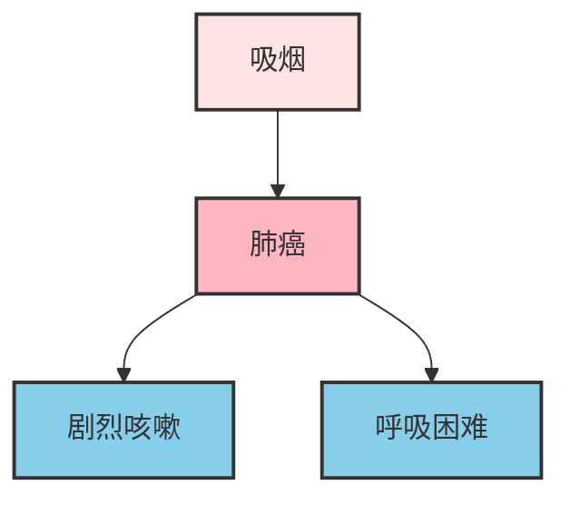
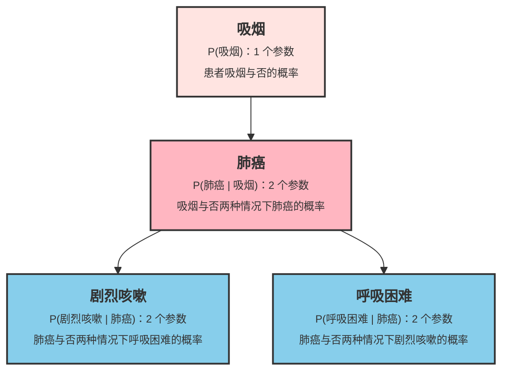

# 贝叶斯网络

1988 年，人工智能先驱朱迪亚·珀尔（Judea Pearl）出版了《Probabilistic Reasoning in Intelligent Systems》一书，首次系统地提出了**贝叶斯网络**（Bayesian Network）的概念，将概率论与图论结合，解决了困扰人工智能领域多年的不确定性推理问题。珀尔因此获得了 2011 年的图灵奖，贝叶斯网络也成为最重要的概率图模型之一，广泛应用于医疗诊断、故障检测、风险评估等领域。

在[朴素贝叶斯](naive-bayes.md)一章中，我们学习了用"朴素"假设（特征相互独立）简化贝叶斯计算。但现实世界中的变量往往存在复杂的依赖关系，譬如发烧和咳嗽都与感冒相关，但它们之间也可能相互影响；收入和教育程度共同影响贷款审批，但收入和教育之间也有关联。贝叶斯网络正是为了解决这类问题而设计，它提供了一种系统的方法来建模变量之间的依赖，既能表达复杂的概率关系，又能进行高效的概率推断。

## 图结构

朴素贝叶斯的成功源于它大胆地假设各特征相互独立，把联合概率直接分解为各条件概率的乘积，大幅降低计算复杂度，但也付出了精确性的代价，丢失了特征之间的关联信息。如何既保留特征的关联信息，又能保证联合概率计算的可行性？贝叶斯网络的解决方案是用图结构显式表达变量间的依赖关系，只建模直接依赖，间接依赖通过图结构推导。这种策略既避免了建模所有关联的复杂性，又保留了关键的依赖信息。

贝叶斯网络的图结构属于**有向无环图**（Directed Acyclic Graph, DAG），其中的**节点**（Node）表示随机变量，**有向边**（Directed Edge，如 $A \rightarrow B$）表示"A 直接影响 B"，**无环**（Acyclic）说明不存在循环路径，确保因果关系的合理性，不会出现倒果为因的情况。假设我们要建模吸烟、肺癌、剧烈咳嗽和呼吸困难之间的关系，得到的 DAG 应如下图所示：


*图：医疗诊断网络的 DAG*

"吸烟 → 肺癌"表达吸烟作为风险因素会增加患肺癌的概率；"肺癌 → 剧烈咳嗽"表达癌症会引起剧烈的咳嗽；"肺癌 → 呼吸困难"表达癌症会导致呼吸困难的症状出现。DAG 中，每个节点都有明确的家族关系。**父节点**（Parent）是指向某节点的节点，表示直接影响者；**子节点**（Child）是被某节点指向的节点，表示被影响者。在上图中，"肺癌"的父节点是"吸烟"，子节点是"剧烈咳嗽"和"呼吸困难"；"吸烟"作为"肺癌"的父节点，同时也是"剧烈咳嗽"和"呼吸困难"的祖先节点。

## 条件独立性

在贝叶斯网络中，每个节点都遵循一个名为**条件独立性**（Conditional Independence）的基本规则：给定其父节点后，该节点只与父节点形成依赖关系，父节点与所有非后代节点条件独立。现实中，每个特征都可能与任意其他特征产生依赖，这是一种网状关系，朴素贝叶斯中各特征无条件地独立的假设是直接忽略依赖，让网状变成一组离散的点；而条件独立性规则是将网状依赖变成了树（森林）状依赖。继续用疾病诊断网络来说明：

- **"肺癌"的视角**：给定"肺癌"的状态后，"剧烈咳嗽"和"呼吸困难"都条件独立。如果已知患者确实患有肺癌，是否咳嗽与是否呼吸困难彼此之间不再提供额外信息，它们都是由肺癌引起的症状，彼此之间没有直接的因果关系。

- **"吸烟"的视角**：给定"肺癌"的状态后，"吸烟"与"呼吸困难"、"剧烈咳嗽"都条件独立。这更符合直觉：如果已经知道患者是否患肺癌，那么吸烟这个风险因素就不再影响对症状的预测。肺癌成为了吸烟和症状之间的中介变量，阻断了信息的传递。

可见，DAG 图中的每个节点，都只需要处理与父节点的关联关系即可。贝叶斯网络利用条件独立性大幅简化概率计算，才能在放弃了朴素假设后，继续为求解联合概率提供了可行性。如果没有 DAG 结构，四个二元变量（吸烟、肺癌、呼吸困难、剧烈咳嗽）的联合概率分布的搜索空间有 $2^4 - 1 = 15$ 种可能性，模型要用 15 个参数去存储。但在贝叶斯网络中，我们只需要为每个节点构建**条件概率表**（Conditional Probability Table, CPT），如下图所示：


*图：医疗诊断网络的 CPT*

每个节点都有一个 CPT，存储给定父节点取值时该节点的概率分布，模型总共仅需 7 个参数去存储，而且这种节省随着变量数量增加而呈指数级增长。图结构告诉我们"谁影响谁"，条件概率表告诉我们"影响有多强烈"，根据 CPT 就能将联合概率分解为简单的条件概率乘积。

对于疾病诊断网络，是把“吸烟、肺癌、呼吸困难、剧烈咳嗽”这四种有相互关联特征的联合概率，转化为四个节点条件概率的乘积：

$$P(\text{吸烟}, \text{肺癌}, \text{呼吸困难}, \text{剧烈咳嗽}) = P(\text{吸烟}) \cdot P(\text{肺癌} | \text{吸烟}) \cdot P(\text{呼吸困难} | \text{肺癌}) \cdot P(\text{剧烈咳嗽} | \text{肺癌})$$

对于一般情况，在贝叶斯网络中，X 的联合概率为每个节点相对其父节点的条件概率的乘积：

$$P(X_1, X_2, \ldots, X_n) = \prod_{i=1}^{n} P(X_i | \text{Parents}(X_i))$$

## 贝叶斯网络推断

给定贝叶斯网络的结构和参数（CPT），我们可以进行[概率统计推断](../../maths/probability/statistical-inference.md)，根据已知证据计算未知变量的后验概率。这类似于医生根据患者的症状和检查结果来推断疾病的概率。在贝叶斯网络中，推断任务主要分为三类，按复杂程度递增排列：

1. **概率查询**（Posterior Probability Query）：这是最基本的推断形式，给定一组证据变量 $E$ 的观测值 $e$，计算查询变量 $Q$ 的后验概率分布 $P(Q | E=e)$。以前述疾病诊断网络为例：
    - **证据**：患者观察到剧烈咳嗽的症状，即 $E = \{\text{剧烈咳嗽}=\text{是}\}$
    - **查询变量**：是否患有肺癌，即 $Q = \{\text{肺癌}\}$
    - **推断目标**：计算 $P(\text{肺癌}=\text{是} | \text{剧烈咳嗽}=\text{是})$ 和 $P(\text{肺癌}=\text{否} | \text{剧烈咳嗽}=\text{是})$

    根据贝叶斯定理，这个后验概率可以通过 CPT 和图结构计算得出。剧烈咳嗽的出现会提升患肺癌的后验概率，因为 CPT 告诉我们 $P(\text{剧烈咳嗽}=是 | \text{肺癌}=\text{是})$ 远高于 $P(\text{剧烈咳嗽}=\text{是} | \text{肺癌}=\text{否})$。

2. **最大后验查询**（Maximum A Posteriori，MAP）：MAP 查询是概率查询的扩展。给定证据，找出查询变量的最可能取值组合，即求解：$q^* = \arg\max_{q} P(Q=q | E=e)$。与概率查询返回完整分布不同，MAP 只返回概率最大的那个取值。继续以疾病诊断为例：
    - **证据**：剧烈咳嗽且呼吸困难，即 $E = \{\text{剧烈咳嗽}=\text{是}, \text{呼吸困难}=\text{是}\}$
    - **查询变量**：肺癌状态，即 $Q = \{\text{肺癌}\}$
    - **推断目标**：比较 $P(\text{肺癌}=\text{是} | \text{剧烈咳嗽}=\text{是}, \text{呼吸困难}=\text{是})$ 与 $P(\text{肺癌}=\text{否} | \text{剧烈咳嗽}=\text{是}, \text{呼吸困难}=\text{是})$，返回概率更大的那个状态

    两个症状同时出现提供了更强的证据，MAP 查询会综合这些信息给出最可能的诊断结论。注意 MAP 与概率查询的区别，MAP 是"最可能的诊断是什么"，而概率查询是"各诊断的概率分别是多少"。

3. **最可能解释**（Most Probable Explanation，MPE）：MPE 是最高级的推断形式，给定证据，求所有非证据变量的最可能联合取值组合，即求解 $x^* = \arg\max_{x} P(X=x | E=e)$。其中 $X$ 包含网络中所有非证据变量。与 MAP 只关注查询变量不同，MPE 要求同时为所有隐藏变量找到最可能的配置。例如：
    - **证据**：患者观察到剧烈咳嗽的症状
    - **隐藏变量**：吸烟、肺癌、呼吸困难
    - **推断目标**：找出 $\{\text{吸烟}, \text{肺癌}, \text{呼吸困难}\}$ 的最可能联合状态

    可能的候选解释包括"吸烟 = 是, 肺癌 = 是, 呼吸困难 = 是"、"吸烟 = 否, 肺癌 = 是, 呼吸困难 = 否"等。MPE 要计算每个完整配置的后验概率，返回概率最大的那个组合。这相当于回答"最能解释当前证据的完整场景是什么"。

三类推断的关系可以概括为：概率查询回答"概率分布是什么"，MAP 回答"单个变量的最佳猜测是什么"，MPE 回答"整个网络的最佳状态配置是什么"。贝叶斯网络最常用的推断方法是**枚举法**（Enumeration Inference）。其核心思想是：利用贝叶斯网络的分解特性，通过枚举所有与证据一致的隐藏变量赋值，计算查询变量的后验分布。
具体步骤如下：

1. **确定变量分类**。将网络中的变量分为三类：
    - **证据变量** $E$：已有观测值的变量（如 剧烈咳嗽 = 是）
    - **查询变量** $Q$：需要推断的变量（如肺癌）
    - **隐藏变量** $H$：既非证据也非查询的变量（如吸烟、呼吸困难）

2. **枚举隐藏变量**。对每个隐藏变量的所有可能取值进行组合枚举。例如有两个二元隐藏变量 $H_1, H_2$，则需要枚举 $(H_1=\text{是}, H_2=\text{是})$、$(H_1=\text{是}, H_2=\text{否})$、$(H_1=\text{否}, H_2=\text{是})$、$(H_1=\text{否}, H_2=否\text{否})$ 四种情况。

3. **计算联合概率**。对每一种隐藏变量赋值组合，结合已知的证据和假设的查询变量取值，利用链式法则计算联合概率：
$$P(Q=q, E=e, H=h) = \prod_{i=1}^{n} P(X_i | \text{Parents}(X_i))$$

4. **边缘化与归一化**。对所有隐藏变量赋值求和，得到查询变量的未归一化概率，最后除以总和进行归一化：
$$P(Q=q | E=e) = \frac{\sum_{h} P(Q=q, E=e, H=h)}{\sum_{q'} \sum_{h} P(Q=q', E=e, H=h)}$$

枚举法的优点是概念清晰、实现简单，能够给出精确的推断结果；缺点是计算复杂度随隐藏变量数量指数增长（$O(2^{|H|})$），仅适用于小型网络。对于大型网络，需要采用变量消元、信念传播等更高效的近似推断算法。以下代码用枚举法思想了诊断网络的推断：

```python runnable extract-class="SimpleBayesianNetwork"
import numpy as np
import matplotlib.pyplot as plt

class SimpleBayesianNetwork:
    """
    简单贝叶斯网络实现
    支持离散变量和精确推断（枚举法）
    """
    def __init__(self):
        self.nodes = {}  # 节点信息：{name: {'parents': [], 'values': []}}
        self.cpts = {}   # 条件概率表：{name: {parent_values: {value: prob}}}
        self.topo_order = []  # 拓扑排序
    
    def add_node(self, name, values, parents=None):
        """添加节点"""
        if parents is None:
            parents = []
        self.nodes[name] = {'parents': parents, 'values': values}
        self._update_topo_order()
    
    def set_cpt(self, name, cpt):
        """
        设置条件概率表
        
        cpt格式：{parent_value_tuple: {value: prob}}
        对于无父节点的变量：{(): {value: prob}}
        """
        self.cpts[name] = cpt
    
    def _update_topo_order(self):
        """计算拓扑排序"""
        visited = set()
        order = []
        
        def visit(node):
            if node in visited:
                return
            visited.add(node)
            for parent in self.nodes[node]['parents']:
                visit(parent)
            order.append(node)
        
        for node in self.nodes:
            visit(node)
        
        self.topo_order = order
    
    def get_prob(self, name, value, parent_values):
        """获取条件概率 P(name=value | parent_values)"""
        parent_key = tuple(parent_values) if parent_values else ()
        return self.cpts[name].get(parent_key, {}).get(value, 0)
    
    def joint_prob(self, assignment):
        """计算联合概率 P(X1, X2, ...)"""
        prob = 1.0
        for node in self.topo_order:
            parents = self.nodes[node]['parents']
            parent_values = [assignment[p] for p in parents]
            value = assignment[node]
            prob *= self.get_prob(node, value, parent_values)
        return prob
    
    def enumerate_inference(self, query, evidence):
        """
        枚举推断：计算 P(query | evidence)
        
        query: {node: '?'} 返回分布
        evidence: {node: value}
        """
        query_nodes = list(query.keys())
        hidden = [n for n in self.nodes if n not in query_nodes and n not in evidence]
        
        def enumerate_assignments(variables, current):
            if not variables:
                yield current.copy()
                return
            var = variables[0]
            for value in self.nodes[var]['values']:
                current[var] = value
                yield from enumerate_assignments(variables[1:], current)
            del current[var]
        
        query_values = {}
        total = 0.0
        
        query_node = query_nodes[0]
        for qv in self.nodes[query_node]['values']:
            prob_sum = 0.0
            for assignment in enumerate_assignments(hidden, {}):
                assignment.update(evidence)
                assignment[query_node] = qv
                prob_sum += self.joint_prob(assignment)
            query_values[qv] = prob_sum
            total += prob_sum
        
        # 归一化
        for k in query_values:
            query_values[k] /= total
        return query_values


# 构建疾病诊断网络
bn = SimpleBayesianNetwork()

bn.add_node('吸烟', ['是', '否'])
bn.add_node('肺癌', ['是', '否'], parents=['吸烟'])
bn.add_node('呼吸困难', ['是', '否'], parents=['肺癌'])
bn.add_node('剧烈咳嗽', ['是', '否'], parents=['肺癌'])

bn.set_cpt('吸烟', {(): {'是': 0.3, '否': 0.7}})
bn.set_cpt('肺癌', {
    ('是',): {'是': 0.1, '否': 0.9},
    ('否',): {'是': 0.01, '否': 0.99}
})
bn.set_cpt('呼吸困难', {
    ('是',): {'是': 0.65, '否': 0.35},
    ('否',): {'是': 0.1, '否': 0.9}
})
bn.set_cpt('剧烈咳嗽', {
    ('是',): {'是': 0.9, '否': 0.1},
    ('否',): {'是': 0.05, '否': 0.95}
})

print("=" * 60)
print("贝叶斯网络推断演示")
print("=" * 60)

# 1. 无条件概率
print("\n1. 无条件概率 P(肺癌):")
result1 = bn.enumerate_inference({'肺癌': '?'}, {})
print(f"   P(肺癌=是) = {result1['是']:.4f}")
print(f"   P(肺癌=否) = {result1['否']:.4f}")

# 2. 单证据推断
print("\n2. P(肺癌 | 剧烈咳嗽=是):")
result2 = bn.enumerate_inference({'肺癌': '?'}, {'剧烈咳嗽': '是'})
print(f"   P(肺癌=是 | 剧烈咳嗽) = {result2['是']:.4f}")
print(f"   P(肺癌=否 | 剧烈咳嗽) = {result2['否']:.4f}")

# 3. 多证据推断
print("\n3. P(肺癌 | 吸烟=是, 剧烈咳嗽=是):")
result3 = bn.enumerate_inference({'肺癌': '?'}, {'吸烟': '是', '剧烈咳嗽': '是'})
print(f"   P(肺癌=是 | 吸烟, 剧烈咳嗽) = {result3['是']:.4f}")
print(f"   P(肺癌=否 | 吸烟, 剧烈咳嗽) = {result3['否']:.4f}")

# 4. 逆向推断（诊断推断）
print("\n4. P(吸烟 | 肺癌=是):")
result4 = bn.enumerate_inference({'吸烟': '?'}, {'肺癌': '是'})
print(f"   P(吸烟=是 | 肺癌) = {result4['是']:.4f}")
print(f"   P(吸烟=否 | 肺癌) = {result4['否']:.4f}")

# 可视化推断结果
fig, ax = plt.subplots(figsize=(12, 6))

scenarios = ['无条件', '剧烈咳嗽', '吸烟+剧烈咳嗽', '逆向推断\n(肺癌→吸烟)']
p_cancer_yes = [result1['是'], result2['是'], result3['是'], result4['是']]
p_cancer_no = [result1['否'], result2['否'], result3['否'], result4['否']]

x = np.arange(len(scenarios))
width = 0.35

bars1 = ax.bar(x - width/2, p_cancer_yes, width, label='是', color='#FF6B6B', edgecolor='#333', lw=2)
bars2 = ax.bar(x + width/2, p_cancer_no, width, label='否', color='#90EE90', edgecolor='#333', lw=2)

ax.set_ylabel('概率', fontsize=12)
ax.set_title('不同证据下的推断结果对比', fontsize=14, fontweight='bold')
ax.set_xticks(x)
ax.set_xticklabels(scenarios)
ax.legend(title='肺癌状态', fontsize=11)
ax.set_ylim(0, 1)
ax.grid(True, alpha=0.3, axis='y')

for bar, prob in zip(bars1, p_cancer_yes):
    ax.text(bar.get_x() + bar.get_width()/2, bar.get_height() + 0.02, f'{prob:.2%}', ha='center', fontsize=11)

plt.tight_layout()
plt.show()
plt.close()
```

从可视化结果中可以看到关键的推断特性：

- **无条件概率**：肺癌概率仅 3.7%，反映了人群总体患病率。
- **单证据推断**：剧烈咳嗽后，肺癌概率飙升到 47.37%，证据的影响力显著。
- **多证据推断**：吸烟 + 剧烈咳嗽双重证据下，肺癌概率高达 75%。
- **逆向推断**：已知肺癌后，吸烟概率从 30% 提升到 75%，体现了贝叶斯的"逆向推理"能力。

这正是贝叶斯网络的精髓：信息可以沿着有向边双向流动。正向推断（预测）是从原因推断结果；逆向推断（诊断）是从结果推断原因。

## 本章小结

贝叶斯网络将概率论与图论结合，用有向无环图显式建模变量间的依赖关系，是结构化概率建模的范式：先确定变量间的依赖结构（定性），再量化依赖强度（定量），最后用概率规则进行推断。这套范式贯穿整个概率图模型领域，从隐马尔可夫模型到马尔可夫随机场，其核心思想都源于贝叶斯网络。然而，贝叶斯网络也有局限：当变量之间存在复杂依赖或存在**隐变量**（无法观测的变量）时，网络的学习和推断变得困难。下一章，我们将学习处理隐变量问题的 [EM 算法](em-algorithm.md)。

## 练习题

给定以下贝叶斯网络结构，分析各节点的条件独立性关系：

   ```mermaid
   graph TD
       %% 定义节点样式
       classDef weather fill:#FFE4B5,stroke:#333,stroke-width:2px
       classDef forecast fill:#E6E6FA,stroke:#333,stroke-width:2px
       classDef umbrella fill:#98FB98,stroke:#333,stroke-width:2px
       classDef mood fill:#87CEEB,stroke:#333,stroke-width:2px

       %% 节点定义
       W[天气]:::weather
       F[预报]:::forecast
       U[带伞]:::umbrella
       M[心情]:::mood

       %% 边定义
       W --> U
       F --> U
       W --> M
   ```

   - 当已知"天气 = 雨天"时，"心情"与"预报"是否条件独立？为什么？
   - 当已知"带伞 = 是"时，"天气"与"预报"是否独立？
   - 如果要推断"心情"，哪些变量是相关的证据变量？

   <details>
   <summary>参考答案</summary>

   **条件独立性分析**：

   当已知"天气 = 雨天"时，心情与预报条件独立。

   原因：心情的父节点是天气，根据贝叶斯网络的条件独立性规则 —— 给定父节点后，该节点与所有非后代节点独立。天气是心情的父节点，预报不是心情的后代，因此在已知天气的情况下，心情与预报条件独立。

   **头对头结构**（V-Structure）：

   当已知"带伞 = 是"时，天气与预报不独立，它们会变得相关。

   这是典型的**头对头结构**（Head-to-Head）：天气 → 带伞 ← 预报。在头对头结构中，当子节点（带伞）或其任何后代被观测时，两个父节点（天气和预报）之间会产生**解释消除**（Explaining Away）效应，使它们变得相关。

   例如：如果观察到带伞了，但预报说晴天（低概率带伞），那么推断下雨的概率就会上升，预报的信息影响了对天气的判断。

   **相关证据变量**：

   推断"心情"时，直接相关的证据变量只有"天气"。

   原因：心情的父节点只有天气，根据条件独立性，给定天气后，心情与网络中其他所有变量都独立。因此，预报和带伞都不能为心情提供额外信息，它们只能通过天气间接影响心情。
   </details>

