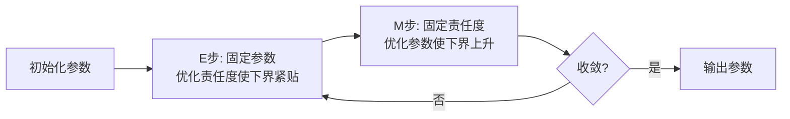

# EM 算法

经过前面两章的学习，我们既能通过对已知样本的统计，根据先验概率对新数据进行预测，也能够根据已知证据，推断未知变量的后验概率。然而这些都是以"已经有足够证据（样本数据）"为前提的。现实中，并非所有数据都可以观测到，生活中涉及**隐变量**的场景比比皆是，想象你走进一家有三个厨房的餐厅，三个厨房都在做菜，但你只能看到端出来的菜品，看不到菜是从哪个厨房出来的。菜品本身是观测变量，而"这道菜来自哪个厨房"就是隐变量，你无法直接观测，但它确实影响着你能看到的数据。在机器学习中，类似场景也随处可见，除了统计分析中变量缺失被视为隐变量外，聚类问题中数据点的特征是观测到的，但"这个点属于哪个簇"是隐变量，混合模型中，样本值是观测到的，但"样本来自哪个成分分布"也是隐变量，等等。

隐变量带来的障碍在于[最大似然估计](../../maths/probability/statistical-inference.md#最大似然估计mle)的似然函数中包含了对隐变量的求和或积分，缺少数据使得直接优化变得困难。**EM 算法**（Expectation-Maximization Algorithm）正是解决这一困境的经典方法，它通过"期望"和"最大化"个步骤的交替迭代，逐步逼近最大似然解。

## 期望最大化过程

EM 算法的名字直接来源于**期望最大化**（Expectation-Maximization）过程，该过程分为期望（Expectation，简称 E 步）和最大化（Maximization，简称 M 步）两个步骤。

考虑一个具体例子，假设我们收集了 100 名学生的考试成绩，观察到成绩分布呈现"双峰"形态，一部分学生成绩集中在 60 分左右，另一部分集中在 85 分左右。直觉告诉我们，这些学生可能来自两个不同的群体（比如两个不同水平的重点班和普通班）。但我们并不知道每个学生属于哪个班级。以上场景中，学生所属的班级就是一个隐变量。经过初步估计（凭经验猜测的初始值），重点班占比 $\pi_1=0.4$，成绩服从正态分布 $\mathcal{N}(\mu_1=85, \sigma_1^2=25)$；普通班占比 $\pi_2=0.6$，成绩服从正态分布 $\mathcal{N}(\mu_2=60, \sigma_2^2=36)$。现有一名学生的成绩为 $x=70$ 分，请计算该学生属于重点班和普通班的概率分别是多少？

这个问题是在给定观测成绩 $x=70$ 下求的该学生来自重点班和普通班的后验概率，在期望最大化过程中称这个后验为**责任度**（Responsibility）。根据[贝叶斯定理](../../maths/probability/probability-basics.md#贝叶斯定理)，其计算公式为：

$$\gamma_k = P(z_i=k | x = 70) = \frac{P(x_i | z_i = k) \cdot P(z_i = k)}{P(x_i)} = \frac{\pi_k \mathcal{N}(x | \mu_k, \sigma_k^2)}{\sum_{j=1}^{2} \pi_j \mathcal{N}(x | \mu_j, \sigma_j^2)}$$

因为分母都是一样的，所以比较学生属于两个班的概率，只要计算两个班在 $x=70$ 处的加权概率即可。根据[正态分布公式](../../maths/probability/probability-basics.md#正态分布)，重点班 $\pi_1(0.4) \times \mathcal{N}(70|85, 25)\approx 0.0117$，普通班 $\pi_2(0.6) \times \mathcal{N}(70|60, 36) \approx 0.0394$，总概率 $P(x=70)  = 0.0511$，因此该学生属于重点班的概率约为 22.9%，属于普通班的概率约为 77.1%。以上计算过程就是期望最大化的 **E 步**：在已知模型参数的情况下，估计每个样本属于各隐变量的后验概率。

对样本中 100 份考试成绩都算完 E 步后，我们手里有 100 名学生各自属于重点班和普通班的责任度。比如小明（70 分）有 22.9% 的概率属于重点班，小红（88 分）有 91% 的概率属于重点班。**M 步**的任务就是根据这些"软分配"信息来重新估计班级占比和两个班级成绩分布的参数（占比、均值和方差）。

- **更新重点班的均值**：假设我们把所有学生的责任度列出来，成绩高的学生责任度普遍高（他们"像"重点班的），成绩低的责任度普遍低。现在我们要重新计算重点班的平均分。如果按传统做法，计算班级平均分就是把"确定属于重点班"的学生挑出来算平均。但 EM 算法的精髓在于不强行划分（因为现在每个人都有一定概率属于重点班），而是让每个学生对均值更新的贡献乘上于他属于重点班的概率。可以将这种更新方式想象成一场拔河比赛，一个考 95 分（优秀）的学生责任度是 0.97，他几乎全力以赴地把均值往高分拉；一个考 70 分（中等）的学生责任度只有 0.23，他只使出一小半的力气，对成绩均值的影响就小得多。最终，均值会向责任度高的那群高分学生靠拢，但又不至于完全抛弃那些可能是重点班的中等生，毕竟小明这样的学生还有 22.9% 的概率属于重点班，不能像对待普通班那样完全忽略。均值更新的数学表示为：

$$\mu_1^{new} = \frac{\sum_{i=1}^{n} \gamma_{i1} \cdot x_i}{\sum_{i=1}^{n} \gamma_{i1}}$$

- **更新重点班的方差**：同样地，计算方差时也不是简单看"重点班学生"散布得多开，而是按责任度加权。一个责任度 0.9 的学生如果离新均值很远，会显著增大方差估计；一个责任度 0.1 的学生即使偏离很远，对重点班方差的贡献也很小。这保证了重点班的"形状"主要由那些"确实像重点班"的学生决定，而不会被边缘可疑样本过度干扰。方差更新的数学表示为：

$$\sigma_1^{2,new} = \frac{\sum_{i=1}^{n} \gamma_{i1} \cdot (x_i - \mu_1^{new})^2}{\sum_{i=1}^{n} \gamma_{i1}}$$

- **更新混合系数（班级占比）**：最后，要确定重点班在整个统计样本中占多大比例。不是数有多少人"确定"分到重点班，而是把所有学生属于重点班的概率加起来，除以总人数。如果 100 个学生的责任度加起来是 38.5，那么重点班的混合系数就是 38.5%，这直观反映了"重点班的有效人数"。

通过这样一轮 M 步，我们得到了更新后的重点班参数：均值可能从 85 上调到 87（因为高分学生的责任度拉高了平均），方差可能略微缩小（排除了一些中等分的干扰），混合系数也从最初的 40% 调整到了更贴合数据的真实比例。接下来，用这套新参数重新计算责任度（回到 E 步），如此交替迭代，直到参数稳定收敛，不再变化。这就是期望最大化的完整含义：**在隐变量的期望分布下，最大化似然函数来更新参数**。完整的期望最大化过程如下图所示。


*图： 期望最大化过程*

由于主题原因，本节并没有严格推导期望最大化过程是能够稳定收敛的。严谨的数学证明最早在 1977 年的论文《Maximum Likelihood from Incomplete Data via the EM Algorithm》中给出，这篇文章原本只是提出一种处理缺失数据的技术方法，后来被发现适用于更广泛的隐变量问题，被聚类分析、混合模型、隐马尔可夫模型等所采用，这篇文章至今已被引用超过五万次，成为统计学和机器学习领域最具影响力的工作之一。

## 高斯混合模型

**高斯混合模型**（Gaussian Mixture Model, GMM）是应用 EM 算法的典型，适合用多个高斯分布的混合来刻画"多峰"数据分布。想象你是一家连锁餐厅的数据分析师，收集了顾客用餐时间的分布数据。你发现用餐时间呈现明显的"三峰"形态：一部分顾客（上班族）用餐时间集中在 20 分钟左右，另一部分顾客（聚餐家庭）集中在 60 分钟左右，还有一部分（商务宴请）集中在 120 分钟左右。这说明顾客来自三个不同的群体，但因为隐私原因，你不能直接询问每个顾客的身份，这种情况就适合使用 GMM 来进行数据分析。

GMM 假设数据来自 $K$ 个高斯分布的混合：$P(x) = \sum_{k=1}^{K} \pi_k \mathcal{N}(x | \mu_k, \Sigma_k)$，这个公式的含义是：
- $\pi_k$：第 $k$ 个成分的混合系数，表示"数据来自第 $k$ 个高斯分布的比例"，满足 $\sum_k \pi_k = 1$
- $\mu_k$：第 $k$ 个高斯成分的均值，表示该成分的"中心位置"
- $\Sigma_k$：第 $k$ 个高斯成分的协方差矩阵，表示该成分的"形状和伸展方向"
- $\mathcal{N}(x | \mu_k, \Sigma_k)$：以 $\mu_k$ 为中心、$\Sigma_k$ 为协方差的正态分布密度函数

隐变量 $z_i$ 表示样本 $x_i$ 来自哪个成分（取值 $1, 2, \ldots, K$）。类比来说：$z_i$ 就像顾客的群体标签，我们看不到标签本身，但能看到用餐时间 $x_i$，而用餐时间的分布受群体标签影响。以下代码实现了一个 GMM 模型，并演示了使用这个模型完成 3 种成份数据的聚类效果：

```python runnable extract-class="GaussianMixtureModel"
import numpy as np

class GaussianMixtureModel:
    """
    高斯混合模型实现
    使用EM算法求解
    """
    def __init__(self, n_components=3, max_iter=100, tol=1e-4):
        self.n_components = n_components
        self.max_iter = max_iter
        self.tol = tol  # 收敛阈值
        
        self.weights_ = None   # 混合系数 (K,)
        self.means_ = None     # 均值 (K, n_features)
        self.covariances_ = None  # 协方差矩阵 (K, n_features, n_features)
        self.log_likelihood_history_ = []
    
    def _initialize(self, X):
        """初始化参数"""
        n_samples, n_features = X.shape
        K = self.n_components
        
        # 随机初始化均值（从数据中随机选择K个点）
        indices = np.random.choice(n_samples, K, replace=False)
        self.means_ = X[indices].copy()
        
        # 初始化协方差为数据协方差的对角线
        data_cov = np.cov(X.T)
        self.covariances_ = np.array([np.diag(np.diag(data_cov)) + 1e-6 * np.eye(n_features) 
                                       for _ in range(K)])
        
        # 初始化混合系数为均匀分布
        self.weights_ = np.ones(K) / K
    
    def _gaussian_pdf(self, X, mean, cov):
        """计算多元高斯概率密度"""
        n_features = X.shape[1]
        diff = X - mean
        
        # 加小值保证数值稳定
        cov_reg = cov + 1e-6 * np.eye(n_features)
        
        # 使用Cholesky分解计算行列式和逆
        try:
            L = np.linalg.cholesky(cov_reg)
            log_det = 2 * np.sum(np.log(np.diag(L)))
            diff_L = np.linalg.solve(L, diff.T).T
            mahalanobis = np.sum(diff_L ** 2, axis=1)
        except np.linalg.LinAlgError:
            # 如果Cholesky失败，使用标准方法
            sign, log_det = np.linalg.slogdet(cov_reg)
            cov_inv = np.linalg.inv(cov_reg)
            mahalanobis = np.sum(diff @ cov_inv * diff, axis=1)
        
        log_prob = -0.5 * (n_features * np.log(2 * np.pi) + log_det + mahalanobis)
        return log_prob
    
    def _e_step(self, X):
        """E步：计算责任度"""
        n_samples = X.shape[0]
        K = self.n_components
        
        # 计算每个成分的对数概率
        log_probs = np.zeros((n_samples, K))
        for k in range(K):
            log_probs[:, k] = (np.log(self.weights_[k] + 1e-10) + 
                               self._gaussian_pdf(X, self.means_[k], self.covariances_[k]))
        
        # 计算对数似然
        log_likelihood = np.sum(np.log(np.sum(np.exp(log_probs), axis=1)))
        
        # 计算责任度（使用log-sum-trick避免数值下溢）
        log_sum = np.log(np.sum(np.exp(log_probs - log_probs.max(axis=1, keepdims=True)), axis=1, keepdims=True)) + log_probs.max(axis=1, keepdims=True)
        responsibilities = np.exp(log_probs - log_sum)
        
        return responsibilities, log_likelihood
    
    def _m_step(self, X, responsibilities):
        """M步：更新参数"""
        n_samples, n_features = X.shape
        K = self.n_components
        
        # 计算每个成分的有效样本数
        N_k = responsibilities.sum(axis=0) + 1e-10
        
        # 更新混合系数
        self.weights_ = N_k / n_samples
        
        # 更新均值
        self.means_ = (responsibilities.T @ X) / N_k[:, np.newaxis]
        
        # 更新协方差
        for k in range(K):
            diff = X - self.means_[k]
            weighted_diff = responsibilities[:, k:k+1] * diff
            self.covariances_[k] = (weighted_diff.T @ diff) / N_k[k]
            # 添加正则化
            self.covariances_[k] += 1e-6 * np.eye(n_features)
    
    def fit(self, X):
        """训练模型"""
        self._initialize(X)
        self.log_likelihood_history_ = []
        
        prev_log_likelihood = -np.inf
        
        for iteration in range(self.max_iter):
            # E步
            responsibilities, log_likelihood = self._e_step(X)
            self.log_likelihood_history_.append(log_likelihood)
            
            # 检查收敛
            if abs(log_likelihood - prev_log_likelihood) < self.tol:
                print(f"EM收敛于第{iteration}次迭代")
                break
            
            # M步
            self._m_step(X, responsibilities)
            
            prev_log_likelihood = log_likelihood
        
        return self
    
    def predict(self, X):
        """预测聚类标签"""
        responsibilities, _ = self._e_step(X)
        return np.argmax(responsibilities, axis=1)
    
    def predict_proba(self, X):
        """预测属于各成分的概率"""
        responsibilities, _ = self._e_step(X)
        return responsibilities
    
    def score(self, X):
        """计算对数似然"""
        _, log_likelihood = self._e_step(X)
        return log_likelihood


# 生成3个高斯分布的数据
n_samples = 300
true_means = np.array([[0, 0], [3, 3], [0, 4]])
true_covs = np.array([
    [[1, 0.3], [0.3, 1]],
    [[0.5, 0], [0, 0.5]],
    [[1, -0.5], [-0.5, 1]]
])

X = []
for i in range(3):
    samples = np.random.multivariate_normal(true_means[i], true_covs[i], 100)
    X.append(samples)
X = np.vstack(X)

# 打乱数据
np.random.shuffle(X)

# 训练GMM
gmm = GaussianMixtureModel(n_components=3, max_iter=100)
gmm.fit(X)

import matplotlib.pyplot as plt

# 预测
labels = gmm.predict(X)

# 创建可视化
fig, axes = plt.subplots(1, 2, figsize=(14, 5))

# 左图：GMM聚类结果
ax1 = axes[0]
colors = ['#FF6B6B', '#4ECDC4', '#45B7D1']
for k in range(3):
    cluster_points = X[labels == k]
    ax1.scatter(cluster_points[:, 0], cluster_points[:, 1],
                c=colors[k], label=f'成分 {k}', alpha=0.6, s=50)

# 标记估计的均值
ax1.scatter(gmm.means_[:, 0], gmm.means_[:, 1],
            c='black', marker='x', s=200, linewidths=3,
            label='估计均值', zorder=5)

ax1.set_xlabel('X1', fontsize=12)
ax1.set_ylabel('X2', fontsize=12)
ax1.set_title(f'GMM聚类结果 (n_components=3)', fontsize=13, fontweight='bold')
ax1.legend(loc='upper left', fontsize=9)
ax1.grid(True, alpha=0.3)
ax1.set_aspect('equal', adjustable='box')

# 右图：对数似然收敛曲线
ax2 = axes[1]
iterations = range(len(gmm.log_likelihood_history_))
ax2.plot(iterations, gmm.log_likelihood_history_,
         'b-', linewidth=2, marker='o', markersize=4)
ax2.set_xlabel('迭代次数', fontsize=12)
ax2.set_ylabel('对数似然', fontsize=12)
ax2.set_title('EM算法收敛过程', fontsize=13, fontweight='bold')
ax2.grid(True, alpha=0.3)

# 添加收敛信息文本
converge_text = f'最终对数似然: {gmm.log_likelihood_history_[-1]:.2f}\n'
converge_text += f'迭代次数: {len(gmm.log_likelihood_history_)}'
ax2.text(0.98, 0.05, converge_text, transform=ax2.transAxes,
         fontsize=10, verticalalignment='bottom', horizontalalignment='right',
         bbox=dict(boxstyle='round', facecolor='wheat', alpha=0.5))

plt.tight_layout()
plt.savefig('gmm_clustering.png', dpi=150, bbox_inches='tight')
plt.show()

# 打印聚类结果信息
print("=== GMM聚类结果 ===")
print(f"收敛对数似然: {gmm.log_likelihood_history_[-1]:.2f}")
print(f"\n估计均值:")
for k, mean in enumerate(gmm.means_):
    print(f"  成分{k}: {mean}")
print(f"\n估计混合系数: {gmm.weights_}")
print(f"\n各成分样本数: {[np.sum(labels == k) for k in range(3)]}")
```

## 本章小结

EM 算法展示了一套概率建模的优雅过程，当面对不可观测变量时，通过 E 步、M 步的交替迭代，逐步逼近真实，在每一步都保持对不确定性的尊重。这种用概率分布而非确定值来刻画未知的思想是现代机器学习的重要理念，从贝叶斯方法到变分推断再到深度生成模型，都能看到 EM 思想的影子。譬如视频生成领域的**变分自编码器**（VAE）是一个典型的例子。VAE 将 EM 的变分推断思想引入神经网络架构，编码器网络参数化隐变量的后验分布（类似 E 步），解码器网络参数化观测变量的生成分布（类似 M 步）。理解 EM 算法，就很容易理解 VAE 为何需要"重构损失"和"KL 散度"。

## 练习题

对于一维高斯混合模型，设有两个成分，参数为 $\pi_1=0.3, \mu_1=0, \sigma_1^2=1$ 和 $\pi_2=0.7, \mu_2=5, \sigma_2^2=2$。给定观测值 $x=2$，计算样本属于两个成分的责任度 $\gamma_1$ 和 $\gamma_2$。

<details>
<summary>参考答案</summary>

责任度的计算公式为：

$$\gamma_k = \frac{\pi_k \mathcal{N}(x | \mu_k, \sigma_k^2)}{\sum_{j=1}^{2} \pi_j \mathcal{N}(x | \mu_j, \sigma_j^2)}$$

首先计算两个成分的高斯密度：

$$\mathcal{N}(x=2 | \mu_1=0, \sigma_1^2=1) = \frac{1}{\sqrt{2\pi}} \exp\left(-\frac{(2-0)^2}{2}\right) = \frac{1}{\sqrt{2\pi}} e^{-2} \approx 0.054$$

$$\mathcal{N}(x=2 | \mu_2=5, \sigma_2^2=2) = \frac{1}{\sqrt{4\pi}} \exp\left(-\frac{(2-5)^2}{4}\right) = \frac{1}{\sqrt{4\pi}} e^{-2.25} \approx 0.065$$

加权后的值：
- 成分 1：$\pi_1 \times \mathcal{N}_1 = 0.3 \times 0.054 = 0.0162$
- 成分 2：$\pi_2 \times \mathcal{N}_2 = 0.7 \times 0.065 = 0.0455$

总概率：$P(x) = 0.0162 + 0.0455 = 0.0617$

责任度：
- $\gamma_1 = 0.0162 / 0.0617 \approx 0.26$
- $\gamma_2 = 0.0455 / 0.0617 \approx 0.74$

**结论**：观测值 $x=2$ 有约 26% 概率来自成分 1（均值 0 附近），约 74% 概率来自成分 2（均值 5 附近）。这个结果符合直觉，$x=2$ 更接近 $\mu_2=5$，且成分 2 的混合系数更大。

</details>