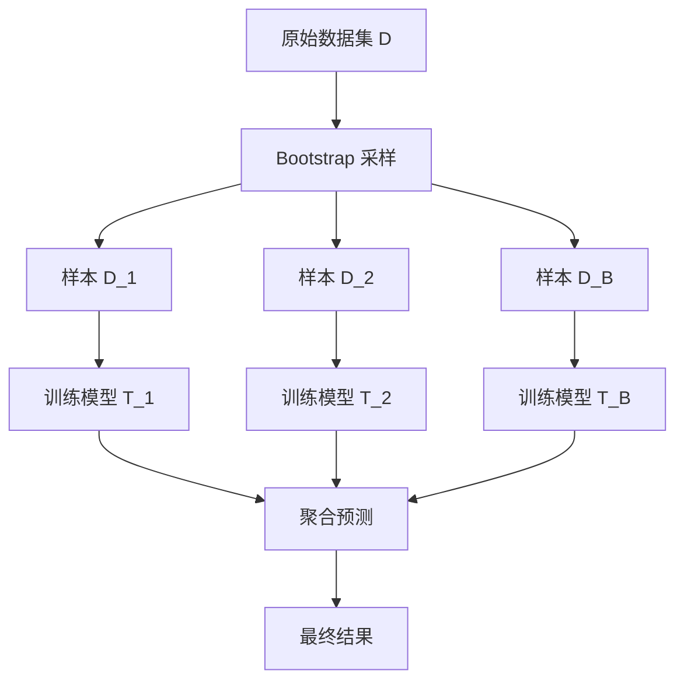

# 随机森林

[决策树](decision-tree.md)有着可解释、直观易懂的优势，也有着极其容易过拟合的问题，决策树对训练数据非常敏感，只要数据稍有变化，树的结构就可能完全不同。虽然可以靠剪枝控制模型规模来缓解，但这个先天缺陷一直难以根除。直到 2001 年，李昂·布莱曼（Leo Breiman，就是发明 [CART 算法](decision-tree.md#cart-算法)的那位统计学家）在《Machine Learning》发表了开创性论文《Random Forests》，提出了随机森林算法后这个问题才被彻底解决。

**随机森林**（Random Forest）是集成学习的经典代表，它构建多棵决策树，共同投票决定最终结果。每棵树看到不同的数据样本（Bootstrap 采样）、关注不同的特征（特征随机），因此它们学到的规律各不相同，组合后既能保持决策树的直观性，又能大幅提升预测稳定性和准确率。随机森林展现集成学习优势，是以群体智慧提升个体判断的经典案例

## Bagging 思想

随机森林的核心技术是**Bagging**，是"**B**ootstrap **Agg**regat**ing**"两个单词首尾聚合成的单词。Bagging 思想是指将训练集分层几份，让每个模型看到不同的数据，学到不同的规律。其中**自助采样**（Bootstrap）是一种重采样技术，从原始数据集中有放回（Repeated Sampling）地随机抽取样本，构造新的训练集。数学上，每个样本在一次抽取中被选中的概率是 $\frac{1}{n}$，不被选中的概率是 $1-\frac{1}{n}$。经过较多的 $n$ 次抽取后，某个样本从未被选中的概率趋近于 $e^{-1}$（约 0.368）：

$$P(\text{未被选中}) = \left(1-\frac{1}{n}\right)^n \approx e^{-1} \approx 0.368$$

这意味着每个 Bootstrap 样本约包含原始数据集 **63.2%** 的不同样本（$1-0.368=0.632$）。那些未被选中的样本称为 **OOB 样本**（Out-of-Bag），可以用来验证模型性能。Bagging 算法的流程可以总结为两阶段：

- **训练阶段**：从原始数据集生成 $B$ 个 Bootstrap 样本，在每个 Bootstrap 样本上训练一个基学习器（如决策树）。
- **预测阶段**：对于新样本，让所有模型分别预测，然后聚合结果：
    - **分类任务**：多数投票，每个模型预测一个类别，选择得票最多的。
    - **回归任务**：平均值，每个模型预测一个数值，取算术平均。


*图：Bagging 算法的流程*

Bagging 的有效性源于**方差降低**。假设你要射击靶心，单次射击可能因为手抖偏离目标。如果你射击 100 次取平均位置，随机抖动会被相互抵消，平均位置更接近靶心。数学上，如果 $B$ 个模型的方差都是 $\sigma^2$，两两相关系数是 $\rho \in [0, 1]$（0 表示完全独立，1 表示完全相同），则集成后方差为 $\text{Var} = \rho \sigma^2 + \frac{1-\rho}{B} \sigma^2$，其中：
- $\rho \sigma^2$ 是模型间相关性带来的方差，这部分无法通过集成消除，因为相关模型犯同样的错误。
- $\frac{1-\rho}{B} \sigma^2$ 是模型间差异带来的方差，这部分可以通过增加模型数量来降低。分母中的 $B$ 表示模型数量越多，这部分方差越小。

整体公式可以理解为集成方差由两部分组成，一部分无法消除（相关性），一部分可以降低（差异性）。当 $B \to \infty$（模型数量趋于无穷），集成方差趋近于 $\rho \sigma^2$，只要模型不是完全相关，就肯定小于单模型的 $\sigma^2$。

## 特征随机

集成方差公式揭示 Bagging 中模型越不相关，集成效果越好。如果所有模型完全相同（$\rho=1$），集成没有任何效果；如果模型完全独立（$\rho=0$），集成方差趋近于零。因此，问题的关键转化为如何降低集成模型之间的相关性。为此，随机森林在 Bagging 基础上，进一步引入**特征随机性**，具体做法在每个节点分裂时，不是从全部 $d$ 个特征中选择最优分裂，而是先随机选取 $m$ 个特征（一般选择 $m = \sqrt{d}$ 或者 $m = d/3$），再从这 $m$ 个特征中选择最优分裂。

这就好比一个班级投票选班长，如果所有学生都只看"成绩"这个指标，投票结果可能偏向成绩好的候选人。但如果每个学生只能看部分信息，有的看成绩，有的看品德，有的看体育，看不同的视角投票结果才会更全面，不过度依赖单一指标。数学上的解释更严谨，假设某个特征非常强（信息增益最大），如果没有特征随机，所有树的根节点都会选择它分裂。这样，树的结构高度相似，两两相关系数 $\rho$ 很大，方差公式中的 $\rho \sigma^2$ 无法有效降低。特征随机强迫每棵树看不同的视角，增加多样性。当树之间相关性 $\rho$ 降低时，集成方差公式中的 $\rho \sigma^2$ 部分（无法通过增加树的数量来消除）也随之降低。

## 聚合预测

多棵决策树训练完成后，下一步就是如何让它们投票决定最终结果。一般有两种投票机制。

- **硬投票**（Hard Voting）是最直接的聚合方式，每个模型预测一个类别，选择得票最多的类别，就是少数服从多数。
- **软投票**（Soft Voting）是考虑了预测置信度的聚合方式，每个模型输出各类别的概率的[区间估计](../../maths/probability/statistical-inference.md#区间估计)，对各类别概率取平均后选择最大概率类别。这种投票方式在现实中专家委员会的投票中有所使用。

举个具体例子，假设有 3 棵树预测某样本：

| 树 | P(A) | P(B) | P(C) | 硬投票预测 |
|:--:|:----:|:----:|:----:|:----------:|
| 1 | 0.8 | 0.1 | 0.1 | A |
| 2 | 0.5 | 0.4 | 0.1 | A |
| 3 | 0.3 | 0.6 | 0.1 | B |

- 硬投票：A 得 2 票，B 得 1 票 → 预测 A
- 软投票：平均概率 $[P(A)=0.53, P(B)=0.37, P(C)=0.10]$ → 预测 A

但注意到树 3 对 B 的置信度很高（0.6），而树 2 对 A 的置信度相对较低（0.5）。如果树 2 对 A 的置信度更低一些（比如 0.4），软投票就会选择预测 B，而硬投票仍然预测 A。这就是软投票的优势：置信度高的预测有更大影响力。因此，尽管软投票要复杂一些，但实践中一般仍然更多采用软投票的方式聚合预测结果。

## 特征重要性：如何评估特征的贡献

上一节我们学习了投票机制。然而，随机森林除了预测能力强，还有一个独特优势：可以自然地评估特征重要性。本节将介绍两种方法，并分析它们各自的优缺点和适用场景。

随机森林的特征重要性在实际应用中非常有价值：它可以告诉我们哪些特征对预测最有影响，帮助我们理解模型、筛选特征、解释结果。

### 方法 1：平均不纯度减少（Mean Decrease in Impurity）

**平均不纯度减少**是最直接的方法：对于每个特征，计算所有树中该特征带来的不纯度减少的平均值。

用一个类比理解：想象一个面试流程。每个面试官（树）都会问不同的问题（特征），然后根据候选人的回答决定是否录用。如果某个问题（特征）经常能帮助面试官做出决定（带来大的不纯度减少），那么这个问题的重要性就高。

数学表达：

$$Importance(A) = \frac{1}{B} \sum_{b=1}^{B} \sum_{t \in T_b} \Delta I(t) \cdot \mathbb{I}[\text{feature}(t) = A]$$

这个公式看着抽象，拆开来看含义很直观：
- $\Delta I(t)$ 是节点 $t$ 分裂带来的不纯度减少量（信息增益或 Gini 指数下降）
- $\mathbb{I}[\text{feature}(t) = A]$ 是指示函数，如果节点 $t$ 用特征 $A$ 分裂，则值为 1，否则为 0
- $\sum_{t \in T_b}$ 是对树 $T_b$ 的所有节点求和
- $\frac{1}{B} \sum_{b=1}^{B}$ 是对所有树求平均

**优点**：
- 计算简单，训练过程中可直接计算
- 无需额外计算

**缺点**：
- 偏向取值多的特征（与信息增益的缺陷类似）
- 不能反映特征在未见数据上的表现

### 方法 2：置换重要性（Permutation Importance）

**置换重要性**更可靠：将某个特征的值随机打乱，观察模型性能下降多少。

用一个类比理解：想象一个团队分工合作。如果某个成员（特征）很重要，当他突然"罢工"（值被打乱），团队效率会大幅下降。如果某个成员不重要，即使他罢工，团队效率几乎不受影响。

数学表达：

$$Importance(A) = \text{score}(D) - \text{score}(D_{\text{permuted}(A)})$$

这个公式看着抽象，拆开来看含义很直观：
- $\text{score}(D)$ 是模型在原始数据上的性能（如准确率）
- $D_{\text{permuted}(A)}$ 是将特征 $A$ 的值随机打乱后的数据
- $\text{score}(D_{\text{permuted}(A)})$ 是模型在打乱数据上的性能
- 两者的差值反映特征 $A$ 对模型性能的贡献

**为什么打乱特征值能评估重要性？**

直觉理解：如果特征 $A$ 真正重要，打乱它的值会破坏特征与目标之间的关系，模型性能显著下降。如果特征 $A$ 不重要，打乱它的值对预测没有影响，性能几乎不变。

**优点**：
- 更可靠，反映特征在未见数据上的表现
- 不偏向取值多的特征

**缺点**：
- 计算成本更高（需要多次打乱和评估）
- 如果特征之间高度相关，结果可能不稳定

### 方法对比

| 特性 | 平均不纯度减少 | 置换重要性 |
|:----:|:--------------:|:----------:|
| 计算复杂度 | 低（训练时计算） | 高（需额外评估） |
| 可靠性 | 中（偏向取值多特征） | 高（反映实际贡献） |
| 适用场景 | 快速筛选特征 | 精确分析特征贡献 |

**实际应用建议**：先用平均不纯度减少快速筛选，再用置换重要性精确分析关键特征。

## NumPy 实现：手写随机森林

理解理论之后，用代码实现是最有效的学习方式。下面我们用 NumPy 手写一个随机森林分类器，完整实现 Bootstrap 采样、特征随机选择、多棵决策树训练和多数投票预测功能。代码演示了随机森林在手写数字分类任务上的效果，并与单棵决策树对比，展示集成学习的优势。

随机森林的核心实现分为两部分：一是支持特征随机选择的决策树类 `DecisionTreeForRF`，二是管理多棵树并聚合预测的 `RandomForestClassifier`。前者在每次分裂时只考虑随机选取的特征子集，后者通过 Bootstrap 采样训练多棵树并用多数投票决定最终结果。

```python runnable extract-class="RandomForestClassifier"
import numpy as np

class DecisionTreeForRF:
    """
    用于随机森林的决策树
    
    与普通决策树的区别：每次分裂时只考虑随机选取的特征子集
    
    参数:
        max_depth : int, 默认值 10
            树的最大深度
        min_samples_split : int, 默认值 2
            分裂所需的最小样本数
        max_features : int or None
            每次分裂时考虑的特征数量
    """
    
    def __init__(self, max_depth=10, min_samples_split=2, max_features=None):
        self.max_depth = max_depth
        self.min_samples_split = min_samples_split
        self.max_features = max_features
        self.tree = None
    
    def _gini(self, y):
        """计算Gini指数"""
        if len(y) == 0:
            return 0
        _, counts = np.unique(y, return_counts=True)
        probs = counts / len(y)
        return 1 - np.sum(probs ** 2)
    
    def _best_split(self, X, y, feature_indices):
        """
        寻找最佳分裂（只考虑指定特征子集）
        
        对应理论：特征随机——每个节点只从m个随机特征中选择最优分裂
        """
        best_gini = float('inf')
        best_feature = None
        best_threshold = None
        
        for feature in feature_indices:
            thresholds = np.unique(X[:, feature])
            for threshold in thresholds:
                left_mask = X[:, feature] <= threshold
                right_mask = ~left_mask
                
                if np.sum(left_mask) == 0 or np.sum(right_mask) == 0:
                    continue
                
                n = len(y)
                gini = (np.sum(left_mask) / n) * self._gini(y[left_mask]) + \
                       (np.sum(right_mask) / n) * self._gini(y[right_mask])
                
                if gini < best_gini:
                    best_gini = gini
                    best_feature = feature
                    best_threshold = threshold
        
        return best_feature, best_threshold
    
    def _build_tree(self, X, y, depth):
        """递归构建决策树"""
        n_samples, n_features = X.shape
        
        # 检查终止条件
        if (depth >= self.max_depth or 
            n_samples < self.min_samples_split or 
            len(np.unique(y)) == 1):
            values, counts = np.unique(y, return_counts=True)
            return {'leaf': True, 'class': values[np.argmax(counts)]}
        
        # 随机选择特征子集（对应理论：特征随机）
        if self.max_features is not None:
            feature_indices = np.random.choice(n_features, self.max_features, replace=False)
        else:
            feature_indices = np.arange(n_features)
        
        feature, threshold = self._best_split(X, y, feature_indices)
        
        if feature is None:
            values, counts = np.unique(y, return_counts=True)
            return {'leaf': True, 'class': values[np.argmax(counts)]}
        
        left_mask = X[:, feature] <= threshold
        right_mask = ~left_mask
        
        return {
            'leaf': False,
            'feature': feature,
            'threshold': threshold,
            'left': self._build_tree(X[left_mask], y[left_mask], depth + 1),
            'right': self._build_tree(X[right_mask], y[right_mask], depth + 1)
        }
    
    def fit(self, X, y):
        """训练决策树"""
        self.tree = self._build_tree(X, y, 0)
        return self
    
    def _predict_one(self, x, node):
        """预测单个样本"""
        if node['leaf']:
            return node['class']
        if x[node['feature']] <= node['threshold']:
            return self._predict_one(x, node['left'])
        return self._predict_one(x, node['right'])
    
    def predict(self, X):
        """批量预测"""
        return np.array([self._predict_one(x, self.tree) for x in X])


class RandomForestClassifier:
    """
    随机森林分类器
    
    实现：
    1. Bootstrap采样（对应理论：样本随机）
    2. 多棵决策树训练（每棵树使用不同的Bootstrap样本和特征子集）
    3. 多数投票预测（对应理论：投票机制）
    
    参数:
        n_estimators : int, 默认值 100
            树的数量（对应理论中的B）
        max_depth : int, 默认值 10
            每棵树的最大深度
        max_features : str or int, 默认值 'sqrt'
            每次分裂时考虑的特征数量（对应理论中的m）
    """
    
    def __init__(self, n_estimators=100, max_depth=10, max_features='sqrt'):
        self.n_estimators = n_estimators
        self.max_depth = max_depth
        self.max_features = max_features
        self.trees = []
    
    def _bootstrap_sample(self, X, y):
        """
        Bootstrap采样（对应理论：有放回重采样）
        
        从原始数据集中有放回地抽取n个样本
        """
        n_samples = X.shape[0]
        indices = np.random.choice(n_samples, n_samples, replace=True)
        return X[indices], y[indices]
    
    def fit(self, X, y):
        """
        训练随机森林
        
        核心步骤：
        1. 确定特征子集大小m
        2. 对每棵树：Bootstrap采样 → 训练决策树
        """
        n_features = X.shape[1]
        
        # 确定特征子集大小m（对应理论：分类用sqrt(d)，回归用d/3）
        if self.max_features == 'sqrt':
            max_features = int(np.sqrt(n_features))
        elif self.max_features == 'log2':
            max_features = int(np.log2(n_features))
        else:
            max_features = n_features
        
        self.trees = []
        for _ in range(self.n_estimators):
            # Bootstrap采样
            X_sample, y_sample = self._bootstrap_sample(X, y)
            
            # 训练决策树（带特征随机）
            tree = DecisionTreeForRF(
                max_depth=self.max_depth,
                max_features=max_features
            )
            tree.fit(X_sample, y_sample)
            self.trees.append(tree)
        
        return self
    
    def predict(self, X):
        """
        多数投票预测（对应理论：硬投票）
        
        每棵树预测一个类别，选择得票最多的类别
        """
        predictions = np.array([tree.predict(X) for tree in self.trees])
        result = []
        for i in range(X.shape[0]):
            values, counts = np.unique(predictions[:, i], return_counts=True)
            result.append(values[np.argmax(counts)])
        return np.array(result)
    
    def score(self, X, y):
        """计算准确率"""
        return np.mean(self.predict(X) == y)


# 测试：手写数字分类
from sklearn.datasets import load_digits
from sklearn.model_selection import train_test_split

digits = load_digits()
X, y = digits.data, digits.target

X_train, X_test, y_train, y_test = train_test_split(X, y, test_size=0.3, random_state=42)

# 训练随机森林
rf = RandomForestClassifier(n_estimators=50, max_depth=15)
rf.fit(X_train, y_train)

print("=== 随机森林分类（手写数字数据集）===")
print(f"树的数量: {rf.n_estimators}")
print(f"训练准确率: {rf.score(X_train, y_train):.3f}")
print(f"测试准确率: {rf.score(X_test, y_test):.3f}")

# 对比单棵决策树（展示集成学习的优势）
single_tree = DecisionTreeForRF(max_depth=15, max_features=None)  # 不限制特征，相当于普通决策树
single_tree.fit(X_train, y_train)
print(f"\n单棵决策树测试准确率: {np.mean(single_tree.predict(X_test) == y_test):.3f}")
```

从输出结果可以看到，随机森林的测试准确率明显高于单棵决策树（约 95% vs 约 82%）。这说明集成多棵树确实有效降低了过拟合风险，提升了预测稳定性。这正是"群体智慧"的体现：多棵树的投票结果比单棵树的判断更可靠。

---

## 应用场景：客户购买预测

随机森林因其直观性和可解释性，在许多领域有广泛应用。下面通过客户购买预测案例展示随机森林的实际应用。企业需要根据客户的年龄、收入、教育程度、工作年限等因素判断是否购买高端产品。随机森林的优势在于能自然地评估特征重要性 —— 企业可以知道哪些因素对购买决策影响最大，从而优化营销策略。

```python runnable
import numpy as np
from shared.tree.random_forest_classifier import RandomForestClassifier

# 模拟客户数据
np.random.seed(42)
n_samples = 500

# 特征：年龄、收入、教育年限、工作年限
age = np.random.randint(22, 60, n_samples)
income = np.random.randint(20, 200, n_samples)  # 千元
education = np.random.randint(8, 20, n_samples)  # 年
experience = np.random.randint(0, 30, n_samples)

X = np.column_stack([age, income, education, experience])

# 决策规则：高收入+高学历 或 年龄适中+一定经验
y = ((income > 100) & (education > 14)) | ((age > 30) & (age < 50) & (experience > 5))
y = y.astype(int)

# 添加噪声（模拟现实中的不确定性）
noise_idx = np.random.choice(n_samples, 20, replace=False)
y[noise_idx] = 1 - y[noise_idx]

# 训练随机森林
rf = RandomForestClassifier(n_estimators=100, max_depth=8)
rf.fit(X, y)

print("=== 客户购买预测 ===")
print(f"模型准确率: {rf.score(X, y):.3f}")

# 预测新客户
new_customers = np.array([
    [35, 150, 16, 8],   # 高收入、高学历
    [25, 50, 12, 2],    # 年轻、低收入
    [40, 80, 14, 10],   # 中等条件
])

predictions = rf.predict(new_customers)
print("\n新客户预测:")
for i, (customer, pred) in enumerate(zip(new_customers, predictions)):
    print(f"客户{i+1}: 年龄{customer[0]}、收入{customer[1]}万、学历{customer[2]}年、经验{customer[3]}年 → {'购买' if pred == 1 else '不购买'}")
```

从输出结果可以看到，随机森林成功学习到了客户购买规则。客户 1（高收入、高学历）被预测为购买，客户 2（年轻、低收入）被预测为不购买，客户 3（中等条件）根据具体特征组合做出判断。这展示了随机森林在实际业务场景中的应用价值：它能从历史数据中学习复杂的决策规则，并对新客户做出合理预测。

### 随机森林的适用场景

| 特性 | 随机森林 | 单棵决策树 |
|:----:|:--------:|:----------:|
| 预测稳定性 | 高（投票消除噪声） | 低（数据变化影响大） |
| 过拟合风险 | 低（多样性分散风险） | 高（易过拟合） |
| 特征重要性 | 自然可计算 | 可计算但不稳定 |
| 计算成本 | 中（需训练多棵树） | 低（单棵树） |

**典型应用场景**：
1. **金融风控**：评估贷款申请风险，特征重要性帮助解释决策依据
2. **医疗诊断**：预测疾病风险，多个医生的"投票"更可靠
3. **电商推荐**：预测用户购买倾向，处理大量特征
4. **竞赛建模**：Kaggle 竞赛中的常用基线模型

---

## 本章小结

随机森林展示了集成学习的核心思想：**群体智慧优于个体判断**。通过组合多棵决策树，既保持了决策树的可解释性，又大幅提升了预测稳定性和准确率。

本章的核心要点可以提炼为三条：

**第一，Bagging 是降低方差的关键技术。** Bootstrap 采样让每棵树看到不同的数据（约 63.2%的不同样本），学到不同的规律；聚合预测通过多数投票或平均消除个别模型的错误。数学上，集成方差由两部分组成：$\rho \sigma^2$（相关性部分，无法消除）和 $\frac{1-\rho}{B}\sigma^2$（差异性部分，可通过增加树数降低）。这意味着**模型越不相关，集成效果越好**。

**第二，特征随机进一步增加多样性。** 如果所有树的根节点都选择同一个"最强特征"，树之间会高度相关。特征随机强迫每棵树"看不同的视角"，每个节点只从随机选取的$m$个特征中选择最优分裂。分类任务通常取 $m=\sqrt{d}$，回归任务取 $m=d/3$。

**第三，投票机制和特征重要性提供实用功能。** 硬投票简单直接（少数服从多数），软投票考虑置信度（概率平均后选最大），通常软投票效果更好。特征重要性可帮助理解模型、筛选特征、解释结果 —— 平均不纯度减少计算简单但偏向取值多特征，置换重要性更可靠但计算成本更高。

随机森林虽然在实践中表现出色，但仍有改进空间。例如，当数据中存在大量噪声特征时，特征随机可能导致分裂质量下降。这个问题将在下一章通过 Boosting 解决：Boosting 采用另一种集成思想 —— 不是让多棵树"并行投票"，而是让多棵树"串行纠错"，每棵新树专门学习前一轮的错误样本。