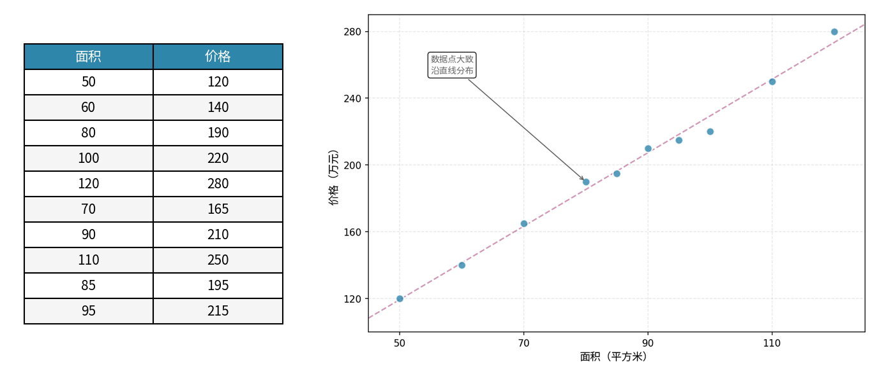
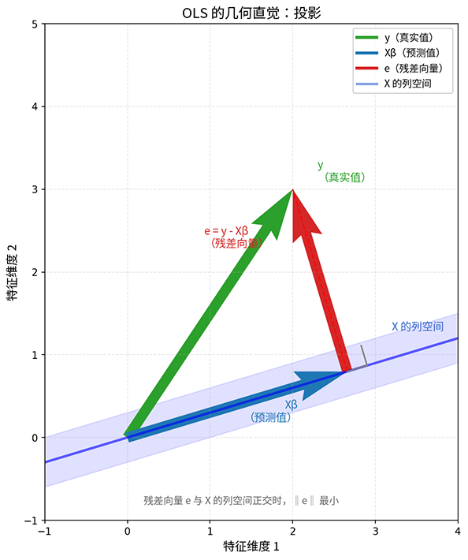

# 线性回归

"回归"（Regression）这个词源于 19 世纪英国统计学家弗朗西斯 · 高尔顿（Francis Galton）的研究。他在分析父子身高数据时发现一个有趣的现象：高个子父亲的孩子，身高往往比父亲略矮；矮个子父亲的孩子，身高往往比父亲略高 —— 子女的身高似乎"回归"向人群的平均水平。高尔顿将这种向均值靠拢的趋势称为"回归现象"。后来，"回归"一词被原来越多的文献所采用，含义也逐渐扩展，不再仅指向均值回归，而是泛指**用数学模型描述变量之间依赖关系的方法**。当我们说**线性回归**（Linear Regression）时，意即用线性函数来刻画输入变量与输出变量之间的定量关系。

如果说[概率统计](../../maths/probability/introduction.md)教会了我们"如何在不确定性中做出决策"，那么线性回归就是这一决策思维最朴素、最直接的实践。它将复杂的世界进行了极大简化，假设纷扰繁杂的现实可以用直线（或[超平面](https://en.wikipedia.org/wiki/Hyperplane)）来描述，尝试采用最朴素的数学结构捕捉变量之间的关系。今天，线性模型之所以能成为许多统计学习教材的"第一课"，不是因为它能力"强大"，恰恰相反，是因为它能力"有限"，有限的能力伴随而来的是有限的复杂度和有限的风险，有限的参数带来了稳健的估计，有限的假设带来了可解释的结果。这些特点构成了线性模型的价值和应用场景：

1. **可解释性**：线性模型的每个系数直接对应一个特征的影响力。系数的绝对值大小告诉我们要"关注什么"，正负号告诉我们"影响方向"。这种直观性在医疗诊断、金融风控等需要解释决策原因的场景中至关重要。
2. **小样本稳健性**：当数据量有限时，复杂模型容易"过度学习"噪声，而线性模型的简单结构反而成为一种保护。20 个样本对于训练一个神经网络毫无意义，但训练一个线性回归模型却可能能给出有价值的初步结论。
3. **计算效率**：线性回归有[闭式解](#线性回归闭式解)（Closed-Form Solution），一次计算即可得到最优解，不需要迭代优化。这种效率使其成为大规模数据处理和实时预测的前置选项。

当然，我们应该一体两面的理性看待事物，线性回归确实有十分明显的局限性：

1. **非线性关系**：现实世界中很多关系并非线性。房价与面积可能存在边际效用递减，用户活跃度与收入可能呈现 S 形曲线。线性模型无法直接捕捉这些非线性模式。
2. **特征交互缺失**：线性模型假设可以用直线描述事实，实际上是架设各特征独立影响结果，所以它无法自动学习特征之间的交互效应。譬如，"高收入+高学历"的组合效应可能远大于两者单独效应之和，线性模型需要人工构造交互特征才能捕捉这类关系。
3. **表达能力有限**：对于图像、语音等高维复杂数据，线性模型的简单结构难以提取有效特征，这正是后来深度学习崛起的根本原因。

理解这些局限并非否定线性回归的价值，线性回归模型看似简单，却蕴含着深刻的力量，常常是探索数据的第一步，是理解其他更复杂模型的基础。今天深度神经网络的许多隐层本质上就是线性变换，线性模型成为了这些复杂模型的构建模块，理解线性回归也是理解深度学习的起点。

## 线性假设

我们从一个具体的例子开始。假设我们收集了某城市 10 套房屋的数据，将面积与价格绘制在 $x$ 轴为面积、$y$ 轴为价格的平面坐标系中，如下图所示。根据生活经验和图中数据，我们可以直观地看到面积越大，房屋价格越高，十个数据点大致沿着面积从小到达，价格从低到高的一条直线分布（这个统计数据是简化过的，没有考虑真实的边际效应）。当我们面对一堆散落在坐标系中的数据点时，凭直觉会自然而然地"画一条线穿过它们"，但计算机如何准确画出这条线？这条线在数学上如何精确地量化出来？



*图：房价与面积散点图*

平面解析几何的直线方程是 $y = \beta_0 + \beta_1 x$，这个例子中 $\beta_0$ 是截距（基准价格），$\beta_1$ 是斜率（每平米价格）。如果 $\beta_0 = 30$，$\beta_1 = 2$，那么直线方程是 $价格 = 30 + 2 \times 面积$，含义是：基准价格 30 万，每平米加 2 万。

我们要找一条直线，确定 $\beta_0$ 和 $\beta_1$ 的具体数值，使得它尽可能地贴近所有数据点。所谓贴近就是真实价格与预测价格之间的差异，让预测值与真实值的误差最小。譬如 50 平米的房屋真实价格 120 万，如果直线预测为 $30 + 2 \times 50 = 130$ 万，则误差为 $120 - 130 = -10$ 万。考虑到预测偏低时误差为正，预测偏高时误差为负。直接相加会相互抵消，无法反映整体贴近程度。因此采用**平方误差**（Mean Squared Error, MSE）来衡量，就是将误差平方后相加，这样所有误差都变成正值，能更好地衡量整体偏离程度。

现实中，房价不会只由面积这一个特征决定，楼层、卧室数量、到学校距离等因素都对最终价格产生影响。将上述思路推广以适应更一般的情况：假设有一组数据 $\{(x_i, y_i)\}_{i=1}^{n}$，其中 $x_i \in \mathbb{R}^d$ 是输入特征向量，$y_i \in \mathbb{R}$ 是输出目标值。线性回归的假设表达为：找到一个超平面 $y_i = \beta_0 + \beta_1 x_{i1} + \beta_2 x_{i2} + \cdots + \beta_d x_{id} + \epsilon_i$ 能够刻画出所有特征到结果的映射关系。

为了书写和运算方便，线性假设一般采用[矩阵向量积](../../maths/linear/matrices.md#矩阵向量积)形式来表示，设 $X$ 为设计矩阵（包含所有样本的特征），$\beta$ 为参数向量，$\epsilon$ 为误差向量：$y = X\beta + \epsilon$，其中：$X = \begin{bmatrix} 1 & x_{11} & \cdots & x_{1 d} \\ 1 & x_{21} & \cdots & x_{2 d} \\ \vdots & \vdots & \ddots & \vdots \\ 1 & x_{n1} & \cdots & x_{nd} \end{bmatrix} \in \mathbb{R}^{n \times (d+1)}$（第一列为全 1，对应截距项，如例子中的基准价格 30 万），$\beta = \begin{bmatrix} \beta_0 \\ \beta_1 \\ \vdots \\ \beta_d \end{bmatrix} \in \mathbb{R}^{d+1}$，$\epsilon_i \sim N(0, \sigma^2)$

## 最小二乘准则

在房价预测的例子里，我们寻找一条直线穿过数据点使得整体误差最小，为避免过高和过低的预测值正负相互抵消，直接选择了各误差项的平方和作为整体误差的定义。不知读到此处是否有人产生过一丝疑惑，要处理正负抵消的方式很多，譬如取绝对值之和，即 $\sum|y_i - \hat{y}_i|$，这也能避免抵消问题，为何一定是取平方和？

答案是有一小部分原因是绝对值函数在零点不可导，优化时需要特殊处理，数学上不够优雅。但采用平方和的处理方式的最大原因还是遵循统计学的经典选择**最小二乘准则**（Ordinary Least Squares, OLS）。"最小二乘"的字面意思就是"最小的平方之和"，"二乘"即二次乘法就是平方。这个方法诞生于天文学领域。十九世纪初，法国数学家勒让德（Adrien-Marie Legendre）面对的是天体观测数据充斥噪声的困境时提出了该准则：既然不知道哪个测量更准，那就让所有测量公平竞争，让所有误差的平方和最小，这样没有一个测量被偏袒，也没有一个被忽视，当时一个朴素的直觉成就了现代统计学的经典。数学家高斯（Carl Friedrich Gauss）也声称他更早就提出过该准则，但因未及时发表，优先权归于勒让德。两人殊途同归的发现恰恰说明最小二乘是一个自然浮现的思想，当我们面对"如何从噪声数据中提取规律"这个问题时，这条路径几乎是最简洁有力的选择。

用数学语言精确描述，OLS 要解决的问题是：找到一组参数 $\beta$，使得以下损失函数最小：

$$L(\beta) = \sum_{i=1}^{n} (y_i - \hat{y}_i)^2 = \sum_{i=1}^{n} (y_i - x_i^T \beta)^2$$

这个公式看似复杂，拆开来看含义很直观：
* $y_i$ 是第 $i$ 个样本的真实值（比如某套房子的真实价格）
* $\hat{y}_i = x_i^T \beta$ 是模型对该样本的预测值，即特征向量 $x_i$ 与参数向量 $\beta$ 的线性组合（回顾[线性假设](#线性假设) $y = X\beta$） 
* $(y_i - \hat{y}_i)^2$ 是该样本的平方误差，衡量"预测偏离了多少"
* $\sum_{i=1}^{n}$ 把所有样本的误差累加，得到整体偏离程度

所以 $L(\beta)$ 的含义就是："模型对所有样本的总偏离程度"。我们的目标是找到使这个总偏离最小的 $\beta$。为了便于运算，将损失函数写成矩阵形式。设残差向量（即每个样本真实值与预测值之差组成的向量） $e = y - X\beta$，则损失函数可以改写为：

$$L(\beta) = e^T e = (y - X\beta)^T(y - X\beta) = ||y - X\beta||^2$$

这个公式展示了矩阵形式的层层递进关系：
* $e = y - X\beta$ 是残差向量，即 $n$ 个样本的误差组成的向量：$e = [e_1, e_2, \ldots, e_n]$，默认为列向量，形状 $n \times 1$，下一步相乘时左乘数要转置成 $1 \times n$ 的行向量，以得到 $1 \times 1$ 的结果。
* 残差平方之和为 $e_1^2 + e_2^2 + \cdots + e_n^2$，这正好是 $e$ 的 [L2 范数](../../maths/linear/vectors.md#向量范数)的平方，也即是 $e^T e$ [向量点积](../../maths/linear/vectors.md#内积与投影)自乘。将残差向量 $e = y - X\beta$ 代入得到 $(y - X\beta)^T(y - X\beta)$。
* 既然 $||y - X\beta||^2$ 是 L2 范数的平方，L2 范数代表的是欧几里得距离，因此损失函数公式的几何意义就是"残差向量的长度平方"。

以上矩阵形式不仅简洁优美，更重要的是揭示了 OLS 的几何本质：**最小化残差向量的长度**。把这个问题放到几何空间中同样直观。假设 $X$ 有 $2$ 列 $n$ 行（$2$ 个特征，$n$ 个样本），那么 $X$ 的所有列向量构成一个二维平面，这就是"列空间"。$y$ 同样是一个向量（$1$ 列 $n$ 行，$1$ 个真实结果，$n$ 个样本），一般不会恰好落在这个平面上（否则意味着完美预测）。我们的目标是：在列空间内找到一个向量 $X\beta$ 让它尽可能接近 $y$。平面外一点到平面的最短距离，是沿着垂直方向到达平面的。换句话说，$y$ 在列空间上的"投影"是最接近它的点。这个投影点就是 $\hat{y} = X\beta$，而 $y$ 到投影点的连线就是残差向量 $e = y - X\beta$。



*图：OLS 的几何直觉——y 在 X 列空间的投影*

上图清晰地展示了三个向量之间的关系，绿色向量 $y$ 是真实值，代表我们观测到的结果；蓝色向量 $X\beta$ 是预测值，落在 $X$ 的列空间内；红色向量 $e$ 是残差，从预测值指向真实值，代表"模型没能解释的部分"。关键洞察在于最小残差向量 $e$ 与列空间**正交**（垂直），只有当残差垂直于列空间时，长度才达到最小，这就像点到平面的最短距离永远是垂直线段。

[投影定理](https://en.wikipedia.org/wiki/Hilbert_projection_theorem)（Projection Theorem）给出了更精确表述：**残差向量 $y - X\beta$ 与 $X$ 的所有列向量正交时，$\beta$ 为最优解**。正交的数学表达是[点积为零](../../maths/linear/vectors.md#内积与投影)，即 $X^T(y - X\beta) = 0$，这正是我们接下来推导闭式解的起点。

## 线性回归闭式解

投影定理告诉我们，线性回归达到最优解的条件是 $X^T(y - X\beta) = 0$。解这个方程，求得：$\hat{\beta} = (X^TX)^{-1}X^Ty$，这就是著名的 **OLS 闭式解公式**。拆开来看它的含义：

* $X^TX$ 是设计矩阵的[自相关矩阵](https://en.wikipedia.org/wiki/Autocorrelation#Matrix)，形状为 $(d+1) \times (d+1)$，包含了特征之间的关联信息，$(X^TX)^{-1}$ 就是自相关矩阵的逆，用于解耦特征之间的相互影响。
* $X^Ty$：特征与目标值的互相关向量，形状 $(d+1) \times 1$，反映了各特征对目标的影响方向。
* 整体公式：将互相关向量用自相关矩阵的逆"矫正"后，得到各特征的权重系数。

闭式解的价值在于**一次矩阵运算直接得到最优解，无需迭代优化**。这与后面要学习的神经网络等需要反复迭代调整参数的方法形成鲜明对比，线性回归的简单结构赋予了它简洁的结构和极高的计算效率。我们用以下代码即实现了 OLS 线性回归，完成了公式到代码的直接转化。

```python runnable
import numpy as np

class LinearRegression:
    """
    手写 OLS 线性回归实现， 
    使用闭式解：β = (X^T X)^(-1) X^T y
    """   
    def __init__(self):
        self.coef_ = None  # 参数向量（不含截距）
        self.intercept_ = None  # 截距
        self.beta_ = None  # 完整参数向量
    
    def fit(self, X, y):
        """
        训练模型
        Parameters:
        X : ndarray, shape (n_samples, n_features)
            特征矩阵
        y : ndarray, shape (n_samples,)
            目标值向量
        """
        # 添加截距列（全 1）
        n_samples = X.shape[0]
        X_augmented = np.column_stack([np.ones(n_samples), X])
        
        # OLS 闭式解：β = (X^T X)^(-1) X^T y
        # 使用 np.linalg.solve 代替直接求逆，更稳定
        XtX = X_augmented.T @ X_augmented
        Xty = X_augmented.T @ y
        
        # 解线性方程组 XtX * β = Xty
        self.beta_ = np.linalg.solve(XtX, Xty)
        
        # 分离截距和系数
        self.intercept_ = self.beta_[0]
        self.coef_ = self.beta_[1:]
        
        return self
    
    def predict(self, X):
        """
        预测
        Parameters:
        X : ndarray, shape (n_samples, n_features)
            特征矩阵
        
        Returns:
        y_pred : ndarray, shape (n_samples,)
            预测值
        """
        return X @ self.coef_ + self.intercept_
    
    def score(self, X, y):
        """
        计算 R² 得分
        R² = 1 - SS_res / SS_tot
        """
        y_pred = self.predict(X)
        ss_res = np.sum((y - y_pred) ** 2)  # 残差平方和
        ss_tot = np.sum((y - np.mean(y)) ** 2)  # 总平方和
        r2 = 1 - ss_res / ss_tot
        return r2

# 生成测试数据
n_samples = 100
n_features = 2

# 真实参数：β_0 = 3, β_1 = 2, β_2 = -1
true_beta = np.array([3, 2, -1])
X = np.random.randn(n_samples, n_features)
noise = np.random.randn(n_samples) * 0.5  # 添加噪声
y = X[:, 0] * 2 + X[:, 1] * (-1) + 3 + noise

# 训练模型
model = LinearRegression()
model.fit(X, y)

# 输出结果
print("真实参数:", true_beta)
print("估计参数:", model.beta_)

# 可视化：预测值与真实值对比
import matplotlib.pyplot as plt
y_pred = model.predict(X)

fig, axes = plt.subplots(1, 2, figsize=(12, 5))

# 左图：真实值 vs 预测值散点图
axes[0].scatter(y, y_pred, alpha=0.6, edgecolors='k', linewidth=0.5)
axes[0].plot([y.min(), y.max()], [y.min(), y.max()], 'r--', lw=2, label='理想拟合线')
axes[0].set_xlabel('真实值')
axes[0].set_ylabel('预测值')
axes[0].set_title('真实值 vs 预测值')
axes[0].legend()
axes[0].grid(True, alpha=0.3)

# 右图：残差分布直方图
residuals = y - y_pred
axes[1].hist(residuals, bins=20, edgecolor='black', alpha=0.7)
axes[1].axvline(x=0, color='r', linestyle='--', lw=2, label='零残差线')
axes[1].set_xlabel('残差 (真实值 - 预测值)')
axes[1].set_ylabel('频数')
axes[1].set_title('残差分布')
axes[1].legend()
axes[1].grid(True, alpha=0.3)

plt.tight_layout()
plt.show()
plt.close()
```

## 本章小结

本章从线性回归的应用场景出发，建立了一个完整的知识链条：**假设 → 准则 → 解法**。线性假设 $y = X\beta + \epsilon$ 简化了世界，将复杂关系压缩为一条直线（或超平面）；最小二乘准则 $\argmin ||y - X\beta||^2$ 为这条直线确立了"最优"的标准，即最小化残差向量的长度；投影定理揭示了 OLS 准则的几何本质：残差正交于列空间，由此导出了闭式解 $\hat{\beta} = (X^TX)^{-1}X^Ty$。

线性回归的真正价值不在于能直接使用它去解决哪些问题，而是许多更复杂的模型都与它一样，共享同一套**从数据中学习规律**的思维范式：先假设一个模型结构（某种关系假设），再定义一个优化准则（什么样的解是"好的"），最后找到最优参数（如何求解）。这套范式贯穿了整个统计学习领域，逻辑回归、支持向量机、神经网络，无一不是这一范式的不同变体。理解线性回归，就是理解了这个范式的起点。

## 练习题

1. 给定设计矩阵 $X = \begin{bmatrix} 1 & 2 \\ 1 & 4 \\ 1 & 6 \end{bmatrix}$ 和目标向量 $y = \begin{bmatrix} 3 \\ 5 \\ 7 \end{bmatrix}$，使用闭式解公式 $\hat{\beta} = (X^TX)^{-1}X^Ty$ 计算回归系数，并写出最终的回归方程。
    <details>
    <summary>参考答案</summary>
    第一步：计算 $X^TX$
    $$X^TX = \begin{bmatrix} 1 & 1 & 1 \\ 2 & 4 & 6 \end{bmatrix} \begin{bmatrix} 1 & 2 \\ 1 & 4 \\ 1 & 6 \end{bmatrix} = \begin{bmatrix} 3 & 12 \\ 12 & 56 \end{bmatrix}$$

    第二步：计算 $(X^TX)^{-1}$
    $$|X^TX| = 3 \times 56 - 12 \times 12 = 168 - 144 = 24$$
    $$\begin{bmatrix} 3 & 12 \\ 12 & 56 \end{bmatrix}^{-1} = \frac{1}{24}\begin{bmatrix} 56 & -12 \\ -12 & 3 \end{bmatrix} = \begin{bmatrix} 7/3 & -1/2 \\ -1/2 & 1/8 \end{bmatrix}$$

    第三步：计算 $X^Ty$
    $$X^Ty = \begin{bmatrix} 1 & 1 & 1 \\ 2 & 4 & 6 \end{bmatrix} \begin{bmatrix} 3 \\ 5 \\ 7 \end{bmatrix} = \begin{bmatrix} 15 \\ 68 \end{bmatrix}$$

    第四步：计算 $\hat{\beta}$
    $$\hat{\beta} = \begin{bmatrix} 7/3 & -1/2 \\ -1/2 & 1/8 \end{bmatrix} \begin{bmatrix} 15 \\ 68 \end{bmatrix} = \begin{bmatrix} 35 - 34 \\ -7.5 + 8.5 \end{bmatrix} = \begin{bmatrix} 1 \\ 1 \end{bmatrix}$$

    因此回归方程为：$\hat{y} = 1 + 1 \cdot x = 1 + x$

    验证：当 $x=2$ 时，$\hat{y}=3$；当 $x=4$ 时，$\hat{y}=5$；当 $x=6$ 时，$\hat{y}=7$。预测值与真实值完全吻合，说明数据点恰好落在一条直线上，模型完美拟合。
    </details>

1. 解释为什么最小二乘准则采用"误差平方和"而非"误差绝对值之和"作为损失函数。从数学优化和统计推断两个角度说明。
    <details>
    <summary>参考答案</summary>

    **数学优化角度**：

    平方函数 $f(x) = x^2$ 在所有点（包括零点）都可导，这使得我们可以使用梯度下降、牛顿法等基于导数的优化算法。而绝对值函数 $|x|$ 在零点不可导，优化时需要特殊处理（如次梯度方法），数学上不够优雅，计算也更复杂。此外，平方损失函数是凸函数，有唯一全局最优解；而绝对值损失虽也是凸函数，但在最优解附近可能有一段"平坦区域"，求解不如平方损失精确。

    **统计推断角度**：

    假设误差 $\epsilon_i \sim N(0, \sigma^2)$（服从正态分布），则最大化似然函数等价于最小化误差平方和。换言之，最小二乘准则与正态分布假设下的最大似然估计是一致的。

    正态分布是自然界最常见的分布形态，许多随机现象（如测量误差、生物特征）都近似服从正态分布。因此最小二乘准则不仅是数学上的便利选择，更具有统计理论的支持。
    </details>

1. 给出方程 $X^T(y - X\beta) = 0$ 求 $\beta$ 的过程。
    <details>
    <summary>参考答案</summary>
    根据矩阵乘法满足分配率，从 $X^T(y - X\beta) = 0$ 得到 $X^Ty - X^TX\beta = 0$，移项得 $X^TX\beta = X^Ty$。

    注意到 $X^TX$ 是一个 $(d+1) \times (d+1)$ 的方阵，当它可逆（即 $X$ 列满秩，各特征之间线性无关）时，两边同乘逆矩阵：

    $$\hat{\beta} = (X^TX)^{-1}X^Ty$$
    </details>

1. 在房价预测场景中，假设我们收集了 5 套房屋的数据：面积（平方米）和价格（万元）分别为 $(60, 120)$、$(80, 160)$、$(100, 200)$、$(120, 230)$、$(150, 280)$。请用代码实现线性回归，计算每平米价格和基准价格，并预测一套 90 平米房屋的价格。
    <details>
    <summary>参考答案</summary>

    ```python runnable
    import numpy as np

    # 数据准备
    X = np.array([60, 80, 100, 120, 150])  # 面积
    y = np.array([120, 160, 200, 230, 280])  # 价格

    # 构造设计矩阵（添加截距列）
    n = len(X)
    X_augmented = np.column_stack([np.ones(n), X])

    # OLS 闭式解
    XtX = X_augmented.T @ X_augmented
    Xty = X_augmented.T @ y
    beta = np.linalg.solve(XtX, Xty)

    print(f"基准价格（截距）: {beta[0]:.2f} 万元")
    print(f"每平米价格（斜率）: {beta[1]:.2f} 万元/平米")

    # 预测 90 平米的房屋
    price_90 = beta[0] + beta[1] * 90
    print(f"90 平米房屋预测价格: {price_90:.2f} 万元")
    ```

    **注意**：由于数据点不完全落在一条直线上（$120$ 平米房屋价格 $230$ 万偏离了线性趋势），模型拟合存在一定误差。这体现了线性回归"近似拟合"是找到一条尽可能贴近所有点的直线，而非强行穿过每个点。
    </details>

1. 解释"线性假设"的含义，并讨论以下场景是否适合使用线性回归：(a) 股票价格预测；(b) 温度与冰淇淋销量关系；(c) 用户年龄与社交软件使用时长关系。对不适合的情况提出改进思路。
    <details>
    <summary>参考答案</summary>

    **线性假设的含义**：

    线性假设 $y = X\beta + \epsilon$ 核心有两点：
    1. **关系线性**：输入特征的加权组合（加截距）决定输出，无非线性交互
    2. **误差独立同分布**：$\epsilon_i \sim N(0, \sigma^2)$，误差服从正态分布，相互独立

    **场景分析**：

    (a) **股票价格预测**：不适合。股票价格受多种复杂因素影响，且具有明显的非线性特征（如边际效应、市场情绪波动）。此外，股票序列具有时间相关性，误差不独立。改进思路：使用时间序列模型（如 ARIMA、LSTM）或引入非线性特征。

    (b) **温度与冰淇淋销量**：基本适合。温度升高，销量大致线性增加。但需注意：极高温天气可能导致销量下降（人们不愿外出），存在非线性拐点。改进思路：可用分段线性回归，或引入温度的二次项捕捉非线性。

    (c) **用户年龄与社交软件使用时长**：不适合。年轻人使用时间长，中年人适中，老年人较少，呈现倒 U 型或阶梯型关系，而非线性。改进思路：引入年龄的二次项（$y = \beta_0 + \beta_1 \cdot 年龄 + \beta_2 \cdot 年龄^2$），或按年龄段分组分析。

    **总结**：线性回归的适用前提是"关系近似线性、误差独立正态"。违背这些假设时，可通过特征变换、引入交互项、使用其他模型等方式改进。理解假设的边界，是正确应用模型的前提。
    </details>