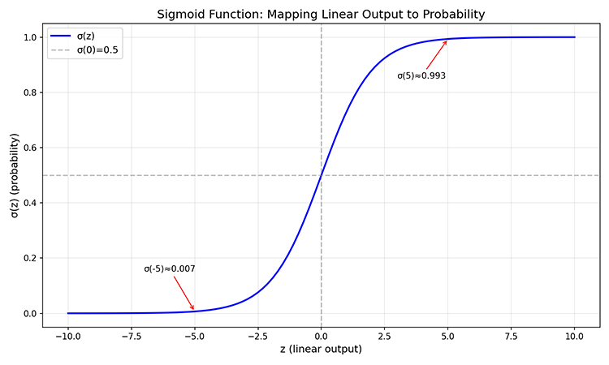
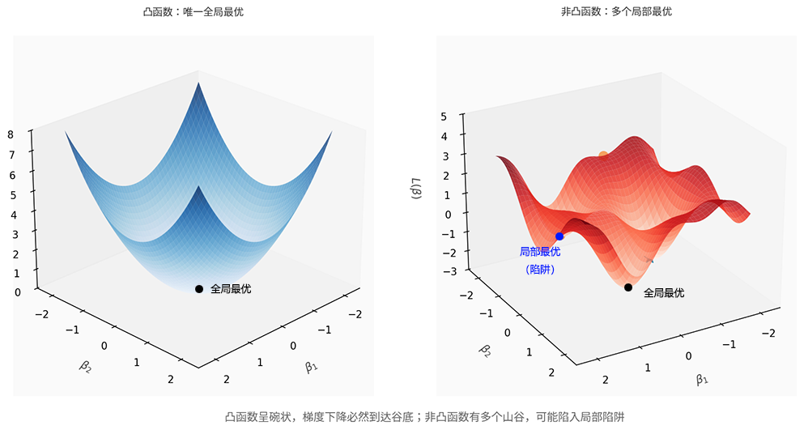

# 逻辑回归

十九世纪，统计学家发现人口统计中的 Logistic 函数天然具备能够将任意实数映射到 $(0,1)$ 区间的特性，可作为概率的数学表达，于是使用这个函数，以概率值的回归来描述分类问题，**逻辑回归**（Logistic Regression）这个名字由此诞生，虽然"逻辑回归"这种被称为回归却解决的是分类问题的命名方式一直被人所诟病，但经过百年使用，已经广泛流传开来，成了监督学习中一个"名不副实"的 BUG。一般来讲，在监督学习中，根据任务结果的输出类型，任务可分为两大类：

- **回归任务（Regression）**：预测连续数值输出。目标是估计一个具体的数值，如房价预测（输出为具体金额）、温度预测（输出为具体温度值）。回归任务的输出空间是连续的实数域，模型追求"预测值尽可能接近真实值"。
- **分类任务（Classification）**：预测离散类别标签。目标是判断样本属于哪个类别，如邮件分类（垃圾邮件或正常邮件）、疾病诊断（患病或健康）。分类任务的输出空间是有限的离散集合，模型追求"判断正确与否"。

逻辑回归用线性函数构建决策基础，再通过 Sigmoid 函数将线性输出转换为概率，最终用概率阈值做出分类判断。这种"回归思想解决分类问题"的设计，体现了概率思维如何弥合数值预测与类别判断之间的鸿沟，也为后续神经网络（其输出层本质上就是逻辑回归）奠定了基础。

逻辑回归继承了线性模型的优点，同样具备可解释性，每个系数对应一个特征的影响力，正负号表示"促进还是抑制"，数值大小表示"影响强弱"。譬如在客户流失预测中，"投诉次数"的系数为正，意味着投诉越多流失风险越高；"活跃度"的系数为负，意味着活跃度越高流失风险越低。这种直观性使其在医疗诊断、金融风控等需要解释决策原因的场景中备受青睐。同时，逻辑回归对小样本数据也有较好的稳健性，当数据量有限时，复杂模型容易过度学习噪声，而逻辑回归的简单结构反而成为一种保护。当然，作为线性模型，逻辑回归也有明显局限：

1. **线性决策边界**：逻辑回归本质上是线性模型经过 Sigmoid 变换，其决策边界仍是一条直线（或超平面）。当两类数据呈现非线性分布（如环形、月牙形）时，逻辑回归无法有效分类，需要引入特征变换或核技巧。

2. **特征交互缺失**：与线性回归一样，逻辑回归假设各特征独立影响结果，无法自动学习特征之间的交互效应。譬如"高收入 + 高学历"的组合效应可能远大于两者单独效应之和，逻辑回归需要人工构造交互特征才能捕捉这类关系。

3. **对不平衡数据敏感**：当某一类样本占比极高（如 99% 的邮件都是正常邮件，只有 1% 是垃圾邮件），逻辑回归倾向于将所有样本预测为多数类，少数类的识别能力极差。需要通过调整阈值、加权损失或采样策略来缓解。

## 回归与分类的界限

我们通过一个具体例子，结合前文接触过的[线性回归](linear-regression.md)来理解回归任务与分类任务之间界限，用以回答为何线性回归无法直接解决分类问题。考虑一个简化的邮件分类场景：预测邮件是否为垃圾邮件（标签 1 表示垃圾邮件，标签 0 表示正常邮件）。假设特征 $x$ 表示"可疑关键词出现次数"，我们收集到以下数据：

| 邮件编号 | 可疑关键词次数 ($x$) | 标签 ($y$) |
|:--------:|:-------------------:|:----------:|
| 1 | 2 | 0 |
| 2 | 5 | 0 |
| 3 | 8 | 1 |
| 4 | 12 | 1 |

首先，尝试用线性回归来拟合数据，通过 [OLS 闭式解](linear-regression.md#线性回归闭式解)得到方程 $\hat{y} = 0.1x - 0.3$。再假设 $\hat{y}$ 超过阈值 0.5 就是垃圾邮件，否则视为正常邮件。现在使用该方程对下面 3 份新邮件进行预测：

- 邮件 A：可疑关键词出现 3 次，预测值 $\hat{y} = 0.1 \times 3 - 0.3 = 0$，判断为正常邮件 ✓
- 邮件 B：可疑关键词出现 7 次，预测值 $\hat{y} = 0.1 \times 7 - 0.3 = 0.4$，判断为正常邮件（$0.4 < 0.5$）？
- 邮件 C：可疑关键词出现 20 次，预测值 $\hat{y} = 0.1 \times 20 - 0.3 = 1.7$，判断为垃圾邮件（$1.7 > 0.5$） ✓

现在问题立即显现了，邮件 B 的预测值 0.4 处于"灰色地带"，既不完全接近 0，也不接近 1，能判断这就是正常邮件？邮件 C 的问题更大，预测值 1.7 甚至超出了标签的取值范围 $\{0, 1\}$，这个"1.7"是什么意思？邮件垃圾无以复加以至模型吐槽它是垃圾的概率超过 100% 吗？由此可见，线性回归模型输出 $y = X\beta$ 可能是任意实数，使用阈值将实数分段，直接用线性回归来做二分类任务会带来诸多混乱问题：

1. **输出无界**。线性回归输出可以是任意值，如 $y = -10$ 或 $y = 100$。当真实标签为 1，模型输出为 100 时，虽然阈值判断正确（$100 \geq 0.5$），但这个输出无法解释为"概率"。概率的数学定义要求值域在 $(0,1)$ 之间，100 这个数字在概率语境下毫无意义。

2. **损失函数不合理**。线性回归使用平方损失 $(y - \hat{y})^2$。当真实标签为 1，模型输出为 100 时，平方损失计算 $(1 - 100)^2 = 9801$，这是一个极大的惩罚值。但事实上，模型已经做出了正确判断（预测为类别 1），不应该被如此严厉惩罚。平方损失的数学性质与分类任务的语义逻辑存在内在冲突。

3. **对异常值敏感**。假设数据集中有几个极端样本，真实标签为 1，但特征值异常大（譬如有样本的可疑关键词次数高达 100 次）。线性回归会为了"贴近"这些极端值，显著调整参数，可能导致决策边界整体偏移，影响对正常样本的分类准确性。

这些问题的根源在于线性回归假设输出是连续数值，追求"预测值接近真实值"；而分类任务需要的是"判断正确与否"，两者的目标函数不匹配，不能简单通过阈值解决。逻辑回归通过引入 Sigmoid 函数，才从根本上解决了这个不匹配问题。

## Sigmoid 函数

Sigmoid 函数（也即是前文提到的 Logistic 函数）定义为：$\sigma(z) = \frac{1}{1 + e^{-z}} = \frac{e^z}{1 + e^z}$，其图像是一条 S 形曲线，正因如此，被称为"Sigmoid"函数（希腊语中 Sigmoid 意为"像 Sigma 的形状"，$\sigma$ 的曲线形态），如下图所示：



*图：Sigmoid 函数的 S 形曲线*

这条曲线最早用于描绘人口增长模型，当人口较少时，增长缓慢（函数左端趋于 0）；当人口适中时，增长加速（函数中段斜率最大）；当人口接近环境承载上限时，增长趋于饱和（函数右端趋于 1）。后来，统计学家发现 Sigmoid 函数有如下几个关键性质，使其成为概率建模的理想选择：

1. **值域 $(0,1)$**：输出严格限制在 0 到 1 之间，且两端渐近但不达到边界，可以完美解释为概率区间。
2. **单调递增**：输入越大，输出越接近 1，符合"越满足条件，概率越高"的直觉。
3. **中心点 $\sigma(0) = 0.5$**：当输入为 0 时，输出为 0.5，表示"完全不确定"。
4. **导数简洁**：$\sigma'(z) = \sigma(z)(1-\sigma(z))$，这一性质在梯度计算中带来很大便利。

上述四点从 Sigmoid 的函数图像中都可以轻易得到：Sigmoid 曲线最陡峭的部分在 $z=0$ 处，此时 $\sigma(0) = 0.5$，导数 $\sigma'(0) = 0.5 \times 0.5 = 0.25$ 达到最大值。当 $z$ 趋向两端时，曲线趋于平坦，导数趋于 0。这个性质意味着：当预测结果"不确定"时（概率接近 0.5），模型对参数变化最敏感；当预测结果"确定"时（概率接近 0 或 1），模型对参数变化不敏感，即"已做出判断，不再轻易动摇"。

不过，上述四点的前提反而不能简单从 Sigmoid 的函数图像中找到答案：凭什么认为 $\sigma(z)$ 代表事件发生的概率，而不是某种随意的数值映射？这个问题的答案要在 Sigmoid 函数的反函数（交换自变量和因变量身份得到的函数）中才容易看清楚。设 Sigmoid 输出为 $p = \sigma(z)$，其反解为 $z = \log\frac{p}{1-p}$。右边这个表达式 $\log\frac{p}{1-p}$ 在统计学中有个专门的名字：**对数几率**（$\log odds$）。要解释什么是对数几率，需先从 **$odds$（几率）** 这个概念说起。

设事件发生概率为 $p$，$odds$ 定义为发生与不发生概率之比：$odds = \frac{p}{1-p}$，几率这个概念在日常生活中很常见。譬如预测下雨概率 $p = 0.8$，则 $odds = 0.8/0.2 = 4$，我们常说"下雨的可能性是不下雨的 4 倍"；预测比赛胜率 $p = 0.25$，则 $odds = 0.25/0.75 = 1/3$，常说"胜算只有三分之一"。$odds$ 把概率转化为"倍数关系"，更直观地表达事件发生的相对强度。

$odds$ 的取值范围是 $(0, +\infty)$，当 $p$ 接近 1 时，$odds$ 趋于无穷大，当 $p$ 接近 0 时，$odds$ 趋于 0。这个不对称的范围给数学处理带来不便。取对数后得到了对数几率（$\log odds = \log\frac{p}{1-p}$），这个变换将 $odds$ 的范围 $(0, +\infty)$ 映射到实数域 $(-\infty, +\infty)$，且关系是单调递增的，$p$ 越大，$\log odds$ 也越大；$p = 0.5$ 时，$\log odds = \log 1 = 0$；$p > 0.5$ 时，$\log odds > 0$；$p < 0.5$ 时，$\log odds < 0$。

现在回到 Sigmoid 的反函数 $z = \log\frac{p}{1-p}$，很容易发现关键联系：**Sigmoid 函数的输入 $z$ 恰好是概率 $p$ 的对数几率**。换言之：

$$p = \sigma(z) = \sigma(\log\frac{p}{1-p})$$

这意味着，如果我们让线性模型 $X\beta$ 的输出表示"对数几率"，那么通过 Sigmoid 变换后，$\sigma(X\beta)$ 自然就是事件发生的概率。这个发现揭示了逻辑回归的设计思想：逻辑回归分为决策和输出两个部分，决策部分仍然是线性的 $X\beta$，代表从样本学习到的对数几率（一个无界的实数值，适合线性模型处理）。输出部分通过 Sigmoid 变换 $\sigma$，将对数几率"翻译"回概率（一个有界的 $(0,1)$ 值，满足概率的数学约束）。这种设计巧妙地弥合了线性回归与分类任务之间的界限，线性回归擅长预测无界实数，分类任务需要有界概率，中间的桥梁就是对数几率。线性模型预测对数几率，Sigmoid 函数完成最后的"翻译"工作。

## 逻辑回归优化准则

现在我们已经解决了"概率输出"的问题，Sigmoid 函数将线性模型的输出映射到 $(0,1)$ 区间，且预测结果可以解释为"事件发生的概率"。但这也只完成了一半的工作，有了预测概率 $\hat{p}$，还需要一个标准来衡量预测的结果是否准确，这就是损失函数要解决的问题了。

经过前文对[最小二乘准则](linear-regression.md#最小二乘准则)的推导，损失函数的定义我们已经知晓：给定真实标签 $y$ 和预测值 $\hat{y}$，损失函数 $L(y, \hat{y})$ 量化"预测偏离真实程度"。损失越小，预测越准确。在线性回归中，我们使用平方损失 $(y - \hat{y})^2$，在逻辑回归中平方损失还能否继续沿用？

直觉上，平方损失似乎也能适用于分类任务：真实标签为 $1$，预测概率为 $0.8$，损失 $(1-0.8)^2 = 0.04$；真实标签为 $0$，预测概率为 $0.3$，损失 $(0-0.3)^2 = 0.09$。似乎也能满足预测越接近真实标签，损失越小的要求。但是，平方损失在逻辑回归的损失函数最小化过程中将遇到非常大的阻碍。回想线性回归我们是如何最小化损失函数的 —— 直接从 OLS 闭式解公式解出最优的参数 $\hat{\beta} = (X^TX)^{-1}X^Ty$，不需要迭代优化。闭式解存在的前提在于线性回归的损失函数 $L(\beta) = (y - X\beta)^2$ 对 $\beta$ 是二次函数，求导后令梯度为零，得到线性方程组 $X^TX\beta = X^Ty$，可直接解出 $\beta$。

逻辑回归却无法享受这种一步到位的便利。预测值 $\hat{y} = X\beta$ 是线性的，预测概率 $\hat{p} = \sigma(X\beta)$ 中的 Sigmoid 函数却是非线性的，这使得损失函数 $L(\beta) = (y - \sigma(X\beta))^2$ 对 $\beta$ 不再是简单的二次函数，求导后无法得到可解的线性方程组，闭式解不存在。因此，逻辑回归只能采用迭代优化方法求数值解。回顾数学基础部分，[梯度](../../maths/calculus/gradient.md#梯度)的本质是函数增长最快的方向，所以负梯度方向可作为指导模型最小化损失函数的导航，从某个初始参数出发，沿着负梯度方向逐步调整，直至梯度为零时，损失函数收敛到最小值。这种方法称为**梯度下降**（Gradient Descent）。

现在，平方损失的问题开始暴露出来了。要计算损失函数对参数 $\beta$ 的梯度，必须运用**链式法则**（Chain Rule），因为参数 $\beta$ 与损失函数 $L$ 之间存在一个"中间商"：预测概率 $\hat{p}$。梯度传递的路径是：

$$L \xrightarrow{\frac{\partial L}{\partial \hat{p}}} \hat{p} \xrightarrow{\frac{\partial \hat{p}}{\partial z}} z \xrightarrow{\frac{\partial z}{\partial \beta}} \beta$$

换言之，损失函数不直接依赖于参数 $\beta$，而是通过 $z = X\beta$ 和 $\hat{p} = \sigma(z)$ 间接影响。根据[链式法则](../../maths/calculus/gradient.md#复合函数与链式法则)，梯度需要逐层传递：

$$\frac{\partial L}{\partial \beta} = \frac{\partial L}{\partial \hat{p}} \cdot \frac{\partial \hat{p}}{\partial z} \cdot \frac{\partial z}{\partial \beta}$$

逐项计算这三个导数：

1. **损失对概率的导数**：平方损失 $L = (y - \hat{p})^2$ 对 $\hat{p}$ 求导，得到 $\frac{\partial L}{\partial \hat{p}} = 2(\hat{p} - y)$

2. **概率对中间值的导数**：预测概率 $\hat{p} = \sigma(z)$ 对 $z$ 求导，利用 Sigmoid 的导数性质 $\sigma'(z) = \sigma(z)(1-\sigma(z))$，得到 $\frac{\partial \hat{p}}{\partial z} = \hat{p}(1-\hat{p})$

3. **中间值对参数的导数**：线性部分 $z = X\beta$ 对 $\beta$ 求导，得到 $\frac{\partial z}{\partial \beta} = X$

将这三项相乘，平方损失对参数 $\beta$ 的梯度为：

$$\nabla_\beta L = 2(\hat{p} - y) \cdot \hat{p}(1-\hat{p}) \cdot X$$

这个式子揭示了一个平方误差带来的悖论：当模型预测接近正确边界（$\hat{p}$ 接近 0 或 1）时，因子 $\hat{p}(1-\hat{p})$ 接近 0，梯度趋于消失。换言之，**模型越是"自信地做出正确判断"，学习动力反而越弱**。设想一个极端场景：真实标签为 1，当前预测概率 $\hat{p} = 0.01$（极大的错误概率）。此时梯度却为 $2(1-0.01) \times 0.01(1-0.01) \approx 0.02$，学习信号极微弱。模型明明犯了严重错误，却因为 Sigmoid 的"挤压效应"而几乎无法从错误中学习。这与分类任务的学习逻辑背反，越是预测错误，学习动力应该越强，而非越弱。



*图：凸函数与非凸函数图像*

此外，引入 Sigmoid 后，平方损失变成**非凸函数**。如上图所示，线性回归的平方损失是凸函数，有唯一全局最优解，优化过程必然收敛到最优参数。但 Sigmoid 的非线性变换使得 $(y - \sigma(X\beta))^2$ 的曲面可能出现多个"山峰"和"山谷"，梯度下降可能陷入局部最优，无法找到最佳参数。这与线性回归的"一路下山直达谷底"截然不同。梯度消失与非凸优化这两个严重问题，使得平方损失与分类任务的内在逻辑存在根本冲突。我们需要寻找一个能适配分类任务的损失函数。

## 交叉熵损失

不妨从统计学的基本视角出发寻找适配分类任务的损失函数。分类问题都可以建模为[伯努利分布](../../maths/probability/probability-basics.md#伯努利分布)：每个样本标签 $y_i$ 是一次伯努利试验的结果，要么发生（$y_i=1$）要么不发生（$y_i=0$），发生概率记为 $p_i$。伯努利分布的概率公式为：

$$P(y_i) = p_i^{y_i}(1-p_i)^{1-y_i}$$

这个公式的巧妙之处在于：当 $y_i=1$ 时，概率就是 $p_i$；当 $y_i=0$ 时，概率就是 $1-p_i$。一个公式同时覆盖两种情况，不需要分支判断。假设样本相互独立，所有样本的联合似然（即同时观察到这组标签的概率）为各样本概率的乘积：

$$L(\beta) = \prod_{i=1}^{n} p_i^{y_i}(1-p_i)^{1-y_i}$$

在介绍统计推断时，我们知道了[最大似然估计](../../maths/probability/statistical-inference.md#最大似然估计-mle)的核心思想是找到参数 $\beta$，使得观察到当前数据集的概率最大。我们希望模型输出的概率 $p_i$ 与真实标签 $y_i$ 高度吻合，对于标签为 1 的样本，$p_i$ 应该大；对于标签为 0 的样本，$p_i$ 应该小，这与分类任务的直觉完全一致。按照最大似然估计的处理流程，先取对数将乘法转为加法，得到对数似然函数：

$$\log L(\beta) = \sum_{i=1}^{n} [y_i \log p_i + (1-y_i)\log(1-p_i)]$$

接下来做两个数学处理。按照机器学习中的习惯，优化损失函数通常是指"让损失最小化"，所以这里添加负号，让最大化对数似然等价于最小化**负**对数似然。此外，除以样本数 $n$ 取平均，使得损失值不随数据规模波动，具有"平均每个样本损失"的直观含义，添加常数因子 $1/n$ 不改变最优解的位置，但能让梯度更稳定：

$$J(\beta) = -\frac{1}{n}\sum_{i=1}^{n} [y_i \log p_i + (1-y_i)\log(1-p_i)]$$

经过这两个变换后得到的结果被称为**交叉熵损失**（Cross-Entropy Loss），它就是在逻辑回归中使用的损失函数，其中 $p_i = \sigma(X_i\beta)$。交叉熵这个名字来源于信息论，衡量两个概率分布之间的差异程度，但推导过程完全来自统计学最大似然原则，数学与直觉在此达成完美统一。

## 梯度下降优化实践

现在，我们将平方误差损失替换成交叉熵损失，重新按照[逻辑回归优化准则](#逻辑回归优化准则)来走一遍最优化流程。梯度的传递路径依然是：

$$J \xrightarrow{\frac{\partial J}{\partial p}} p \xrightarrow{\frac{\partial p}{\partial z}} z \xrightarrow{\frac{\partial z}{\partial \beta}} \beta$$

逐项计算这三个导数：

1. **损失对概率的导数**：单个样本的交叉熵损失 $J_i = -[y_i \log p_i + (1-y_i)\log(1-p_i)]$。对 $p_i$ 求导时，数据 $y_i$ 有两种取值情况，当 $y_i = 1$ 时，交叉熵损失后半部分为零，简化为 $-y_i \log p_i$，导数为 $-\frac{1}{p_i}$；当 $y_i = 0$ 时，交叉熵损失前半部分为零，简化为 $-\log(1-p_i)$，导数为 $\frac{1}{1-p_i}$。将两种情况合并，得到导数：$\frac{\partial J_i}{\partial p_i} = -\frac{y_i}{p_i} + \frac{1-y_i}{1-p_i}$

2. **概率对中间值的导数**：与前文完全相同，利用 Sigmoid 的导数性质 $\sigma'(z) = \sigma(z)(1-\sigma(z))$，得到 $\frac{\partial p_i}{\partial z_i} = p_i(1-p_i)$。

3. **中间值对参数的导数**：与前文完全相同，线性部分 $z_i = X_i\beta$ 对 $\beta$ 求导，得到 $\frac{\partial z_i}{\partial \beta} = X_i$。

将三项相乘，得到交叉熵损失对参数 $\beta$ 的梯度为：

$$\frac{\partial J_i}{\partial \beta} = \left(-\frac{y_i}{p_i} + \frac{1-y_i}{1-p_i}\right) \cdot p_i(1-p_i) \cdot X_i$$

初看起来，这个式子很复杂，但只要展开括号内的表达式：

$$\frac{\partial J_i}{\partial \beta} = \left(-\frac{y_i}{p_i} + \frac{1-y_i}{1-p_i}\right) \cdot p_i(1-p_i) = -y_i \cdot \frac{1}{p_i} \cdot p_i(1-p_i) + (1-y_i) \cdot \frac{1}{1-p_i} \cdot p_i(1-p_i)$$

观察每一项，$p_i$ 和 $\frac{1}{p_i}$ 相乘得到 $1$，$(1-p_i)$ 和 $\frac{1}{1-p_i}$ 相乘也得到 $1$，分子分母完美抵消，这正是交叉熵损失设计精妙之处。简化后得到十分优雅的结果：

$$\frac{\partial J_i}{\partial \beta} = (p_i - y_i) X_i$$

最后，对所有样本求平均，便得到完整的梯度向量：

$$\nabla_\beta J = \frac{1}{n}\sum_{i=1}^{n} (p_i - y_i) X_i = \frac{1}{n}X^T(p - y)$$

梯度中 $(p_i - y_i)$ 表示预测概率与真实标签的偏差，当预测准确时（$p_i \approx y_i$），梯度接近 0，参数不再调整；当预测错误时（如 $y_i=1$ 但 $p_i=0.3$），梯度为正值，引导参数增加 $X_i\beta$ 的输出，从而提高 $p_i$。与平方损失的梯度消失问题形成对比，交叉熵损失的梯度 $(p_i - y_i)$ 在预测错误时始终有显著值，学习速度不受 $\hat{p}$ 位置影响。这正是分类任务需要的性质：越是预测错误，学习动力越强；越是预测正确，学习动力越弱。

有了梯度公式后，就可以按梯度下降算法的标准步骤，重复迭代更新参数，直至损失收敛（梯度接近 0）或达到最大迭代次数：

1. **正向传播**：用当前参数 $\beta$ 计算预测概率 $p = \sigma(X\beta)$。
2. **计算梯度**：根据公式 $\nabla_\beta J = \frac{1}{n}X^T(p - y)$ 计算出梯度值。
3. **参数更新**：沿负梯度方向调整参数 $\beta^` = \beta - \alpha \nabla_\beta J$，其中 $\alpha$ 为学习率。

其中，学习率 $\alpha$ 控制每步参数调整的幅度，太大可能跨过最优解导致震荡，太小则收敛缓慢。实际应用中，通常通过实验调参选择合适的学习率。

下面的代码使用 NumPy 从零实现一个完整的逻辑回归模型。代码将前文推导的数学公式转化为可运行的程序：`sigmoid` 函数实现 Sigmoid 变换，`cross_entropy_loss` 函数计算交叉熵损失，`fit` 方法执行梯度下降迭代优化。整个实现过程展示了理论推导与工程实践之间的映射关系。

```python runnable extract-class="LogisticRegression"
import numpy as np

class LogisticRegression:
    """
    手写逻辑回归实现
    使用梯度下降优化交叉熵损失
    """   
    def __init__(self, learning_rate=0.1, n_iterations=1000):
        self.lr = learning_rate           # 学习率，控制梯度下降的步长
        self.n_iterations = n_iterations  # 迭代次数，梯度下降的最大迭代轮数
        self.coef_ = None                 # 特征系数（权重），训练后保存
        self.intercept_ = None            # 截距项，训练后保存
        self.loss_history = []            # 损失历史记录，用于可视化收敛过程，后续可视化
    
    def sigmoid(self, z):
        """Sigmoid 函数"""
        z = np.clip(z, -500, 500)
        return 1 / (1 + np.exp(-z))
    
    def cross_entropy_loss(self, y, p):
        """交叉熵损失"""
        # 避免 log(0)
        eps = 1e-15
        p = np.clip(p, eps, 1 - eps)
        return -np.mean(y * np.log(p) + (1 - y) * np.log(1 - p))
    
    def fit(self, X, y):
        """
        训练模型（梯度下降）
        
        Parameters:
        X : ndarray, shape (n_samples, n_features)
            特征矩阵
        y : ndarray, shape (n_samples,)
            标签向量 (0 或 1)
        """
        n_samples, n_features = X.shape
        
        # 初始化参数
        self.coef_ = np.zeros(n_features)
        self.intercept_ = 0
        
        # 梯度下降迭代
        for i in range(self.n_iterations):
            # 计算预测概率
            z = X @ self.coef_ + self.intercept_
            p = self.sigmoid(z)
            
            # 记录损失
            self.loss_history.append(self.cross_entropy_loss(y, p))
            
            # 计算梯度（交叉熵损失的简洁梯度）
            gradient_coef = (1 / n_samples) * (X.T @ (p - y))
            gradient_intercept = (1 / n_samples) * np.sum(p - y)
            
            # 更新参数
            self.coef_ -= self.lr * gradient_coef
            self.intercept_ -= self.lr * gradient_intercept
        
        return self
    
    def predict_proba(self, X):
        """预测概率"""
        z = X @ self.coef_ + self.intercept_
        return self.sigmoid(z)
    
    def predict(self, X, threshold=0.5):
        """预测类别"""
        proba = self.predict_proba(X)
        return (proba >= threshold).astype(int)
    
    def score(self, X, y):
        """计算准确率"""
        y_pred = self.predict(X)
        return np.mean(y_pred == y)

# 测试：生成二分类数据
n_samples = 200

# 两个特征
X = np.random.randn(n_samples, 2)

# 真实决策边界：x1 + x2 > 0 为类别 1
y = (X[:, 0] + X[:, 1] > 0).astype(int)

# 训练模型
model = LogisticRegression(learning_rate=0.1, n_iterations=1000)
model.fit(X, y)

print("=== 逻辑回归结果 ===")
print(f"系数: {model.coef_}")
print(f"截距: {model.intercept_:.4f}")
print(f"训练准确率: {model.score(X, y):.3f}")
print(f"最终损失: {model.loss_history[-1]:.4f}")

# 预测示例
print("\n预测示例:")
test_samples = np.array([[1, 1], [-1, -1], [0.5, -0.3]])
proba = model.predict_proba(test_samples)
pred = model.predict(test_samples)
for i, (sample, p, label) in enumerate(zip(test_samples, proba, pred)):
    print(f"样本 {i+1}: {sample}, 预测概率 = {p:.4f}, 预测类别 = {label}")

# 可视化：损失收敛过程
import matplotlib.pyplot as plt

plt.figure(figsize=(10, 5))
plt.plot(model.loss_history)
plt.xlabel('迭代次数')
plt.ylabel('交叉熵损失')
plt.title('逻辑回归训练过程：损失收敛')
plt.grid(True, alpha=0.3)
plt.show()
plt.close()
```

## 多分类扩展：Softmax 回归

逻辑回归的理论基础是伯努利分布，只能解决二分类问题。当类别超过两类时（如邮件分为"正常、垃圾、可疑"三类），我们需要同时输出多个概率，且这些概率之和必须为 1（这是概率分布的基本约束）。一个朴素的想法是既然每个类别都需要一个概率，那就为每个类别单独训练一个 Sigmoid 模型？但这会导致概率之和不为 1，且多个模型之间缺乏协调。因此我们需要一个统一的扩展框架，一次性输出所有类别的概率分布，这种扩展称为**多项逻辑回归**（或称 Softmax 回归）。

设模型输出 $K$ 个值 $z_1, z_2, \ldots, z_K$（对应 $K$ 个类别），这些值可以是任意的实数，没有约束。**Softmax 函数**的任务是将这 $K$ 个无界实数转换为合法的概率分布。其定义为：

$$P(y=k) = \frac{e^{z_k}}{\sum_{j=1}^{K} e^{z_j}}$$

这个公式虽然简单，但设计颇为巧妙。首先，指数函数 $e^{z_k}$ 将实数映射到正数（概率的基本要求），且保持了单调性：$z_k$ 越大，$e^{z_k}$ 越大，对应的概率也越大。其次，分母是所有指数值的总和，起到归一化的作用，确保所有概率之和恒为 1。

用一个具体例子来说明：假设三个类别的输出值 $z = [2, 1, 0.5]$，计算 $e^z = [e^2, e^1, e^{0.5}] \approx [7.39, 2.72, 1.65]$，总和约为 11.76。第一个类别的概率 $P(y=1) = 7.39/11.76 \approx 0.63$，第二个类别 $P(y=2) = 2.72/11.76 \approx 0.23$，第三个类别 $P(y=3) = 1.65/11.76 \approx 0.14$。三者之和恰好为 1，且输出值越大的类别，概率越高。

根据上述讨论，总结 Softmax 函数具有以下几个性质：

1. **归一化**：$\sum_{k=1}^{K} P(y=k) = 1$，这是分母设计带来的必然结果。
2. **单调性**：$z_k$ 越大，对应的概率越大，这是指数函数单调性的直接延续。
3. **相对关系**：概率取决于相对得分，而非绝对得分。将所有 $z_k$ 同时加 10（或减 10），每个 $e^{z_k}$ 都乘以 $e^{10}$（或除以 $e^{10}$），分子分母同步变化，概率分布完全不变。这个性质在数值计算中有重要应用：当某个 $z_k$ 很大导致 $e^{z_k}$ 溢出时，可以将所有 $z_k$ 减去最大值，既避免溢出，又不改变概率结果。

最后，Softmax 与 Sigmoid 的关系揭示了两者数学本质的一致性。当类别数 $K=2$ 时，设 $z_1 = z$，$z_2 = 0$（以第二个类别作为基准），代入 Softmax 公式：

$$P(y=1) = \frac{e^{z}}{e^{z} + e^{0}} = \frac{e^{z}}{1 + e^{z}} = \sigma(z)$$

这正好就是 Sigmoid 函数的表达式，说明 Softmax 是 Sigmoid 的自然推广，二分类时，两者等价，多分类时，Softmax 将"一个概率"扩展为"一组概率分布"，数学内核不变，只是输出维度从 1 维增加到 $K$ 维。这种"线性输出 + Softmax 变换"的组合模式后来成为神经网络的标配，几乎所有神经网络模型的输出层都是 Softmax 回归，前面的隐藏层负责特征变换，最后一层负责将变换后的特征转化为概率决策。理解了逻辑回归和 Softmax 回归的原理，也是为后续深度神经网络及大语言模型的学习做准备。


## 逻辑回归应用实践

下面这段代码展示了逻辑回归在商业场景中的典型应用。企业通过分析客户的活跃度、投诉次数、使用时长等特征，预测其流失概率，从而提前采取挽留措施。这是一个典型的二分类问题：流失（$y=1$）或不流失（$y=0$），逻辑回归的优势在于它能输出流失概率而非简单的类别标签，让决策者可以根据概率大小制定差异化的客户关怀策略，譬如对高危客户主动介入，对稳定客户维持常规服务。这个例子还展示出逻辑回归的**可解释性**的价值，三个系数分别量化了三个特征对流失风险的影响方向和强度，业务人员可以直接据此制定干预策略。


```python runnable
import numpy as np
from shared.linear.logistic_regression import LogisticRegression

# 模拟客户数据
np.random.seed(42)
n_customers = 500

# 特征：使用月数、活跃度评分、投诉次数
months = np.random.randint(1, 60, n_customers)
activity_score = np.random.uniform(0, 100, n_customers)
complaints = np.random.randint(0, 5, n_customers)

X = np.column_stack([months, activity_score, complaints])

# 流失逻辑：低活跃度 + 多投诉 = 高流失概率
z_true = -activity_score/50 + complaints*0.5 - months/100
churn_prob_true = 1/(1 + np.exp(-z_true))
y = (churn_prob_true > np.random.uniform(0, 1, n_customers)).astype(int)

# 训练模型
model = LogisticRegression(learning_rate=0.01, n_iterations=2000)
model.fit(X, y)

print("=== 客户流失预测模型 ===")
print(f"月数系数: {model.coef_[0]:.4f} (负值表示长期客户更稳定)")
print(f"活跃度系数: {model.coef_[1]:.4f} (负值表示活跃度降低流失风险)")
print(f"投诉系数: {model.coef_[2]:.4f} (正值表示投诉增加流失风险)")
print(f"截距: {model.intercept_:.4f}")
print(f"模型准确率: {model.score(X, y):.3f}")

# 预测高危客户
new_customer = np.array([[12, 30, 3]])  # 12个月，活跃度30，投诉3次
churn_prob = model.predict_proba(new_customer)[0]
print(f"\n新客户流失概率: {churn_prob:.2%}")
if churn_prob > 0.5:
    print("建议：该客户流失风险较高，建议主动关怀")
else:
    print("建议：该客户相对稳定，维持正常服务即可")
```


## 小结

本章从逻辑回归的历史渊源出发，建立了一个完整的知识链条：**问题 → 变换 → 损失 → 优化**。分类问题与线性回归的数学冲突（输出无界、损失不合理）催生了 Sigmoid 变换的需求；Sigmoid 函数将线性输出映射为概率，同时与对数几率建立了数学联系；最大似然估计导出了交叉熵损失，其梯度公式 $(p_i - y_i)X_i$ 简洁优雅，完美契合分类任务的学习逻辑；梯度下降实现了高效优化，Softmax 函数将二分类扩展到多分类场景。

逻辑回归的真正价值不在于它能直接解决哪些复杂问题，而是它建立了一套**概率视角的分类范式**：用线性模型学习对数几率，用非线性变换转换为概率，用概率阈值做出判断。这套范式贯穿了整个统计学习领域，从经典的 logistic 模型到现代神经网络（其输出层本质上就是 Softmax 回归），无一不是这一范式的变体与延伸。理解逻辑回归，就是理解了这个范式的起点。

下一章，我们将讨论如何处理线性模型的"过度学习"问题——正则化与广义线性模型，探索如何在保持模型简洁性的同时，提升其表达能力与稳健性。

## 练习题

1. 给定数据集：特征 $X = \begin{bmatrix} 1 & 2 \\ 2 & 3 \\ 3 & 4 \\ 4 & 5 \end{bmatrix}$，标签 $y = \begin{bmatrix} 0 \\ 0 \\ 1 \\ 1 \end{bmatrix}$。使用梯度下降实现逻辑回归，找到决策边界方程，并计算训练准确率。
    <details>
    <summary>参考答案</summary>
    
    ```python
    import numpy as np
    
    # 数据准备
    X = np.array([[1, 2], [2, 3], [3, 4], [4, 5]])
    y = np.array([0, 0, 1, 1])
    
    # 手动梯度下降
    n_samples, n_features = X.shape
    coef = np.zeros(n_features)
    intercept = 0
    lr = 0.1
    
    for i in range(1000):
        z = X @ coef + intercept
        p = 1 / (1 + np.exp(-z))
        
        grad_coef = (1/n_samples) * X.T @ (p - y)
        grad_intercept = (1/n_samples) * np.sum(p - y)
        
        coef -= lr * grad_coef
        intercept -= lr * grad_intercept
    
    print(f"系数: {coef}")
    print(f"截距: {intercept:.4f}")
    print(f"决策边界方程: {coef[0]:.2f}*x1 + {coef[1]:.2f}*x2 + {intercept:.2f} = 0")
    
    # 预测
    y_pred = (p >= 0.5).astype(int)
    accuracy = np.mean(y_pred == y)
    print(f"训练准确率: {accuracy:.2f}")
    ```
    
    结果分析：决策边界大致为 $-x_1 + x_2 + 某常数 = 0$，即 $x_2 \approx x_1 - 某常数$。观察数据，类别 1 的样本 $(3,4)$ 和 $(4,5)$ 都满足 $x_2 > x_1$，类别 0 的样本 $(1,2)$ 和 $(2,3)$ 也满足 $x_2 > x_1$，但后者数值较小。真正的决策边界可能更复杂，需要更多样本才能稳定估计。
    </details>

2. 解释为什么交叉熵损失的梯度 $\nabla_\beta J = \frac{1}{n}X^T(\hat{p} - y)$ 不会出现梯度消失问题，而平方损失会。
    <details>
    <summary>参考答案</summary>
    
    **交叉熵损失的梯度分析**：
    
    梯度公式中，$(\hat{p} - y)$ 表示预测偏差。当预测错误时（如 $y=1$ 但 $\hat{p}=0.1$），偏差为 $0.1 - 1 = -0.9$，梯度有明显的值。当预测正确时（如 $y=1$ 且 $\hat{p}=0.95$），偏差为 $-0.05$，梯度接近 0，参数稳定。无论 $\hat{p}$ 在哪个位置，只要预测不准确，梯度就有驱动力。
    
    **平方损失的梯度分析**：
    
    平方损失对 $\hat{p}$ 的梯度为 $2(\hat{p} - y)$，但通过 Sigmoid 传递时，还需乘以 $\hat{p}(1-\hat{p})$。当 $\hat{p}$ 接近 0 或 1 时，$\hat{p}(1-\hat{p})$ 接近 0，梯度消失。此时即使预测错误（如 $y=1$ 但 $\hat{p}=0.01$），梯度也会被"压制"，学习速度极慢。
    
    **本质区别**：
    
    交叉熵损失通过最大似然推导，天然适应了 Sigmoid 的数学性质，消除了 $\hat{p}(1-\hat{p})$ 因子。平方损失强行套用线性回归的框架，忽略了 Sigmoid 引入的非线性，导致梯度消失。这再次印证了：损失函数的设计必须与模型结构匹配。
    </details>

3. 在 Sigmoid 函数中，为什么需要对输入 $z$ 进行截断（如 `np.clip(z, -500, 500)`）？不截断会发生什么问题？
    <details>
    <summary>参考答案</summary>
    
    **数值溢出问题**：
    
    Sigmoid 计算 $1/(1+e^{-z})$。当 $z$ 为很大的负数（如 $z=-1000$）时，$e^{-z} = e^{1000}$ 是天文数字，远超过浮点数的表示范围，导致 `inf`（无穷大）溢出。此时 $1/(1+\inf) = 0$，虽然数学上正确，但计算过程不稳定。
    
    更严重的是，当 $z$ 为很大的正数（如 $z=1000$）时，$e^{-z} = e^{-1000}$ 接近 0，计算正常。但如果代码先计算 $e^{-z}$ 再相加，可能在某些极端情况下出现精度损失。
    
    **截断的作用**：
    
    `np.clip(z, -500, 500)` 将 $z$ 限制在合理范围内。当 $z=-500$ 时，$\sigma(z) \approx 7 \times 10^{-218}$，已经足够接近 0；当 $z=500$ 时，$\sigma(z) \approx 1 - 7 \times 10^{-218}$，足够接近 1。超出这个范围的值截断后，数学意义不变（仍然代表"极不可能"或"极可能"），但避免了溢出风险。
    
    **更优雅的替代方案**：
    
    使用 `np.where(z >= 0, 1/(1+np.exp(-z)), np.exp(z)/(1+np.exp(z)))`，根据 $z$ 的正负选择不同的计算公式，可以完全避免溢出。这是数值稳定性的标准技巧。
    </details>

4. 解释 Softmax 函数中"减去最大值"（`z_shifted = z - np.max(z)`）的数值稳定性原理，并说明为什么这不影响概率计算结果。
    <details>
    <summary>参考答案</summary>
    
    **溢出问题**：
    
    Softmax 计算 $e^{z_k} / \sum_j e^{z_j}$。当某个 $z_k$ 很大（如 $z_k = 1000$）时，$e^{1000}$ 远超过浮点数范围，导致 `inf` 溢出，整个计算失败。
    
    **减去最大值的原理**：
    
    设 $z_{max} = \max_j z_j$，将所有 $z_k$ 减去 $z_{max}$：
    
    $$P(y=k) = \frac{e^{z_k - z_{max}}}{\sum_j e^{z_j - z_{max}}} = \frac{e^{z_k}/e^{z_{max}}}{\sum_j e^{z_j}/e^{z_{max}}} = \frac{e^{z_k}}{\sum_j e^{z_j}}$$
    
    分子和分母同时除以 $e^{z_{max}}$，结果不变。但此时最大的 $z_k - z_{max} = 0$，对应 $e^0 = 1$；其他值都小于等于 0，$e^{负数}$ 在 $(0,1]$ 范围内，不会溢出。
    
    **数学证明**：
    
    假设 $z = [1000, 1001, 999]$，直接计算会溢出。减去最大值后 $z' = [-1, 0, -2]$，计算：
    
    $$P = [e^{-1}, e^0, e^{-2}] / (e^{-1}+e^0+e^{-2}) = [0.368, 1, 0.135] / 1.503 = [0.245, 0.665, 0.090]$$
    
    这与不截断的理论结果一致，但避免了溢出。
    
    **关键洞察**：
    
    Softmax 的结果只取决于 $z$ 的相对大小，而非绝对大小。同时加减一个常数，概率分布不变。减去最大值是一个"零成本"的数值技巧，既保证稳定性，又不改变数学结果。
    </details>

5. 在客户流失预测场景中，假设数据集有 1000 个客户，其中 950 个未流失（标签 0），50 个已流失（标签 1）。逻辑回归训练后可能将所有客户都预测为"未流失"。解释为什么会发生这种情况，并提出三种解决方法。
    <details>
    <summary>参考答案</summary>
    
    **问题根源**：
    
    当数据严重不平衡时，模型倾向于预测多数类。原因在于：若模型将所有样本预测为 $p=0$（未流失），对 950 个正确样本损失为 $-log(1) = 0$，对 50 个错误样本损失为 $-log(0) \to \infty$，但梯度会被"淹没"。相反，若模型将所有样本预测为 $p=0.95$（与数据比例一致），总损失可能更低。交叉熵损失的数学性质使得"偏向多数类"成为一种"次优但可行"的妥协。
    
    **解决方法**：
    
    1. **调整分类阈值**：默认阈值 0.5 不适合不平衡数据。根据业务需求，可降低阈值到 0.1 或更低，只要 $p > 0.1$ 就预测为流失。这会提高流失客户的识别率，但会增加误报（将稳定客户误判为流失）。
    
    2. **加权损失函数**：给少数类样本更大的权重。修改损失为：
       $$J = -\frac{1}{n}\sum_i [w_1 \cdot y_i \log p_i + w_0 \cdot (1-y_i)\log(1-p_i)]$$
       其中 $w_1 > w_0$（如 $w_1 = 19, w_0 = 1$，与样本比例相反）。这使得少数类的错误被放大，模型被迫重视流失样本。
    
    3. **采样策略**：
       - 过采样（Oversampling）：复制少数类样本，使两类数量接近
       - 欠采样（Undersampling）：随机抽取多数类样本，减少其数量
       - SMOTE：合成新的少数类样本（插值生成），而非简单复制
    
    **选择建议**：
    
    调整阈值最简单，但可能牺牲整体准确率；加权损失保留全部数据，但需调参；采样策略效果明显，但可能引入偏差。实际应用中，常结合多种方法，并根据业务目标（如"宁可误报也不漏报"）调整策略。
    </details>