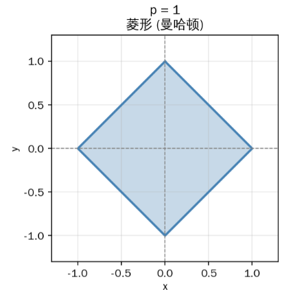
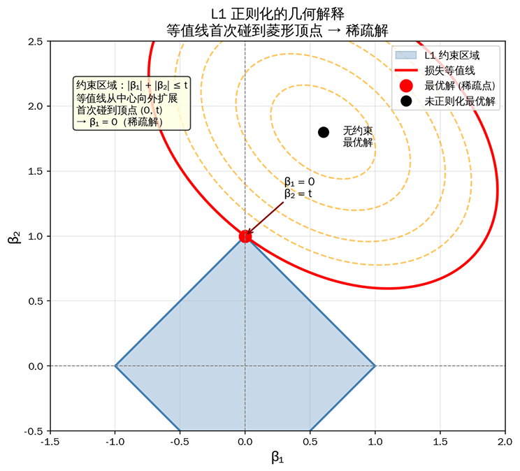
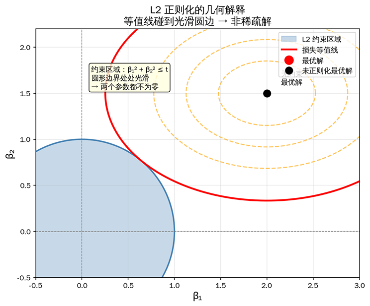

# 正则化与广义线性模型

本节，我们要借助前文建立的线性模型上下文语境，去讨论过拟合问题与应对过拟合的正则化方法。正则化是线性模型、神经网络等许多模型的通用技巧，但因为线性模型的参数直接对应特征影响力，正则化通过约束参数大小，既能防止过拟合又能保持模型的可解释性，还有完美的几何解释（等高线与约束区域的交点）。相比之下，神经网络模型的参数是分布式表示，正则化效果相对抽象，难以直观理解。

计算机科学家亚瑟·塞谬尔（Arthur Samuel）在开发机器学习跳棋程序时，发现程序在训练集上表现得很好，但在实战中却频频失误，原因是模型过度学习训练数据的细节，丧失了对真实规律的把握能力。就好比中学生学习选择了背诵历届高考原题，而不是真正理解知识，自然在考试中难以获得好成绩。塞谬尔将这种现象命名为**过拟合**（Overfitting），**正则化**（Regularization）则是用来解决过拟合问题的核心技术，它通过在损失函数中加入参数约束，强迫模型跳出训练数据的复杂细节，寻找更简单的结构来拟合数据。

## 拟合与泛化

机器学习的目标从来不是"记住训练数据"，而是"学会预测未知"。**泛化**（Generalization）指的就是模型从训练集学到的知识迁移到测试集的能力，训练集是"课本"，测试集是"考试"，学得好不好考试说了才算。泛化的数学定义是模型在整个数据分布上的期望误差，即：

$$E_{泛化} = \mathbb{E}_{(x,y) \sim P_{真实}}[L(f(x), y)]$$

但在实践中，我们无法获取"真实分布"的所有数据，只能用有限的训练集学习和有限的测试集评估。因此，泛化能力通常通过测试误差与训练误差的差距来衡量：

- **训练误差大、测试误差大**：这种现象称为欠拟合（Underfitting），说明模型本身训练还不够，训练本身就是从欠拟合到拟合的渐进过程，继续迭代优化便是。
- **训练误差小、测试误差小**：这种现象说明模型泛化好，学到真实规律，是我们想要的结果。
- **训练误差小、测试误差大**：这种现象称为过拟合，说明模型的泛化能力差，需要调整模型结构，改变训练方式等手段来处理。

以一个具体例子来解释如何选择不同模型来拟合现实世界。假设任务是从 10 个数据点中学习一条拟合曲线，真实的数据生成规律是 $y = \sin(x) + $ 噪声。现在你有如下三种不同复杂度的模型可供选择：

| 模型 | 参数数量 | 训练误差 | 新数据预测表现 |
|:----:|:--------:|:--------:|:--------------:|
| 线性模型： $y = ax + b$ | 2 | 大 | 稳定，泛化较差 |
| 三次多项式： $y = a_0 + a_1x + a_2x^2 + a_3x^3$ | 4 |适中 | 较稳定，泛化较好 |
| 九次多项式：$y = \sum_{i=0}^{9} a_i x^i$ | 10 | 接近 0 | 预测失败，泛化差 |

由于九次多项式有 10 个参数，恰好等于样本数量，函数曲线理论上可以完美穿过训练集的每个数据点（训练误差接近 0），但这条"完美曲线"在新数据上几乎是肯定预测错误的。因为仅凭 10 个点的数据，根本不能支持称这种复杂度的模型的训练，几乎必然会产生过拟合现象。过拟合的产生源于三个因素的组合：

1. **模型复杂度过高**：参数数量过多，模型有足够的自由度去拟合噪声而非真实规律。如例子中的九次多项式画了一条曲线穿过散点图，允许曲线任意弯曲（参数很多），它可以穿越每一个噪声点，画出一条锯齿状的曲线，这条曲线在训练数据上完美，但对新数据毫无价值。

2. **训练数据不足**：样本数量太少，模型无法学到真实的统计规律。根据统计学的一般经验，参数数量应该显著少于样本数量（如样本数至少是参数数的 10 倍），否则模型容易过拟合。

3. **训练数据噪声干扰**：训练数据中的噪声被模型当作规律学习。真实数据总包含测量误差、记录偏差等噪声，当模型复杂度足够高时，它会认真学习这些噪声，导致预测失准。

## 正则化原理

以上三项过拟合来源因素中，第三项噪声问题是样本数据来源的局限，无法人为控制，只能靠数据预处理尽量缓解，这里不去讨论。而前两项本质是同一句话：**训练数据不足以支撑模型的复杂度**。此前，我们优化模型的唯一目标是令损失函数最小化，如果工程实践中仅把模型训练目标定为损失函数最小的话，那很容易得到一个精密复杂的但极其脆弱的模型，这个模型在训练集的表现上肯定优于一个鲁棒而简单模型，这显然并非我们想要的结果。所以，我们要为模型优化设定除了损失函数最小之外的第二目标：**限制模型的复杂度**。正则化的原理就是通过在损失函数中加入参数惩罚项，达到限制模型复杂度的目的，它的数学表示为：

$$L_{reg}(\beta) = L(\beta) + \lambda \cdot R(\beta)$$

其中 $L(\beta)$ 是原损失函数（如线性回归的平方损失，逻辑回归的交叉熵损失），$R(\beta)$ 表示正则化项，惩罚参数量的多少和参数值的大小，$\lambda$ 是正则化强度，控制惩罚力度。

九次多项式的例子已体现了参数量多少对模型复杂度的影响，此外，参数值过大也会带来过拟合风险。参数值过大意味着模型对输入特征过度敏感，微小的输入变化会导致巨大的输出变化。想象一个线性回归模型 $y = 1000x_1 + 0.01x_2$，当 $x_1$ 变化 1 时，输出变化 1000；而当 $x_2$ 变化 100 时，输出才变化 1。这种极端的敏感差异正是过拟合的特征，模型对某些特征反应过度，很可能是把噪声当成了规律。

### L1 正则化：Lasso

**Lasso**（最小绝对值收缩与选择算子 "Least Absolute Shrinkage and Selection Operator" 的首字母缩写）也常直接称作 L1 正则化，它主要用于约束模型参数的数量，能让某些参数精确为零。参数为零意味着对应的特征被剔除，模型只学习真正有用的特征。这种自动筛选特征的能力被称为**稀疏性**，是 L1 正则化区别于其他正则化的核心价值。Lasso 的数学表示为：$L_{Lasso}(\beta) = L(\beta) + \lambda ||\beta||_1$，其中 $||\beta||_1 = \sum_{j=1}^{d} |\beta_j|$ 是参数绝对值之和，也即是参数的 L1 范数。为了能讲清楚 L1 正则化是如何带来稀疏性的，我们先回顾[范数](../../maths/linear/vectors.md#范数)中 L1 的单位球形状，如下图所示：



*L1 单位球图像*

绝对值 $|\beta|$ 在 $\beta = 0$ 处有一个"尖点"，左导数是 -1，右导数是 +1，左右不相等，函数在此处不可导。这个不可导点就像一个陷阱，当参数被优化到接近零时，梯度方向突然改变，参数容易被卡在零位置，无法继续移动。用一个类比来理解，想象你在山坡上往下走，L1 正则化的山坡在 $\beta = 0$ 处有一个"V 形凹陷"，你走到凹陷底部时，左右两边都是向上的坡，自然就停在那里了。稍后要介绍的 L2 正则化的山坡是光滑的碗形，没有这种凹陷，你只会滑到一个接近零但不精确为零的位置。

考虑这样一个具体例子，假设模型只有两个参数 $\beta_1$ 和 $\beta_2$，我们仍然把优化的目标设定为损失函数最小化，但是增加一个约束条件 $|\beta_1| + |\beta_2| \leq 1$，约束在平面上形成一个菱形区域，菱形有四个"顶点"，分别位于 $(1, 0)$、$(0, 1)$、$(-1, 0)$、$(0, -1)$，恰好落在坐标轴上。



*L1 正则化产生稀疏解的几何解释：损失函数等值线（红色椭圆）首次碰到菱形顶点，产生稀疏解*

迭代优化时，如果没有约束条件，损失函数最优解可以在任何位置；有了约束后，损失函数就取不到最小值，只能逐步寻求次小值，直至满足约束。将这些因要满足约束逐步渐增的次小值连起来画出等值线（想象前面用山峰 / 山谷来比喻的损失函数图像，等值线就类似这个山峰 / 山谷的等高线），可以看到等值线从代表最小值的中心点向外扩展，与约束区域首次接触的位置就是满足约束的最优解了。由于菱形的边界是直线，等高线更容易碰到菱形的顶点（尖角），而不是边缘的平直部分。碰到顶点意味着某个参数为 0，这就是稀疏解的几何来源。

稀疏解相当于自动完成了特征选择，系数为 0 的特征被剔除，Lasso 自动筛选出最重要的特征，无需人工筛选。这在基因筛选（从数千个基因中找出致病基因）、文本分类（从海量词汇中选择关键词）等场景极具价值。此外，模型简洁更加凸显了可解释性，稀疏解保留少量非零参数，譬如帮助医生从几百个复杂化验结果中筛选出几个关键指标，医生就可以专注解释病因。

由于 Lasso 没有闭式解（因为 $|\beta|$ 不可导），所以也需要迭代优化算法。坐标下降法是常用 Lasso 回归实现算法，大体思路是每次只更新一个参数，其他参数固定，轮流更新直至收敛。以下代码用坐标下降算法实现了 Lasso 回归。

```python runnable extract-class="LassoRegression"
import numpy as np

class LassoRegression:
    """
    Lasso回归实现（L1正则化）
    使用坐标下降算法
    
    适用于：
    1. 需要自动特征选择
    2. 特征数量多，部分特征可能无关
    3. 追求稀疏、可解释的模型
    """
    
    def __init__(self, alpha=1.0, n_iterations=1000, tol=1e-4):
        self.alpha = alpha          # 正则化强度λ
        self.n_iterations = n_iterations  # 最大迭代次数
        self.tol = tol              # 收敛阈值
        self.coef_ = None
        self.intercept_ = None
    
    def soft_threshold(self, rho, lambda_):
        """
        软阈值函数（Lasso的核心操作）
        
        将参数"推向"零，可能精确到达零
        """
        if rho < -lambda_:
            return rho + lambda_
        elif rho > lambda_:
            return rho - lambda_
        else:
            return 0.0
    
    def fit(self, X, y):
        """
        训练模型（坐标下降）
        
        每次更新一个参数，轮流迭代直至收敛
        """
        n_samples, n_features = X.shape
        
        # 初始化参数
        self.coef_ = np.zeros(n_features)
        self.intercept_ = np.mean(y)
        y_centered = y - self.intercept_
        
        # 数据标准化（加速收敛，保证公平惩罚）
        X_mean = np.mean(X, axis=0)
        X_std = np.std(X, axis=0)
        X_std[X_std == 0] = 1  # 避免除零
        X_normalized = (X - X_mean) / X_std
        
        # 坐标下降迭代
        for iteration in range(self.n_iterations):
            coef_old = self.coef_.copy()
            
            for j in range(n_features):
                # 计算当前特征的"部分残差"
                # 即：去掉第j个特征后的预测残差
                residual = y_centered - X_normalized @ self.coef_ + self.coef_[j] * X_normalized[:, j]
                
                # 计算rho（未正则化的梯度项）
                rho = X_normalized[:, j] @ residual / n_samples
                
                # 应用软阈值（Lasso的关键步骤）
                self.coef_[j] = self.soft_threshold(rho, self.alpha)
            
            # 还原到原始尺度
            self.coef_ = self.coef_ / X_std
            
            # 检查收敛
            if np.max(np.abs(self.coef_ - coef_old)) < self.tol:
                break
        
        return self
    
    def predict(self, X):
        """预测"""
        return X @ self.coef_ + self.intercept_
    
    def score(self, X, y):
        """R²得分"""
        y_pred = self.predict(X)
        ss_res = np.sum((y - y_pred) ** 2)
        ss_tot = np.sum((y - np.mean(y)) ** 2)
        return 1 - ss_res / ss_tot
    
    def get_selected_features(self, threshold=0.01):
        """返回被选中的特征索引（非零系数）"""
        return np.where(np.abs(self.coef_) > threshold)[0]


# 演示Lasso的稀疏性
n_samples = 100
n_features = 10

# 生成数据：只有3个特征真正有用，其余7个是噪声
X = np.random.randn(n_samples, n_features)
true_coef = np.array([5, 3, -2, 0, 0, 0, 0, 0, 0, 0])  # 只有前3个有效
y = X @ true_coef + np.random.randn(n_samples) * 0.5

# Lasso回归
lasso = LassoRegression(alpha=0.5, n_iterations=1000)
lasso.fit(X, y)

print("=== Lasso稀疏性演示 ===")
print(f"真实系数: {true_coef}")
print(f"Lasso估计: {lasso.coef_}")
print(f"R²得分: {lasso.score(X, y):.3f}")
print(f"非零参数数量: {len(lasso.get_selected_features())} (原始{len(true_coef)}个)")
print("Lasso成功识别出真正有用的3个特征！")
```

### L2 正则化：岭回归

**岭回归**（Ridge Regression）常直接称作 L2 正则化，它的主要作用是约束模型的参数值大小，让参数估计更稳定，但通常不会让参数精确为零。参数收缩意味着模型对所有特征的响应都变得更加温和，降低了对单个特征的过度依赖。这种稳定性提升是岭回归区别于 Lasso 的核心价值。岭回归的数学表示为：$L_{Ridge}(\beta) = L(\beta) + \lambda ||\beta||^2_2$，其中 $||\beta||^2_2 = \sum_{j=1}^{d} \beta_j^2$ 是参数 L2 范数的平方。

考虑 Lasso 中举的例子，假设模型只有两个参数 $\beta_1$ 和 $\beta_2$，优化目标仍为损失函数最小化，但约束条件变为 $\beta_1^2 + \beta_2^2 \leq 1$。约束在平面上形成一个圆形区域，圆形的边界处处光滑圆润，没有"顶点"或"尖角"。损失函数的等高线从中心向外扩展时，碰到的圆形边界上的点通常不会落到坐标轴上，两个参数都不为零，这就是为什么 L2 正则化不产生稀疏解。



*L2 正则化的几何解释：圆形边界光滑，等值线碰到圆边时两个参数都不为零*

非稀疏意味着岭回归保留了所有特征，只是让它们的系数变小。当所有特征都真正有用时（如房价预测中面积、房间数、地段评分都相关），岭回归是比 Lasso 更好的选择，Lasso 可能因样本数据的局限，剔除某些相关特征，而岭回归保留全部信息并稳定处理[共线性](https://en.wikipedia.org/wiki/Collinearity)（指多个特征高度相关，导致模型难以区分各特征的独立贡献，如 $x_2 \approx 2x_1$）。岭回归最大的优势毫无疑问是它具备闭式解，无需迭代优化一次就可以求出最优解，计算效率极高。岭回归的闭式解为 $\hat{\beta}_{Ridge} = (X^TX + \lambda I)^{-1}X^Ty$，与线性回归的 [OLS 闭式解](linear-regression.md#线性回归闭式解) $\hat{\beta}_{OLS} = (X^TX)^{-1}X^Ty$ 对比，岭回归在 $X^TX$ 上加了 $\lambda I$。这个看似简单的改动解决了 OLS 的三个先天缺陷：

1. **始终有解**：当特征之间存在共线性时，$X^TX$ 可能不可逆或接近不可逆（[矩阵求逆](../../maths/linear/matrices.md#矩阵的转置和逆)中讲过可逆的三个条件之一是满秩，共线性意味着不满秩），OLS 无解或参数估计极其不稳定。岭回归加上 $\lambda I$ 后，矩阵一定可逆，这就好比在泥泞的路铺了一层石子，原来走不通的路变得可行了。

2. **参数收缩稳定**：正则化项 $\lambda\beta$ 使得参数估计值比 OLS 小，参数被约束拉向原点，模型对特征的响应变得更加温和。这种收缩效应降低了模型对单个特征的依赖，提升了泛化稳定性。

3. **共线性合理处理**：当多个特征高度相关时（如房价预测中的"面积"和"房间数"），OLS 的参数估计可能剧烈波动（一个特征系数为正，另一个为负，且绝对值都很大）。岭回归通过参数约束，使相关特征的系数趋于相近，避免这种不合理的波动。

下面表格总结了岭回归和 Lasso 的特点与适用场景对比：

| 特性 | 岭回归（L2） | Lasso（L1） |
|:----:|:-----------:|:-----------:|
| 参数约束 | 收缩但不为零 | 可精确为零（稀疏） |
| 特征选择 | 不自动选择 | 自动选择 |
| 计算复杂度 | 有闭式解，计算快 | 需迭代优化 |
| 共线性处理 | 参数趋于相近，稳定 | 随机选择一个为 0，不稳定 |
| 适用场景 | 特征都相关时 | 需要特征筛选时 |

下面的代码实现了一个完整的岭回归类，并演示了岭回归如何处理共线性问题。当特征高度相关时，岭回归通过 L2 正则化约束参数空间，获得稳定的解，相关特征的系数会趋于相近，而非像 Lasso 那样随机选择一个置零。

```python runnable extract-class="RidgeRegression"
import numpy as np

class RidgeRegression:
    """
    岭回归实现（L2正则化）
    
    适用于：
    1. 特征之间存在共线性
    2. 参数估计不稳定
    3. 需要防止过拟合
    """
    
    def __init__(self, alpha=1.0):
        self.alpha = alpha  # 正则化强度λ
        self.coef_ = None   # 特征系数
        self.intercept_ = None  # 截距
    
    def fit(self, X, y):
        """
        训练模型（闭式解）
        
        Parameters:
        X : ndarray, shape (n_samples, n_features)
            特征矩阵
        y : ndarray, shape (n_samples,)
            目标向量
        """
        n_samples = X.shape[0]
        X_augmented = np.column_stack([np.ones(n_samples), X])
        
        # 岭回归闭式解：β = (X^T X + λI)^(-1) X^T y
        # 注意：不对截距项正则化（I的第一行第一列为0）
        I = np.eye(X_augmented.shape[1])
        I[0, 0] = 0  # 截距项不参与正则化
        
        XtX = X_augmented.T @ X_augmented
        Xty = X_augmented.T @ y
        
        self.beta_ = np.linalg.solve(XtX + self.alpha * I, Xty)
        
        self.intercept_ = self.beta_[0]
        self.coef_ = self.beta_[1:]
        
        return self
    
    def predict(self, X):
        """预测"""
        return X @ self.coef_ + self.intercept_
    
    def score(self, X, y):
        """R²得分"""
        y_pred = self.predict(X)
        ss_res = np.sum((y - y_pred) ** 2)
        ss_tot = np.sum((y - np.mean(y)) ** 2)
        return 1 - ss_res / ss_tot


# 演示：共线性问题
n_samples = 50

# 生成高度相关的特征（模拟共线性）
x1 = np.random.randn(n_samples)
x2 = x1 + np.random.randn(n_samples) * 0.01  # x2几乎等于x1（高度共线性）
x3 = np.random.randn(n_samples)
X = np.column_stack([x1, x2, x3])

# 目标值：真实规律是 x1 和 x3 有影响，x2 应该不重要（但x2≈x1）
y = 2 * x1 + 3 * x3 + np.random.randn(n_samples) * 0.5

print("=== 共线性问题演示 ===")
print("特征相关性: x1与x2高度相关（≈0.99）")

# OLS尝试（可能数值不稳定）
try:
    X_aug = np.column_stack([np.ones(n_samples), X])
    XtX = X_aug.T @ X_aug
    beta_ols = np.linalg.solve(XtX, X_aug.T @ y)
    print(f"OLS参数: {beta_ols[1:]}")
    print("警告: OLS参数可能因共线性而不稳定!")
except np.linalg.LinAlgError:
    print("OLS失败: 矩阵不可逆!")

# 岭回归（稳定处理共线性）
ridge = RidgeRegression(alpha=1.0)
ridge.fit(X, y)
print(f"岭回归参数: {ridge.coef_}")
print(f"岭回归R²: {ridge.score(X, y):.3f}")
print("岭回归参数更稳定，相关特征的系数趋于相近")
```

## 广义线性模型

我们已经学习过线性回归和逻辑回归，它们有着不同的适用任务（回归、分类）、损失函数（平方误差、交叉熵）、优化手段（OLS 闭式解、迭代优化），但是又似乎能够感觉到它们共享着同一套处理问题的框架（寻找假设、建立准则、度量损失、优化模型）。如果用一个生活中的类比，就像在学习钢琴和小提琴两种乐器，表面上，钢琴用键盘，小提琴用琴弦，演奏姿势完全不同。但深入学习后，你会发现它们共享相同的音乐理论基础：音阶、节奏、和弦，等等。**广义线性模型**（Generalize Linear Model，GLM）框架就像是揭示音乐理论统一性的框架，它告诉我们线性回归和逻辑回归表面不同，但演奏技巧（数学本质）是却是相通的。两者的相似性从这张对比表开始显现：

| 对比项 | 线性回归 | 逻辑回归 |
|:------:|:-------:|:-------:|
| 任务类型 | 回归（预测数值） | 分类（预测类别） |
| 损失函数 | 平方损失 | 交叉熵损失 |
| 参数估计 | OLS 闭式解 | 梯度下降迭代 |
| 输出范围 | $(-\infty, +\infty)$ | $(0, 1)$ |
| **线性预测器** | $X\beta$ | $X\beta$ |
| **分布假设** | 正态分布 | 伯努利分布 |

表格前四行的差异显而易见，但注意最后两行，两者的**线性预测器**都是 $X\beta$，只是输出方式和分布假设不同。这就像钢琴和小提琴虽然演奏方式不同，但都在演奏同样的乐谱（线性预测器）。GLM 框架正是要揭示这种乐谱一致性，它用三个要素定义响应变量 $y$ 与线性预测器 $X\beta$ 的关系，数学表达为：$y = g^{-1}(X\beta)$。其中 $g$ 称为**连接函数**，负责将线性预测器 $X\beta$ 的输出转换到响应变量的取值范围。这个公式中三个要素的组合可以衍生出丰富的 GLM 模型家族：

1. **分布族**：响应变量 $y$ 服从什么分布是模型对数据生成机制的假设。线性回归假设 $y$ 服从正态分布（连续值），逻辑回归假设 $y$ 服从伯努利分布（二分类），[泊松回归](https://en.wikipedia.org/wiki/Poisson_regression)假设 $y$ 服从泊松分布（计数值），等等。

2. **线性预测器**：$X\beta$ 是所有 GLM 的共同的计算引擎，线性组合输入特征，计算每个样本的得分。无论后续如何转换，第一步永远是计算 $X\beta$。

3. **连接函数**：$g$ 连接线性预测器与分布均值 $\mu$。它的作用是将 $X\beta$ 的原始输出翻译到合适的取值范围。线性回归不需要翻译，所以 $g(\mu) = \mu$（Identity 连接）；逻辑回归需要将 $X\beta$ 映射到概率 $(0, 1)$，所以用 Logit 连接函数。

GLM 框架最有价值的地方是它把看似不同的模型纳入统一视角。下表展示了四种常见 GLM：

| 模型 | 分布族 | 连接函数 | 连接函数公式 | 典型应用 |
|:----:|:------:|:--------:|:-----------:|:--------:|
| 线性回归 | 正态分布 | Identity | $g(\mu) = \mu$ | 房价预测 |
| 逻辑回归 | 伯努利分布 | Logit | $g(\mu) = \log\frac{\mu}{1-\mu}$ | 用户流失诊断 |
| 泊松回归 | 泊松分布 | Log | $g(\mu) = \log\mu$ | 交通流量预测 |
| 概率单位回归 | 正态分布 | Probit | $g(\mu) = \Phi^{-1}(\mu)$ | 信用评分 |

这里以逻辑回归为例，套用 GLM 框架来重新看待的它运作机制：

- **分布族**：标签 $y$ 服从伯努利分布，$y=1$ 的概率是 $p$，$y=0$ 的概率是 $1-p$。这对应分类任务的结果只能是两个类别之一。

- **线性预测器**：$z = X\beta$，计算每个样本的得分。得分 $z$ 可以取任意实数（如 -5.3 或 8.7），但我们需要的是概率 $p \in (0, 1)$。

- **连接函数**：Logit 函数 $g(p) = \log\frac{p}{1-p}$（对数几率）建立了得分 $z$ 与概率 $p$ 之间的桥梁。公式 $z = g(p) = \log\frac{p}{1-p}$ 可以反解为 $p = \frac{1}{1+e^{-z}} = \sigma(z)$，这正是 Sigmoid 变换。

GLM 框架揭示了逻辑回归的标准操作流程：先计算线性预测器 $X\beta$，再用 Sigmoid 函数将其映射到概率范围。线性回归更直接：$X\beta$ 本身就是预测值，不需要额外转换。理解 GLM 框架，就像理解了音乐理论后再学习新乐器，你会知道新乐器只是表达方式的变换，底层原理是相通的。

## 正则化应用实践

下面代码通过一个模拟房价预测场景，直观展示 L1 和 L2 正则化的差异。我们生成 20 个候选特征，但只有前 5 个特征真正影响房价（系数分别为 50、30、-20、15、10），其余 15 个为无关噪声特征。通过对比岭回归（λ=1）和两个不同强度的 Lasso（λ=0.5、λ=2），我们可以观察到：

- 系数收缩方式：岭回归让所有特征系数趋近于零但不为零；Lasso 则将部分系数精确压缩为零。
- 特征选择效果：强正则化的 Lasso（λ=2）有大概率（取决于随机数据）能成功剔除所有噪声特征，仅保留 5 个有效特征。
- 预测性能平衡：正则化强度需权衡拟合能力与稀疏性，太弱则噪声残留，太强则信息丢失。

```python runnable
import numpy as np
import matplotlib.pyplot as plt
from shared.linear.ridge_regression import RidgeRegression
from shared.linear.lasso_regression import LassoRegression

# 模拟房价预测数据
n_samples = 100
n_features = 20  # 20个候选特征，但只有5个真正有用

# 生成特征
X = np.random.randn(n_samples, n_features)

# 真实规律：只有前5个特征影响房价
true_coef = np.array([50, 30, -20, 15, 10, 0, 0, 0, 0, 0, 0, 0, 0, 0, 0, 0, 0, 0, 0, 0])
y = X @ true_coef + np.random.randn(n_samples) * 10

# 训练三个模型
models = {
    'Ridge (λ=1)': RidgeRegression(alpha=1.0),
    'Lasso (λ=0.5)': LassoRegression(alpha=0.5),
    'Lasso (λ=2)': LassoRegression(alpha=2.0)
}

results = {}
for name, model in models.items():
    model.fit(X, y)
    results[name] = {
        'coef': model.coef_,
        'score': model.score(X, y),
        'nonzero': np.sum(np.abs(model.coef_) > 0.01)
    }

# 可视化对比
fig, axes = plt.subplots(1, 3, figsize=(15, 5))

# 图1：系数对比
colors = {'Ridge (λ=1)': '#3498db', 'Lasso (λ=0.5)': '#e74c3c', 'Lasso (λ=2)': '#9b59b6'}
for i, (name, res) in enumerate(results.items()):
    axes[0].bar(np.arange(n_features) + i*0.25, res['coef'], width=0.25, 
                color=colors[name], alpha=0.7, label=name)

axes[0].axhline(y=0, color='black', linewidth=0.5)
axes[0].set_xlabel('特征编号')
axes[0].set_ylabel('系数值')
axes[0].set_title('不同正则化方法的系数对比')
axes[0].legend()

# 标记真实有效特征
axes[0].axvspan(-0.5, 4.5, alpha=0.1, color='green', label='真实有效特征')

# 图2：模型性能与特征数量对比（双轴图）
model_names = list(results.keys())
scores = [results[n]['score'] for n in model_names]
nonzeros = [results[n]['nonzero'] for n in model_names]

x_pos = np.arange(len(model_names))
# 左轴：R²得分（柱状图）
bars1 = axes[1].bar(x_pos - 0.15, scores, width=0.3, color='#3498db', alpha=0.7, label='R²得分')
axes[1].set_xticks(x_pos)
axes[1].set_xticklabels(model_names)
axes[1].set_ylabel('R²得分', color='#3498db')
axes[1].set_ylim(0, 1)
axes[1].tick_params(axis='y', labelcolor='#3498db')

# 右轴：非零参数数量（柱状图）
ax2 = axes[1].twinx()
bars2 = ax2.bar(x_pos + 0.15, nonzeros, width=0.3, color='#e74c3c', alpha=0.7, label='非零参数')
ax2.set_ylabel('非零参数数量', color='#e74c3c')
ax2.set_ylim(0, 20)
ax2.tick_params(axis='y', labelcolor='#e74c3c')

# 添加理想特征数参考线
ax2.axhline(y=5, color='green', linestyle='--', linewidth=2, label='理想特征数=5')
axes[1].set_title('性能 vs 特征数量：Lasso用更少特征达到相近性能')

# 合并图例
lines1, labels1 = axes[1].get_legend_handles_labels()
lines2, labels2 = ax2.get_legend_handles_labels()
axes[1].legend(lines1 + lines2, labels1 + labels2, loc='upper left')

# 图3：特征选择效果（Lasso的稀疏性）
lasso_weak = results['Lasso (λ=0.5)']['coef']
lasso_strong = results['Lasso (λ=2)']['coef']

axes[2].barh(np.arange(n_features), np.abs(true_coef), color='green', alpha=0.3, label='真实重要特征')
axes[2].barh(np.arange(n_features)+0.2, np.abs(lasso_strong), color='#9b59b6', alpha=0.7, label='Lasso(λ=2)估计')
axes[2].set_yticks(np.arange(n_features) + 0.1)
axes[2].set_yticklabels([f'特征{i}' for i in range(n_features)])
axes[2].set_xlabel('系数绝对值')
axes[2].set_title('特征选择效果：Lasso剔除噪声特征')
axes[2].legend(loc='upper right')

plt.tight_layout()
plt.show()

print("\n=== 正则化效果总结 ===")
print(f"真实有效特征数: 5")
for name, res in results.items():
    print(f"{name}: R²={res['score']:.3f}, 非零参数={res['nonzero']}")

lasso_nonzero = results['Lasso (λ=2)']['nonzero']
if lasso_nonzero == 5:
    print("\nLasso(λ=2)成功剔除所有噪声特征，精确保留5个有效特征！")
elif lasso_nonzero < 5:
    print(f"\nLasso(λ=2)保留了{lasso_nonzero}个特征，部分有效特征被剔除，建议减小λ值。")
else:
    print(f"\nLasso(λ=2)保留了{lasso_nonzero}个特征，仍有{lasso_nonzero-5}个噪声未被剔除，建议增大λ值。")
```

## 本章小结

过拟合是机器学习实践中的一大挑战，模型在训练集上表现完美却在真实场景中失效，本质上是因为模型学习了噪声而非规律。正则化技术通过约束参数空间来控制模型复杂度，就像为赛车安装刹车系统，防止模型在追求训练完美的道路上失控。L1 正则化利用范数的几何特性产生稀疏解，让无关特征的系数精确为零，实现自动特征选择；L2 正则化则稳定处理共线性问题，保证模型始终有解。选择哪种正则化取决于实际需求。

GLM 框架从更高维度揭示了线性回归、逻辑回归等模型的数学统一性，它们都遵循分布族定义数据类型、线性预测器计算得分、连接函数转换输出范围的三要素结构，差异只是表达方式的变换，底层原理相通。

## 练习题

1. 给定数据集：特征矩阵 $X$ 包含两个高度相关的特征（$x_2 \approx x_1$），目标值 $y = 2x_1 + \epsilon$。对比 OLS 和岭回归的参数估计稳定性，并解释为什么岭回归更稳定。
    <details>
    <summary>参考答案</summary>
    
    ```python runnable
    import numpy as np
    
    n_samples = 50
    
    # 生成高度共线性的特征
    x1 = np.random.randn(n_samples)
    x2 = x1 + np.random.randn(n_samples) * 0.01  # x2几乎等于x1
    X = np.column_stack([x1, x2])
    
    # 目标值只依赖于x1
    y = 2 * x1 + np.random.randn(n_samples) * 0.5
    
    # OLS估计（不稳定）
    X_aug = np.column_stack([np.ones(n_samples), X])
    beta_ols = np.linalg.solve(X_aug.T @ X_aug, X_aug.T @ y)
    print(f"OLS参数: β1={beta_ols[1]:.2f}, β2={beta_ols[2]:.2f}")
    print("问题: β1和β2符号相反且绝对值很大，这是因为OLS试图'分配'相同特征的影响")
    
    # 岭回归估计（稳定）
    from shared.linear.ridge_regression import RidgeRegression
    ridge = RidgeRegression(alpha=1.0)
    ridge.fit(X, y)
    print(f"岭回归参数: β1={ridge.coef_[0]:.2f}, β2={ridge.coef_[1]:.2f}")
    print("岭回归将相关特征的系数趋于相近，避免不合理的大幅波动")
    ```
    
    **稳定性解释**：
    
    当 $x_1$ 和 $x_2$ 高度相关时，OLS 面临"分配困境" —— 两个特征几乎相同，模型难以判断哪个更重要。极端情况下，OLS 可能给出 $\beta_1 = 1000, \beta_2 = -998$ 这样的解：两个系数符号相反且绝对值巨大，相互"抵消"后恰好产生正确的预测。这种解在数学上正确，但极不稳定 —— 稍微改变数据，系数就会剧烈波动。
    
    岭回归通过参数约束，强迫 $\beta_1$ 和 $\beta_2$ 都保持较小的值，相关特征的系数趋于相近（如 $\beta_1 \approx \beta_2 \approx 1$）。虽然单个系数的绝对值可能略有偏差，但整体预测仍然准确，且参数稳定得多。
    </details>

2. 解释为什么通常不对截距项施加正则化，如果对截距项正则化会产生什么问题？
    <details>
    <summary>参考答案</summary>
    
    **截距项的本质**：
    
    截距 $\beta_0$ 代表数据的"基准水平"，即所有特征为零时的预测值。它反映数据的整体位置，而非特征与结果的关系。例如房价预测中，截距可能代表"基础房价"（不含面积、地段等因素的起始价格）。
    
    **不应该正则化截距的原因**：
    
    正则化的目的是约束"特征敏感度" —— 防止模型对某个特征反应过度。截距不涉及任何特征，它只是一个基准值，约束截距没有意义。
    
    如果强制正则化截距（让 $\beta_0$ 也收缩），会导致预测系统性偏移。假设真实数据均值是 100，OLS 会估计 $\beta_0 \approx 100$；如果正则化迫使 $\beta_0 \approx 0$，所有预测都会偏低约 100，模型整体失效。
    
    **实现中的处理**：
    
    代码中通过设置 $I[0,0] = 0$（正则化矩阵的第一元素为零）来排除截距项的正则化。这是标准做法。
    </details>
