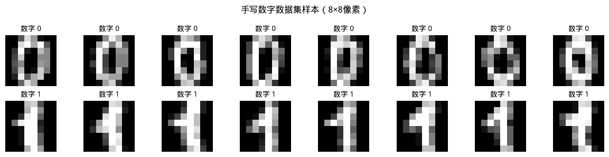

# 支持向量机

1963 年，苏联数学家弗拉基米尔·瓦普尼克（Vladimir Vapnik）在解决模式识别问题时，提出了支持向量方法，1995 年，瓦普尼克发表的论文《Support−Vector Networks》正式提出软间隔**支持向量机**（Support Vector Machine，SVM），解决了实际数据中普遍存在的噪声和重叠问题，此后支持向量机迅速成为机器学习领域的主流方法，在文本分类、图像识别、生物信息等领域取得了巨大成功，直到深度学习的兴起才改变了格局。

## 最大间隔超平面

回顾我们在[逻辑回归](../linear-models/logistic-regression.md)章节学到的内容，线性分类模型通过寻找一条直线（一个超平面）来分隔不同类别的数据。然而，对于同一个分类问题，可能存在无数个能够正确划分训练数据的超平面。以二维空间为例，假设我们收集了某银行的客户数据，用收入水平和消费频率两个特征来区分优质客户（正类）和风险客户（负类）。将这两类数据绘制在平面坐标系中，可以直观看到正类样本集中在右上区域，负类样本集中在左下区域。此时，任何一条穿过中间空白区域的直线都能正确划分训练数据，但哪一条才是最好的呢？

下图中左边的画面展示了这个困境，每条虚线都能将两类数据分开，但它们的位置各不相同。右边的画面给出了 SVM 的答案：应当选择那条距离两类样本都最远的直线。这条直线的两侧各有一条平行线穿过最近的数据点，中间的区域称为**间隔**（Margin）。SVM 的核心思想正是最大化这个间隔，寻找到一条最大间隔的直线（超平面），让分类边界尽可能远离两类数据，从而获得对未知数据更强的预测能力。


*图：左图展示多条可行分隔线，右图展示 SVM 选择的最大间隔分隔线*

SVM 的答案完全符合人类直觉，你要在一条狭窄的山路上修建护栏分隔双向车道，首选的做法肯定也是把护栏放在平行于两侧山壁的路中央，让两侧车辆都有最大的活动空间。最大间隔超平面让两类数据都尽可能远离分类边界，这样即使数据有轻微扰动或噪声，分类结果也不会轻易出错。瓦普尼克还给出了这种直觉背后的统计学习理论支撑，严格证明了分类器的泛化误差上限与间隔成反比，间隔越大，模型对未见样本的分类错误率越低。

### 超平面、距离与间隔

理解 SVM 的第一步是建立"距离"的数学定义。在日常生活中，我们用尺子测量点到直线的距离，在统计学习中，我们则需要一个适用于任意维度空间的度量公式。解析几何告诉我们在 $d$ 维空间中，分隔两类数据的超平面可以用一个线性方程来描述：

$$w^T x + b = 0$$

其中 $w \in \mathbb{R}^d$ 是一个 $d$ 维向量，称为**法向量**（Normal Vector），法向量垂直于超平面，决定了超平面的方向。$b \in \mathbb{R}$ 是一个实数，称为**截距**（Intercept），它决定了超平面到原点的距离。当 $b=0$ 时，超平面穿过原点；当 $b>0$ 时，超平面沿法向量方向平移远离原点。以二维空间为例，方程 $w_1 x_1 + w_2 x_2 + b = 0$ 表示一条直线。假设 $w = (1, -1)$ 且 $b = 0$，则方程为 $x_1 - x_2 = 0$，这是一条穿过原点、斜率为 1 的直线。法向量 $(1, -1)$ 垂直于这条直线，指向右上方向。

空间中任意一点 $x$ 到超平面 $w^T x + b = 0$ 的距离是它在在法向量方向上的有向投影的绝对值，如下图所示，紫色实线连接了测试点（金色五角星）与其在超平面上的投影点（紫色十字标记），根据[向量投影](../../maths/linear/vectors.md#内积与投影)的定义与距离公式，这两点之间的距离为：

$$\text{distance}(x) = \frac{|w^T x + b|}{\|w\|}$$

之所以要取绝对值是因为 $w^T x + b$ 是点 $x$ 代入超平面方程后的值，反映了点相对于超平面的位置。当值为正时，点位于法向量所指的一侧；当值为负时，点位于相反一侧，绝对值 $|w^T x + b|$ 确保距离始终为正数，因为我们关心的是"有多远"而非"在哪边"。


*图：左图展示点到超平面的距离计算，右图展示函数间隔与几何间隔的关系*

对于二分类问题，与传统线性分类器使用惯用 $y \in \{0, 1\}$ 标签不同，SVM 约定的类别标签取值为 $y \in \{-1, +1\}$。这个约定的巧妙之处在于 $y_i(w^T x_i + b)$ 的符号直接反映分类是否正确。当分类正确时，$y_i$ 与 $w^T x_i + b$ 同号，乘积为正；当分类错误时，两者异号，乘积为负。基于这个观察，我们定义**函数间隔**（Functional Margin）的概念：

$$\hat{\gamma}_i = y_i (w^T x_i + b)$$

函数间隔衡量的是分类的正确程度。$\hat{\gamma}_i > 0$ 表示分类正确，值越大意味着点离超平面越远；$\hat{\gamma}_i < 0$ 表示分类错误，点穿越了超平面。不过，函数间隔有个问题：它对参数 $w$ 和 $b$ 的缩放是敏感的，如果我们把 $w$ 和 $b$ 同时放大两倍，超平面本身没有变化（因为方程 $2w^T x + 2b = 0$ 与 $w^T x + b = 0$ 定义的是同一个超平面），但函数间隔 $\hat{\gamma}_i$ 却变成了两倍。为了解决这个问题，我们继续定义**几何间隔**（Geometric Margin），即函数间隔除以法向量的模长：

$$\gamma_i = \frac{y_i (w^T x_i + b)}{||w||} = \frac{\hat{\gamma}_i}{||w||}$$

几何间隔是点到超平面的实际几何距离，与参数缩放无关。上图中右边的画面展示了这个概念，绿色箭头标注的距离 $\gamma$ 正是几何间隔。对于正类点，几何间隔表示点到超平面的距离；对于负类点，几何间隔同样是距离，只是方向相反。当所有样本都分类正确时，几何间隔的最小值就是整个数据集的间隔，这个间隔越大，分类边界越安全。

## 支持向量

支持向量的含义其实非常直观形象：某些数据点像柱子一样支撑着分类边界。如果把分类边界想象成一道墙，支持向量就是紧贴这道墙的两排柱子，墙的位置完全由这些柱子决定，其他远离墙的数据点对墙的位置没有任何影响。

SVM 的优化目标是找到使整个数据集的**最小几何间隔最大化**的超平面。换句话说，我们希望最靠近超平面的那些点（即最"危险"的点）也能保持足够的距离。用数学语言将 SVM 优化目标描述出来是：

$$\arg \max_{w, b} \min_i \gamma_i = \arg \max_{w, b} \min_i \frac{y_i (w^T x_i + b)}{\|w\|}$$

这个目标函数的含义是首先找出所有样本点中几何间隔最小的那个点（即最靠近超平面的点），然后调整超平面的参数 $w$ 和 $b$，让这个最小距离尽可能大。这是一种"最大化最坏情况"的策略，确保即使是最危险的样本也能被正确分类，从而为整体分类提供安全保障。

直接优化这个目标函数是比较棘手的，因为它是一个[非凸函数](../../maths/calculus/derivative.md#高阶导数)。不过支持向量机通过一个巧妙的归一化技巧，将其转化为一个等价的凸优化问题处理。具体做法是规定**最小函数间隔等于 1**，即要求所有的函数间隔都必须大于等于 1：

$$y_i (w^T x_i + b) \geq 1, \quad \forall i$$

这个约束下，对于那些恰好满足 $y_i (w^T x_i + b) = 1$ 的点就是最靠近超平面的点，其几何间隔为 $\frac{1}{\|w\|}$。由于分子固定为 1，最大化几何间隔等价于最小化分母 $\|w\|$，因此目标函数就转化为：

$$\arg \min_{w, b} \frac{1}{2} \|w\|^2 \quad \text{s.t.} \quad y_i (w^T x_i + b) \geq 1, \quad i = 1, \ldots, n$$

这里又用了一个数学技巧，使用 $\frac{1}{2}\|w\|^2$ 代替原来的 $\|w\|$ ，两者的最小化是等价的，但平方运算保持单调性且便于求导，系数 $\frac{1}{2}$ 令求导后的形式更简洁。现在这个优化问题是一个标准的凸优化问题，具有唯一全局最优解，不会陷入局部最优。

在最优分隔超平面确定后，那些恰好满足约束等号成立的样本点（即满足 $y_i (w^T x_i + b) = 1$ 的点）就是**支持向量**（Support Vectors）。从几何角度看，支持向量是距离超平面最近的点，它们都落在间隔边界上，如下图所示。


*图：左图展示支持向量（高亮标记）如何决定分类边界，右图展示非支持向量可以自由移动而不影响边界*

图中高亮标记的星形点和圆形点就是支持向量，它们紧贴间隔边界，箭头表示这些点到超平面的距离。只有支持向量决定最终的分类边界，其他点（灰色箭头表示可以移动）只要不越过间隔边界，就可以任意移动而不影响超平面的位置。

这个性质揭示了 SVM 具有稀疏性，同时也是 SVM 高效处理大规模数据的关键原因。假设训练数据有 1000 个样本，但最终只有 10 个支持向量。那么，这 10 个点就浓缩了整个数据集的分类信息。模型存储时只需保存这 10 个点，而不需要保存全部 1000 个样本，大幅减少了存储和计算开销。

## 硬间隔优化

现在我们来完成 SVM 目标函数的优化。目标函数 $\frac{1}{2} ||w||^2 = \frac{1}{2}(w_1^2 + \cdots + w_d^2)$ 是一个凸函数，图像是一个碗形曲面，从任何初始点出发，向下行走最终都会到达碗底，有唯一最小值。约束条件 $y_i (w^T x_i + b) \geq 1$ 是线性不等式约束，定义了一个凸的区域（称为可行域）。凸目标函数配合凸可行域，共同构成一个凸优化问题，这类问题通常是有高效的求解算法的。相比之下，神经网络训练中的目标函数通常是非凸的，存在大量局部极值点，优化起来更困难。

这里要使用的求解算法被称为**拉格朗日对偶方法**，是一种将约束优化转化为无约束优化的经典技巧，因为直接求解原始问题需要处理不等式约束，无疑增加了计算复杂度，因此考虑引入一组辅助变量（称为拉格朗日乘子），将约束条件嵌入到目标函数，从而把约束优化转化为无约束优化。具体做法是为每个约束 $y_i (w^T x_i + b) \geq 1$ 引入一个拉格朗日乘子 $\alpha_i \geq 0$，构造拉格朗日函数：

$$\mathcal{L}(w, b, \alpha) = \frac{1}{2} ||w||^2 - \sum_{i=1}^{n} \alpha_i [y_i (w^T x_i + b) - 1]$$

仔细观察这个函数的构成，第一项 $\frac{1}{2} ||w||^2$ 是原始目标函数；第二项 $\sum_{i=1}^{n} \alpha_i [y_i (w^T x_i + b) - 1]$ 是约束条件的加权组合，每个约束 $y_i (w^T x_i + b) - 1 \geq 0$ 被乘以对应的 $\alpha_i$ 后累加。当约束 $y_i (w^T x_i + b) - 1 \geq 0$ 被满足时，减去一个非负值会降低整体函数值；当约束没有被满足时，减去一个负值反而会提升函数值。拉格朗日乘子 $\alpha_i$ 的作用就像一个惩罚系数，约束违反得越严重，惩罚力度越大。

接下来，我们需要找到拉格朗日函数关于 $w$ 和 $b$ 的极小值点。相对于 $w$ 和 $b$ 而言，这是已经变成了一个无约束优化问题。依据微积分中关于[偏导数](../../maths/calculus/gradient.md#偏导数)和[梯度](../../maths/calculus/gradient.md#梯度)的知识，极值点处函数对各变量的偏导数必须为零，这样分别对 $w$ 和 $b$ 求偏导后令其为零就得到两个方程，过程如下：

- **对 $w$ 求偏导数**

1. 处理拉格朗日函数的第一项。前面的数学处理在这里发挥了很优雅的作用，将 [L2 范数](../../maths/linear/vectors.md#范数)公式代入得到：

    $$\frac{\partial}{\partial w}\left(\frac{1}{2}||w||^2\right) = \frac{\partial}{\partial w}\left[\frac{1}{2}(w_1^2 + w_2^2 + \cdots + w_d^2)\right]        = \frac{1}{2} \cdot 2w = w$$

2. 处理拉格朗日函数的第二项 $\sum_{i=1}^{n} \alpha_i [y_i (w^T x_i + b) - 1]$。注意到 $w^T x_i = w \cdot x_i = \sum_{j=1}^{d} w_j x_{ij}$（其中 $x_{ij}$ 表示第 $i$ 个样本的第 $j$ 个特征）。对 $w$ 求偏导时，只有 $w^T x_i$ 部分包含 $w$，而 $b$ 和常数项 $-1$ 对 $w$ 来说是常数。根据向量求导规则 $\frac{\partial}{\partial w}(w^T x_i) = x_i$，因此，第二项对 $w$ 的偏导数为：

    $$\frac{\partial}{\partial w}\left[-\sum_{i=1}^{n} \alpha_i y_i (w^T x_i + b)\right] = -\sum_{i=1}^{n} \alpha_i y_i x_i$$

3. 将两部分合并，得到拉格朗日函数对 $w$ 的偏导数，并且在极值点处，偏导数必须为零，由此得到第一个方程：

    $$\frac{\partial \mathcal{L}}{\partial w} = w - \sum_{i=1}^{n} \alpha_i y_i x_i = 0 \text{ ，即： } w = \sum_{i=1}^{n} \alpha_i y_i x_i$$

- **对 $b$ 求偏导数**
1. 处理拉格朗日函数的第一项。由于 $b$ 只出现在第二项里，所以这项直接为零。

2. 处理拉格朗日函数的第二项，将其展开得到：

    $$-\sum_{i=1}^{n} \alpha_i [y_i (w^T x_i + b) - 1] = -\sum_{i=1}^{n} \alpha_i y_i (w^T x_i) - \sum_{i=1}^{n} \alpha_i y_i b + \sum_{i=1}^{n} \alpha_i$$

    展开后，只有第二项包含 $b$，因此对 $b$ 求偏导数得到：

    $$\frac{\partial \mathcal{L}}{\partial b} = -\sum_{i=1}^{n} \alpha_i y_i$$

3. 在极值点处，偏导数必须为零，得到第二个方程：

    $$\frac{\partial \mathcal{L}}{\partial b} = -\sum_{i=1}^{n} \alpha_i y_i = 0 \text{ ，即： } \sum_{i=1}^{n} \alpha_i y_i = 0$$

第一个方程 $w = \sum_{i=1}^{n} \alpha_i y_i x_i$ 揭示了 $w$ 与拉格朗日乘子 $\alpha$ 的关系，这也是 SVM 的核心结构：最优超平面的法向量 $w$ 是所有训练样本的加权组合，每个样本的贡献权重是 $\alpha_i y_i$。如果某个样本的 $\alpha_i = 0$，则它对 $w$ 没有任何贡献；只有 $\alpha_i > 0$ 的样本才参与构建分类边界。

第二个方程 $\sum_{i=1}^{n} \alpha_i y_i = 0$ 是拉格朗日乘子必须满足的约束，称为**线性约束**：所有 $\alpha_i$ 与对应标签 $y_i$ 的乘积之和为零，这个约束在后续求解对偶问题时会发挥作用。

将上述两个方程代入拉格朗日函数，消去 $w$ 和 $b$，得到**对偶问题**（将原始优化问题转化为关于拉格朗日乘子 $\alpha$ 的等价优化问题）：

$$\arg \max_\alpha \sum_{i=1}^{n} \alpha_i - \frac{1}{2} \sum_{i=1}^{n} \sum_{j=1}^{n} \alpha_i \alpha_j y_i y_j x_i^T x_j （\text{s.t.} \quad \alpha_i \geq 0, \quad \sum_{i=1}^{n} \alpha_i y_i = 0）$$

对偶问题的目标函数是一个关于 $\alpha$ 的二次函数，约束是线性约束，因此也是一个凸二次规划问题。对于 SVM，求解对偶问题比求解原始问题有诸多优势：对偶问题中变量的维度是样本数量 $n$，而原始问题中变量的维度是特征维度 $d$。当特征维度远高于样本数量时（如文本分类中词汇量巨大但文档数量有限），优化对偶问题要高效得多。更重要的是，对偶问题的目标函数中出现 $x_i^T x_j$，即样本之间的内积，这为引入**核函数**（Kernel Function）奠定了基础，核技巧正是通过替换内积来处理非线性分类问题，我们将在[下一章](kernel-methods.md)再详细讨论。

最后，在通过令偏导数为零求解对偶问题时，我们还需要一个准则来判断找到的解是否满足原始问题的约束条件，这正是[KKT 条件](https://en.wikipedia.org/wiki/Karush%E2%80%93Kuhn%E2%80%93Tucker_conditions)（Karush-Kuhn-Tucker Conditions）的作用。KKT 条件是凸优化问题中最优解必须满足的充要条件，它建立了对偶问题的解与原始问题最优性之间的联系：

1. **原始可行性条件**：$y_i (w^T x_i + b) - 1 \geq 0$，即原始问题的约束必须满足。
2. **对偶可行性条件**：$\alpha_i \geq 0$，即拉格朗日乘子必须为非负（我们在对偶问题中已显式施加此约束）。
3. **互补松弛性条件**：$\alpha_i [y_i (w^T x_i + b) - 1] = 0$，这是最关键的条件，它揭示了支持向量的本质特征。

互补松弛条件的含义是拉格朗日乘子 $\alpha_i$ 与约束违反程度 $y_i (w^T x_i + b) - 1$ 的乘积必须为零。这导致两种情况：

1. 如果 $\alpha_i > 0$，则必须有 $y_i (w^T x_i + b) - 1 = 0$，即该样本恰好落在间隔边界上，是支持向量。
2. 如果 $y_i (w^T x_i + b) - 1 > 0$（样本远离间隔边界），则必须有 $\alpha_i = 0$，该样本不是支持向量。

这再次印证了 SVM 的稀疏性：只有支持向量对应的 $\alpha_i > 0$，其他样本的 $\alpha_i = 0$。从计算角度看，这意味着我们只需要关注少数关键样本，不必为所有样本计算权重，极大简化了求解过程。

## 软间隔与松弛变量

到目前为止，我们讨论的都是硬间隔 SVM，严格要求所有样本点都必须正确分类，并且位于间隔边界之外。然而，现实数据往往不那么理想。噪声、测量误差、异常值都可能导致某些样本点越界，譬如正类样本混入负类区域，或者两类数据在边界附近重叠。在这种情况下，硬间隔 SVM 可能无解，或者为了满足硬性约束而找到一个非常复杂的超平面，反而导致过拟合。由于硬间隔 SVM 受异常样本的影响过大，直接导致了 1963 年首次提出后，长达 30 多年时间里，并没有产生特别令人关注的成果。

这种情况在 1995 年发生了改变，瓦普尼克提出了**软间隔** SVM，与硬间隔 SVM 的关键区别是放宽约束条件，允许某些样本点违反间隔约束。具体做法是引入一组**松弛变量**（Slack Variables） $\xi_i \geq 0$，每个样本对应一个松弛变量，用于衡量该样本违反约束的程度。修改后的优化问题变为：

$$\arg \min_{w, b, \xi} \frac{1}{2} \|w\|^2 + C \sum_{i=1}^{n} \xi_i   （\text{s.t.} \quad y_i (w^T x_i + b) \geq 1 - \xi_i, \quad \xi_i \geq 0）$$

可以这样理解松弛变量 $\xi_i$ 的含义，原来的约束要求 $y_i (w^T x_i + b) \geq 1$，即样本必须至少距离超平面 1 个单位（函数间隔）。引入松弛后，约束放宽为 $y_i (w^T x_i + b) \geq 1 - \xi_i$。如果一个样本的 $\xi_i = 0.5$，意味着它的函数间隔可以放宽到 $1 - 0.5 = 0.5$，即允许它比硬间隔要求的位置"靠近"超平面 0.5 个单位。如果 $\xi_i = 1$，样本可以恰好落在超平面上（函数间隔为零）；如果 $\xi_i > 1$，样本甚至可以越过超平面进入对方的区域（被错误分类）。

目标函数中新增的项 $C \sum_{i=1}^{n} \xi_i$ 是对松弛变量的惩罚。参数 $C$ 是**惩罚系数**（Regularization Parameter），控制模型对误分类的容忍程度：

- **$C$ 很大**：松弛变量的惩罚权重高，模型倾向于严格遵守约束，宁可牺牲间隔大小也要正确分类所有样本。这可能导致模型过于复杂，对噪声敏感，产生过拟合。
- **$C$ 很小**：松弛变量的惩罚权重低，模型倾向于选择更大的间隔，即使牺牲一些分类正确率。这使模型更加稳健，对噪声有较强的抵抗能力，但可能导致欠拟合。

$C$ 的选择需要在"分类准确率"和"模型复杂度"之间权衡，类似于[正则化](../linear-models/regularization-glm.md)章节讨论的偏差 - 方差权衡。实际应用中，$C$ 通常通过交叉验证来确定。

引入松弛变量后，拉格朗日对偶方法依然适用。新的拉格朗日函数需要同时引入两组乘子：$\alpha_i \geq 0$ 对应间隔约束，$\mu_i \geq 0$ 对应松弛变量非负约束。经过推导，软间隔 SVM 的对偶问题形式非常简洁：

$$\arg \max_\alpha \sum_{i=1}^{n} \alpha_i - \frac{1}{2} \sum_{i=1}^{n} \sum_{j=1}^{n} \alpha_i \alpha_j y_i y_j x_i^T x_j  （\text{s.t.} \quad 0 \leq \alpha_i \leq C, \quad \sum_{i=1}^{n} \alpha_i y_i = 0）$$

这与硬间隔的唯一区别在于 $\alpha_i$ 从无上界约束变为上界为 $C$。这个变化意味着拉格朗日乘子 $\alpha_i$ 不能无限增长，最大值为惩罚系数 $C$。从 KKT 条件分析，软间隔 SVM 的样本可以分为三类：

1. **正确分类且远离边界**：$\alpha_i = 0$，$\xi_i = 0$，样本位于间隔边界之外，对模型没有贡献。
2. **支持向量**：$0 < \alpha_i < C$，$\xi_i = 0$，样本恰好落在间隔边界上，与硬间隔情况类似。
3. **违反约束的样本**：$\alpha_i = C$，$\xi_i > 0$，样本越过了间隔边界。这些样本可能是被错误分类的（$\xi_i > 1$），或者是位于间隔区域内的（$0 < \xi_i < 1$）。

这三类样本的划分说明软间隔 SVM 不再只依赖边界上的支持向量，而是同时考虑违反约束的样本。这些违规样本对应的 $\alpha_i = C$，它们在构建超平面时同样发挥作用，只是贡献权重被限制在 $C$ 以下。

## 软间隔 SVM 实践

前几节我们建立了 SVM 的完整理论框架，现在将这些理论转化为可运行的代码。下面的实现采用对偶问题的梯度上升求解方法，核心思路分为四个步骤：

**第一步：预计算核矩阵**：这是一个类似于计算缓存的工程优化措施。在训练开始前，首先计算所有样本之间的内积矩阵 $K[i,j] = x_i^T x_j$，也称为核矩阵或 Gram 矩阵。这是一个 $n \times n$ 的对称矩阵，其中 $n$ 是样本数量。预计算核矩阵的目的是避免在后续迭代中重复计算样本内积，从而大幅提升训练效率。对于线性核，核矩阵可以通过矩阵乘法 `K = X @ X.T` 一次性完成计算。

**第二步：迭代更新拉格朗日乘子 $\alpha$**：对偶问题的目标函数为 $\arg \max_{\alpha} \sum_{i=1}^{n} \alpha_i - \frac{1}{2} \sum_{i=1}^{n} \sum_{j=1}^{n} \alpha_i \alpha_j y_i y_j x_i^T x_j$。采用梯度上升法进行优化。对于每个 $\alpha_i$，其梯度为：$\frac{\partial L}{\partial \alpha_i} = 1 - y_i \sum_{j=1}^{n} \alpha_j y_j K[j,i]$。每次迭代中，依次更新每个 $\alpha_i$，然后将其投影到约束区间 $[0, C]$ 内（软间隔约束）。此外，为满足等式约束 $\sum \alpha_i y_i = 0$，每次迭代后对所有 $\alpha$ 进行均值修正。

**第三步：识别支持向量**：训练完成后，根据 $\alpha$ 的值识别支持向量。根据 KKT 条件，只有 $\alpha_i > 0$ 的样本才是支持向量。实际实现中设置一个极小阈值（如 $10^{-5}$），筛选出满足 `alpha > threshold` 的样本索引，提取对应的支持向量集合及其标签和乘子值。

**第四步：计算超平面参数 $w$ 和 $b$**：得到支持向量后，计算超平面的法向量 $w$ 和截距 $b$：

- 法向量 $w$ 由支持向量加权求和得到：$w = \sum_{i \in SV} \alpha_i y_i x_i$
- 截距 $b$ 使用支持向量的平均偏差计算：$b = \frac{1}{|SV|} \sum_{i \in SV} (y_i - w^T x_i)$

至此，模型训练完成，得到决策函数 $f(x) = w^T x + b$，可用于新样本的预测。注意，代码实现中使用了简化的梯度上升算法，而非标准序列最小优化算法（Sequential Minimal Optimization，SMO）。SMO 是工业界广泛采用的高效求解方法，但实现复杂度较高。这里的简化版本足以理解 SVM 的核心机制，适合演示教学目的。

```python runnable extract-class="SimpleSVM"
import numpy as np

class SimpleSVM:
    """
    简化版软间隔SVM实现
    
    使用梯度上升优化对偶问题，支持软间隔（通过参数C控制）
    
    核心步骤：
    1. 预计算核矩阵 K = X @ X.T（线性核）
    2. 迭代更新拉格朗日乘子 alpha
    3. 根据alpha找出支持向量
    4. 计算超平面参数 w 和 b
    """
    
    def __init__(self, learning_rate=0.01, n_iterations=1000, C=1.0):
        self.lr = learning_rate       # 梯度上升的学习率
        self.n_iterations = n_iterations  # 迭代次数
        self.C = C                    # 软间隔惩罚系数
        self.alpha = None             # 拉格朗日乘子（训练后获得）
        self.w = None                 # 超平面法向量
        self.b = None                 # 超平面截距
        self.support_vectors_ = None  # 支持向量集合
    
    def fit(self, X, y):
        """
        训练SVM模型
        
        对偶问题的目标函数：
        max sum(alpha_i) - 0.5 * sum(alpha_i * alpha_j * y_i * y_j * x_i^T x_j)
        约束：0 <= alpha_i <= C, sum(alpha_i * y_i) = 0
        
        使用梯度上升迭代优化，每次更新一个alpha_i
        """
        n_samples, n_features = X.shape
        
        # 初始化拉格朗日乘子（全零）
        self.alpha = np.zeros(n_samples)
        
        # 预计算核矩阵（线性核：样本内积）
        # K[i,j] = x_i^T x_j，用于加速目标函数计算
        K = X @ X.T
        
        # 梯度上升优化对偶问题
        for iteration in range(self.n_iterations):
            for i in range(n_samples):
                # 计算alpha_i的梯度
                # 目标函数对alpha_i的偏导：1 - y_i * sum_j(alpha_j * y_j * K[j,i])
                gradient = 1 - y[i] * np.sum(self.alpha * y * K[:, i])
                
                # 梯度上升更新
                self.alpha[i] += self.lr * gradient
                
                # 投影到约束区间 [0, C]
                # 对应软间隔的约束：0 <= alpha_i <= C
                self.alpha[i] = np.clip(self.alpha[i], 0, self.C)
            
            # 约束修正：确保 sum(alpha * y) = 0
            # 通过减去均值偏差来近似满足线性约束
            bias = np.mean(self.alpha * y)
            self.alpha = self.alpha - bias * y
            self.alpha = np.clip(self.alpha, 0, self.C)
        
        # 找出支持向量（alpha > 阈值的样本）
        sv_threshold = 1e-5
        sv_indices = self.alpha > sv_threshold
        self.support_vectors_ = X[sv_indices]
        sv_labels = y[sv_indices]
        sv_alpha = self.alpha[sv_indices]
        
        # 计算超平面参数 w = sum(alpha_i * y_i * x_i)
        # 只有支持向量参与计算（其他样本alpha=0）
        self.w = np.zeros(n_features)
        for i, (sv, label, a) in enumerate(zip(self.support_vectors_, sv_labels, sv_alpha)):
            self.w += a * label * sv
        
        # 计算截距 b
        # 使用支持向量计算：对于支持向量，y_i(w^T x_i + b) = 1（硬间隔）
        # 或 y_i(w^T x_i + b) = 1 - xi_i（软间隔）
        # 这里取所有支持向量的平均值
        if len(self.support_vectors_) > 0:
            self.b = np.mean(sv_labels - self.support_vectors_ @ self.w)
        else:
            self.b = 0
        
        return self
    
    def decision_function(self, X):
        """
        决策函数值：w^T x + b
        
        正值表示预测为正类，负值表示预测为负类
        绝对值大小反映样本到超平面的距离
        """
        return X @ self.w + self.b
    
    def predict(self, X):
        """
        预测类别标签
        
        sign(w^T x + b): +1 表示正类，-1 表示负类
        """
        return np.sign(self.decision_function(X)).astype(int)
    
    def score(self, X, y):
        """计算分类准确率"""
        predictions = self.predict(X)
        return np.mean(predictions == y)

# 生成两类数据：正类分布在(2,2)附近，负类分布在(-2,-2)附近
n_samples = 100
X_pos = np.random.randn(n_samples // 2, 2) + np.array([2, 2])
X_neg = np.random.randn(n_samples // 2, 2) + np.array([-2, -2])
X = np.vstack([X_pos, X_neg])
y = np.hstack([np.ones(n_samples // 2), -np.ones(n_samples // 2)])

# 训练软间隔SVM
svm = SimpleSVM(learning_rate=0.01, n_iterations=500, C=10.0)
svm.fit(X, y)

print("=== SVM训练结果 ===")
print(f"超平面法向量 w: [{svm.w[0]:.3f}, {svm.w[1]:.3f}]")
print(f"超平面截距 b: {svm.b:.4f}")
print(f"支持向量数量: {len(svm.support_vectors_)} / {n_samples}")
print(f"训练准确率: {svm.score(X, y):.3f}")

# 预测新样本
new_samples = np.array([[1, 1], [-1, -1], [0, 0]])
predictions = svm.predict(new_samples)
print("\n=== 新样本预测 ===")
for sample, pred in zip(new_samples, predictions):
    print(f"  点 ({sample[0]}, {sample[1]}) → 类别 {pred:+d}")
```

## 应用场景：手写数字识别

SVM 在图像识别领域有着经典的应用，下面我们使用 SciKit-Learn 提供的手写数字数据集，演示 SVM 如何区分数字 $0$ 和 $1$。这是一个典型的二分类问题：数字 $0$ 的图像通常呈现环形特征，数字 $1$ 的图像则呈现细长竖条特征，两类图像在像素空间中具有明显不同的分布模式。



*图：SciKit-Learn 手写数字数据集*

该数据集的每个样本是一张 8×8 的灰度图像，共 64 个像素点作为特征。虽然特征维度不算太高，但数据量有限（数百个样本），小样本学习正是 SVM 发挥优势的场景。

```python runnable
from sklearn.datasets import load_digits
from sklearn.model_selection import train_test_split
from shared.svm.simple_s_v_m import SimpleSVM
import matplotlib.pyplot as plt
import numpy as np

# 加载手写数字数据集
digits = load_digits()
X, y = digits.data, digits.target

# 筛选数字0和1，构造二分类问题
mask = (y == 0) | (y == 1)
X_binary = X[mask]
y_binary = y[mask]
y_binary = np.where(y_binary == 0, -1, 1)

# 划分训练集和测试集
X_train, X_test, y_train, y_test = train_test_split(
    X_binary, y_binary, test_size=0.3, random_state=42
)

# 训练软间隔SVM
svm = SimpleSVM(learning_rate=0.001, n_iterations=300, C=1.0)
svm.fit(X_train, y_train)

# 可视化：支持向量和分类结果
# 使用PCA将64维数据降到2维进行可视化
from sklearn.decomposition import PCA

pca = PCA(n_components=2)
X_train_2d = pca.fit_transform(X_train)
X_test_2d = pca.transform(X_test)
sv_2d = pca.transform(svm.support_vectors_)

# 创建决策边界网格
x_min, x_max = X_train_2d[:, 0].min() - 1, X_train_2d[:, 0].max() + 1
y_min, y_max = X_train_2d[:, 1].min() - 1, X_train_2d[:, 1].max() + 1
xx, yy = np.meshgrid(np.linspace(x_min, x_max, 200), np.linspace(y_min, y_max, 200))

# 在原始高维空间计算决策函数，然后映射回2D
grid_points = np.c_[xx.ravel(), yy.ravel()]
grid_points_64d = pca.inverse_transform(grid_points)
Z = svm.decision_function(grid_points_64d)
Z = Z.reshape(xx.shape)

fig, axes = plt.subplots(1, 2, figsize=(14, 5))

# 左图：训练集可视化
ax1 = axes[0]
contour = ax1.contourf(xx, yy, Z, levels=50, cmap='RdBu_r', alpha=0.6)
ax1.contour(xx, yy, Z, levels=[-1, 0, 1], colors=['blue', 'black', 'red'], linestyles=['--', '-', '--'], linewidths=1.5)

pos_mask = y_train == 1
neg_mask = y_train == -1
ax1.scatter(X_train_2d[pos_mask, 0], X_train_2d[pos_mask, 1], c='red', marker='o', s=50, label='数字 1 (+1)', edgecolors='k', linewidths=0.5)
ax1.scatter(X_train_2d[neg_mask, 0], X_train_2d[neg_mask, 1], c='blue', marker='s', s=50, label='数字 0 (-1)', edgecolors='k', linewidths=0.5)

ax1.scatter(sv_2d[:, 0], sv_2d[:, 1], facecolors='none', edgecolors='green', s=150, linewidths=2, label=f'支持向量 ({len(svm.support_vectors_)}个)')

ax1.set_xlabel('第一主成分', fontsize=11)
ax1.set_ylabel('第二主成分', fontsize=11)
ax1.set_title('训练集分类结果（PCA降维可视化）', fontsize=12, fontweight='bold')
ax1.legend(loc='upper right', fontsize=9)
plt.colorbar(contour, ax=ax1, label='决策函数值')

# 右图：测试集可视化
ax2 = axes[1]
ax2.contourf(xx, yy, Z, levels=50, cmap='RdBu_r', alpha=0.6)
ax2.contour(xx, yy, Z, levels=[0], colors='black', linestyles='-', linewidths=2)

y_pred = svm.predict(X_test)
correct = y_pred == y_test

pos_correct = (y_test == 1) & correct
pos_wrong = (y_test == 1) & ~correct
neg_correct = (y_test == -1) & correct
neg_wrong = (y_test == -1) & ~correct

ax2.scatter(X_test_2d[pos_correct, 0], X_test_2d[pos_correct, 1], c='red', marker='o', s=80, label='数字 1 (正确)', edgecolors='k', linewidths=0.5)
ax2.scatter(X_test_2d[neg_correct, 0], X_test_2d[neg_correct, 1], c='blue', marker='s', s=80, label='数字 0 (正确)', edgecolors='k', linewidths=0.5)

if np.any(pos_wrong) or np.any(neg_wrong):
    ax2.scatter(X_test_2d[pos_wrong, 0], X_test_2d[pos_wrong, 1], facecolors='none', edgecolors='red', marker='o', s=120, linewidths=2, label='数字 1 (错误)')
    ax2.scatter(X_test_2d[neg_wrong, 0], X_test_2d[neg_wrong, 1], facecolors='none', edgecolors='blue', marker='s', s=120, linewidths=2, label='数字 0 (错误)')

ax2.set_xlabel('第一主成分', fontsize=11)
ax2.set_ylabel('第二主成分', fontsize=11)
ax2.set_title(f'测试集预测结果（准确率: {svm.score(X_test, y_test):.3f}）', fontsize=12, fontweight='bold')
ax2.legend(loc='upper right', fontsize=9)

plt.tight_layout()
plt.savefig('svm_classification.png', dpi=150, bbox_inches='tight', facecolor='white')
plt.show()

# 展示部分支持向量对应的原始图像
fig, axes = plt.subplots(2, 6, figsize=(10, 3.5))

sv_indices = []
for sv in svm.support_vectors_:
    for i, x in enumerate(X_train):
        if np.allclose(x, sv, atol=1e-5):
            sv_indices.append(i)
            break

sv_labels = y_train[sv_indices]
n_show = min(12, len(svm.support_vectors_))

for idx in range(n_show):
    ax = axes[idx // 6, idx % 6]
    ax.imshow(svm.support_vectors_[idx].reshape(8, 8), cmap='gray')
    label = '数字 1' if sv_labels[idx] == 1 else '数字 0'
    ax.set_title(f'{label}\\n(SV {idx+1})', fontsize=9)
    ax.axis('off')

for idx in range(n_show, 12):
    axes[idx // 6, idx % 6].axis('off')

plt.suptitle('支持向量对应的原始图像（决定分类边界的关键样本）', fontsize=11, fontweight='bold')
plt.tight_layout()
plt.savefig('support_vectors.png', dpi=150, bbox_inches='tight', facecolor='white')
plt.show()
```

运行结果显示了 SVM 的几个关键特性：首先，测试准确率接近或超过 90%，说明模型具有良好的泛化能力，没有出现过拟合；其次，支持向量数量占训练样本的比例较低，印证了 SVM 的稀疏性：少数关键样本就能决定分类边界；最后，64 维特征空间中，模型依然能高效运作，这正是对偶问题的优势体现。

## 本章小结

SVM 展示了一种不同于传统机器学习方法的新范式：它不从启发式规则出发，而是从理论推导出发，将分类问题转化为一个具有数学保证的优化问题。这种"理论驱动"的设计哲学贯穿了 SVM 的整个架构，最大化间隔的思想源自统计学习理论对泛化误差的分析，凸优化的求解方法源自运筹学的研究积累，对偶问题的引入源自拉格朗日乘子法的经典技巧。

SVM 也展示了与许多经典机器学习算法一致的思维方式：回顾本章的核心脉络，可以归纳为一条清晰的推理链条：为解决"如何度量分类好坏"，定义了函数间隔与几何间隔；为解决"如何找到最好的超平面"，推导出最大间隔优化问题；为解决"如何高效求解这个优化问题"的需求出发，引入了拉格朗日对偶方法；为解决"如何处理现实数据的不完美"的挑战，提出了软间隔与松弛变量。SVM 与许多经典的机器学习思维一样，都是从一个直观的几何思想开始，逐步构建数学框架，最终形成可求解、可应用、有理论保证的算法。

SVM 的独特价值体现在几个方面：首先是**稀疏性**，只有少数支持向量决定模型，这使得 SVM 在存储和推理时都极为高效；其次是**理论保证**，间隔理论为 SVM 的泛化能力提供了定量分析工具；最后是**核技巧的可扩展性**，通过替换内积运算，线性 SVM 可以无缝扩展为非线性分类器，这是下一章将要探讨的主题。