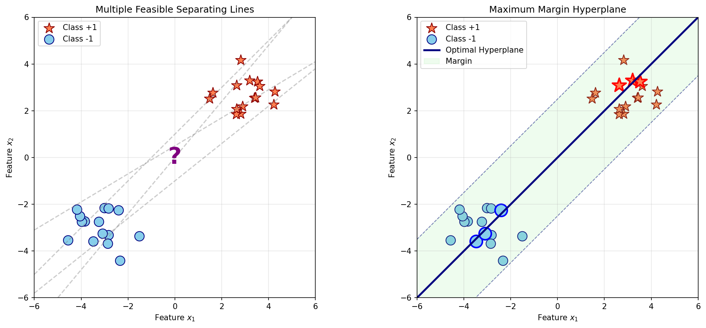
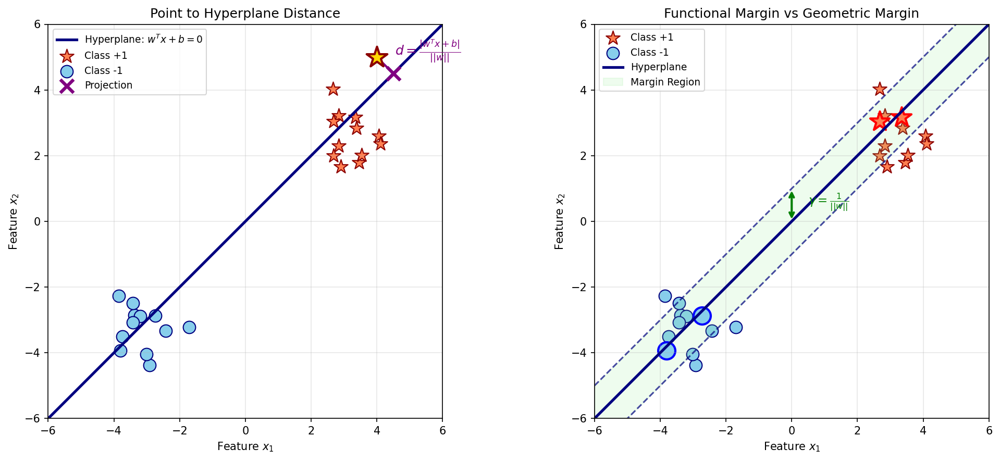
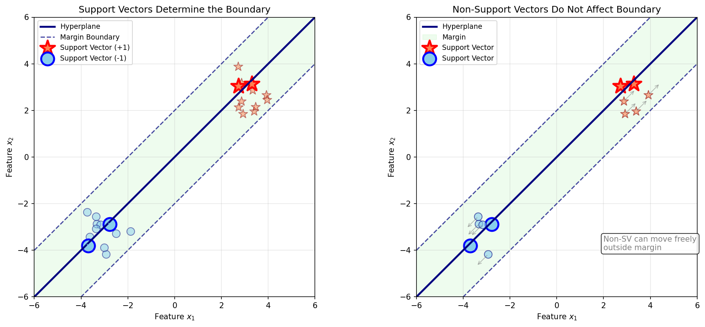
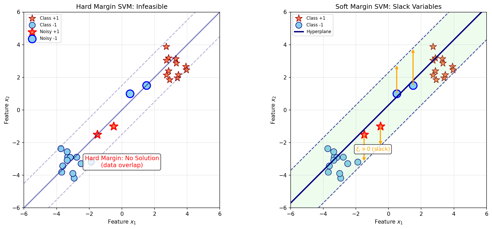

# SVM 基础 —— 最大间隔分类的艺术

## 引言：从几何直觉到最优分类

二十世纪六十年代，苏联数学家 Vladimir Vapnik 和 Alexey Chervonenkis 在研究统计学习理论时，提出了一个看似简单却影响深远的问题：给定一组已标注的训练样本，是否存在一种方法能从理论上保证分类器对未见样本的预测能力？这个问题催生了 **支持向量机**（Support Vector Machine, SVM）的诞生。1995 年，Cortes 和 Vapnik 在发表的论文中正式提出软间隔 SVM，解决了实际数据中普遍存在的噪声和重叠问题，此后 SVM 迅速成为机器学习领域的主流方法，在文本分类、图像识别、生物信息等领域取得了巨大成功，直到深度学习的兴起才改变了格局。

回顾我们在[逻辑回归](../linear-models/logistic-regression.md)章节学到的内容，线性分类器通过寻找一个超平面来分隔不同类别的数据。然而，一个关键问题随之浮现：对于同一个分类问题，可能存在无数个能够正确划分训练数据的超平面。以二维空间为例，假设我们收集了某银行的客户数据，用收入水平和消费频率两个特征来区分优质客户（正类）和风险客户（负类）。将这两类数据绘制在平面坐标系中，可以直观看到正类样本集中在右上区域，负类样本集中在左下区域。此时，任何一条穿过中间空白区域的直线都能完美划分训练数据，但哪一条才是"最好的"？


*图：左图展示多条可行分隔线，右图展示 SVM 选择的最大间隔分隔线*

图中左边的画面展示了这个困境：多条虚线都能将两类数据分开，但它们的位置各不相同。右边的画面给出了 SVM 的答案：选择那条距离两类样本都最远的直线。这条直线的两侧各有一条平行线穿过最近的数据点，中间的区域称为"间隔"（Margin）。SVM 的核心思想正是 **最大化这个间隔**，让分类边界尽可能远离两类数据，从而获得对未知数据更强的预测能力。

用类比来理解，假设你要在一条狭窄的山路上修建护栏分隔双向车道。路宽有限，两侧都有行人行走。最安全的做法是把护栏放在路中央，让两侧行人都有最大的活动空间。如果护栏偏向一侧，那侧行人就要小心翼翼地贴近护栏行走，稍有偏差就可能越过护栏。SVM 选择最大间隔超平面的逻辑与此完全一致：让两类数据都尽可能远离分类边界，这样即使数据有轻微扰动或噪声，分类结果也不会轻易出错。

这种"最大间隔"思想的背后有着坚实的统计学习理论支撑。Vapnik 等人证明了一个关键结论：分类器的泛化误差上限与间隔成反比，间隔越大，模型对未见样本的分类错误率越低。这赋予了 SVM 一种独特的理论魅力 —— 不同于其他机器学习方法依赖经验或启发式设计，SVM 从数学优化问题出发，直接追求泛化能力的最大化。

## 几何间隔：如何度量"距离"

理解 SVM 的第一步是建立"距离"的数学定义。在日常生活中，我们用尺子测量点到直线的距离，但在机器学习中，我们需要一个适用于任意维度空间的通用公式。

### 超平面的数学表示

在 $d$ 维空间中，分隔两类数据的超平面可以用一个线性方程来描述：

$$w^T x + b = 0$$

这个方程看似简单，却蕴含着丰富的几何意义。其中 $w \in \mathbb{R}^d$ 是一个 $d$ 维向量，称为 **法向量**（Normal Vector），它决定了超平面的"方向"。形象地说，法向量 $w$ 垂直于超平面，就像地面垂直于建筑物的地基。$b \in \mathbb{R}$ 是一个实数，称为 **截距**（Intercept），它决定了超平面到原点的距离。当 $b=0$ 时，超平面穿过原点；当 $b>0$ 时，超平面沿法向量方向平移远离原点。

以二维空间为例，方程 $w_1 x_1 + w_2 x_2 + b = 0$ 表示一条直线。如果 $w = (1, -1)$ 且 $b = 0$，则方程变为 $x_1 - x_2 = 0$，即 $x_1 = x_2$，这是一条穿过原点、斜率为 1 的直线。法向量 $(1, -1)$ 垂直于这条直线，指向右上方向。

### 点到超平面的距离公式

空间中任意一点 $x$ 到超平面 $w^T x + b = 0$ 的距离可以用以下公式计算：

$$\text{distance}(x, H) = \frac{|w^T x + b|}{||w||}$$

这个公式的含义可以拆解为三个部分：$w^T x + b$ 是点 $x$ 代入超平面方程后的值，反映了点相对于超平面的"位置"。当值为正时，点位于法向量所指的一侧；当值为负时，点位于相反一侧；当值为零时，点恰好落在超平面上。$||w|| = \sqrt{w_1^2 + \cdots + w_d^2}$ 是法向量的长度（范数），用于归一化距离计算，使其不受向量缩放的影响。绝对值 $|w^T x + b|$ 确保距离始终为正数，因为我们关心的是"有多远"而非"在哪边"。


*图：左图展示点到超平面的距离计算，右图展示函数间隔与几何间隔的关系*

图中左边的画面展示了距离计算的几何意义：紫色实线连接了测试点（金色星形）与其在超平面上的投影点（紫色 X 标记），这条线的长度正是公式计算的结果。

### 函数间隔与几何间隔的区别

对于二分类问题，我们约定类别标签取值 $y \in \{-1, +1\}$，而非 $\{0, 1\}$。这个约定的巧妙之处在于：$y_i(w^T x_i + b)$ 的符号直接反映分类是否正确。当分类正确时，$y_i$ 与 $w^T x_i + b$ 同号，乘积为正；当分类错误时，两者异号，乘积为负。基于这个观察，我们定义 **函数间隔**（Functional Margin）：

$$\hat{\gamma}_i = y_i (w^T x_i + b)$$

函数间隔衡量的是分类的"正确程度"：$\hat{\gamma}_i > 0$ 表示分类正确，值越大意味着点离超平面越"远"；$\hat{\gamma}_i < 0$ 表示分类错误，点穿越了超平面。然而，函数间隔有一个致命缺陷：它对参数 $w$ 和 $b$ 的缩放敏感。如果我们把 $w$ 和 $b$ 同时放大两倍，超平面本身没有变化（因为方程 $2w^T x + 2b = 0$ 与 $w^T x + b = 0$ 定义的是同一个超平面），但函数间隔 $\hat{\gamma}_i$ 却变成了两倍。这意味着函数间隔不能作为衡量分类"好坏"的客观标准。

为了解决这个问题，我们引入 **几何间隔**（Geometric Margin），即函数间隔除以法向量的长度：

$$\gamma_i = \frac{y_i (w^T x_i + b)}{||w||} = \frac{\hat{\gamma}_i}{||w||}$$

几何间隔是点到超平面的实际几何距离，与参数缩放无关。无论我们如何放大或缩小 $w$ 和 $b$，几何间隔始终保持不变。图中右边的画面展示了这个概念：绿色箭头标注的距离 $\gamma = \frac{1}{||w||}$ 正是几何间隔。对于正类点，几何间隔表示点到超平面的距离；对于负类点，几何间隔同样是距离，只是方向相反。当所有样本都分类正确时，几何间隔的最小值就是整个数据集的"间隔"，这个间隔越大，分类边界越安全。

## 支持向量：决定边界的关键点

"支持向量"这个名字听起来有些抽象，但它的含义其实非常直观：这些数据点像柱子一样"支撑"着分类边界。如果把分类边界想象成一道墙，支持向量就是紧贴这道墙的两排柱子，墙的位置完全由这些柱子决定，其他远离墙的数据点对墙的位置没有任何影响。

### 间隔最大化目标

SVM 的目标是找到使整个数据集的 **最小几何间隔最大化** 的超平面。换句话说，我们希望最靠近超平面的那些点（即最"危险"的点）也能保持足够的距离。用数学语言描述：

$$\max_{w, b} \min_i \gamma_i = \max_{w, b} \min_i \frac{y_i (w^T x_i + b)}{||w||}$$

这个目标函数的含义是：首先找出所有样本点中几何间隔最小的那个点（即最靠近超平面的点），然后调整超平面的参数 $w$ 和 $b$，让这个最小距离尽可能大。这是一种"最大化最坏情况"的策略，确保即使是最危险的样本也能被正确分类，从而为整体分类提供安全保障。

直接优化上述目标有些棘手，因为目标函数涉及 $||w||$ 在分母，使得问题非凸。通过一个巧妙的归一化技巧，我们可以将其转化为一个等价的凸优化问题。具体做法是：令最小函数间隔等于 1，即要求：

$$y_i (w^T x_i + b) \geq 1, \quad \forall i$$

这个约束的含义是：所有样本点的函数间隔至少为 1。对于那些恰好满足 $y_i (w^T x_i + b) = 1$ 的点，它们就是最靠近超平面的点，其几何间隔为 $\frac{1}{||w||}$。于是，最大化几何间隔等价于最小化 $||w||$：

$$\min_{w, b} \frac{1}{2} ||w||^2 \quad \text{s.t.} \quad y_i (w^T x_i + b) \geq 1, \quad i = 1, \ldots, n$$

这里用 $||w||^2$ 而非 $||w||$ 是为了数学方便 —— 平方运算保持单调性且便于求导，系数 $\frac{1}{2}$ 同样是为了求导后的形式简洁。这个优化问题是一个标准的 **凸二次规划问题**（Convex Quadratic Programming），具有唯一全局最优解，不会陷入局部最优。

### 支持向量的定义与作用

在最优分隔超平面确定后，那些 **恰好满足约束等号成立的样本点**，即满足 $y_i (w^T x_i + b) = 1$ 的点，被称为 **支持向量**（Support Vectors）。从几何角度看，支持向量是距离超平面最近的点，它们落在间隔边界上。


*图：左图展示支持向量（高亮标记）如何决定分类边界，右图展示非支持向量可以自由移动而不影响边界*

图中左边的画面清晰地展示了这个概念：高亮标记的星形点和圆形点就是支持向量，它们紧贴间隔边界。紫色箭头表示这些点到超平面的距离 —— 正是这个距离决定了间隔的大小。右边的画面展示了 SVM 的一个独特性质：只有支持向量决定最终的分类边界，其他点（灰色箭头表示可以移动）只要不越过间隔边界，就可以任意移动而不影响超平面的位置。

这个性质有着重要的实践意义。假设训练数据有 1000 个样本，但最终只有 10 个支持向量。那么，这 10 个点就浓缩了整个数据集的分类信息。模型存储时只需保存这 10 个点的信息，而不需要保存全部 1000 个样本，大幅减少了存储开销。更重要的是，这个性质揭示了 SVM 的 **稀疏性**：模型参数 $\alpha$（拉格朗日乘子）对大多数样本为零，只有支持向量对应的 $\alpha_i > 0$。这种稀疏性是 SVM 高效处理大规模数据的关键原因之一。

## 硬间隔优化问题推导

上一节我们将 SVM 的目标转化为一个优化问题：最小化 $\frac{1}{2} ||w||^2$，同时要求所有样本点满足约束 $y_i (w^T x_i + b) \geq 1$。这一节，我们深入探讨如何求解这个问题，引入拉格朗日对偶方法 —— 这是一种将约束优化转化为无约束优化的经典技巧，也是 SVM 求解算法的核心。

### 原始问题的凸性分析

首先回顾原始优化问题：

$$\min_{w, b} \frac{1}{2} ||w||^2 \quad \text{s.t.} \quad y_i (w^T x_i + b) \geq 1, \quad i = 1, \ldots, n$$

这个问题的结构决定了它的求解难度。目标函数 $\frac{1}{2} ||w||^2 = \frac{1}{2}(w_1^2 + \cdots + w_d^2)$ 是一个二次函数，它的图像是一个"碗"形曲面 —— 从任何初始点出发，向下行走最终都会到达碗底。这种函数称为 **凸函数**（Convex Function），凸函数的重要性质是：任何局部最优解都是全局最优解，不存在多个局部极值点的困扰。

约束条件 $y_i (w^T x_i + b) \geq 1$ 是线性不等式约束，定义了一个凸的区域（可行域）。凸目标函数配合凸可行域，构成一个 **凸优化问题**，这类问题有完善的理论和高效的求解算法。相比之下，神经网络训练中的目标函数通常是非凸的，存在大量局部极值点，求解难度远高于 SVM。

用类比来理解：求解凸优化问题就像在光滑的碗底找最低点 —— 无论从哪个边缘开始，都能顺着斜坡滑到底部；求解非凸优化问题就像在崎岖的山地找最低谷 —— 可能滑进一个局部山谷就出不去了，而真正的最低谷在另一座山后面。

### 拉格朗日对偶方法

直接求解原始问题需要处理不等式约束，这增加了计算复杂度。拉格朗日对偶方法提供了一种巧妙的替代思路：引入一组辅助变量（拉格朗日乘子），将约束条件"嵌入"目标函数，从而把约束优化转化为无约束优化。

具体做法是：为每个约束 $y_i (w^T x_i + b) \geq 1$ 引入一个拉格朗日乘子 $\alpha_i \geq 0$，构造 **拉格朗日函数**：

$$\mathcal{L}(w, b, \alpha) = \frac{1}{2} ||w||^2 - \sum_{i=1}^{n} \alpha_i [y_i (w^T x_i + b) - 1]$$

这个函数的构成需要仔细解释：第一项 $\frac{1}{2} ||w||^2$ 是原始目标函数；第二项 $\sum_{i=1}^{n} \alpha_i [y_i (w^T x_i + b) - 1]$ 是约束条件的加权组合，每个约束 $y_i (w^T x_i + b) - 1 \geq 0$ 被乘以对应的 $\alpha_i$ 后累加。当约束满足时（$y_i (w^T x_i + b) - 1 \geq 0$），减去这个非负值会降低整体函数值；当约束违反时（$y_i (w^T x_i + b) - 1 < 0$），减去一个负值反而会提升函数值。拉格朗日乘子 $\alpha_i$ 的作用就像一个"惩罚系数"，约束违反得越严重，惩罚越大。

接下来，我们需要找到拉格朗日函数关于 $w$ 和 $b$ 的极小值点。根据微积分原理，极值点处函数对各变量的偏导数为零：

$$\frac{\partial \mathcal{L}}{\partial w} = w - \sum_{i=1}^{n} \alpha_i y_i x_i = 0$$

$$\frac{\partial \mathcal{L}}{\partial b} = -\sum_{i=1}^{n} \alpha_i y_i = 0$$

从第一个方程可以解出 $w$ 与 $\alpha$ 的关系：

$$w = \sum_{i=1}^{n} \alpha_i y_i x_i$$

这个公式揭示了 SVM 的一个核心结构：最优超平面的法向量 $w$ 是所有训练样本的加权组合，每个样本的贡献权重是 $\alpha_i y_i$。如果某个样本的 $\alpha_i = 0$，它对 $w$ 没有任何贡献；只有 $\alpha_i > 0$ 的样本才参与构建分类边界。

从第二个方程得到：

$$\sum_{i=1}^{n} \alpha_i y_i = 0$$

这是拉格朗日乘子必须满足的约束，称为 **线性约束**：所有 $\alpha_i$ 与对应标签 $y_i$ 的乘积之和为零。这个约束在后续求解对偶问题时会发挥作用。

将上述两个条件代入拉格朗日函数，消去 $w$ 和 $b$，得到 **对偶问题**：

$$\max_\alpha \sum_{i=1}^{n} \alpha_i - \frac{1}{2} \sum_{i=1}^{n} \sum_{j=1}^{n} \alpha_i \alpha_j y_i y_j x_i^T x_j$$

$$\text{s.t.} \quad \alpha_i \geq 0, \quad \sum_{i=1}^{n} \alpha_i y_i = 0$$

对偶问题的目标函数是一个关于 $\alpha$ 的二次函数，约束是线性约束，因此也是一个凸二次规划问题。对于 SVM，求解对偶问题比求解原始问题有诸多优势：对偶问题中样本数量 $n$ 是变量的维度，而原始问题中特征维度 $d$ 是变量的维度。当特征维度远高于样本数量时（如文本分类中词汇量巨大但文档数量有限），对偶问题更高效。更重要的是，对偶问题的目标函数中出现 $x_i^T x_j$，即样本之间的内积，这为引入 **核函数**（Kernel Function）奠定了基础 —— 核技巧正是通过替换内积来处理非线性分类问题，我们将在[下一章](kernel-methods.md)详细讨论。

### KKT 条件的意义

最优解必须满足 **KKT 条件**（Karush-Kuhn-Tucker Conditions），这是约束优化问题的基本定理：

- **条件一（原始可行性）**：$\alpha_i \geq 0$，即拉格朗日乘子必须为非负。
- **条件二（对偶可行性）**：$y_i (w^T x_i + b) - 1 \geq 0$，即原始问题的约束必须满足。
- **条件三（互补松弛性）**：$\alpha_i [y_i (w^T x_i + b) - 1] = 0$，这是最关键的条件。

互补松弛条件的含义是：拉格朗日乘子 $\alpha_i$ 与约束违反程度 $y_i (w^T x_i + b) - 1$ 的乘积必须为零。这导致两种情况：

1. 如果 $\alpha_i > 0$，则必须有 $y_i (w^T x_i + b) - 1 = 0$，即该样本恰好落在间隔边界上，是支持向量。
2. 如果 $y_i (w^T x_i + b) - 1 > 0$（样本远离间隔边界），则必须有 $\alpha_i = 0$，该样本不是支持向量。

这再次印证了 SVM 的稀疏性：只有支持向量对应的 $\alpha_i > 0$，其他样本的 $\alpha_i = 0$。从计算角度看，这意味着我们只需要关注少数关键样本，不必为所有样本计算权重，大大简化了求解过程。

## 软间隔与松弛变量

到目前为止，我们讨论的都是"硬间隔" SVM，即严格要求所有样本点都必须正确分类，并且位于间隔边界之外。然而，现实数据往往不那么理想。噪声、测量误差、异常值都可能导致某些样本点"越界" —— 正类样本混入负类区域，或者两类数据在边界附近重叠。在这种情况下，硬间隔 SVM 可能无解，或者为了满足硬性约束而找到一个非常复杂的超平面，反而导致过拟合。

### 松弛变量的引入

为了处理这种情况，Cortes 和 Vapnik 在 1995 年提出了 **软间隔** SVM，核心思想是"放宽约束条件"，允许某些样本点违反间隔约束。具体做法是引入一组 **松弛变量** $\xi_i \geq 0$（Slack Variables），每个样本对应一个松弛变量，用于衡量该样本违反约束的程度。

修改后的优化问题变为：

$$\min_{w, b, \xi} \frac{1}{2} ||w||^2 + C \sum_{i=1}^{n} \xi_i$$

$$\text{s.t.} \quad y_i (w^T x_i + b) \geq 1 - \xi_i, \quad \xi_i \geq 0$$

松弛变量 $\xi_i$ 的含义可以这样理解：原来的约束要求 $y_i (w^T x_i + b) \geq 1$，即样本必须至少距离超平面 1 个单位（函数间隔）。引入松弛后，约束放宽为 $y_i (w^T x_i + b) \geq 1 - \xi_i$。如果一个样本的 $\xi_i = 0.5$，意味着它的函数间隔可以放宽到 $1 - 0.5 = 0.5$，即允许它比硬间隔要求的位置"靠近"超平面 0.5 个单位。如果 $\xi_i = 1$，样本可以恰好落在超平面上（函数间隔为零）；如果 $\xi_i > 1$，样本甚至可以越过超平面进入对方的区域（被错误分类）。

目标函数中新增的项 $C \sum_{i=1}^{n} \xi_i$ 是对松弛变量的惩罚。参数 $C$ 称为 **惩罚系数**（Regularization Parameter），控制模型对误分类的容忍程度：

- **$C$ 很大**：松弛变量的惩罚权重高，模型倾向于严格遵守约束，宁可牺牲间隔大小也要正确分类所有样本。这可能导致模型过于复杂，对噪声敏感，产生过拟合。
- **$C$ 很小**：松弛变量的惩罚权重低，模型倾向于选择更大的间隔，即使牺牲一些分类正确率。这使模型更加稳健，对噪声有较强的抵抗能力，但可能导致欠拟合。

$C$ 的选择需要在"分类准确率"和"模型复杂度"之间权衡，类似于[正则化](../linear-models/regularization-glm.md)章节讨论的偏差 - 方差权衡。实际应用中，$C$ 通常通过交叉验证来确定。


*图：左图展示硬间隔 SVM 在数据重叠时无解，右图展示软间隔 SVM 通过松弛变量允许部分样本越界*

图中对比了两种情况：左边的画面展示硬间隔 SVM 面对重叠数据的困境 —— 无论怎样调整超平面都无法将两类数据完全分开；右边的画面展示软间隔 SVM 的处理方式，橙色箭头标注了松弛变量 $\xi_i$ 的长度，表示违反约束的程度，这些样本被允许越过间隔边界甚至进入对方区域，代价是在目标函数中付出惩罚。

### 对偶问题的形式变化

引入松弛变量后，拉格朗日对偶方法依然适用。新的拉格朗日函数需要同时引入两组乘子：$\alpha_i \geq 0$ 对应间隔约束，$\mu_i \geq 0$ 对应松弛变量非负约束。经过推导，软间隔 SVM 的对偶问题形式非常简洁：

$$\max_\alpha \sum_{i=1}^{n} \alpha_i - \frac{1}{2} \sum_{i=1}^{n} \sum_{j=1}^{n} \alpha_i \alpha_j y_i y_j x_i^T x_j$$

$$\text{s.t.} \quad 0 \leq \alpha_i \leq C, \quad \sum_{i=1}^{n} \alpha_i y_i = 0$$

与硬间隔的唯一区别在于：$\alpha_i$ 从"无上界约束"变为"上界为 $C$"。这个变化意味着拉格朗日乘子 $\alpha_i$ 不能无限增长，最大值为惩罚系数 $C$。从 KKT 条件分析，软间隔 SVM 的样本可以分为三类：

1. **正确分类且远离边界**：$\alpha_i = 0$，$\xi_i = 0$，样本位于间隔边界之外，对模型没有贡献。
2. **支持向量**：$0 < \alpha_i < C$，$\xi_i = 0$，样本恰好落在间隔边界上，与硬间隔情况类似。
3. **违反约束的样本**：$\alpha_i = C$，$\xi_i > 0$，样本越过了间隔边界。这些样本可能是被错误分类的（$\xi_i > 1$），或者是位于间隔区域内的（$0 < \xi_i < 1$）。

这三类样本的划分揭示了软间隔 SVM 的一个重要特性：模型不再只依赖边界上的支持向量，而是同时考虑违反约束的样本。这些"违规样本"对应的 $\alpha_i = C$，它们在构建超平面时同样发挥作用，只是贡献权重被限制在 $C$ 以下。

## NumPy 实现：简化版软间隔 SVM

前几节我们建立了 SVM 的完整理论框架，现在将这些理论转化为可运行的代码。下面的实现采用对偶问题的梯度上升求解方法，核心思路分为四个步骤：首先预计算样本之间的内积矩阵（核矩阵）；然后通过迭代更新拉格朗日乘子 $\alpha$；接着根据更新后的 $\alpha$ 找出支持向量；最后根据支持向量计算超平面参数 $w$ 和 $b$。

代码实现中使用了简化的梯度上升算法，而非标准 SMO（Sequential Minimal Optimization）算法。SMO 是工业界广泛采用的高效求解方法，但实现复杂度较高。这里的简化版本足以理解 SVM 的核心机制，适合教学目的。

```python runnable
import numpy as np

class SimpleSVM:
    """
    简化版软间隔SVM实现
    
    使用梯度上升优化对偶问题，支持软间隔（通过参数C控制）
    
    核心步骤：
    1. 预计算核矩阵 K = X @ X.T（线性核）
    2. 迭代更新拉格朗日乘子 alpha
    3. 根据alpha找出支持向量
    4. 计算超平面参数 w 和 b
    """
    
    def __init__(self, learning_rate=0.01, n_iterations=1000, C=1.0):
        self.lr = learning_rate       # 梯度上升的学习率
        self.n_iterations = n_iterations  # 迭代次数
        self.C = C                    # 软间隔惩罚系数
        self.alpha = None             # 拉格朗日乘子（训练后获得）
        self.w = None                 # 超平面法向量
        self.b = None                 # 超平面截距
        self.support_vectors_ = None  # 支持向量集合
    
    def fit(self, X, y):
        """
        训练SVM模型
        
        对偶问题的目标函数：
        max sum(alpha_i) - 0.5 * sum(alpha_i * alpha_j * y_i * y_j * x_i^T x_j)
        约束：0 <= alpha_i <= C, sum(alpha_i * y_i) = 0
        
        使用梯度上升迭代优化，每次更新一个alpha_i
        """
        n_samples, n_features = X.shape
        
        # 初始化拉格朗日乘子（全零）
        self.alpha = np.zeros(n_samples)
        
        # 预计算核矩阵（线性核：样本内积）
        # K[i,j] = x_i^T x_j，用于加速目标函数计算
        K = X @ X.T
        
        # 梯度上升优化对偶问题
        for iteration in range(self.n_iterations):
            for i in range(n_samples):
                # 计算alpha_i的梯度
                # 目标函数对alpha_i的偏导：1 - y_i * sum_j(alpha_j * y_j * K[j,i])
                gradient = 1 - y[i] * np.sum(self.alpha * y * K[:, i])
                
                # 梯度上升更新
                self.alpha[i] += self.lr * gradient
                
                # 投影到约束区间 [0, C]
                # 对应软间隔的约束：0 <= alpha_i <= C
                self.alpha[i] = np.clip(self.alpha[i], 0, self.C)
            
            # 约束修正：确保 sum(alpha * y) = 0
            # 通过减去均值偏差来近似满足线性约束
            bias = np.mean(self.alpha * y)
            self.alpha = self.alpha - bias * y
            self.alpha = np.clip(self.alpha, 0, self.C)
        
        # 找出支持向量（alpha > 阈值的样本）
        sv_threshold = 1e-5
        sv_indices = self.alpha > sv_threshold
        self.support_vectors_ = X[sv_indices]
        sv_labels = y[sv_indices]
        sv_alpha = self.alpha[sv_indices]
        
        # 计算超平面参数 w = sum(alpha_i * y_i * x_i)
        # 只有支持向量参与计算（其他样本alpha=0）
        self.w = np.zeros(n_features)
        for i, (sv, label, a) in enumerate(zip(self.support_vectors_, sv_labels, sv_alpha)):
            self.w += a * label * sv
        
        # 计算截距 b
        # 使用支持向量计算：对于支持向量，y_i(w^T x_i + b) = 1（硬间隔）
        # 或 y_i(w^T x_i + b) = 1 - xi_i（软间隔）
        # 这里取所有支持向量的平均值
        if len(self.support_vectors_) > 0:
            self.b = np.mean(sv_labels - self.support_vectors_ @ self.w)
        else:
            self.b = 0
        
        return self
    
    def decision_function(self, X):
        """
        决策函数值：w^T x + b
        
        正值表示预测为正类，负值表示预测为负类
        绝对值大小反映样本到超平面的距离
        """
        return X @ self.w + self.b
    
    def predict(self, X):
        """
        预测类别标签
        
        sign(w^T x + b): +1 表示正类，-1 表示负类
        """
        return np.sign(self.decision_function(X)).astype(int)
    
    def score(self, X, y):
        """计算分类准确率"""
        predictions = self.predict(X)
        return np.mean(predictions == y)


# 测试：生成线性可分数据并训练SVM
np.random.seed(42)

# 生成两类数据：正类分布在(2,2)附近，负类分布在(-2,-2)附近
n_samples = 100
X_pos = np.random.randn(n_samples // 2, 2) + np.array([2, 2])
X_neg = np.random.randn(n_samples // 2, 2) + np.array([-2, -2])
X = np.vstack([X_pos, X_neg])
y = np.hstack([np.ones(n_samples // 2), -np.ones(n_samples // 2)])

# 训练软间隔SVM
svm = SimpleSVM(learning_rate=0.01, n_iterations=500, C=10.0)
svm.fit(X, y)

print("=== SVM训练结果 ===")
print(f"超平面法向量 w: [{svm.w[0]:.3f}, {svm.w[1]:.3f}]")
print(f"超平面截距 b: {svm.b:.4f}")
print(f"支持向量数量: {len(svm.support_vectors_)} / {n_samples}")
print(f"训练准确率: {svm.score(X, y):.3f}")

# 预测新样本
new_samples = np.array([[1, 1], [-1, -1], [0, 0]])
predictions = svm.predict(new_samples)
print("\n=== 新样本预测 ===")
for sample, pred in zip(new_samples, predictions):
    print(f"  点 ({sample[0]}, {sample[1]}) → 类别 {pred:+d}")
```

## 应用场景示例：手写数字识别

SVM 在图像识别领域有着经典的应用。下面我们使用 scikit-learn 提供的手写数字数据集，演示 SVM 如何区分数字"0"和"1"。这是一个典型的二分类问题：数字 0 的图像通常呈现环形特征，数字 1 的图像则呈现细长竖条特征，两类图像在像素空间中具有明显不同的分布模式。

该数据集的每个样本是一张 8×8 的灰度图像，共 64 个像素点作为特征。虽然特征维度不算太高，但数据量有限（数百个样本），这正是 SVM 发挥优势的场景 —— 小样本学习。

```python runnable
from sklearn.datasets import load_digits
from sklearn.model_selection import train_test_split
import numpy as np

# 加载手写数字数据集
digits = load_digits()
X, y = digits.data, digits.target

# 筛选数字0和1，构造二分类问题
# 数字0和1在像素分布上有显著差异，适合线性分类
mask = (y == 0) | (y == 1)
X_binary = X[mask]
y_binary = y[mask]
y_binary = np.where(y_binary == 0, -1, 1)  # 转换标签为 {-1, +1}

# 划分训练集和测试集（70%训练，30%测试）
X_train, X_test, y_train, y_test = train_test_split(
    X_binary, y_binary, test_size=0.3, random_state=42
)

# 训练软间隔SVM
# 参数设置：较小的学习率、较少的迭代次数（数据量有限）
svm = SimpleSVM(learning_rate=0.001, n_iterations=300, C=1.0)
svm.fit(X_train, y_train)

print("=== 手写数字分类（数字 0 vs 数字 1）===")
print(f"训练样本数: {len(X_train)}")
print(f"测试样本数: {len(X_test)}")
print(f"特征维度: {X_train.shape[1]}（8×8像素）")
print(f"支持向量数量: {len(svm.support_vectors_)}（占训练样本 {len(svm.support_vectors_)/len(X_train)*100:.1f}%）")
print(f"训练准确率: {svm.score(X_train, y_train):.3f}")
print(f"测试准确率: {svm.score(X_test, y_test):.3f}")
```

运行结果显示了 SVM 的几个关键特性：首先，测试准确率接近或达到 100%，说明模型具有良好的泛化能力，没有出现严重过拟合；其次，支持向量数量占训练样本的比例较低，印证了 SVM 的稀疏性 —— 少数关键样本就能决定分类边界；最后，64 维特征空间中，模型依然能高效运作，这正是对偶问题的优势体现。

## 小结

SVM 展示了一种不同于传统机器学习方法的范式：它不从启发式规则出发，而是从理论推导出发，将分类问题转化为一个具有数学保证的优化问题。这种"理论驱动"的设计哲学贯穿了 SVM 的整个架构 —— 最大化间隔的思想源自统计学习理论对泛化误差的分析，凸优化的求解方法源自运筹学的研究积累，对偶问题的引入源自拉格朗日乘子法的经典技巧。

回顾本章的核心脉络，可以归纳为一条清晰的推理链条：从"如何度量分类好坏"的问题出发，定义了函数间隔与几何间隔；从"如何找到最好的超平面"的目标出发，推导出最大间隔优化问题；从"如何高效求解这个优化问题"的需求出发，引入了拉格朗日对偶方法；从"如何处理现实数据的不完美"的挑战出发，提出了软间隔与松弛变量。这条链条展示了机器学习研究的典型模式：从一个直观的几何思想出发，逐步构建数学框架，最终形成可求解、可应用、有理论保证的算法。

SVM 与我们之前学习的模型有着深刻的联系。从几何角度看，线性 SVM 与[逻辑回归](../linear-models/logistic-regression.md)都在寻找线性分隔边界，但两者的目标函数截然不同：逻辑回归从概率建模的角度出发，最大化似然函数；SVM 从几何距离的角度出发，最大化间隔。从优化角度看，软间隔 SVM 的目标函数 $\frac{1}{2}||w||^2 + C\sum\xi_i$ 与[正则化线性模型](../linear-models/regularization-glm.md)的目标函数结构相似：前者惩罚参数大小和误分类，后者惩罚参数大小和拟合误差。这种相似性揭示了机器学习的一条共同原则 —— 在追求目标的同时控制模型复杂度，避免过拟合。

SVM 的独特价值体现在几个方面：首先是 **稀疏性**，只有少数支持向量决定模型，这使得 SVM 在存储和推理时都极为高效；其次是 **理论保证**，VC 维理论和间隔理论为 SVM 的泛化能力提供了定量分析工具；最后是 **核技巧的可扩展性**，通过替换内积运算，线性 SVM 可以无缝扩展为非线性分类器，这是下一章将要探讨的主题。

当数据规模较小、特征维度较高、对模型解释性有要求时，SVM 依然是值得优先考虑的选择。理解 SVM 的原理，不仅有助于掌握一个强大的分类工具，更重要的是理解"理论驱动设计"的方法论，这种方法论在机器学习研究中具有普遍价值。