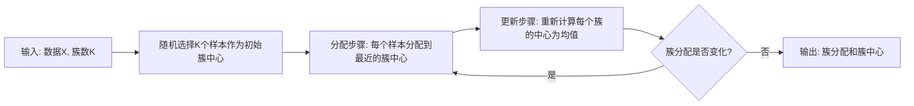

# 聚类

在前面学习的所有统计学习方法都有明确的目标 —— 预测房价、识别类别、分类邮件，等等。这些学习方法都统称为**监督学习**（Supervised Learning），因为这些方法全部都依赖于标签，每个学习样本都有正确的答案，模型从样本中学习输入到输出的映射。就像学生在老师监督指导下学习，每道题都有标准答案可以对照。

然而，现实世界中大量数据并没有标签，我们可能有成千上万客户的购买记录，但不知道他们属于哪个群体；有海量基因表达数据，但不知道哪些基因共同作用；有复杂的社交网络关系，但不知道隐藏的社区结构。这些问题就像让学生在没有答案的试卷上自己归纳规律。以上，正是**无监督学习**（Unsupervised Learning）要解决的问题。


*图：聚类过程示意图：从无标签数据中发现自然分组*

**聚类**（Clustering）是最基本的无监督学习任务，将相似的样本归为一组（称为"簇"），使不同组的样本尽可能不同。1967 年，英国统计学家詹姆斯·麦克奎恩（James MacQueen）在第五届伯克利数学统计与概率研讨会上提出了 K-Means 聚类算法，当时他面对的问题就是如何在没有预先定义类别的情况下，将大量观测数据自动分组，如上图所示。K-means 算法被视为无监督学习的起源，后来衍生出了层次聚类、密度聚类等一系列重要方法。

## K-means 数学原理

想象你是一位老师，教室中 50 名学生散坐在各处，你希望把他们分成 5 个小组进行讨论，但你对这些学生完全陌生，不知道他们的姓名、性格或关系。唯一的线索是你可以看到每个人的座位坐标 $(x, y)$，此时你该如何分组？直觉告诉你让坐得近的学生归为一组，这样小组讨论时走动距离最短。可能你会先随意选 5 个位置作为小组的中心，让每个学生走向最近的那个中心，然后根据谁走到了哪里来确定分组。接着，你发现某些小组的中心位置不太合理，譬如有一组的学生都集中在教室后排，但中心却被定在了前排。于是你把每个小组的中心移到该组所有学生的平均位置。这样一来，分组可能又需要调整，有些学生离新的中心更近了。

这个过程就像一场追逐渐近的游戏，先定中心，再分组；分组变了，中心也跟着变；中心变了，分组又重新调整。直到某个时刻，中心和分组都一起稳定下来，这就是 K-means 算法的核心逻辑。上面的过程十分直观，但要把它变成计算机能执行的算法，需要回答好两个问题：

1. **如何度量"好的"分组？** 理想情况下，组内学生坐得近（组内紧密），组间距离远（组间分离）。这是 K-means 的目标函数。
2. **如何找到"最好的"分组？** 给定 50 个学生的坐标和 5 个小组的要求，这是 K-means 的迭代算法。

基于上面的直观类比，我们可以给出 K-means 的数学定义。给定 $n$ 个样本 $\{x_1, x_2, \ldots, x_n\}$，每个样本是一个 $d$ 维向量（比如学生的座位坐标 $(x, y)$ 是 2 维）。将这 $n$ 个样本分成 $K$ 个**簇**（Cluster）$C_1, C_2, \ldots, C_K$，每个簇有一个**簇中心**（Cluster Center）$\mu_k$。K-means 的目标是找到一种分组方式，使得每个样本到其所属簇中心的距离平方和 $J$ 最小：

$$J = \sum_{k=1}^{K} \sum_{x_i \in C_k} \|x_i - \mu_k\|^2$$

其中，$x_i$ 是第 $i$ 个样本的位置；$\mu_k$ 是第 $k$ 个簇的中心位置；$\|x_i - \mu_k\|^2$ 是样本 $x_i$ 到簇中心 $\mu_k$ 的[欧几里得距离](../../maths/linear/vectors.md#范数)。公式中两个求和符号，外层 $\sum_{k=1}^{K}$ 表示对所有 $K$ 个簇求和，内层 $\sum_{x_i \in C_k}$ 表示对属于簇 $C_k$ 的所有样本求和。所以整个公式是在度量所有样本离它们所属簇中心的总离散程度。

当 $J$ 达到最小时，说明所有样本都尽可能靠近自己簇的中心，组内紧密度最高。簇中心 $\mu_k$ 的计算公式也很自然，就是簇内所有样本的**均值**（这正是"K-means"名称的由来，"means"就是均值），把属于簇 $C_k$ 的所有样本位置加起来，除以样本数量 $|C_k|$，得到的就是簇的中心位置：

$$\mu_k = \frac{1}{|C_k|} \sum_{x_i \in C_k} x_i$$

从统计学的角度看，对于一个簇 $C_k$，其内部样本的离散程度可以用[方差](../../maths/probability/probability-basics.md#偏差与方差)来度量。方差越大，说明簇内样本分布越分散；方差越小，说明簇内样本越紧密。而 K-means 的目标函数 $J$ 正是所有簇方差的总和（忽略常数因子）：

$$J = \sum_{k=1}^{K} |C_k| \cdot \text{Var}(C_k)$$

因此，最小化 $J$ 等价于最小化所有簇的加权方差总和。从几何上看，就是让每个簇内部的样本尽可能聚在一起，就像把散落的沙子聚成几堆紧实的沙团，每个簇中心 $\mu_k$ 是该簇样本的几何重心（Centroid）。当簇中心位于重心时，样本到中心的距离平方和最小。这就像一个现实世界的物理系统，当重心处于平衡位置时，系统的势能最小。

## K-means 迭代算法详解

上一节我们介绍了 K-means 的数学原理是最小化簇内距离平方和。现在我们要实际找到最优的分组方案，如果枚举所有可能的分组，计算量是天文数字（$n$ 个样本分成 $K$ 个簇所有可能的分配方案数量约为 $K^n/K!$）。K-means 采用了一种巧妙的交替优化策略，先固定簇中心找最优分配，再固定分配找最优中心，交替迭代直到收敛，可以用下面的流程图来直观展示：


*图：K-means 算法流程图*

K-means 算法的具体步骤如下：

- 步骤一 **初始化簇中心**：随机选择 $K$ 个样本作为初始簇中心 $\mu_1, \mu_2, \ldots, \mu_K$。这一步看似随机，但选择的好坏直接影响最终结果，后面我们会讨论如何改进这一步。

- 步骤二 **分配步骤**：对于每个样本 $x_i$，计算它到所有 $K$ 个簇中心的距离，将其分配到最近的那个簇 $c_i = \arg\min_k \|x_i - \mu_k\|^2$。其中 $c_i$ 表示样本 $x_i$ 所属的簇编号。这一步是在固定簇中心的情况下，寻找最优的样本分配。显然，把每个样本分配到最近的中心是局部最优的选择。

- 步骤三 **更新步骤**：根据新的分配结果，重新计算每个簇的中心 $\mu_k = \frac{1}{|C_k|} \sum_{x_i \in C_k} x_i$，这一步是在固定样本分配的情况下，寻找最优的簇中心。根据上一节的推导，当簇中心取簇内样本的均值时，距离平方和最小。

- 步骤四 **检查收敛**：重复步骤二和步骤三，直到簇分配不再变化（所有样本都稳定在某个簇中），或者目标函数的变化小于某个阈值，或者达到预设的最大迭代次数。

以上步骤一定是能够迭代能收敛的，因为每次迭代，目标函数 $J$ 都不会增加。原因如下：

- 在分配步骤中，每个样本被分配到最近的簇中心。如果某个样本的原簇中心不是最近的，把它移到更近的簇中心后，它到簇中心的距离平方必然减小。因此，分配步骤后，$J$ 只会减小或不变。

- 在更新步骤中，簇中心被重新计算为簇内样本的均值。根据数学推导，均值是使簇内距离平方和最小的位置（可以用求导证明）。因此，更新步骤后，每个簇内的距离平方和都会减小或不变，从而整体 $J$ 减小或不变。

由于 $J$ 每次迭代都不会增加，且 $J$ 有下界（最小为 0，当所有样本重合时），因此 $J$ 必然收敛到某个值。同时，样本数量有限，可能的分配方案也有限，因此簇分配最终会稳定在某一种方案上。不过，收敛并不意味着找到了全局最优。K-means 只能保证收敛到**局部最优**，就像在山谷里找到了一个低点，但可能还有更深的谷底没被发现。后面我们会讨论如何缓解这个问题。

## K-means 算法实践

理解了算法原理后，我们用代码实现一个完整的 K-means 聚类器。下面的代码演示了从初始化、迭代到收敛的完整过程，并在模拟数据上验证算法的有效性。代码使用 300 个样本、3 个预设簇，通过多次随机初始化（`n_init=10`）来降低陷入局部最优的风险。

```python runnable extract-class="KMeans"
import numpy as np
import matplotlib.pyplot as plt

class KMeans:
    """
    K-means聚类算法实现
    
    参数:
        n_clusters : int, 簇的数量K
        max_iter : int, 最大迭代次数
        tol : float, 收敛阈值（中心变化小于此值时停止）
        n_init : int, 随机初始化的次数（取最优结果）
    """
    
    def __init__(self, n_clusters=3, max_iter=300, tol=1e-4, n_init=10):
        self.n_clusters = n_clusters
        self.max_iter = max_iter
        self.tol = tol
        self.n_init = n_init
        
        self.cluster_centers_ = None  # 簇中心
        self.labels_ = None           # 每个样本的簇分配
        self.inertia_ = None          # 目标函数值（距离平方和）
    
    def _init_centers(self, X):
        """
        随机初始化簇中心
        
        从数据中随机选择K个样本作为初始中心
        """
        indices = np.random.choice(len(X), self.n_clusters, replace=False)
        return X[indices].copy()
    
    def _assign_clusters(self, X, centers):
        """
        分配步骤：将每个样本分配到最近的簇中心
        
        计算每个样本到所有中心的距离平方，返回最近的簇编号
        """
        distances = np.zeros((len(X), self.n_clusters))
        for k in range(self.n_clusters):
            # 计算样本到第k个中心的距离平方（对应目标函数中的||x - μ||²）
            distances[:, k] = np.sum((X - centers[k]) ** 2, axis=1)
        return np.argmin(distances, axis=1)
    
    def _update_centers(self, X, labels):
        """
        更新步骤：重新计算每个簇的中心
        
        簇中心 = 簇内样本的均值（这就是"means"的含义）
        """
        centers = np.zeros((self.n_clusters, X.shape[1]))
        for k in range(self.n_clusters):
            mask = labels == k
            if np.sum(mask) > 0:
                # 取簇内样本的均值作为新中心
                centers[k] = X[mask].mean(axis=0)
            else:
                # 空簇的罕见情况：随机重新初始化
                centers[k] = X[np.random.randint(len(X))]
        return centers
    
    def _compute_inertia(self, X, labels, centers):
        """
        计算目标函数值J
        
        J = 所有样本到其所属簇中心的距离平方和
        """
        inertia = 0
        for k in range(self.n_clusters):
            mask = labels == k
            inertia += np.sum((X[mask] - centers[k]) ** 2)
        return inertia
    
    def fit(self, X):
        """
        训练K-means模型
        
        执行多次随机初始化，取目标函数最小的结果
        """
        best_inertia = float('inf')
        best_centers = None
        best_labels = None
        
        for init in range(self.n_init):
            # 初始化簇中心
            centers = self._init_centers(X)
            
            # 迭代直到收敛
            for i in range(self.max_iter):
                # 步骤2：分配样本到最近的簇
                labels = self._assign_clusters(X, centers)
                
                # 步骤3：更新簇中心
                new_centers = self._update_centers(X, labels)
                
                # 检查收敛：中心变化是否小于阈值
                if np.max(np.abs(new_centers - centers)) < self.tol:
                    break
                
                centers = new_centers
            
            # 计算本次初始化的目标函数值
            inertia = self._compute_inertia(X, labels, centers)
            
            # 保留最优结果
            if inertia < best_inertia:
                best_inertia = inertia
                best_centers = centers.copy()
                best_labels = labels.copy()
        
        # 存储最优结果
        self.cluster_centers_ = best_centers
        self.labels_ = best_labels
        self.inertia_ = best_inertia
        
        return self
    
    def predict(self, X):
        """
        预测新样本所属的簇
        
        根据训练得到的簇中心，将新样本分配到最近的簇
        """
        return self._assign_clusters(X, self.cluster_centers_)

# 生成模拟数据：3个真实簇，每个簇100个样本
n_samples = 300
centers_true = np.array([[0, 0], [5, 5], [0, 5]])

X = np.vstack([
    np.random.randn(100, 2) + centers_true[0],  # 簇1：中心(0,0)
    np.random.randn(100, 2) + centers_true[1],  # 簇2：中心(5,5)
    np.random.randn(100, 2) + centers_true[2]   # 簇3：中心(0,5)
])

# 运行K-means
kmeans = KMeans(n_clusters=3, n_init=10)
kmeans.fit(X)

# 可视化聚类结果与中心对比
fig, axes = plt.subplots(1, 2, figsize=(14, 6))

# 左图：聚类结果散点图
colors = ['#e74c3c', '#3498db', '#2ecc71', '#f39c12', '#9b59b6']
for i in range(kmeans.n_clusters):
    mask = kmeans.labels_ == i
    axes[0].scatter(X[mask, 0], X[mask, 1], c=colors[i], alpha=0.6, s=50, label=f'簇{i+1}')

# 绘制真实中心和估计中心
axes[0].scatter(centers_true[:, 0], centers_true[:, 1], c='black', marker='x', s=200, linewidths=3, label='真实中心')
axes[0].scatter(kmeans.cluster_centers_[:, 0], kmeans.cluster_centers_[:, 1], c='red', marker='*', s=300, edgecolors='white', linewidths=2, label='估计中心')

axes[0].set_xlabel('特征 1', fontsize=12)
axes[0].set_ylabel('特征 2', fontsize=12)
axes[0].set_title('K-means 聚类结果', fontsize=14, fontweight='bold')
axes[0].legend(loc='upper right', fontsize=10)
axes[0].grid(True, alpha=0.3)

# 右图：中心坐标对比表格图
axes[1].axis('off')
axes[1].set_xlim(0, 1)
axes[1].set_ylim(0, 1)

# 标题
axes[1].text(0.5, 0.9, 'K-means 聚类结果统计', fontsize=16, fontweight='bold', ha='center', va='top')

# 统计信息
unique, counts = np.unique(kmeans.labels_, return_counts=True)
y_pos = 0.75

# 真实中心 vs 估计中心对比
axes[1].text(0.1, y_pos, '真实中心 vs 估计中心:', fontsize=12, fontweight='bold')
y_pos -= 0.08
for i in range(len(centers_true)):
    true_c = centers_true[i]
    est_c = kmeans.cluster_centers_[i]
    axes[1].text(0.15, y_pos, f'簇{i+1}: 真实({true_c[0]:.2f}, {true_c[1]:.2f}) | 估计({est_c[0]:.2f}, {est_c[1]:.2f})', 
                 fontsize=10, family='monospace')
    y_pos -= 0.06

y_pos -= 0.05
axes[1].text(0.1, y_pos, f'目标函数值 (Inertia): {kmeans.inertia_:.2f}', fontsize=11, fontweight='bold')
y_pos -= 0.08

axes[1].text(0.1, y_pos, '各簇样本数:', fontsize=11, fontweight='bold')
y_pos -= 0.06
for u, c in zip(unique, counts):
    axes[1].text(0.15, y_pos, f'  簇{u+1}: {c} 个样本', fontsize=10)
    y_pos -= 0.05

plt.tight_layout()
plt.show()
```

### 局限与改进

[算法详解](clustering.md#k-means-迭代算法详解)中提到了 K-means 只能收敛到局部最优，这意味着不同的初始簇中心可能导致不同的最终结果，就像从不同的起点下山，可能到达不同的山谷。举个极端例子：假设数据有 3 个清晰的自然簇（即数据本身固有的、分布紧凑且彼此分离的群组结构），但如果随机初始化时恰好选择了同一个真实簇内的 3 个样本作为初始中心，那么这 3 个中心会彼此竞争同一组样本，最终可能导致原本应被分开的两个簇被合并，而真正的第三个簇却被忽略。

造成这个问题的根本原因是 K-means 的目标函数 $J$ 是[非凸](../linear-models/logistic-regression.md#逻辑回归优化准则)的，它有多个局部最小值，而随机初始化可能让算法落入较浅的谷底。虽然我们通过多次运行（`n_init=10`）降低了风险，但这只是治标，不是治本，运气不好时，10 次初始化也可能都落入同一个局部最优。

2007 年，大卫·阿瑟（David Arthur）和提出了 K-means++ 算法，通过一种概率性的初始化策略，大幅降低了陷入局部最优的概率。核心思想是让初始中心之间尽可能分散，而不是随机聚集。K-means++ 初始化时，先随机选择第一个中心 $\mu_1$，然后对于每个后续中心 $\mu_k$（$k=2, 3, \ldots, K$），计算每个样本 $x_i$ 到已选中心的最短距离 $D(x_i)$，再以概率 $P(x_i) = D(x_i)^2 / \sum_j D(x_j)^2$ 选择下一个中心。最后使用选出的 $K$ 个中心，运行标准 K-means 算法。

这个概率公式的设计很巧妙，样本离已选中心越远，被选为下一个中心的概率越大。下面的代码展示了 K-means++ 初始化的实现，对比它与随机初始化的效果差异。

```python runnable
import numpy as np
import matplotlib.pyplot as plt

def kmeans_plusplus_init(X, K):
    """
    K-means++初始化策略
    
    使初始中心之间尽可能分散，降低陷入局部最优的概率
    
    参数:
        X : 数据矩阵 (n_samples, n_features)
        K : 簇的数量
    
    返回:
        centers : 初始簇中心 (K, n_features)
    """
    n_samples = len(X)
    centers = []
    
    # 步骤1：随机选择第一个中心
    first_idx = np.random.randint(n_samples)
    centers.append(X[first_idx].copy())
    
    # 步骤2：依次选择剩余的K-1个中心
    for k in range(1, K):
        # 计算每个样本到已选中心的最短距离平方
        distances_sq = np.zeros(n_samples)
        for i in range(n_samples):
            # 到所有已选中心的最短距离
            min_dist = float('inf')
            for c in centers:
                dist = np.sum((X[i] - c) ** 2)
                if dist < min_dist:
                    min_dist = dist
            distances_sq[i] = min_dist
        
        # 按距离平方的概率分布选择下一个中心
        # 距离越远的样本，被选中的概率越大
        probs = distances_sq / distances_sq.sum()
        next_idx = np.random.choice(n_samples, p=probs)
        centers.append(X[next_idx].copy())
    
    return np.array(centers)

def run_kmeans(X, K, init_centers, max_iter=50):
    """运行K-means迭代，返回最终结果"""
    centers = init_centers.copy()
    
    for _ in range(max_iter):
        # 分配
        distances = np.zeros((len(X), K))
        for k in range(K):
            distances[:, k] = np.sum((X - centers[k]) ** 2, axis=1)
        labels = np.argmin(distances, axis=1)
        
        # 更新
        new_centers = np.zeros((K, X.shape[1]))
        for k in range(K):
            mask = labels == k
            if np.sum(mask) > 0:
                new_centers[k] = X[mask].mean(axis=0)
            else:
                new_centers[k] = X[np.random.randint(len(X))]
        
        if np.max(np.abs(new_centers - centers)) < 1e-4:
            break
        centers = new_centers
    
    # 计算目标函数值
    inertia = 0
    for k in range(K):
        mask = labels == k
        inertia += np.sum((X[mask] - centers[k]) ** 2)
    
    return labels, centers, inertia

# 生成数据：3个簇，相距较近（更容易陷入局部最优）
np.random.seed(42)
centers_true = np.array([[0, 0], [3, 3], [6, 0]])
X = np.vstack([
    np.random.randn(80, 2) * 0.5 + centers_true[0],
    np.random.randn(80, 2) * 0.5 + centers_true[1],
    np.random.randn(80, 2) * 0.5 + centers_true[2]
])

# 创建可视化图形
fig = plt.figure(figsize=(16, 12))

# 定义颜色方案
colors = ['#e74c3c', '#3498db', '#2ecc71']
init_colors = ['#c0392b', '#2980b9', '#27ae60']

# 左上图：随机初始化 - 初始中心
ax1 = plt.subplot(2, 3, 1)
np.random.seed(123)  # 固定种子以便复现
random_init = X[np.random.choice(len(X), 3, replace=False)]
ax1.scatter(X[:, 0], X[:, 1], c='lightgray', alpha=0.5, s=30, label='数据点')
ax1.scatter(random_init[:, 0], random_init[:, 1], c=init_colors, marker='X', s=300, 
            edgecolors='black', linewidths=2, label='初始中心', zorder=5)
ax1.scatter(centers_true[:, 0], centers_true[:, 1], c='black', marker='x', s=200, 
            linewidths=3, label='真实中心', zorder=5)
ax1.set_title('随机初始化：初始中心位置', fontsize=13, fontweight='bold')
ax1.set_xlabel('特征 1', fontsize=11)
ax1.set_ylabel('特征 2', fontsize=11)
ax1.legend(loc='upper left', fontsize=9)
ax1.grid(True, alpha=0.3)

# 中上图：随机初始化 - 最终结果
ax2 = plt.subplot(2, 3, 2)
np.random.seed(123)
random_init = X[np.random.choice(len(X), 3, replace=False)]
labels_r, centers_r, inertia_r = run_kmeans(X, 3, random_init)
for i in range(3):
    mask = labels_r == i
    ax2.scatter(X[mask, 0], X[mask, 1], c=colors[i], alpha=0.6, s=50, label=f'簇{i+1}')
ax2.scatter(centers_true[:, 0], centers_true[:, 1], c='black', marker='x', s=200, 
            linewidths=3, label='真实中心')
ax2.scatter(centers_r[:, 0], centers_r[:, 1], c='red', marker='*', s=300, 
            edgecolors='white', linewidths=2, label='估计中心')
ax2.set_title(f'随机初始化：聚类结果\n目标函数值: {inertia_r:.2f}', fontsize=13, fontweight='bold')
ax2.set_xlabel('特征 1', fontsize=11)
ax2.set_ylabel('特征 2', fontsize=11)
ax2.legend(loc='upper left', fontsize=9)
ax2.grid(True, alpha=0.3)

# 右上图：随机初始化 - 中心轨迹示意
ax3 = plt.subplot(2, 3, 3)
ax3.axis('off')
ax3.set_xlim(0, 1)
ax3.set_ylim(0, 1)
ax3.text(0.5, 0.9, '随机初始化特点', fontsize=14, fontweight='bold', ha='center', va='top')
features = [
    '• 完全随机选择初始中心',
    '• 可能出现中心聚集',
    '• 容易陷入局部最优',
    '• 需要多次运行(n_init)',
    '',
    f'本次运行目标函数值:',
    f'{inertia_r:.2f}'
]
y_pos = 0.75
for feat in features:
    weight = 'bold' if '目标函数值' in feat else 'normal'
    ax3.text(0.1, y_pos, feat, fontsize=11, fontweight=weight)
    y_pos -= 0.12

# 左下图：K-means++初始化 - 初始中心
ax4 = plt.subplot(2, 3, 4)
np.random.seed(123)
plusplus_init = kmeans_plusplus_init(X, 3)
ax4.scatter(X[:, 0], X[:, 1], c='lightgray', alpha=0.5, s=30, label='数据点')
ax4.scatter(plusplus_init[:, 0], plusplus_init[:, 1], c=init_colors, marker='X', s=300, 
            edgecolors='black', linewidths=2, label='初始中心', zorder=5)
ax4.scatter(centers_true[:, 0], centers_true[:, 1], c='black', marker='x', s=200, 
            linewidths=3, label='真实中心', zorder=5)
# 添加箭头显示选择顺序
for i in range(3):
    ax4.annotate(f'{i+1}', xy=(plusplus_init[i, 0], plusplus_init[i, 1]), 
                xytext=(10, 10), textcoords='offset points', fontsize=12, 
                fontweight='bold', color='white',
                bbox=dict(boxstyle='circle', facecolor='black', alpha=0.7))
ax4.set_title('K-means++：初始中心位置', fontsize=13, fontweight='bold')
ax4.set_xlabel('特征 1', fontsize=11)
ax4.set_ylabel('特征 2', fontsize=11)
ax4.legend(loc='upper left', fontsize=9)
ax4.grid(True, alpha=0.3)

# 中下图：K-means++初始化 - 最终结果
ax5 = plt.subplot(2, 3, 5)
np.random.seed(123)
plusplus_init = kmeans_plusplus_init(X, 3)
labels_pp, centers_pp, inertia_pp = run_kmeans(X, 3, plusplus_init)
for i in range(3):
    mask = labels_pp == i
    ax5.scatter(X[mask, 0], X[mask, 1], c=colors[i], alpha=0.6, s=50, label=f'簇{i+1}')
ax5.scatter(centers_true[:, 0], centers_true[:, 1], c='black', marker='x', s=200, 
            linewidths=3, label='真实中心')
ax5.scatter(centers_pp[:, 0], centers_pp[:, 1], c='red', marker='*', s=300, 
            edgecolors='white', linewidths=2, label='估计中心')
ax5.set_title(f'K-means++：聚类结果\n目标函数值: {inertia_pp:.2f}', fontsize=13, fontweight='bold')
ax5.set_xlabel('特征 1', fontsize=11)
ax5.set_ylabel('特征 2', fontsize=11)
ax5.legend(loc='upper left', fontsize=9)
ax5.grid(True, alpha=0.3)

# 右下图：K-means++特点说明
ax6 = plt.subplot(2, 3, 6)
ax6.axis('off')
ax6.set_xlim(0, 1)
ax6.set_ylim(0, 1)
ax6.text(0.5, 0.9, 'K-means++特点', fontsize=14, fontweight='bold', ha='center', va='top')
features = [
    '• 第1个中心：完全随机',
    '• 后续中心：按距离概率选择',
    '• 初始中心更加分散',
    '• 更易达到全局最优',
    '• 通常只需1次运行',
    '',
    f'本次运行目标函数值:',
    f'{inertia_pp:.2f}'
]
y_pos = 0.75
for feat in features:
    weight = 'bold' if '目标函数值' in feat else 'normal'
    ax6.text(0.1, y_pos, feat, fontsize=11, fontweight=weight)
    y_pos -= 0.12

plt.suptitle('K-means 初始化策略对比：随机初始化 vs K-means++', 
             fontsize=16, fontweight='bold', y=0.98)
plt.tight_layout(rect=[0, 0, 1, 0.96])
plt.show()

# 多次运行统计对比
print("=== 多次运行统计对比（各20次） ===")
random_inertias = []
plusplus_inertias = []

for seed in range(20):
    np.random.seed(seed)
    random_init = X[np.random.choice(len(X), 3, replace=False)]
    _, _, inertia_r = run_kmeans(X, 3, random_init)
    random_inertias.append(inertia_r)
    
    np.random.seed(seed)
    plusplus_init = kmeans_plusplus_init(X, 3)
    _, _, inertia_pp = run_kmeans(X, 3, plusplus_init)
    plusplus_inertias.append(inertia_pp)

print(f"随机初始化平均目标函数值: {np.mean(random_inertias):.2f} ± {np.std(random_inertias):.2f}")
print(f"K-means++平均目标函数值: {np.mean(plusplus_inertias):.2f} ± {np.std(plusplus_inertias):.2f}")
print(f"K-means++优化比例: {(np.mean(random_inertias) - np.mean(plusplus_inertias)) / np.mean(random_inertias) * 100:.1f}%")
```

运行结果表明，K-means++ 的平均目标函数值明显小于随机初始化，且方差更小。这说明它更稳定地找到了较好的聚类结果。在实际应用中，Scikit-learn 的 KMeans 默认使用 K-means++ 初始化。

### 肘部法则与轮廓系数

除了初始化位置，K-means 还有一个必须回答的问题是究竟应该分成几个簇才是合适的？真实情况往往没有明确的答案，K 的选择是一个实践问题，要尝试多个不同的 K 值，然后进行事后评估。两种常用的评估方法是**肘部法则**（Elbow Method）和**轮廓系数**（Silhouette Coefficient）。

- **肘部法则**：随着 K 增大，目标函数 $J$ 会减小，更多的簇意味着每个簇更小、更紧密。但 K 增大到一定程度后，$J$ 的下降速度会放缓。如果把 $J$ 对 K 作图，曲线会呈现一个"肘部"形状，在肘部处的 K 值是一个合理的选择，再增加 K 对紧密度提升不大，但增加了簇的数量（可能过度细分）。

- **轮廓系数**：轮廓系数从另一个角度评估聚类质量，不仅考虑组内紧密，还考虑组间分离。对于每个样本 $x_i$，定义两个度量：

    - $a_i$：样本 $x_i$ 到同簇其他样本的平均距离（组内紧密度，越小越好）
    - $b_i$：样本 $x_i$ 到最近其他簇所有样本的平均距离（组间分离度，越大越好）

    样本 $x_i$ 的轮廓系数定义为：

    $$s_i = \frac{b_i - a_i}{\max(a_i, b_i)}$$

    其中，$b_i - a_i$ 度量组间距离与组内距离的差距，差距越大说明聚类效果越好； $\max(a_i, b_i)$ 是归一化因子，使轮廓系数落在 $[-1, 1]$ 范围内。因此，当 $s_i$ 接近 1 时，样本离自己簇很近、离其他簇很远（聚类效果好）；当 $s_i$ 接近 0 时，样本在簇边界附近（聚类模糊）；当 $s_i$ 接近-1 时，样本可能被分错了簇。整个聚类结果的轮廓系数是所有样本轮廓系数的平均值。值越大，聚类质量越好。

除此之外，还有其他聚类评估指标。下表总结了常用指标的对比：

| 指标 | 计算方式 | 值范围 | 优点 | 缺点 |
|:----:|:--------:|:------:|:----:|:----:|
| 目标函数 $J$ | 簇内距离平方和 | $[0, +\infty)$ | 直观，K-means 直接优化 | 不考虑组间分离，需结合肘部法则 |
| 轮廓系数 | $(b-a)/\max(a,b)$ | $[-1, 1]$ | 同时考虑组内组间，不依赖 K | 计算量大（$O(n^2)$） |
| Calinski-Harabasz | $\frac{\text{组间方差}}{\text{组内方差}} \cdot \frac{n-K}{K-1}$ | $[0, +\infty)$ | 计算快，值越大越好 | 偏好球形簇 |
| Davies-Bouldin | 簇内离散/簇间距离的比值平均 | $[0, +\infty)$ | 值越小越好，直觉清晰 | 不适合非球形簇 |

这些指标各有适用场景。实践中最常用的是轮廓系数（综合评估）和肘部法则（确定 K 值范围）。

## 层次聚类

K-means 算法运行时簇的数量 $K$ 必须是预先知道的，哪怕是不确定也必须传入一个值，最多就使用肘部法则与轮廓系数这些指标来评估传入的哪一个 K 值更加合适。实际应用中，有些情况很难确定数据应该分成几组。譬如分析客户数据时，究竟是 3 类客户还是 5 类我们还可以通过尝试来得出，但做分析基因数据时，功能相似的基因究竟有多少组，几组到几千组都是有可能的，这就很难靠试错和事后评估来解决。

层次聚类（Hierarchical Clustering）提供了一种不同的思路。**不预设簇的数量，而是构建一个层级结构**，这就像生物分类系统：从"物种"到"属"到"科"到"目"，每一层都是一个合理的分组，但粒度不同。通过在不同层级切割，可以得到不同数量的簇，其灵活性远高于 K-means 算法。层次聚类有两种策略：

| 策略 | 方向 | 过程 | 特点 |
|:----:|:----:|:----:|:----:|
| **凝聚式**（Agglomerative） | 自底向上 | 每个样本单独成簇→逐步合并最相似的簇 | 计算更高效，常用 |
| **分裂式**（Divisive） | 自顶向下 | 所有样本成一簇→逐步分裂 | 更符合直觉，但计算复杂 |

凝聚式层次聚类更常用，我们重点介绍这种方法。凝聚式算法从"每个样本单独成簇"开始，计算所有簇对之间的距离（稍后我们就会给出距离定义），找到距离最小的两个簇，合并它们为一个新簇，然后更新距离矩阵，计算新簇与其他簇之间的距离，一直重复这个步骤，逐步合并最相似的簇，直到只剩一个大簇。执行流程如下图所示：


*图：凝聚式层次聚类流程*

合并时需要计算两个簇之间的距离，考虑到一个簇可能有多个样本，定义簇与簇之间的距离有四种常用方法：

| 方法 | 定义 | 公式 | 特点 |
|:----:|:----:|:----:|:----:|
| **单链接**（Single Linkage） | 最近两点距离 | $d(C_a, C_b) = \min_{i \in C_a, j \in C_b} d(i,j)$ | 倾向形成"链状"簇，对噪声敏感 |
| **全链接**（Complete Linkage） | 最远两点距离 | $d(C_a, C_b) = \max_{i \in C_a, j \in C_b} d(i,j)$ | 倾向形成紧凑球形簇，对离群点敏感 |
| **平均链接**（Average Linkage） | 所有点对平均距离 | $d(C_a, C_b) = \frac{1}{|C_a||C_b|} \sum_{i,j} d(i,j)$ | 平衡选择，最常用 |
| **Ward 方法** | 合并后方差增量最小 | 选择使 $\Delta J$ 最小的合并 | 类似 K-means 目标，簇紧凑 |

单链接方法容易形成"链状"结构，就像一群人站成一排，相邻的人被不断合并成一条长链。这在某些场景（如路径分析）有用，但容易受噪声影响。全链接方法倾向形成紧凑、大小相似的簇，因为它考虑最远距离，任何离群点都会拉大整个簇的距离。适用于需要严格定义簇边界的场景。平均链接是单链接和全链接的折中，减少了极端值的影响，是实践中最常用的选择。Ward 方法的目标与 K-means 一致（最小化簇内方差），因此产生的结果与 K-means 相似，但不需要预设 K 值。下面用代码对比四种方法的效果：

```python runnable
import numpy as np
import matplotlib.pyplot as plt

def agglomerative_clustering(X, n_clusters, linkage='average'):
    """
    凝聚式层次聚类实现
    
    参数:
        X : 数据矩阵 (n_samples, n_features)
        n_clusters : 最终簇数
        linkage : 簇间距离定义 ('single', 'complete', 'average', 'ward')
    
    返回:
        labels : 簇分配标签
    """
    n = len(X)
    
    # 初始化：每个样本单独成簇
    clusters = [{i} for i in range(n)]
    labels = np.arange(n)  # 当前每个样本的簇标签
    
    # 计算初始距离矩阵
    distances = np.zeros((n, n))
    for i in range(n):
        for j in range(i+1, n):
            distances[i, j] = np.linalg.norm(X[i] - X[j])
            distances[j, i] = distances[i, j]
    
    # 逐步合并，直到达到目标簇数
    while len(clusters) > n_clusters:
        # 找距离最小的两个簇
        min_dist = float('inf')
        merge_pair = (0, 1)
        
        for i in range(len(clusters)):
            for j in range(i+1, len(clusters)):
                # 计算簇间距离
                d = compute_cluster_distance(
                    X, clusters[i], clusters[j], linkage, distances
                )
                if d < min_dist:
                    min_dist = d
                    merge_pair = (i, j)
        
        # 合并两个簇
        i, j = merge_pair
        new_cluster = clusters[i] | clusters[j]
        
        # 更新簇列表
        clusters = [c for k, c in enumerate(clusters) if k not in (i, j)]
        clusters.append(new_cluster)
        
        # 更新标签
        new_label = min(i, j)
        for idx in new_cluster:
            labels[idx] = new_label
    
    # 重新编号标签（从0到n_clusters-1）
    unique_labels = np.unique(labels)
    label_mapping = {old: new for new, old in enumerate(unique_labels)}
    final_labels = np.array([label_mapping[l] for l in labels])
    
    return final_labels


def compute_cluster_distance(X, cluster_a, cluster_b, linkage, pairwise_distances):
    """
    计算两个簇之间的距离
    
    根据不同的链接方法计算
    """
    if linkage == 'single':
        # 最近两点距离
        min_dist = float('inf')
        for i in cluster_a:
            for j in cluster_b:
                if pairwise_distances[i, j] < min_dist:
                    min_dist = pairwise_distances[i, j]
        return min_dist
    
    elif linkage == 'complete':
        # 最远两点距离
        max_dist = 0
        for i in cluster_a:
            for j in cluster_b:
                if pairwise_distances[i, j] > max_dist:
                    max_dist = pairwise_distances[i, j]
        return max_dist
    
    elif linkage == 'average':
        # 平均距离
        total = 0
        count = 0
        for i in cluster_a:
            for j in cluster_b:
                total += pairwise_distances[i, j]
                count += 1
        return total / count
    
    elif linkage == 'ward':
        # Ward方法：计算合并后的方差增量
        # ΔJ = |C_a|·|C_b|/(|C_a|+|C_b|) · ||μ_a - μ_b||²
        center_a = X[list(cluster_a)].mean(axis=0)
        center_b = X[list(cluster_b)].mean(axis=0)
        n_a = len(cluster_a)
        n_b = len(cluster_b)
        return (n_a * n_b / (n_a + n_b)) * np.sum((center_a - center_b) ** 2)
    
    return 0

# 生成数据：4个簇，其中一个包含离群点
centers_true = np.array([[0, 0], [3, 0], [0, 3], [3, 3]])
X = np.vstack([
    np.random.randn(25, 2) * 0.4 + centers_true[0],
    np.random.randn(25, 2) * 0.4 + centers_true[1],
    np.random.randn(25, 2) * 0.4 + centers_true[2],
    np.random.randn(25, 2) * 0.4 + centers_true[3]
])

# 添加一个离群点
X = np.vstack([X, np.array([[6, 6]])])

# 计算轮廓系数
def compute_silhouette(X, labels):
    from numpy.linalg import norm
    n = len(X)
    unique = np.unique(labels)
    s_vals = []
    for i in range(n):
        own = labels[i]
        same_cluster = [j for j in range(n) if labels[j] == own and j != i]
        a_i = np.mean([norm(X[i] - X[j]) for j in same_cluster]) if len(same_cluster) > 0 else 0
        b_i = float('inf')
        for c in unique:
            if c == own:
                continue
            other_cluster = [j for j in range(n) if labels[j] == c]
            dist = np.mean([norm(X[i] - X[j]) for j in other_cluster])
            if dist < b_i:
                b_i = dist
        s_vals.append((b_i - a_i) / max(a_i, b_i) if max(a_i, b_i) > 0 else 0)
    return np.mean(s_vals)

# 创建可视化
fig, axes = plt.subplots(2, 2, figsize=(14, 12))
fig.suptitle('四种链接方法聚类结果对比', fontsize=16, fontweight='bold')

linkages = ['single', 'complete', 'average', 'ward']
colors = ['#e74c3c', '#3498db', '#2ecc71', '#f39c12', '#9b59b6']
positions = [(0, 0), (0, 1), (1, 0), (1, 1)]
silhouette_scores = []

for linkage, (row, col) in zip(linkages, positions):
    labels = agglomerative_clustering(X, 4, linkage=linkage)
    silhouette = compute_silhouette(X, labels)
    silhouette_scores.append(silhouette)

    ax = axes[row, col]

    # 绘制各簇样本
    for k in range(4):
        mask = labels == k
        ax.scatter(X[mask, 0], X[mask, 1], c=colors[k], alpha=0.7, s=60, edgecolors='white', linewidth=0.5, label=f'簇{k+1}')

    # 特别标注离群点
    ax.scatter(X[-1, 0], X[-1, 1], c='black', marker='X', s=200, edgecolors='white', linewidth=2, label='离群点', zorder=5)

    ax.set_xlabel('特征 1', fontsize=11)
    ax.set_ylabel('特征 2', fontsize=11)
    ax.set_title(f'{linkage.upper()} 链接 (轮廓系数: {silhouette:.4f})', fontsize=12, fontweight='bold')
    ax.legend(loc='upper left', fontsize=9)
    ax.grid(True, alpha=0.3)
    ax.set_xlim(-1.5, 7)
    ax.set_ylim(-1.5, 7)

plt.tight_layout(rect=[0, 0, 1, 0.96])
plt.show()

print("=== 四种链接方法轮廓系数对比 ===")
for linkage, score in zip(linkages, silhouette_scores):
    print(f"{linkage.upper()}链接: {score:.4f}")
```

运行结果显示，四种链接方法产生了不同的聚类结果。Ward 方法的轮廓系数最高，因为它与 K-means 的目标一致（最小化簇内方差），适合数据确实存在球形簇的场景。单链接方法在处理离群点时可能产生"链状"合并，将原本独立的簇通过离群点连接起来。

## 应用场景：精准营销

假设某电商平台拥有 200 名客户的数据，包含两个核心指标：月消费金额和月购买次数。营销团队希望将客户分成几个群体，针对不同群体制定差异化的营销策略，譬如给高消费客户推送会员优惠，给低频客户推送唤醒活动。下面的代码展示了完整的客户分群流程：从数据生成、聚类分析到结果解读。

```python runnable
import numpy as np

# 模拟客户数据：月消费金额、月购买次数
np.random.seed(42)
n_customers = 200

# 生成三种类型的客户（模拟真实市场结构）
# 高价值客户：消费高、频率高（VIP群体）
high_value = np.random.multivariate_normal(
    [1000, 20],  # 平均消费1000元，月购买20次
    [[50000, 500], [500, 20]],  # 协方差矩阵（消费和频率正相关）
    50
)

# 中价值客户：消费中等、频率中等（主力群体）
medium_value = np.random.multivariate_normal(
    [500, 10],  # 平均消费500元，月购买10次
    [[20000, 200], [200, 10]],
    100
)

# 低价值客户：消费低、频率低（潜在流失群体）
low_value = np.random.multivariate_normal(
    [100, 3],  # 平均消费100元，月购买3次
    [[5000, 50], [50, 2]],
    50
)

X_customers = np.vstack([high_value, medium_value, low_value])

# 确保数据非负（消费和次数不能为负）
X_customers = np.maximum(X_customers, 0)

print("=== 客户数据概览 ===")
print(f"总客户数: {len(X_customers)}")
print(f"平均消费: {X_customers[:, 0].mean():.0f}元")
print(f"平均频率: {X_customers[:, 1].mean():.1f}次/月")
print(f"消费范围: [{X_customers[:, 0].min():.0f}, {X_customers[:, 0].max():.0f}]元")
print(f"频率范围: [{X_customers[:, 1].min():.1f}, {X_customers[:, 1].max():.1f}]次")

# 使用K-means分群（假设不知道真实分组，用肘部法则确定K）
print("\n=== 确定最优簇数 ===")

# 袖部法则：测试K=2到5
inertias = []
for K in range(2, 6):
    # 简化K-means实现
    indices = np.random.choice(len(X_customers), K, replace=False)
    centers = X_customers[indices].copy()
    
    for _ in range(100):
        distances = np.zeros((len(X_customers), K))
        for k in range(K):
            distances[:, k] = np.sum((X_customers - centers[k]) ** 2, axis=1)
        labels = np.argmin(distances, axis=1)
        
        new_centers = np.zeros((K, 2))
        for k in range(K):
            mask = labels == k
            if np.sum(mask) > 0:
                new_centers[k] = X_customers[mask].mean(axis=0)
        
        if np.max(np.abs(new_centers - centers)) < 1e-4:
            break
        centers = new_centers
    
    inertia = sum(np.sum((X_customers[labels == k] - centers[k]) ** 2) for k in range(K))
    inertias.append(inertia)
    print(f"K={K}: 目标函数值={inertia:.0f}")

# 分析肘部
print("\n肘部法则分析：")
print("- K从2到3下降显著（分组细化）")
print("- K从3到4下降放缓（已找到合理分组）")
print("- 建议选择K=3")

# 使用K=3进行最终分群
print("\n=== 客户分群结果 ===")
K = 3
indices = np.random.choice(len(X_customers), K, replace=False)
centers = X_customers[indices].copy()

for _ in range(100):
    distances = np.zeros((len(X_customers), K))
    for k in range(K):
        distances[:, k] = np.sum((X_customers - centers[k]) ** 2, axis=1)
    labels = np.argmin(distances, axis=1)
    
    new_centers = np.zeros((K, 2))
    for k in range(K):
        mask = labels == k
        if np.sum(mask) > 0:
            new_centers[k] = X_customers[mask].mean(axis=0)
    
    if np.max(np.abs(new_centers - centers)) < 1e-4:
        break
    centers = new_centers

# 分析各簇特征
for k in range(K):
    mask = labels == k
    cluster_customers = X_customers[mask]
    
    avg_spend = cluster_customers[:, 0].mean()
    avg_freq = cluster_customers[:, 1].mean()
    count = np.sum(mask)
    
    # 给簇命名（基于特征）
    if avg_spend > 800:
        name = "高价值客户(VIP)"
        strategy = "会员专属优惠、新品优先体验"
    elif avg_spend > 300:
        name = "中价值客户(主力)"
        strategy = "积分激励、组合套餐推荐"
    else:
        name = "低价值客户(潜力)"
        strategy = "唤醒活动、低价引流商品"
    
    print(f"\n簇{k+1} - {name}:")
    print(f"  客户数量: {count}人 ({count/len(X_customers)*100:.1f}%)")
    print(f"  平均消费: {avg_spend:.0f}元/月")
    print(f"  平均频率: {avg_freq:.1f}次/月")
    print(f"  建议策略: {strategy}")

print("\n=== 分群结果解读 ===")
print("聚类成功识别出三类客户群体：")
print("1. VIP群体（约25%）：高消费高频次，应重点维护")
print("2. 主力群体（约50%）：中等消费，是营销重点")
print("3. 潜力群体（约25%）：低消费低频次，需唤醒策略")
print("\n这些分群为差异化营销提供了数据支撑。")
```

聚类在更多领域有广泛应用，下表总结了典型场景：

| 应用领域 | 具体场景 | 聚类目标 | 常用方法 |
|:--------:|:--------:|:--------:|:--------:|
| **图像处理** | 图像分割 | 将相似像素归组，压缩或识别 | K-means（像素颜色聚类） |
| **文本分析** | 文档聚类 | 将相似主题文档归组，信息检索 | K-means（TF-IDF 特征） |
| **生物信息** | 基因表达分析 | 发现共表达的基因模块 | 层次聚类（树状图可视化） |
| **社交网络** | 社区发现 | 识别紧密连接的用户群体 | 层次聚类或图聚类 |
| **异常检测** | 离群点识别 | 找到不属于任何簇的点 | 任何方法 + 距离阈值 |
| **推荐系统** | 用户分群 | 发现相似兴趣群体 | K-means 或谱聚类 |

## 本章小结

聚类是无监督学习的入门篇章，它回答了在没有标签的情况下，如何发现数据的内在结构。本章我们从直观类比出发，建立了 K-means 和层次聚类两大方法的数学基础与实践应用。

聚类与[监督学习中的分类](../linear-models/logistic-regression.md#回归与分类的界限)形成对比，分类需要标签指导，学习"什么样的样本属于哪类"；聚类自主发现结构，回答"数据中有哪些自然分组"。这种无监督能力在数据探索阶段尤为重要，当我们对数据一无所知时，聚类是第一个嗅探工具。然而，聚类也有局限，它假设相似性可以用距离度量，但高维数据中距离可能失去意义（维度灾难）；它难以处理非球形簇（如环形数据），需要密度聚类等方法；它对特征尺度敏感，需要标准化预处理。这些问题将在后续章节中讨论。

更重要的是，当数据维度很高时（如图像、文本），直接聚类效果往往不佳。高维空间中样本稀疏，距离计算不稳定。这时需要先[降维](dimensionality-reduction.md)，将高维数据投影到低维空间，保留关键信息的同时降低计算复杂度。下一章我们将学习降维方法，它与聚类配合使用，先降维压缩数据，再聚类发现结构。

## 练习题

1. 为什么 K-means 使用距离平方 $\|x_i - \mu_k\|^2$ 而不是距离 $\|x_i - \mu_k\|$ 作为目标函数？请从计算便利性和统计意义两个角度解释。
    <details>
    <summary>参考答案</summary>

    **从计算便利性角度**：
    - 距离平方避免了开平方运算，计算更快
    - 距离平方是凸函数，优化更稳定（无局部极小点问题）
    - 对距离平方求导可直接得到线性表达式，便于推导簇中心公式

    **从统计意义角度**：
    - 距离平方和等价于簇内方差总和（忽略常数因子）
    - 方差是统计学中度量离散程度的标准方法，有成熟的解释框架
    - 这与回归分析中的最小二乘法一致，建立了统一的理论基础

    一句话总结：距离平方使计算高效且与方差概念相连，揭示了 K-means 的统计本质。

    </details>

1. K-means 和层次聚类各有什么优缺点？在什么场景下应该选择层次聚类而非 K-means？
    <details>
    <summary>参考答案</summary>

    **K-means 优点**：计算高效、易于实现、适合大规模数据；缺点：需预设 K 值、对初始化敏感、只能处理球形簇。

    **层次聚类优点**：不需预设 K 值、结果稳定、树状图提供过程可视化、可适应任意形状簇；缺点：计算复杂度高、不适合大规模数据。

    选择层次聚类的场景：
    1. **不确定簇数量**：想探索不同粒度的分组可能性
    2. **小数据集**：几百到几千样本，计算开销可接受
    3. **需要过程追溯**：如生物学分类，合并路径有解释价值
    4. **非球形簇**：数据自然分组形状不规则（使用单链接）

    </details>